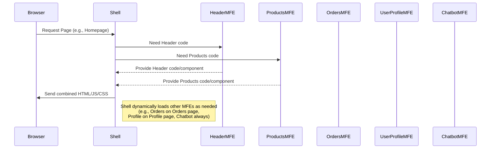

# Chapter 1: Micro Frontend (MFE)

Welcome to the **mfe-project** tutorial! In this first chapter, we're going to explore the fundamental concept that gives this project its name: **Micro Frontend (MFE)**. Don't worry if this sounds complex; we'll break it down into easy-to-understand pieces.

## The Problem: Building Big, Complex Websites

Imagine you want to build a large website, maybe like an online store. This store needs many different parts:

- A header at the top (with navigation and a logo).
- A section showing all the products.
- A page where you can view your past orders.
- A place to update your user profile information.
- Maybe even a helpful chatbot!

If you build this entire website as _one giant application_ with all the code mixed together, it can quickly become very difficult to manage.

- Making a small change in one part (like the user profile) might accidentally break something in another part (like the products page).
- Different teams working on different features might step on each other's toes, making development slow.
- Updating the entire site requires deploying _everything_, even if only a tiny part changed.

This "monolithic" (single, large block) approach can become a headache as the application grows.

## The Solution: Micro Frontends (MFEs)

This is where Micro Frontends come in! The idea is to take that big, complex website and break it down into smaller, more manageable, independent pieces. Think of it like building with Lego bricks instead of sculpting one massive block of clay.

Each "Lego brick" is a **Micro Frontend (MFE)**.

- It's a **small, independent application**.
- It represents just a **part of the user interface** (like the header, the products list, or the user profile).
- It's **self-contained**, meaning it has its own code, its own way of building, and can often be run and tested by itself.
- Crucially, these bricks can be **developed, tested, and deployed _separately_** from each other.

Then, a main application, which we'll call the **Shell** application (we'll dive deep into this in the [next chapter](02_shell__host__application_.md)), acts like the baseplate and puts all these independent MFE bricks together to form the complete, larger user experience.

## MFEs in This Project

In our `mfe-project`, we have exactly this setup! We have several independent applications, each representing a piece of the overall user interface:

- `shell`: This is the main application that brings everything together.
- `header-mfe`: A separate application just for the website header.
- `products-mfe`: An application dedicated to showing products.
- `orders-mfe`: An application for managing user orders.
- `user-profile-mfe`: An application for displaying and editing user profiles.
- `natasha-chatbot-mfe`: An application for the chatbot feature.

Each of these, except the `shell`, is an MFE (or sometimes called a "Remote" application in the context of how they are loaded, which we'll see later).

Let's peek at the project structure through the `package.json` files. You'll see that the main `package.json` orchestrates actions for all the individual MFEs:

```json
// From package.json (main project file)
{
  "name": "mfe-learning-project",
  // ... other details ...
  "scripts": {
    "install:all": "npm run install:shell && npm run install:header && npm run install:products && npm run install:orders && npm run install:profile && npm run install:natasha",
    "dev": "concurrently \"npm run api\" \"npm run dev:header\" \"npm run dev:products\" \"npm run dev:orders\" \"npm run dev:profile\" \"npm run dev:natasha\" \"npm run dev:shell\""
    // ... other scripts ...
  }
  // ... rest of the file ...
}
```

See how scripts like `install:all` or `dev` call specific scripts within folders like `header-mfe`, `products-mfe`, etc.? This shows that each MFE lives in its own directory and can be worked on somewhat independently.

Now, look at the `package.json` inside one of the MFE folders, like `user-profile-mfe`:

```json
// From user-profile-mfe/package.json
{
  "name": "user-profile-mfe",
  "version": "1.0.0",
  "description": "User Profile Component MFE...",
  "scripts": {
    "dev": "webpack serve --config webpack.config.js --mode development",
    "build": "NODE_ENV=production webpack --config webpack.config.js",
    "start": "webpack serve --config webpack.config.js --mode production --port 3004"
    // ... deployment scripts ...
  },
  "dependencies": {
    "react": "^17.0.2",
    "react-dom": "^17.0.2"
    // ... other dependencies ...
  }
  // ... rest of the file ...
}
```

This `package.json` looks like a typical web project's file! It has its own scripts (`dev`, `build`, `start`), its own dependencies (like React), and its own configuration (`webpack.config.js`, which we'll explore in a later chapter: [Webpack Module Federation Plugin](04_webpack_module_federation_plugin_.md)). This confirms that the `user-profile-mfe` is indeed a self-contained, independent unit. The same applies to the other MFEs like `orders-mfe`, `products-mfe`, `header-mfe`, and `natasha-chatbot-mfe`.

## How MFEs Come Together (High-Level View)

So, how does the Shell application combine these independent MFEs into a single page?

Imagine you visit the website's main address in your browser.

1.  Your browser first loads the **Shell** application.
2.  The Shell application looks at the page you're trying to view (e.g., the homepage).
3.  The Shell knows which MFEs are needed for that page (e.g., the Header MFE, the Products MFE).
4.  The Shell then dynamically loads the code for those specific MFEs from where they are hosted (they could be hosted on the same server or different servers!).
5.  Once the MFE code is loaded, the Shell tells each MFE where to render itself on the page.
6.  Voila! The page is assembled from different pieces provided by independent MFEs.

Here's a very simple diagram showing this flow:



This process of dynamically loading code from other applications might seem like magic, but it's made possible by tools like Webpack's Module Federation plugin, which we will explore in future chapters.

## Why Use MFEs? The Benefits

Using Micro Frontends offers several key advantages:

1.  **Independent Development:** Different teams can work on different MFEs simultaneously with less coordination needed.
2.  **Independent Deployment:** A change in the Header MFE doesn't require redeploying the Products MFE. This reduces risk and allows for faster releases.
3.  **Technology Diversity (Optional):** While this project primarily uses React, MFEs _can_ allow you to use different technologies (like Vue or Angular) for different parts of the application if necessary (though this adds complexity).
4.  **Improved Manageability:** Smaller codebases are easier to understand, maintain, and refactor.

## Conclusion

In this chapter, we learned what a Micro Frontend (MFE) is: a small, independent application representing a part of the user interface, like a Lego brick. We saw how MFEs solve the problems of building large, monolithic frontends by breaking them down into manageable pieces. We also got a high-level look at how the `mfe-project` is structured around this concept, with a main Shell application assembling various MFE "bricks" like the Header, Products, Orders, User Profile, and Chatbot.

Now that you understand the basic building block (the MFE), the next logical step is to understand the application that holds all these pieces together: the Shell.

Let's move on to the next chapter to learn more about the Shell application!

[Shell (Host) Application](02_shell__host__application_.md)
