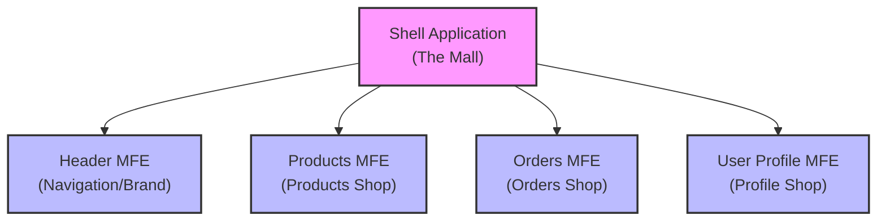

# Chapter 1: Micro Frontend (MFE)

Welcome to the `mfe-project` tutorial! In this series, we're going to explore the exciting world of Micro Frontends and how they can help you build large, complex web applications more effectively.

Let's start with the very first concept: the **Micro Frontend (MFE)** itself.

## What is a Micro Frontend?

Imagine you're building a huge shopping mall website. You have sections for products, orders, customer profiles, maybe a blog, a contact page, etc.

In a traditional setup, all the code for these different sections might be jumbled together in one massive project. Making a change to the "Products" section might accidentally break something in the "Orders" section because everything is tightly linked. Deploying a small fix requires deploying the _entire_ website, which is risky and slow.

Micro Frontends offer a different approach.

**Think of a Micro Frontend like an independent shop in a large mall.**

- Each shop (MFE) is specialized (one sells clothes, another electronics, another has a food court).
- Each shop is _mostly_ self-contained: it manages its own inventory, staff, and look (its own code, dependencies, and build process).
- Customers (users) experience the mall as one cohesive place, walking from shop to shop seamlessly.
- Importantly, if the clothing shop needs a minor update (like rearranging shelves), it doesn't require shutting down or rebuilding the entire mall. It can update and deploy independently.

In technical terms, a Micro Frontend is a **small, self-contained, independently deployable part of your application's user interface**.

## Why Use Micro Frontends?

The main problems MFEs solve are:

1.  **Team Autonomy:** Different teams can own different MFEs (e.g., a "Products Team" for the Products MFE, an "Orders Team" for the Orders MFE). They can work independently, choose their own tools (within reason), and move faster without constantly coordinating every little change with other teams.
2.  **Independent Deployment:** You can build, test, and deploy each MFE on its own schedule. A bug fix in the "User Profile" only requires deploying the User Profile MFE, not the whole application. This reduces risk and increases release frequency.
3.  **Technology Flexibility:** While not always fully realized in practice, MFEs _can_ theoretically be built using different frontend technologies (e.g., one MFE in React, another in Vue). This allows teams to choose the best tool for the job or gradually migrate legacy parts of an application.
4.  **Easier to Manage Complexity:** Instead of one giant codebase, you have several smaller, more manageable codebases.

## How Do MFEs Come Together?

So, if these MFEs are independent, how do they form a single, unified website that the user sees and interacts with?

This is where another key concept comes in: the **Shell Application**.

Think of the Shell as the **Mall itself**. It provides the structure, the entrance, the walkways, and the directories that guide people to different shops. It's the main entry point for the user and is responsible for _loading_ and _arranging_ the different MFEs (shops) into a single page.

Here's a simplified view of how the pieces fit together:



_(You can click on "Shell Application" in the diagram to jump to the next chapter!)_

The Shell Application acts as the "host" that pulls in the "remote" MFEs.

## MFEs in Our Project

In our `mfe-project`, you'll see several folders, each representing a different part of our application built as an MFE:

- `header-mfe`: Contains the code for the site's header and navigation.
- `products-mfe`: Contains the code for managing products.
- `orders-mfe`: Contains the code for managing orders.
- `user-profile-mfe`: Contains the code for displaying and editing user profiles.
- `shell`: This is our Shell Application that brings all these MFEs together.

Let's peek inside one of the MFE folders, like `user-profile-mfe`, just to see how it looks like a standard, independent project.

Here's a small part of its `package.json`:

```json
// user-profile-mfe/package.json
{
  "name": "user-profile-mfe",
  "version": "1.0.0",
  "description": "User Profile Component MFE - Reusable profile component",
  "main": "index.js",
  "scripts": {
    "dev": "webpack serve --config webpack.config.js --mode development",
    "build": "webpack --config webpack.config.js --mode production",
    "start": "webpack serve --config webpack.config.js --mode production --port 3004"
    // ... other scripts
  },
  "dependencies": {
    "react": "^17.0.2",
    "react-dom": "^17.0.2"
  }
  // ... devDependencies, etc.
}
```

See how it has its own `name`, `version`, `scripts` (`dev`, `build`, `start`), and `dependencies` (like React)? This confirms it's a standalone project that can be developed and run independently.

Now look at a small part of its `webpack.config.js`:

```javascript
// user-profile-mfe/webpack.config.js
const HtmlWebpackPlugin = require("html-webpack-plugin");
const ModuleFederationPlugin = require("webpack/lib/container/ModuleFederationPlugin");

module.exports = {
  mode: process.env.NODE_ENV === "production" ? "production" : "development",
  entry: "./src/index.js",

  devServer: {
    port: 3004, // <--- It runs on its own port!
    hot: true,
    headers: {
      /* ... */
    },
  },

  resolve: {
    /* ... */
  },
  module: {
    /* ... */
  },

  plugins: [
    new ModuleFederationPlugin({
      /* ... */
    }), // <--- This is key, we'll learn this later
    new HtmlWebpackPlugin({
      /* ... */
    }),
  ],
};
```

Notice the `devServer.port: 3004`. This means you can actually run the User Profile MFE _by itself_ during development by navigating to `http://localhost:3004`. This is a powerful aspect of MFE development – you can focus on just one part without needing the whole system running.

Finally, let's look at the main component it exposes:

```jsx
// user-profile-mfe/src/UserProfile.js
import React, { useState, useEffect } from "react";
import "./styles.css"; // <-- It has its own styles!

const UserProfile = ({ user }) => {
  const [isEditing, setIsEditing] = useState(false);
  const [formData, setFormData] = useState({
    /* ... */
  });

  // Update form data when user prop changes
  useEffect(() => {
    /* ... */
  }, [user]);

  const handleSave = () => {
    /* ... */
  };
  const handleCancel = () => {
    /* ... */
  };

  if (!user) {
    /* ... */
  } // Handle missing user data

  return (
    // ... JSX for rendering the profile
    <div className="user-profile-container">
      <div className="user-profile">
        {/* ... profile details and edit form */}
        <div className="mfe-info">
          <small>👤 User Profile MFE :3004</small> {/* <-- Self-identifying! */}
        </div>
      </div>
    </div>
  );
};

export default UserProfile; // <-- Exports the component
```

This code shows that the MFE contains the actual UI logic (React component, state, effects) and even its own styling (`styles.css`). It's a complete, small application piece ready to be used elsewhere. The component is `export`ed so other applications (like our Shell) can potentially use it.

This structure is repeated for the `header-mfe`, `products-mfe`, and `orders-mfe` projects. Each is an independent unit.

## Conclusion

In this chapter, we introduced the core concept of Micro Frontends – breaking down a large frontend application into smaller, independent, and deployable units, much like shops in a mall. We saw why this approach is beneficial for large teams and complex applications, offering autonomy and flexibility. We also briefly touched upon the idea of a Shell Application that hosts these MFEs.

You saw how each MFE in our project (`header-mfe`, `products-mfe`, `orders-mfe`, `user-profile-mfe`) lives in its own directory, with its own `package.json` and build configuration, emphasizing its independence.

Now that we understand what an MFE is conceptually, let's dive into the "Mall" itself – the Shell Application that brings them all together.

[Next Chapter: Shell (Host Application)](02_shell__host_application__.md)
