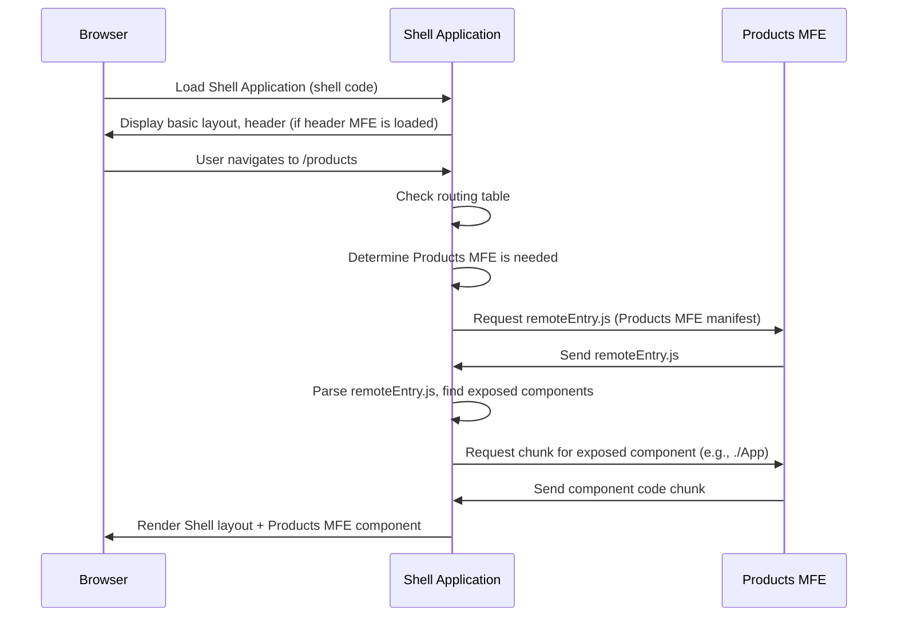

# Chapter 1: Micro Frontend (MFE) Structure

Welcome to the "MFE Learning Project"! This tutorial will guide you through building and understanding a Micro Frontend architecture using Webpack 5's Module Federation.

Let's start with the absolute basics: **What is a Micro Frontend Structure?**

Imagine you're building a really big web application, like a large online store with sections for products, user profiles, orders, and a header that appears on every page. Traditionally, you might build this as one giant application. As it grows, this "monolith" can become really hard to manage. Teams might step on each other's toes, updates become risky, and trying out new technologies is difficult because everything is tightly connected.

This is where the **Micro Frontend (MFE)** approach comes in. Think of it like a large shopping mall. The mall provides the main structure (the building, parking lot, common areas), but the individual shops inside (like a bookstore, a coffee shop, a clothing store) are independent. Each shop manages its own inventory, staff, and operations.

In a Micro Frontend architecture:

1.  The large web application is split into smaller, independent parts. Each part is a **Micro Frontend (MFE)**.
2.  There's a main application, often called the **Shell** or **Host**, that acts like the shopping mall. Its job is to load and display these independent MFEs.

This project (`mfe-project`) follows this structure.

### The Use Case: Building Our Online Store

In our project, we're building a simplified online store application. Instead of one big app, we've broken it down:

- A **Shell** application: This is the main framework that provides the layout and navigation. It's the "shopping mall".
- A **Header MFE**: This handles the navigation bar at the top. It's like a small, shared shop (maybe a directory or info booth?) that appears everywhere.
- A **Products MFE**: This handles displaying and managing products. It's like the "Electronics Store" in the mall.
- An **Orders MFE**: This handles showing user orders. It's like the "Customer Service" desk or "Order Pickup" point.
- A **User Profile MFE**: This could potentially show user details (although in this project, its functionality is exposed for other MFEs to use, acting more like a utility shop).

The goal is that the Shell application will load these individual MFEs as needed to build the complete page the user sees.

### Breaking Down the Structure

Let's look at the core pieces in our project:

1.  **The Shell Application (`shell/`)**

    - This is the main container.
    - It doesn't contain the code for products or orders itself.
    - Its primary job is to:
      - Provide the overall layout.
      - Handle routing (deciding which MFE to show based on the URL).
      - **Load** the necessary MFEs when the user navigates to a specific section (like the Products page or Orders page).

2.  **The Micro Frontends (MFEs)**
    - `header-mfe/`
    - `products-mfe/`
    - `orders-mfe/`
    - `user-profile-mfe/`
    - Each of these directories contains a completely separate project.
    - They can be developed and even run **independently**. You could, for example, run _just_ the Products MFE during development without the Shell or other MFEs.
    - Each MFE is responsible for its own specific feature or part of the UI.
    - They need to be built in a way that they can be loaded _by_ the Shell.

### How the Shell Loads MFEs

How does the Shell know _where_ to find these MFEs and _what_ part of an MFE to load? This is where a crucial technology comes in, which we'll cover in detail in the next chapter: [Webpack Module Federation Plugin](02_webpack_module_federation_plugin_.md).

For now, let's get a high-level idea and look at some code snippets to see how this structure looks in practice.

### Looking at the Project Code

Open the project in your code editor. Notice the main project directory contains several sub-directories:

```bash
mfe-learning-project/
├── shell/
├── header-mfe/
├── products-mfe/
├── orders-mfe/
├── user-profile-mfe/
├── package.json
└── ... other files
```

This directory structure directly reflects our MFE architecture! Each sub-directory is an independent part of the application.

Now, let's peek into the `package.json` file in the root of the project:

```json
{
  "name": "mfe-learning-project",
  "version": "1.0.0",
  "description": "Micro Frontend Architecture Learning Project with Webpack Module Federation",
  "private": true,
  "scripts": {
    "install:all": "npm run install:shell && npm run install:header && npm run install:products && npm run install:orders && npm run install:profile",
    "install:shell": "cd shell && npm install",
    "install:header": "cd header-mfe && npm install",
    "install:products": "cd products-mfe && npm install",
    "install:orders": "cd orders-mfe && npm install",
    "install:profile": "cd user-profile-mfe && npm install",
    "dev": "concurrently \"npm run api\" \"npm run dev:header\" \"npm run dev:products\" \"npm run dev:orders\" \"npm run dev:profile\" \"npm run dev:shell\""
    // ... other scripts
  },
  "devDependencies": {
    "concurrently": "^7.6.0"
    // ...
  }
  // ...
}
```

Notice the `scripts` section. We have separate `install`, `dev`, `build`, and `start` scripts for _each_ MFE (`install:shell`, `install:header`, `dev:products`, etc.). This shows their independence – you can build or run them separately. The `dev` script uses `concurrently` to run _all_ of them at once for local development, which simulates the full application.

Next, let's look at how the Shell application (`shell/`) uses the other MFEs. Open `shell/src/App.js`:

```jsx
// ... imports
import React, { Suspense, useContext, useState } from "react";
import {
  BrowserRouter as Router,
  Routes,
  Route,
  Navigate,
} from "react-router-dom";
// ... other imports

// Lazy load MFE components
const HeaderMfe = React.lazy(() => import("headerMfe/Header"));
const ProductsMfe = React.lazy(() => import("productsMfe/App"));
const OrdersMfe = React.lazy(() => import("ordersMfe/App"));
// ... more lazy imports

const AppContent = () => {
  // ... context and loading logic

  return (
    <div className="app">
      <Router>
        {/* API Status Indicator */}
        {/* ... */}

        {/* Header MFE */}
        <Suspense fallback={<Loading message="Loading Header..." />}>
          <HeaderMfe /> {/* <- Using the Header MFE component */}
        </Suspense>

        {/* Main Content */}
        <main style={{ minHeight: "calc(100vh - 120px)" }}>
          <Routes>
            <Route path="/" element={<Navigate to="/products" replace />} />

            <Route
              path="/products/*"
              element={
                <Suspense fallback={<Loading message="Loading Products..." />}>
                  <ProductsMfe /> {/* <- Using the Products MFE App */}
                </Suspense>
              }
            />

            <Route
              path="/orders/*"
              element={
                <Suspense fallback={<Loading message="Loading Orders..." />}>
                  <OrdersMfe /> {/* <- Using the Orders MFE App */}
                  {/* ... another component from Orders MFE */}
                </Suspense>
              }
            />
          </Routes>
        </main>

        {/* Learning Info */}
        {/* ... */}

        {/* Footer */}
        {/* ... */}
      </Router>
    </div>
  );
};

function App() {
  return (
    // ... context provider
    <AppContent />
    // ...
  );
}

export default App;
```

Look at the lines using `React.lazy`. We're using `import("headerMfe/Header")`, `import("productsMfe/App")`, and `import("ordersMfe/App")`. This is the Shell _asking_ for components provided by the other MFEs. The names like `"headerMfe"` or `"productsMfe"` and the component paths like `/Header` or `/App` are defined using Module Federation, which we'll explore next.

Notice the Shell doesn't import files from the `header-mfe/src/`, `products-mfe/src/`, etc. directories directly. It imports them using these special strings (`"headerMfe/Header"`). This is the magic of Module Federation! The Shell is configured to know that `"headerMfe"` refers to the separately running Header MFE.

How do the MFEs make these components available? Let's look at a snippet from `header-mfe/webpack.config.js`:

```javascript
// ... imports
const ModuleFederationPlugin = require("webpack/lib/container/ModuleFederationPlugin");
// ...

module.exports = {
  // ... other config
  plugins: [
    new ModuleFederationPlugin({
      name: "headerMfe", // This is the name the Shell will use to refer to this MFE
      filename: "remoteEntry.js", // The file that tells others what this MFE exposes
      exposes: {
        // We are exposing our Header component under the key "./Header"
        "./Header": "./src/Header",
      },
      // ... shared modules
    }),
    // ... other plugins
  ],
  // ...
};
```

And from `products-mfe/webpack.config.js`:

```javascript
// ... imports
const ModuleFederationPlugin = require("webpack/lib/container/ModuleFederationPlugin");
// ...

module.exports = {
  // ... other config
  plugins: [
    new ModuleFederationPlugin({
      name: "productsMfe", // Name for this MFE
      filename: "remoteEntry.js",
      exposes: {
        // Expose the main App component for the Shell to consume
        "./App": "./src/App",
      },
      // ... remotes (this MFE can also consume others)
      // ... shared modules
    }),
    // ... other plugins
  ],
  // ...
};
```

These `webpack.config.js` files show that each MFE uses `ModuleFederationPlugin` to define its `name` and `exposes` certain modules. The Shell then uses this `name` and the exposed module path (like `./Header` or `./App`) to import and use the component.

### How it Works (Behind the Scenes)

When you run the Shell application and navigate to a route that needs an MFE (like `/products`):

1.  The Shell's code (which is already loaded) determines that it needs the `productsMfe` application's `./App` component.
2.  Based on its own configuration (`shell/webpack.config.js`), the Shell knows where to find the "entry point" for the `productsMfe` (specifically, its `remoteEntry.js` file).
3.  The Shell's browser downloads the `remoteEntry.js` file from the server hosting the Products MFE.
4.  This `remoteEntry.js` file contains information about what modules the Products MFE exposes and how to load them.
5.  The Shell then downloads the specific code chunk(s) needed for the `./App` component from the Products MFE.
6.  Once downloaded, the Shell can render the `ProductsMfe` component as if it were part of its own application.

Here's a simple diagram illustrating the basic idea:



This process happens seamlessly to the user. The Shell dynamically loads the necessary parts from different deployed applications.

### Conclusion

In this chapter, we've introduced the core concept of a Micro Frontend structure: breaking a large application into independent, smaller applications (MFEs) that are loaded and orchestrated by a main **Shell** application. We saw how this is reflected in our project's directory structure and build scripts, and how the Shell application uses `React.lazy` and special import paths to load components provided by other MFEs.

This independence makes development, deployment, and scaling much more manageable, like having specialized shops within a large, organized mall.

The technology that makes this dynamic loading and sharing of components possible is the **Webpack Module Federation Plugin**. In the next chapter, we will dive deeper into how this powerful plugin works:

[Chapter 2: Webpack Module Federation Plugin](02_webpack_module_federation_plugin_.md)
