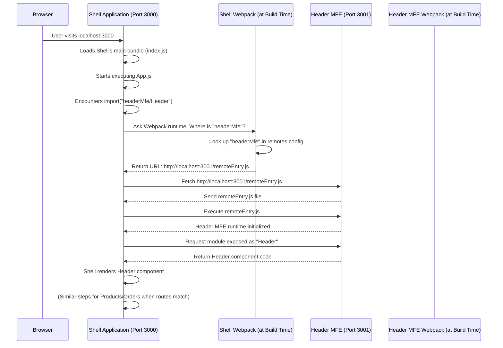

# Chapter 1: Shell Application (Host)

Welcome to this tutorial on building Micro Frontends with Webpack Module Federation! In this first chapter, we're going to explore the foundation of our micro frontend architecture: the Shell Application, also sometimes called the Host.

Imagine you're building a large, complex website, like an online shopping mall. This mall needs lots of different sections: a place to browse products, a place to view your orders, a header showing your profile, maybe a footer with links, and so on.

In a traditional approach, all these pieces might be built together as one giant application. As the mall gets bigger and more features are added, this single application becomes harder to manage, update, and scale. Different teams might step on each other's toes while working on different parts.

This is where Micro Frontends come in! Instead of one giant application, we break it down into smaller, more manageable pieces. Think of each section (products, orders, header) as a separate 'store' within the mall.

But how do you get all these separate 'stores' to appear together as a single, unified shopping mall website? This is the job of the **Shell Application**.

### What is the Shell Application (Host)?

Using our shopping mall analogy:

- The **Shell Application** is like the structure of the shopping mall itself – the building, the hallways, the main entrance, and the common areas.
- It doesn't sell products itself (it doesn't contain the specific business logic of products or orders).
- Its main job is to **host** or contain the different "stores" (our Micro Frontends) and make them appear as one seamless experience to the visitor.

In technical terms, the Shell Application is the main framework or container for your micro frontend system.

### Why Do We Need a Shell Application?

The Shell application is essential because it:

1.  **Provides the Structure:** It defines the overall layout of the page. Where does the header go? Where does the main content area sit? Where does the footer belong?
2.  **Loads the Micro Frontends:** It's responsible for fetching and displaying the code for each individual Micro Frontend ('store').
3.  **Handles Common Infrastructure:** Things that are needed across the entire application, like routing (navigating between different 'pages' or 'stores') or sharing common libraries (like React), are often managed by the Shell.
4.  **Orchestrates the Experience:** It brings everything together so the user sees one cohesive website, not a bunch of disconnected pieces.

So, our main use case for the Shell is to serve as the central hub that loads and displays different parts of our application, which are built as separate Micro Frontends.

Let's look at how our `mfe-project` handles this in the `shell` application code.

### Loading Micro Frontends in the Shell

Open the file `shell/src/App.js`. This is the main React component for our Shell application. Notice how it imports other parts of the application:

```javascript
// shell/src/App.js (Simplified)
import React, { Suspense } from "react";
import { BrowserRouter as Router, Routes, Route } from "react-router-dom";

// Lazy load MFE components
const HeaderMfe = React.lazy(() => import("headerMfe/Header"));
const ProductsMfe = React.lazy(() => import("productsMfe/App"));
const OrdersMfe = React.lazy(() => import("ordersMfe/App"));

// Simple loading component
const Loading = ({ message = "Loading..." }) => (
  <div style={{ padding: "20px", textAlign: "center" }}>{message}</div>
);

const AppContent = () => {
  return (
    <div className="app">
      <Router>
        {/* Header MFE */}
        <Suspense fallback={<Loading message="Loading Header..." />}>
          <HeaderMfe />
        </Suspense>

        {/* Main Content */}
        <main>
          <Routes>
            <Route
              path="/products/*"
              element={
                <Suspense fallback={<Loading message="Loading Products..." />}>
                  <ProductsMfe />
                </Suspense>
              }
            />
            <Route
              path="/orders/*"
              element={
                <Suspense fallback={<Loading message="Loading Orders..." />}>
                  <OrdersMfe />
                </Suspense>
              }
            />
            {/* ... other routes or default redirects */}
          </Routes>
        </main>

        {/* ... Footer MFE or other common elements */}
      </Router>
    </div>
  );
};

function App() {
  // ... App Context Provider ...
  return <AppContent />;
}

export default App;
```

**Explanation:**

1.  `import React, { Suspense } from "react";`: We're using React, and `Suspense` helps us handle components that are being loaded asynchronously (like our MFEs).
2.  `React.lazy(() => import("headerMfe/Header"));`: This line is key! `React.lazy` tells React to _only_ load the `Header` component from the `headerMfe` package when it's actually needed for rendering.
3.  `import("headerMfe/Header")`: This `import()` syntax looks like a regular dynamic import, but in the context of Micro Frontends configured with Webpack Module Federation, it has a special meaning. It tells Webpack, "Go find the `headerMfe` remote module that I've configured, and specifically give me the thing it exposes as `Header`." We'll see where this "configuration" happens next.
4.  `<Suspense fallback={<Loading.../>}>`: While the `headerMfe` code is being fetched over the network, `Suspense` shows a temporary `Loading` message.
5.  `<HeaderMfe />`: Once the `headerMfe` code is loaded, React renders the actual `Header` component provided by that Micro Frontend.
6.  `<ProductsMfe />` and `<OrdersMfe />` are loaded similarly, typically when the user navigates to their respective routes (`/products` or `/orders`).

This `App.js` file shows how the Shell application uses `React.lazy` and dynamic `import()` to _load and display_ the different Micro Frontends (`headerMfe`, `productsMfe`, `ordersMfe`).

### How Does the Shell Know _Where_ to Find the MFEs?

The `import("headerMfe/Header")` syntax is the _request_, but the Shell needs to know the _address_ of the `headerMfe`. This is configured in the Shell's Webpack setup, specifically using the [Webpack Module Federation](03_webpack_module_federation_.md) plugin.

Open the file `shell/webpack.config.js`. This file tells Webpack how to build the Shell application. Look for the `plugins` section and find `ModuleFederationPlugin`:

```javascript
// shell/webpack.config.js (Simplified)
const ModuleFederationPlugin = require("webpack/lib/container/ModuleFederationPlugin");

// Helper function to get MFE URLs (local or production)
const getRemoteUrl = (port, name) => {
  // ... logic to determine URL based on environment ...
  return `http://localhost:${port}/remoteEntry.js`; // Example for local dev
};

module.exports = {
  // ... other Webpack config ...
  plugins: [
    new ModuleFederationPlugin({
      name: "shell", // This is the name of *this* application (the shell)
      remotes: {
        // Configure the remote MFEs the shell needs to load
        headerMfe: `headerMfe@${getRemoteUrl(3001, "mfe/header-mfe")}`,
        productsMfe: `productsMfe@${getRemoteUrl(3002, "mfe/products-mfe")}`,
        ordersMfe: `ordersMfe@${getRemoteUrl(3003, "mfe/orders-mfe")}`,
        // ... potentially other remotes ...
      },
      shared: {
        // ... configuration for shared libraries like React ...
      },
    }),
    // ... other plugins ...
  ],
  // ... other Webpack config ...
};
```

**Explanation:**

1.  `new ModuleFederationPlugin({...})`: This is the core of Webpack Module Federation. It's configuring how this application (`shell`) will interact with other applications (the MFEs).
2.  `name: "shell"`: This gives _this_ application a name (`shell`). While not strictly necessary for a Host that only consumes remotes, it's good practice and required if the Shell were to expose anything itself.
3.  `remotes: { ... }`: This is where the Shell lists _which_ other applications (MFEs) it needs to load and _where_ to find them.
4.  `headerMfe: "headerMfe@http://localhost:3001/remoteEntry.js"` (using the simplified local URL):
    - `headerMfe`: This is the _key_ you use in your `import()` statements in `App.js` (`import("headerMfe/Header")`). You can choose any alias you like here.
    - `headerMfe@`: This part specifies the _name_ of the remote application itself. It must match the `name` defined in the _remote's_ Module Federation config (e.g., the `header-mfe` application must be configured with `name: "headerMfe"`).
    - `http://localhost:3001/remoteEntry.js`: This is the _address_ where Webpack can find the entry point for the `headerMfe` application. This entry point is a special file generated by Webpack Module Federation called `remoteEntry.js`. We'll learn more about [remoteEntry.js](05__remoteentry_js__.md) in a later chapter.

So, when `App.js` says `import("headerMfe/Header")`, Webpack looks up `headerMfe` in the `remotes` list in `webpack.config.js`, finds its URL (`http://localhost:3001/remoteEntry.js`), loads that file, and then asks it for the code related to `"Header"`.

### How it Works: The Loading Process

Let's trace a simplified flow when you open the Shell application in your browser:



This diagram shows that the Shell acts as the central orchestrator. It doesn't _contain_ the code for the MFEs initially, but it knows _where to find_ them and loads them dynamically when needed.

### Shared Libraries

Another important role of the Shell, configured in `shell/webpack.config.js`, is managing [Shared Modules/Libraries](06_shared_modules_libraries_.md), like React.

```javascript
// shell/webpack.config.js (Shared config simplified)
new ModuleFederationPlugin({
  // ... remotes config ...
  shared: {
    react: {
      singleton: true, // Ensure only one copy of React is loaded
      requiredVersion: "^17.0.2", // Shell needs at least this version
      eager: true, // Load React immediately
    },
    "react-dom": {
      singleton: true,
      requiredVersion: "^17.0.2",
      eager: true,
    },
    "react-router-dom": {
      singleton: true,
      requiredVersion: "^6.3.0",
      eager: false, // Lazy load router-dom if not immediately needed
    },
  },
  // ... other config ...
});
```

By listing `react`, `react-dom`, and `react-router-dom` in the `shared` section, the Shell tells Webpack: "These libraries are important, and I want to make sure that all Micro Frontends I load use the _same_ version of these libraries that _I_ am using (or at least a compatible version). Please handle the de-duplication."

This is crucial for performance and preventing conflicts, ensuring that only one instance of React, for example, is loaded in the user's browser, even though both the Shell and the MFEs might depend on it.

### Conclusion

In this chapter, we learned that the Shell Application (Host) is the essential foundation for a Micro Frontend architecture. It's like the main building of our shopping mall, responsible for:

- Providing the overall layout.
- Knowing where our individual Micro Frontends ('stores') live using Webpack Module Federation's `remotes` configuration.
- Dynamically loading and displaying these MFEs using `React.lazy` and `import()`.
- Helping manage [Shared Modules/Libraries](06_shared_modules_libraries_.md) to ensure a smooth, efficient application.

It doesn't contain the business logic of the features (like products or orders) but acts as the container that brings them all together into a single, unified experience.

Now that we understand the role of the Shell, let's dive into what those individual 'stores' or building blocks are. In the next chapter, we'll explore the concept of a [Micro Frontend (MFE)](02_micro_frontend__mfe__.md).

[Micro Frontend (MFE)](02_micro_frontend__mfe__.md)
