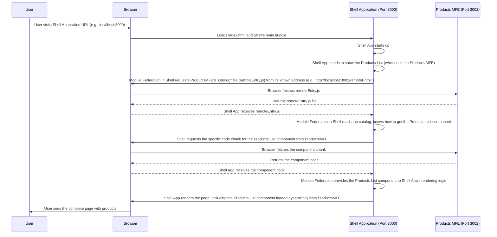

# Chapter 1: Webpack Module Federation

Welcome to the `mfe-project` tutorial! In this first chapter, we're going to dive into the foundational technology that makes everything in our project possible: **Webpack Module Federation**.

Think of building a really large website or web application, like a big online store. Traditionally, you might build this as one giant application. This works fine for smaller projects, but as it grows, it becomes harder to manage. Different teams might work on different parts (like the products page, the checkout, the user profile), but they all have to coordinate closely because they're working on the _same_ codebase. Updates to one part could accidentally break another part.

Wouldn't it be great if each team could build their part of the website as a completely independent application, and then somehow, at the very end, these independent applications could come together in the user's browser to look and feel like one seamless website?

This is where **Webpack Module Federation** comes in!

## The "Delivery Truck" and "Store Manager"

Imagine our big online store is like a large shopping mall. Inside the mall, there are many different stores. Each store is run independently by a different owner (team).

- One store might sell "Products".
- Another might handle the "Shopping Cart".
- Yet another focuses on "User Profiles".

Traditionally, getting goods from one store into another or sharing staff (like a central security team) was complicated. But in our MFE mall, **Webpack Module Federation** acts like:

1.  **The Delivery Truck:** It's the system that figures out _how_ to get the code and components from one independent store (application) to another one that needs it.
2.  **The Store Manager:** It helps each store announce what items (components, code) they have available to share, and helps stores figure out what common supplies (like React, which we'll discuss later in [Shared Dependencies](06_shared_dependencies_.md)) they can share instead of everyone stocking their own.

Essentially, Webpack Module Federation is a powerful Webpack plugin that allows multiple, separate applications to share code and assets _at runtime_. This means an application built by Team A can use a component built by Team B directly in the user's browser, without having to manually copy and paste code or manage complex package versions beforehand.

## The Core Idea: Sharing Code at Runtime

The key idea is "**runtime sharing**". Instead of bundling _all_ the code your application _might_ need from other parts into one large file during the build process, Module Federation lets you dynamically load pieces of code from another running application _when your application needs it_.

This is achieved through a special file generated by the Module Federation plugin called `remoteEntry.js`. Think of this as a "manifest" or "catalog" for a particular application. It lists what code modules (like components or functions) that application is making available for others to use and provides instructions on how to load them.

Let's look at a simplified view of how this might work when one application (the "Shell" or "Host") wants to use something from another application (a "Remote" MFE).



_(This diagram simplifies some technical details, but illustrates the dynamic loading concept.)_

This dynamic loading is the magic! The Shell application doesn't need to know _exactly_ what's inside the Products MFE beforehand, just where to find its catalog (`remoteEntry.js`) and what components are listed there.

## Using the `ModuleFederationPlugin`

Webpack Module Federation is configured using the `ModuleFederationPlugin` provided by Webpack itself. You add this plugin to the `webpack.config.js` file of each application that participates in the federation.

Here's a minimal look at how it appears in a Webpack config:

From `shell/webpack.config.js`:

```javascript
// ... other webpack config settings ...
const ModuleFederationPlugin = require("webpack/lib/container/ModuleFederationPlugin");

module.exports = {
  // ...
  plugins: [
    new ModuleFederationPlugin({
      name: "shell", // This app's unique name
      remotes: {
        // Links to other apps we might use
        // e.g., headerMfe: 'headerMfe@http://localhost:3001/remoteEntry.js'
      },
      shared: {
        // Libraries like React that apps will share
      },
    }),
    // ... other plugins
  ],
  // ...
};
```

This snippet shows the basic setup in our main "Shell" application's Webpack config.

- `name: 'shell'` gives this application a unique name within the federation.
- `remotes` is where this application lists _other_ applications it might want to use code from (we'll cover this in detail in [Remotes Configuration](04_remotes_configuration_.md)).
- `shared` lists common libraries that applications agree to share to avoid loading them multiple times (more on this in [Shared Dependencies](06_shared_dependencies_.md)).

Now let's look at an example from one of the applications that _provides_ code, like the `header-mfe`.

From `header-mfe/webpack.config.js`:

```javascript
// ... other webpack config settings ...
const ModuleFederationPlugin = require("webpack/lib/container/ModuleFederationPlugin");

module.exports = {
  // ...
  plugins: [
    new ModuleFederationPlugin({
      name: "headerMfe", // This app's unique name
      filename: "remoteEntry.js", // The name of the catalog file
      exposes: {
        // What parts of THIS app are available for others
        "./Header": "./src/Header",
      },
      shared: {
        // Libraries THIS app shares
      },
    }),
    // ... other plugins
  ],
  // ...
};
```

Here's what's happening in the `header-mfe`'s config:

- `name: 'headerMfe'` gives this application its unique name.
- `filename: 'remoteEntry.js'` specifies the name for the "catalog" file that lists what's available.
- `exposes` is where this application lists the specific components or modules it wants to make available for _other_ applications to consume (this is covered in [Exposed Modules](05_exposed_modules_.md)).
- `shared` again lists common libraries.

Don't worry if the details of `remotes`, `exposes`, and `shared` aren't perfectly clear yet. We have dedicated chapters coming up to explain each of these key concepts!

## What's Under the Hood (Simplified)

When you build your application using Webpack with the `ModuleFederationPlugin`:

1.  Webpack analyzes your code and figures out which modules are needed.
2.  For applications acting as "Remotes" (like `headerMfe` or `productsMfe`), Webpack bundles the code listed in the `exposes` section into separate chunks and generates the `remoteEntry.js` file. This file acts as a manifest, containing instructions for other applications on how to load these exposed modules.
3.  For the "Host" or "Shell" application, Webpack builds its own code. When it encounters an `import` statement that refers to a module configured in its `remotes` section (like importing a component from `headerMfe`), Webpack doesn't bundle that code directly. Instead, it generates special code that, _at runtime_, will use the `remoteEntry.js` of the remote application to locate and load the necessary module dynamically.
4.  Webpack also manages the `shared` dependencies, making sure that if multiple applications need the same library (like React), the browser only downloads and runs it once, coordinated by the Module Federation plugin.

This process turns your independent application builds into pieces that can be composed together dynamically in the browser, forming your complete MFE application.

## Conclusion

In this chapter, we learned that Webpack Module Federation is the core technology that enables different parts of our `mfe-project` to be built and deployed independently while still being able to share code and work together seamlessly in the user's browser. It acts like the "delivery truck" and "store manager," handling the complex process of loading and sharing code at runtime using a "catalog" file (`remoteEntry.js`) and managing shared libraries.

We saw a glimpse of how the `ModuleFederationPlugin` is configured in the Webpack setup of participating applications, using options like `name`, `remotes`, `exposes`, and `shared`.

Now that we understand the underlying mechanism, let's move on to define the structure of our project. In the next chapter, we'll explore what a **Micro Frontend (MFE)** is in more detail and how our independent application parts fit this model.

[Next Chapter: Micro Frontend (MFE)](02_micro_frontend__mfe__.md)
