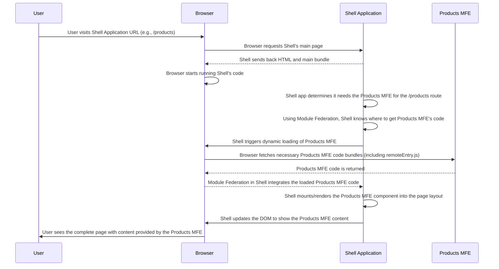

# Chapter 2: Micro Frontend (MFE)

Welcome back to the `mfe-project` tutorial! In [Chapter 1: Webpack Module Federation](01_webpack_module_federation_.md), we introduced the powerful technology that allows separate applications to share code at runtime. Now, let's dive into _what_ we're building with that technology: **Micro Frontends (MFEs)**.

Remember our analogy of a large website being like a shopping mall? Webpack Module Federation is like the advanced logistics system that lets different stores share resources and deliver goods between them efficiently. But what _are_ the stores themselves?

## What is a Micro Frontend?

A **Micro Frontend** is essentially an _independent, self-contained web application_ that represents a specific part or feature of a larger website or web application.

Think of that shopping mall again. Each store in the mall is a Micro Frontend:

- The Clothing Store MFE
- The Book Store MFE
- The Electronics Store MFE
- The Food Court MFE

Each store (MFE) has its own staff (team), manages its own inventory (code and data), has its own layout and design (UI components and styling), and can operate independently. They don't need constant permission from the mall management (a central team) to rearrange their shelves or update their stock.

The goal of Micro Frontends is to take a large, complex frontend application and break it down into smaller, more manageable pieces that can be:

1.  **Developed Independently:** Different teams can work on different MFEs without stepping on each other's toes in a single large codebase.
2.  **Deployed Independently:** Each MFE can be built and deployed on its own release cycle. An update to the "Shopping Cart MFE" doesn't require redeploying the entire website.
3.  **Scaled Independently:** While typically frontend scaling involves caching and CDNs, the principle applies to development teams and infrastructure.
4.  **Technologically Diverse (potentially):** In theory, different teams could use different frontend frameworks (like React, Vue, Angular) for their MFE, although sharing common libraries like React (as we do in this project with [Shared Dependencies](06_shared_dependencies_.md)) is crucial for performance and consistency. Our project primarily uses React for simplicity and consistency across MFEs.

In short, Micro Frontends apply the principles of **microservices** (breaking down a large backend into small, independent services) to the frontend.

## How MFEs Work Together

So, if each MFE is an independent application, how do they form one seamless website for the user?

This is where the "Shell" or "Host" application comes in (which we'll cover in [Chapter 3: Shell (Host) Application](03_shell__host__application_.md)) and where [Webpack Module Federation](01_webpack_module_federation_.md) does its work.

The **Shell** application is the main "entry point" for the user. It's like the structure of the shopping mall itself – the building, the hallways, the directories. The Shell's job is to load the basic page structure and then, using Module Federation, identify _where_ the different MFEs are located and dynamically load them into specific areas of the page as needed.

Imagine the user navigates to the `/products` page of our online store. The Shell application:

1.  Loads its main layout (header, footer, main content area).
2.  Looks at its configuration (using WMF's `remotes`) to find the address of the "Products MFE".
3.  Tells the browser to load the code for the Products MFE (via its `remoteEntry.js` file, as discussed in Chapter 1).
4.  Once loaded, the Shell mounts or renders the Products MFE's main component into the designated area on the page.

To the user, it looks like one application, but behind the scenes, multiple independent applications are running together in their browser.

Here's a simplified look at the interaction flow, similar to our previous diagram but focusing on the Shell-MFE relationship:



## MFEs in Our `mfe-project`

Our `mfe-project` is structured specifically to demonstrate Micro Frontends using Webpack Module Federation. If you look at the project's root directory, you'll see several folders within the `workspaces` defined in `package.json`:

- `shell` (This is our Shell/Host application)
- `header-mfe` (An independent MFE for the header)
- `products-mfe` (An independent MFE for the products page)
- `orders-mfe` (An independent MFE for the orders page)
- `user-profile-mfe` (An independent MFE for a user profile component)

Each of these folders contains what looks like a complete, small React application with its own `package.json`, `webpack.config.js`, `src` directory, etc.

Let's look at the `package.json` snippet again:

```json
// --- File: package.json ---
{
  // ...
  "workspaces": [
    "shell",
    "header-mfe",
    "products-mfe",
    "orders-mfe",
    "user-profile-mfe"
  ],
  "scripts": {
    // ... scripts to install, develop, build, start, deploy *each* app independently
    "dev": "concurrently \"npm run dev:header\" \"npm run dev:products\" \"npm run dev:orders\" \"npm run dev:profile\" \"npm run dev:shell\"",
    "dev:shell": "cd shell && npm run dev",
    "dev:header": "cd header-mfe && npm run dev",
    "dev:products": "cd products-mfe && npm run dev"
    // ... etc.
  }
  // ...
}
```

This `package.json` file uses NPM workspaces, which is a feature that helps manage multiple packages (our MFEs) within a single repository. More importantly for understanding MFEs, notice the `scripts`. There are separate commands like `dev:header`, `build:products`, `start:orders`, etc. This explicitly shows that `header-mfe`, `products-mfe`, and the others are treated as separate projects that can be developed, built, and served _individually_. When you run `npm run dev`, it starts each MFE's development server on a different port (`3001`, `3002`, `3003`, etc.) and the Shell app on its port (`3000`).

## Types of MFEs in this Project

In this project, you'll see two main ways we use Micro Frontends:

1.  **Component MFEs:** These are MFEs that expose a single UI component or a small set of components intended to be embedded _within_ a page managed by the Shell or another MFE. The `header-mfe` is a prime example. It provides a `Header` component that the Shell application loads and places at the top of every page. We'll explore this in [Chapter 7: Component MFE](07_component_mfe_.md).
2.  **Page MFEs:** These are MFEs that represent an entire page or section of the site, often with their own internal routing. The `products-mfe` and `orders-mfe` are examples. When you navigate to `/products` or `/orders` in the Shell app, the Shell loads and renders the _entire application_ from the corresponding MFE into the main content area. We'll cover this in [Chapter 8: Page MFE](08_page_mfe_.md).

You can even have Component MFEs embedded _inside_ Page MFEs, as demonstrated by the `user-profile-mfe` being loaded within the `products-mfe` (check out the `products-mfe/src/App.js` file).

Let's look at the simplified `App.js` from `products-mfe`. It looks like a standard React application entry point:

```javascript
// --- File: products-mfe/src/App.js (Simplified) ---
import React from "react";
import { Routes, Route } from "react-router-dom";
import "./styles.css";
// ... import components like ProductList, ProductDetail, AddProduct ...

const App = () => {
  // ... state and navigation logic ...

  return (
    <div className="products-mfe">
      {/* MFE Header (part of this MFE's layout) */}
      <div className="mfe-header">
        <h1>📦 Products Management</h1>
        <div className="mfe-badge">
          <span>Products MFE</span>
        </div>
      </div>

      {/* Main Content Area for internal routes */}
      <main className="products-content">
        <Routes>
          <Route path="/" element={<ProductList />} />
          <Route path="/add" element={<AddProduct />} />
          {/* ... other internal routes ... */}
        </Routes>
      </main>

      {/* ... other parts of the MFE UI ... */}
    </div>
  );
};

export default App;
```

This snippet from `products-mfe` shows it's built like a typical React app with its own layout (`div className="products-mfe"`), internal components (`ProductList`, `AddProduct`), and even its own routing (`Routes`, `Route`). This entire application is treated as _one_ Micro Frontend that the Shell loads when the user goes to the `/products` path.

Similarly, the `header-mfe` exposes a specific component:

```javascript
// --- File: header-mfe/src/Header.js (Simplified) ---
import React from "react";
import { useNavigate } from "react-router-dom";
import "./styles.css";

const Header = () => {
  const navigate = useNavigate();

  return (
    <header className="mfe-header">
      {/* Brand/Logo */}
      <div className="header-brand">
        <h1>🏗️ MFE Architecture</h1>
      </div>

      {/* Navigation links using the Shell's router */}
      <nav className="header-nav">
        <button onClick={() => navigate("/products")}>Products</button>
        <button onClick={() => navigate("/orders")}>Orders</button>
      </nav>

      {/* MFE Info Badge */}
      <div className="mfe-badge">
        <span>Header MFE</span>
      </div>
    </header>
  );
};

export default Header;
```

This `Header` component from `header-mfe` is what gets "exposed" via Webpack Module Federation ([Exposed Modules](05_exposed_modules_.md)) so that the Shell can import and render it.

## MFEs and Module Federation Configuration

While MFEs are the _concept_ of independent parts, [Webpack Module Federation](01_webpack_module_federation_.md) is the _mechanism_ that makes them work together at runtime.

The Shell's `webpack.config.js` ([Chapter 3: Shell (Host) Application](03_shell__host__application_.md)) uses the `remotes` configuration to point to the `remoteEntry.js` file of each MFE it intends to load:

```javascript
// --- File: shell/webpack.config.js (Snippet) ---
const ModuleFederationPlugin = require("webpack/lib/container/ModuleFederationPlugin");
// ... other imports and config ...

module.exports = {
  // ...
  plugins: [
    new ModuleFederationPlugin({
      name: "shell",
      remotes: {
        // headerMfe is configured here
        headerMfe: `headerMfe@http://localhost:3001/remoteEntry.js`,
        // productsMfe is configured here
        productsMfe: `productsMfe@http://localhost:3002/remoteEntry.js`,
        // ordersMfe is configured here
        ordersMfe: `ordersMfe@http://localhost:3003/remoteEntry.js`,
        // ... etc.
      },
      // ... shared dependencies ...
    }),
    // ... other plugins ...
  ],
  // ...
};
```

And each MFE's `webpack.config.js` uses the `exposes` configuration to list the components or modules it makes available for others (like the Shell) to load:

```javascript
// --- File: header-mfe/webpack.config.js (Snippet) ---
const ModuleFederationPlugin = require("webpack/lib/container/ModuleFederationPlugin");
// ... other imports and config ...

module.exports = {
  // ...
  plugins: [
    new ModuleFederationPlugin({
      name: "headerMfe",
      filename: "remoteEntry.js", // This MFE provides the catalog
      exposes: {
        // The Header component is exposed here
        "./Header": "./src/Header",
      },
      // ... shared dependencies ...
    }),
    // ... other plugins ...
  ],
  // ...
};
```

We will dive deeper into how `remotes` ([Chapter 4: Remotes Configuration](04_remotes_configuration_.md)) and `exposes` ([Chapter 5: Exposed Modules](05_exposed_modules_.md)) work in dedicated chapters. For now, understand that these configurations tell Webpack and the Module Federation plugin which independent application parts (`headerMfe`, `productsMfe`, etc.) exist and what specific pieces (`./Header`, `./App`) they offer or need.

## Conclusion

In this chapter, we defined what a **Micro Frontend (MFE)** is: an independent, self-contained application representing a part of a larger web application. We saw how our `mfe-project` is structured around this concept, with each folder (`shell`, `header-mfe`, etc.) representing a distinct, independently runnable MFE. We briefly touched upon the two main types (Component and Page MFEs) demonstrated in the project and how [Webpack Module Federation](01_webpack_module_federation_.md) is configured to allow the Shell application to load and compose these independent MFEs at runtime.

Now that we understand the concept of Micro Frontends and see how our project is structured around them, let's focus on the application that brings them all together: the Shell.

[Next Chapter: Shell (Host) Application](03_shell__host__application_.md)
