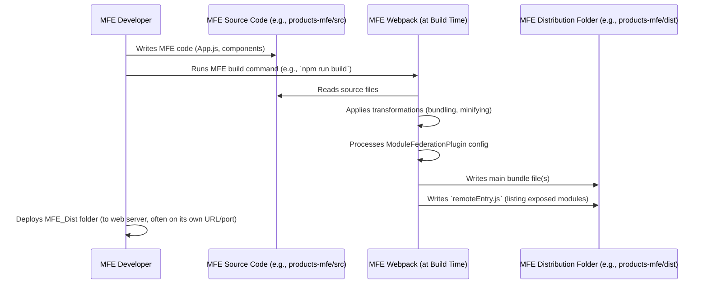

# Chapter 2: Micro Frontend (MFE)

Welcome back! In the last chapter, [Chapter 1: Shell Application (Host)](01_shell_application__host__.md), we explored the foundation of our project – the Shell application. We learned that the Shell acts like the main building of a shopping mall, providing the structure and loading individual stores (our Micro Frontends).

But what exactly are these individual 'stores' or building blocks? That's what we'll dive into in this chapter: the **Micro Frontend**, or MFE for short.

### What is a Micro Frontend (MFE)?

Imagine our shopping mall again. Each distinct store within the mall is like a Micro Frontend.

- **It's a small, independent mini-application:** Just like a store has its own space, employees, and inventory separate from other stores.
- **It represents a distinct part of the larger website:** A shoe store isn't the same as a bookstore, just like a "Products" section might be different from an "Orders" section on a website.
- **They can operate independently:** A store can manage its own stock and sales without constantly coordinating with the store next door (mostly!).
- **They all fit within the larger structure (Shell):** Despite being independent, they exist within the mall's framework and share common areas like hallways.

In technical terms, a Micro Frontend is an application built and deployed _separately_ from other parts of your larger web application. It has its own codebase, its own development team (ideally), and its own build process.

### Why Use Micro Frontends?

Using MFEs helps solve problems that arise when a single application gets too big:

1.  **Team Independence:** Different teams can work on different MFEs simultaneously without stepping on each other's toes. The team building the "Products" MFE doesn't need to wait for the "Orders" team to finish their work to deploy updates.
2.  **Easier Management:** Smaller codebases are easier to understand, maintain, and update than one giant monolithic application.
3.  **Technology Flexibility:** In theory, different MFEs can even be built using different technologies (e.g., one in React, another in Vue, another in Angular), though in this project, we stick to React for simplicity.
4.  **Faster Deployments:** You can deploy updates to a single MFE without redeploying the entire website. If you fix a bug in the "Header" MFE, you only deploy the Header MFE, not the whole application.

### MFEs in Our `mfe-project`

Our project demonstrates different types of MFEs:

- **Header MFE (`header-mfe`):** This is a **Component MFE**. It's a smaller piece of UI (the header bar) that sits at the top of the page, provided by the Shell.
- **Products MFE (`products-mfe`):** This is a **Page MFE**. It takes over the main content area when you navigate to the `/products` route.
- **Orders MFE (`orders-mfe`):** Similar to the Products MFE, this is also a **Page MFE**, handling the content for the `/orders` route.
- **User Profile MFE (`user-profile-mfe`):** This is another **Component MFE**. Interestingly, it's not directly loaded by the Shell, but is instead _embedded_ and loaded by the **Products MFE**! This shows that MFEs can also host _other_ MFEs.

Let's look at the structure of one of these MFEs, the `products-mfe`.

### Anatomy of an MFE (`products-mfe`)

If you look inside the `products-mfe` folder, you'll see it looks like a regular, standalone React application:

```
products-mfe/
├── public/
│   └── index.html      <-- Standard HTML entry point
├── src/
│   ├── App.js          <-- Main component for this MFE
│   ├── ProductList.js  <-- Component specific to Products
│   ├── index.js        <-- MFE's own entry point
│   └── ... other files
├── package.json        <-- MFE's own dependencies and scripts
└── webpack.config.js   <-- MFE's own build configuration
```

This structure highlights the independence of an MFE. It has everything it needs to potentially run on its own (though in this project, they are designed to be hosted).

Now let's see how an MFE prepares itself to be loaded by the Shell or another MFE.

### How an MFE Exposes its Code

Just as the Shell needs to know _where_ to find an MFE (`remotes` in its Webpack config, as we saw in [Chapter 1](01_shell_application__host__.md)), the MFE needs to explicitly say _what_ parts of its code are available for others to use. This is done using Webpack Module Federation's `exposes` configuration.

Open the `products-mfe/webpack.config.js` file and look for the `ModuleFederationPlugin` in the `plugins` section:

```javascript
// products-mfe/webpack.config.js (Simplified)
const ModuleFederationPlugin = require("webpack/lib/container/ModuleFederationPlugin");

module.exports = {
  // ... other Webpack config ...
  plugins: [
    new ModuleFederationPlugin({
      name: "productsMfe", // The unique name of THIS MFE
      filename: "remoteEntry.js", // The name of the entry file others will load
      exposes: {
        // What parts of this MFE are available to others?
        "./App": "./src/App.js", // Expose src/App.js as "./App"
      },
      shared: {
        // ... configuration for shared libraries like React ...
      },
    }),
    // ... other plugins ...
  ],
  // ... other Webpack config ...
};
```

**Explanation:**

1.  `name: "productsMfe"`: This is the unique identifier for this Micro Frontend. When the Shell (`shell/webpack.config.js`) uses `productsMfe` in its `remotes` list, it's looking for _this_ MFE by this name.
2.  `filename: "remoteEntry.js"`: This tells Webpack to generate a special file named `remoteEntry.js` when building this MFE. This file acts like a directory or manifest for this MFE, listing everything it exposes. We'll explore this file in detail in [Chapter 5: `remoteEntry.js`](05__remoteentry_js__.md).
3.  `exposes: { ... }`: This is where the MFE explicitly lists the modules (components, functions, etc.) it makes available to other applications (like the Shell or other MFEs).
    - `"./App": "./src/App.js"`: This line is crucial. It says, "Make the file located at `./src/App.js` inside this `products-mfe` available to others. When another application asks for the module named `./App` from `productsMfe`, give them the code from `./src/App.js`."

Remember how the Shell's `App.js` had `import("productsMfe/App")`?

```javascript
// shell/src/App.js (from Chapter 1, simplified)
const ProductsMfe = React.lazy(() => import("productsMfe/App"));
```

This `import("productsMfe/App")` directly corresponds to the `exposes: { "./App": ... }` in the `products-mfe`'s Webpack config. The part after the slash (`/App`) matches the _key_ in the `exposes` object (`"./App"`).

This is the magic handshake enabled by [Webpack Module Federation](03_webpack_module_federation_.md): the Shell knows _where_ to find the `productsMfe` (from its `remotes` config) and _what_ module name to ask for (`./App`), and the `productsMfe` knows _what file_ to provide when asked for `./App` (from its `exposes` config).

The `header-mfe` and `orders-mfe` have similar `exposes` configurations in their `webpack.config.js` files, exposing their main `App` or `Header` components respectively. The `user-profile-mfe` exposes its `UserProfile` component so the `products-mfe` can load it.

### How it Works: The MFE Build Process

While Chapter 1 showed how the Shell _loads_ the MFE, let's look at the MFE's perspective during its _build_ process. Each MFE is built independently.



This diagram shows that the MFE's build process is separate. It takes the MFE's source code, bundles it up, and critically, generates the `remoteEntry.js` file which is the key to Module Federation. This `dist` folder (containing the bundles and `remoteEntry.js`) is then deployed. The Shell just needs to know the URL where this `remoteEntry.js` file is hosted.

### MFEs Interacting

While MFEs are independent, they often need to share information or trigger actions in other parts of the application. Our project demonstrates a few ways this can happen:

- **Accessing Shared Data:** The `header-mfe`, `products-mfe`, and `orders-mfe` all need access to the current user's information (name, avatar, etc.). Instead of each MFE fetching this data separately, the Shell loads it once and makes it available via a [Shared Context (`window.mfeGlobalContext`)](08_shared_context___window_mfeglobalcontext___.md). You can see this in their `useEffect` hooks:

  ```javascript
  // products-mfe/src/App.js (Simplified)
  useEffect(() => {
    if (window.mfeEventBus) {
      // Get initial context from the Shell
      const context = window.mfeGlobalContext;
      if (context) {
        setUser(context.user);
      }
      // ... listen for updates ...
    }
  }, []);
  ```

- **Communicating via Events:** When the user's email or name is updated in one MFE (e.g., `products-mfe` or `orders-mfe` via `UserApiService`), that MFE can notify other parts of the application using an [Event Bus (`window.mfeEventBus`)](07_event_bus___window_mfeeventbus___.md). Other MFEs listen for these events to update their own UI.

  ```javascript
  // orders-mfe/src/App.js (Simplified)
  useEffect(() => {
    if (window.mfeEventBus) {
      // ... get initial context ...

      // Listen for user updates from anywhere
      const unsubscribeUser = window.mfeEventBus.on(
        "user:updated",
        (userData) => {
          setUser(userData); // Update local state
        }
      );

      return unsubscribeUser; // Clean up listener
    }
  }, []);
  ```

  ```javascript
  // products-mfe/src/App.js (Simplified, UserEditor component)
  const handleSave = () => {
    if (username.trim() && username !== user.name) {
      // Call shared service which updates user and emits event
      updateUser({ name: username.trim() });
      setIsEditing(false);
    }
  };
  ```

  We will explore the shared context, event bus, and user API service ([User API Service (`UserApiService`)](09_user_api_service___userapiservice___.md)) in detail in later chapters. The key takeaway here is that MFEs, while independent, aren't isolated islands; they need ways to communicate and share common data or services.

- **Embedding MFEs within MFEs:** As seen with the `user-profile-mfe`, one MFE (`products-mfe`) can load and display another MFE as part of its own content. This works exactly like the Shell loading an MFE, using `React.lazy` and `import()`, but the configuration (`remotes`) is in the _embedding MFE's_ Webpack config.

  ```javascript
  // products-mfe/src/App.js (Simplified)
  const UserProfileMfe = React.lazy(() => import("userProfileMfe/UserProfile"));

  // ... later in the component render ...
  <Suspense fallback={<div>Loading User Profile MFE...</div>}>
    <UserProfileMfe user={user} />
  </Suspense>;
  ```

  This shows that the concept of "Host" and "Remote" is relative. An MFE can be a "Remote" when loaded by the Shell, and also a "Host" when loading another MFE.

### Conclusion

In this chapter, we've learned that Micro Frontends are the independent building blocks of our system, like the individual stores in a shopping mall. Each MFE:

- Has its own codebase and development team.
- Is built and deployed separately.
- Uses Webpack Module Federation's `exposes` configuration to make specific parts of its code available to others.
- Communicates with the Shell and other MFEs through shared mechanisms like a global context and event bus.

Understanding the MFE is crucial because they are the units of independent development and deployment in this architecture. The magic that allows the Shell to load these independent MFEs and for MFEs to potentially load each other is handled by [Webpack Module Federation](03_webpack_module_federation_.md).

Ready to see how Webpack makes this possible? Let's move on to the next chapter.

[Webpack Module Federation](03_webpack_module_federation_.md)
