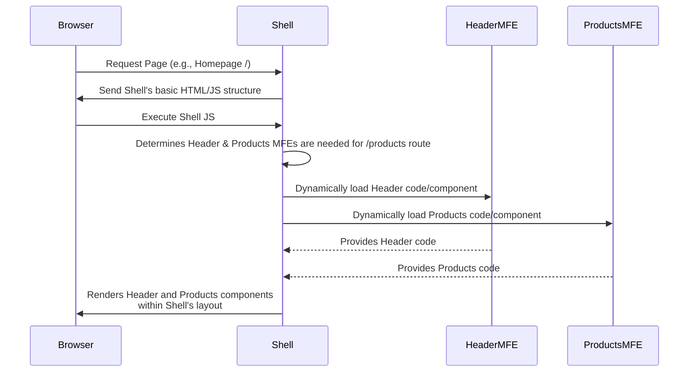

# Chapter 2: Shell (Host) Application

Welcome back to the `mfe-project` tutorial! In [Chapter 1: Micro Frontend (MFE)](01_micro_frontend__mfe__.md), we learned that Micro Frontends are like independent Lego bricks, each representing a small part of your website.

But if you have a pile of Lego bricks, you need something to put them _on_ and _together_ to build the final structure. That's exactly what the **Shell (Host) Application** does.

## The Problem: Bringing Independent Pieces Together

Imagine you've built your independent Lego bricks: a Header brick, a Products List brick, an Orders List brick, and a User Profile brick. They all work perfectly on their own.

But how do you create the _complete webpage_ where the Header is at the top, the Products List is in the middle, and maybe the User Profile link is in the Header? You can't just mash their independent codebases together!

You need a central place that knows:

1.  Which "bricks" (MFEs) are needed for a specific page (e.g., the homepage needs Header and Products).
2.  _Where_ on the page each brick should be placed.
3.  How to load the code for these bricks _when they are needed_.
4.  How these bricks can potentially talk to each other or access shared information.

## The Solution: The Shell Application

The **Shell application** is the answer. In our `mfe-project`, the `shell` directory contains this application. Think of the Shell as:

- **The Main Frame:** It's the first thing the user's browser loads. It provides the basic structure or layout of the page (like the main HTML file and the root `div` where everything else goes).
- **The Orchestrator:** It's responsible for _deciding_ which other MFEs (our "remote" bricks, as we'll call them later) need to be loaded based on things like the URL or user actions.
- **The Container:** It dynamically loads the code for the necessary Remote MFEs and places them into designated spots within its layout.
- **The Provider:** It sets up and shares common resources like the navigation ([React Router](https://reactrouter.com/)), potentially shared data ([Global Context](08_global_context__window_mfeglobalcontext__.md)), and communication channels ([Event Bus](07_event_bus__window_mfeeventbus__.md)) that all the loaded MFEs can use.

The Shell is also often called the **Host** application because it "hosts" or contains the other Micro Frontends.

## How the Shell Works (High-Level)

Let's revisit the simple flow from Chapter 1, now focusing on the Shell's role:



When you navigate to the site, the browser gets the HTML and basic JavaScript from the `shell` application. The Shell's JavaScript then figures out what to display. For the homepage (which redirects to `/products` in our case), the Shell knows it needs the Header and Products MFEs. It uses special technology ([Webpack Module Federation Plugin](04_webpack_module_federation_plugin_.md)) to fetch their code from where they are hosted (even if that's `localhost:3001` for Header and `localhost:3002` for Products during development!). Once loaded, the Shell renders them in the right places on the page.

## Key Responsibilities of the Shell

Let's look at how the Shell in our `mfe-project` handles its main jobs:

### 1. Loading Remote MFEs

The Shell needs to know _where_ to find the code for the other MFEs. This is configured using the Webpack Module Federation Plugin.

Look at the `shell/webpack.config.js` file. There's a section called `remotes`:

```javascript
// From shell/webpack.config.js (simplified)
const ModuleFederationPlugin = require("webpack/lib/container/ModuleFederationPlugin");

// ... (getRemoteUrl function) ...

module.exports = {
  // ... other config ...
  plugins: [
    new ModuleFederationPlugin({
      name: "shell", // This MFE's name
      remotes: {
        // Maps internal name (e.g., headerMfe) to remote location
        headerMfe: `headerMfe@${getRemoteUrl(3001, "mfe/header-mfe")}`,
        natashaChatbotMfe: `natashaChatbotMfe@${getRemoteUrl(
          3006,
          "mfe/natasha-chatbot-mfe"
        )}`,
        productsMfe: `productsMfe@${getRemoteUrl(3002, "mfe/products-mfe")}`,
        ordersMfe: `ordersMfe@${getRemoteUrl(3003, "mfe/orders-mfe")}`,
        // userProfileMfe is currently loaded *by* Products MFE, not the Shell directly
      },
      // ... shared dependencies ...
    }),
    // ... other plugins ...
  ],
  // ... rest of config ...
};
```

This `remotes` object tells the Shell's build process:

- "When I refer to `headerMfe` in my code..."
- "...go and find the `remoteEntry.js` file published by the MFE named `headerMfe` at this URL (`http://localhost:3001/remoteEntry.js` during development)."

The `remoteEntry.js` file is like an index card published by each Remote MFE, listing what components or modules it makes available. The Shell uses this to load the actual code _dynamically_ when needed.

We'll explore the Webpack Module Federation Plugin in much more detail in [Chapter 4: Webpack Module Federation Plugin](04_webpack_module_federation_plugin_.md).

### 2. Routing Between Pages

In a traditional single-page application, a central router (like React Router) handles navigation between different "pages" or views. In an MFE architecture, the **Shell typically owns the main router**.

When you click a navigation link, the Shell's router intercepts it. Based on the URL, the Shell's router decides which Remote MFE corresponds to that route and tells it to render.

Let's look at the main `shell/src/App.js` file:

```javascript
// From shell/src/App.js (simplified)
import React, { Suspense, useContext, useEffect } from "react";
import {
  BrowserRouter as Router,
  Routes,
  Route,
  Navigate,
} from "react-router-dom";
import { AppContextProvider } from "./AppContext"; // For shared context
import "./EventBus"; // Initializes Event Bus

// Lazy load MFE components configured in webpack.config.js remotes
const HeaderMfe = React.lazy(() => import("headerMfe/Header"));
const ProductsMfe = React.lazy(() => import("productsMfe/App"));
const OrdersMfe = React.lazy(() => import("ordersMfe/App"));
const NatashaChatbotMfe = React.lazy(() =>
  import("natashaChatbotMfe/NatashaChatbot")
);

// Simple Loading placeholder
const Loading = ({ message = "Loading..." }) => (
  <div style={{ padding: "20px", textAlign: "center" }}>{message}</div>
);

// Component to handle semantic actions (like navigation requests from MFEs)
const SemanticActionsHandler = () => {
  // ... uses useNavigate and listens to EventBus ...
  return null;
};

// Main App content where layout and routing happen
const AppContent = () => {
  // ... gets shared context ...

  return (
    <div className="app">
      <Router>
        {/* Handles actions requested by Remotes */}
        <SemanticActionsHandler />

        {/* Renders the Header MFE */}
        <Suspense fallback={<Loading message="Loading Header..." />}>
          <HeaderMfe />
        </Suspense>

        {/* Main content area based on route */}
        <main>
          <Routes>
            {/* Redirect root to products */}
            <Route path="/" element={<Navigate to="/products" replace />} />

            {/* Render Products MFE for /products routes */}
            <Route
              path="/products/*" // The "*" allows the Remote MFE to handle sub-routes
              element={
                <Suspense fallback={<Loading message="Loading Products..." />}>
                  <ProductsMfe /> {/* This is the loaded component */}
                </Suspense>
              }
            />

            {/* Render Orders MFE for /orders routes */}
            <Route
              path="/orders/*"
              element={
                <Suspense fallback={<Loading message="Loading Orders..." />}>
                  <OrdersMfe /> {/* This is the loaded component */}
                  {/* Could potentially load another Remote component here too */}
                </Suspense>
              }
            />
            {/* ... other routes ... */}
          </Routes>
        </main>

        {/* Renders the Chatbot MFE (always visible) */}
        <Suspense fallback={null}>
          <NatashaChatbotMfe />
        </Suspense>

        {/* ... Footer ... */}
      </Router>
    </div>
  );
};

function App() {
  return (
    // Provides shared context to all children (Shell components and Remotes)
    <AppContextProvider>
      <AppContent />
    </AppContextProvider>
  );
}

export default App;
```

This code shows:

- The `BrowserRouter` wraps the entire application, controlling the main navigation.
- `React.lazy` is used to import the MFE components _dynamically_. The actual code for `HeaderMfe` or `ProductsMfe` isn't loaded until that component is about to be rendered.
- `Suspense` provides a fallback (like a loading message) while the MFE's code is being fetched and loaded.
- `Routes` and `Route` define which MFE component to render based on the URL path. Notice how the Shell defines the _main_ path (`/products/*`, `/orders/*`) but uses `*` to allow the **Remote MFE** itself to handle any _sub-routes_ within its section (like `/products/123` or `/products/category/electronics`).
- The Header and Chatbot MFEs are included outside the `Routes` because they are always visible parts of the layout, not tied to specific pages.

### 3. Providing Shared Resources (Context & Event Bus)

For MFEs to work together seamlessly, they often need shared information (like the logged-in user) or a way to communicate (like notifying others when a user updates their profile). The Shell is the ideal place to set up these shared resources and make them available to all loaded Remotes.

In our project, the Shell provides:

- **Global Context (window.mfeGlobalContext):** Shared state like user data and API status.
- **Event Bus (window.mfeEventBus):** A mechanism for MFEs to send and receive messages without knowing directly about each other.

These are set up in `shell/src/AppContext.js` and `shell/src/EventBus.js` and attached to the browser's `window` object, making them globally accessible to _any_ JavaScript running on the page, including the code loaded from Remote MFEs.

Here's a peek at how `AppContext.js` makes the user data available:

```javascript
// From shell/src/AppContext.js (simplified)
import React, { createContext, useContext, useState, useEffect } from "react";
import UserApiService from "./userApiService"; // Shell's own API service

export const AppContext = createContext();

export const AppContextProvider = ({ children }) => {
  const [user, setUser] = useState({}); // State for user data
  // ... loading, error states ...

  // Fetch initial user data when Shell loads
  useEffect(() => {
    const fetchInitialUserData = async () => {
      try {
        // Shell uses its own API service
        const userData = await UserApiService.getUser();
        setUser(userData);
      } catch (err) {
        console.warn(
          "⚠️ Shell: Failed to fetch initial user data, using fallback"
        );
        // ... set error, fallback ...
      } // ... finally ...
    };
    fetchInitialUserData();
  }, []);

  // Make context available globally AND update it when user state changes
  useEffect(() => {
    // This object becomes accessible as window.mfeGlobalContext
    window.mfeGlobalContext = {
      user,
      // ... other shared data like loading/error status ...
    };

    // Listen for user updates from MFEs (they emit events after saving changes)
    const handleUserUpdated = (updatedUserData) => {
      console.log(
        "📡 Shell: Received user data update from MFE:",
        updatedUserData
      );
      setUser(updatedUserData); // Update Shell's state
    };
    // Subscribe to the 'user:updated' event
    window.mfeEventBus.on("user:updated", handleUserUpdated);

    // Cleanup subscription on unmount (important!)
    return () => {
      window.mfeEventBus.off("user:updated", handleUserUpdated);
    };
  }, [user]); // Effect runs when user state changes

  // Broadcast user updates to all MFEs when Shell's user state changes
  useEffect(() => {
    if (user && window.mfeEventBus) {
      console.log("📢 Shell: Broadcasting user data to all MFEs:", user);
      window.mfeEventBus.emit("user:updated", user);
    }
  }, [user]); // Effect runs when user state changes

  return (
    // Provide context value via React Context API (for Shell's own components)
    // Remotes access it via window.mfeGlobalContext
    <AppContext.Provider
      value={{
        user,
        // ... other values ...
      }}
    >
      {children} {/* This is where all the Remotes will be rendered */}
    </AppContext.Provider>
  );
};

// ... export AppContext ...
```

And a snippet from `EventBus.js`:

```javascript
// From shell/src/EventBus.js (simplified)
class EventBus {
  constructor() {
    this.events = {}; // Stores event names and their listeners
  }

  // Method to subscribe
  on(event, callback) {
    if (!this.events[event]) {
      this.events[event] = [];
    }
    this.events[event].push(callback);
    // Returns a function to easily unsubscribe
    return () => {
      this.events[event] = this.events[event].filter((cb) => cb !== callback);
    };
  }

  // Method to emit
  emit(event, data) {
    if (this.events[event]) {
      // Call all listeners for this event
      this.events[event].forEach((callback) => {
        callback(data);
      });
    }
  }
  // ... off method ...
}

// Create a single instance and attach it to the window
const eventBus = new EventBus();
window.mfeEventBus = eventBus; // Making it globally accessible
```

These snippets show how the Shell initializes these tools and makes them available globally. Any MFE loaded by the Shell can then access `window.mfeGlobalContext` to read shared data or `window.mfeEventBus.on(...)` and `window.mfeEventBus.emit(...)` to communicate.

We will cover the [Event Bus](07_event_bus__window_mfeeventbus__.md) and [Global Context](08_global_context__window_mfeglobalcontext__.md) in more detail in future chapters.

### 4. Handling Semantic Actions

Sometimes a Remote MFE needs the Shell to perform an action that the Shell controls. A common example is navigation: a "Login" MFE might emit an event like `auth:login_success`, and the Shell (which owns the router) needs to listen for this and navigate the user to the dashboard.

Another example in our project is the Natasha Chatbot MFE. It might detect that the user wants to update their profile based on their chat input. It then emits a `natasha:update_profile` event with the desired changes. The Shell listens for this event in the `SemanticActionsHandler` component:

```javascript
// From shell/src/App.js (simplified)
const SemanticActionsHandler = () => {
  const navigate = useNavigate(); // From Shell's React Router

  useEffect(() => {
    if (window.mfeEventBus) {
      // Listener for navigation requests from the chatbot
      const handleNatashaNavigation = (data) => {
        if (data.path) {
          navigate(data.path); // Shell performs the navigation
        }
      };

      // Listener for profile update requests from the chatbot
      const handleNatashaProfileUpdate = async (data) => {
        if (data.updates && Object.keys(data.updates).length > 0) {
          try {
            // Shell uses its *own* API service to make the update
            const apiResponse = await UserApiService.updateUser(data.updates);
            // Shell emits event to notify *all* MFEs of the change
            window.mfeEventBus.emit("user:updated", apiResponse);
          } catch (error) {
            // Handle error...
          }
        }
      };

      // Subscribe to the events
      window.mfeEventBus.on("natasha:navigate", handleNatashaNavigation);
      window.mfeEventBus.on(
        "natasha:update_profile",
        handleNatashaProfileUpdate
      );

      // Cleanup subscriptions
      return () => {
        window.mfeEventBus.off("natasha:navigate", handleNatashaNavigation);
        window.mfeEventBus.off(
          "natasha:update_profile",
          handleNatashaProfileUpdate
        );
      };
    }
  }, [navigate]); // Effect depends on navigate function

  return null; // This component doesn't render anything visually
};
```

This demonstrates a key pattern: Remote MFEs _request_ actions (by emitting events), and the Shell _performs_ those actions if it's the appropriate layer to do so (like navigation or calling a shared API service owned by the Shell). This pattern is called [Semantic Actions](10_semantic_actions_.md).

## Benefits of a Dedicated Shell

Having a clear Shell application provides several benefits:

- **Central Coordination:** It acts as the single point of entry and orchestration for all MFEs.
- **Consistent Experience:** It ensures a consistent overall layout, navigation, and shared resources across all MFEs, making the separate pieces feel like a unified application.
- **Independent Deployment:** The Shell can be updated and deployed independently from the Remote MFEs (and vice versa), although changes to the Shell might require coordinating with Remotes if they rely on its structure or shared resources.

## Conclusion

In this chapter, we learned that the Shell (or Host) application is the central piece of our Micro Frontend architecture. It's the application that the user's browser loads first, providing the main structure, handling navigation, dynamically loading other Remote MFEs, and providing shared resources like the Event Bus and Global Context. It's the glue that holds our independent Lego bricks together to form the complete website.

Now that we understand the container, let's look at the "bricks" themselves from the Shell's perspective – the Remote Modules.

Let's move on to the next chapter!

[Remote Module (Exposed Module)](03_remote_module__exposed_module__.md)
