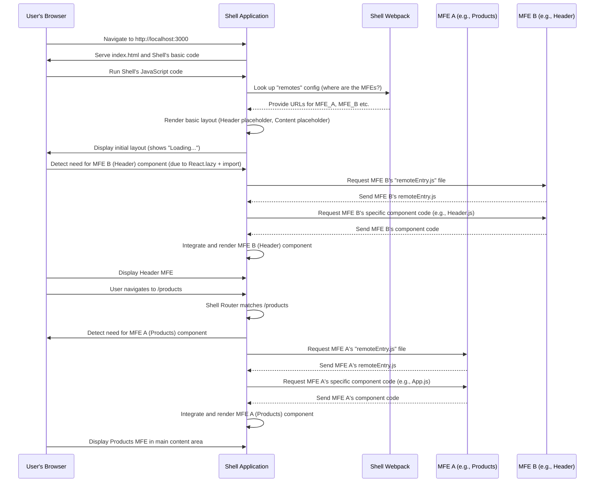

# Chapter 2: Shell (Host Application)

Welcome back to the `mfe-project` tutorial! In [Chapter 1: Micro Frontend (MFE)](01_micro_frontend__mfe__.md), we learned about breaking down a large application into smaller, independent pieces – the Micro Frontends (MFEs), much like individual shops in a large mall.

But if you have many independent shops, how do customers experience them as a single, unified mall? How do they find the right shop? How do they move from one shop to another? This is where the concept of the **Shell (Host Application)** comes in.

## What is the Shell Application?

Think of the Shell application as the **Mall building itself**.

- It's the **main entrance** users walk into first.
- It provides the **overall structure** – the roof, the floor, the main hallways, perhaps shared facilities like restrooms or seating areas.
- It contains the **mall directory** and signs that guide people to different shops (MFEs).
- It ensures the shops are placed correctly and provides a **seamless experience** as users move between them, even though each shop is independent.

In a Micro Frontend architecture, the Shell application is the **main web application** that:

1.  Is the initial application the user's browser loads.
2.  Is responsible for **loading and displaying** the different Micro Frontends.
3.  Provides the **overall page layout** (like a fixed header, footer, or sidebar).
4.  Manages **shared concerns** that apply across the whole application, such as routing, user authentication state, or a common theme.

It acts as the **"host"** that "orchestrates" or manages the **"remote"** MFEs.

## Why is the Shell Important?

Without a Shell, you'd just have several separate, independent websites (your MFEs). The Shell glues them together into what looks and feels like a single application to the user.

Its primary job is to present the MFEs in a cohesive way and handle navigation between them. For example, when a user clicks a "Products" link, the Shell needs to understand that request and make sure the "Products Shop" (the Products MFE) is loaded and displayed in the correct area of the page.

## How Does the Shell Bring MFEs Together?

Let's look at our `mfe-project` and see how the `shell` project fulfills this role.

First, like our MFEs, the `shell` is also a standard web project with its own `package.json` and dependencies:

```json
// shell/package.json
{
  "name": "shell",
  "version": "1.0.0",
  "description": "Shell/Host application for MFE architecture",
  "main": "index.js",
  "scripts": {
    "dev": "webpack serve --config webpack.config.js --mode development", // <-- It runs independently
    "build": "webpack --config webpack.config.js --mode production",
    "start": "webpack serve --config webpack.config.js --mode production --port 3000", // <-- Usually runs on the main port (e.g., 3000)
    "deploy:s3": "..."
  },
  "dependencies": {
    "react": "^17.0.2",
    "react-dom": "^17.0.2",
    "react-router-dom": "^6.3.0" // <-- Used for routing within the Shell
  }
  // ... devDependencies, etc.
}
```

Notice it has its own `start` script, typically running on the main port (like `3000`). This is the entry point for the user. It also includes dependencies like `react-router-dom` because the Shell is responsible for the _main_ application routing.

Next, the Shell needs to know _where_ to find the MFEs it needs to load. This is configured in its Webpack settings, specifically using the `ModuleFederationPlugin`.

```javascript
// shell/webpack.config.js (Simplified)
const ModuleFederationPlugin = require("webpack/lib/container/ModuleFederationPlugin");

// Function to get MFE URL (simplified)
const getRemoteUrl = (port, name) => `http://localhost:${port}/remoteEntry.js`;

module.exports = {
  // ... other webpack config
  plugins: [
    new ModuleFederationPlugin({
      name: "shell", // This app's name
      remotes: {
        // <-- This is the directory!
        headerMfe: `headerMfe@${getRemoteUrl(3001, "mfe/header-mfe")}`, // Points to Header MFE
        productsMfe: `productsMfe@${getRemoteUrl(3002, "mfe/products-mfe")}`, // Points to Products MFE
        ordersMfe: `ordersMfe@${getRemoteUrl(3003, "mfe/orders-mfe")}`, // Points to Orders MFE
      },
      shared: {
        /* ... shared dependencies like React ... */
      },
    }),
    // ... other plugins
  ],
  // ... other webpack config
};
```

This snippet shows the core configuration for the Shell. The `remotes` section is like the Mall's directory. It tells the Shell:

- "If you need `headerMfe`, you can find its code at `http://localhost:3001/remoteEntry.js`."
- "If you need `productsMfe`, look at `http://localhost:3002/remoteEntry.js`."
- And so on for other MFEs.

We'll dive much deeper into what `ModuleFederationPlugin`, `remotes`, and `remoteEntry.js` mean in [Chapter 3: Webpack Module Federation](03_webpack_module_federation_.md) and [Chapter 4: Remote Entry File](04_remote_entry_file_.md). For now, just understand that this is how the Shell _knows_ where the MFEs live.

Now, let's look at how the Shell uses this information in its main application code (`src/App.js`) to display the MFEs and handle navigation.

```jsx
// shell/src/App.js (Simplified)
import React, { Suspense, useContext } from "react";
import { BrowserRouter as Router, Routes, Route, Navigate } from "react-router-dom";
import ErrorBoundary from "./components/ErrorBoundary"; // Covered later
import AppContext, { AppContextProvider } from "./context/AppContext"; // Covered later

// Lazy load MFE components - This is where the Shell "uses" the MFE definitions from webpack config
const HeaderMfe = React.lazy(() => import("headerMfe/Header")); // <-- "Get me the Header component from headerMfe"
const ProductsMfe = React.lazy(() => import("productsMfe/App")); // <-- "Get me the App component from productsMfe"
const OrdersMfe = React.lazy(() => import("ordersMfe/App"));   // <-- "Get me the App component from ordersMfe"

const Loading = () => <div>Loading...</div>; // Simple loading indicator

const AppContent = () => {
  const appContext = useContext(AppContext); // Access shared context

  return (
    <div className="app">
      <Router> {/* Handles routing */}
        {/* Header MFE: Placed at the top */}
        <ErrorBoundary fallback={<div>Header failed</div>}> {/* Safety net */}
          <Suspense fallback={<Loading />}> {/* Show Loading while header loads */}
            <HeaderMfe /> {/* <-- Render the Header MFE */}
          </Suspense>
        </ErrorBoundary>

        {/* Main Content Area: Where other MFEs are loaded based on route */}
        <main>
          <Routes> {/* Defines routes */}
            <Route path="/" element={<Navigate to="/products" replace />} /> {/* Default route */}

            <Route path="/products/*" element={ {/* If URL is /products... */}
                <ErrorBoundary fallback={<div>Products failed</div>}>
                  <Suspense fallback={<Loading />}>
                    <ProductsMfe /> {/* <-- Render the Products MFE */}
                  </Suspense>
                </ErrorBoundary>
              }
            />

            <Route path="/orders/*" element={ {/* If URL is /orders... */}
                <ErrorBoundary fallback={<div>Orders failed</div>}>
                  <Suspense fallback={<Loading />}>
                    <OrdersMfe /> {/* <-- Render the Orders MFE */}
                  </Suspense>
                </ErrorBoundary>
              }
            />
            {/* ... other routes */}
          </Routes>
        </main>

        {/* Learning Info Section: Part of the Shell's layout */}
        <div>{/* Shows shared context user data */}</div>
      </Router>
    </div>
  );
};

function App() {
  return (
    <AppContextProvider> {/* Provides shared context */}
      <AppContent />
    </AppContextProvider>
  );
}

export default App;
```

This code is a great example of the Shell's responsibilities:

1.  **Layout:** It provides the overall `div` structure (`className="app"`) and areas for the `HeaderMfe` and the `main` content.
2.  **Loading:** It uses `React.lazy` and the names defined in the `webpack.config.js` (`"headerMfe/Header"`, `"productsMfe/App"`) to tell React _which_ remote component to load dynamically.
3.  **Routing:** It uses `react-router-dom` (`<Router>`, `<Routes>`, `<Route>`) to decide _which_ MFE (`<ProductsMfe>` or `<OrdersMfe>`) should be displayed in the `main` content area based on the current URL path.
4.  **Shared Concerns:** It wraps the application in an `AppContextProvider` (which we'll explore in [Chapter 7: Inter-MFE Communication](07_inter_mfe_communication__event_bus___context__.md)) to provide shared data (like the user) to all MFEs.

The use of `Suspense` and `ErrorBoundary` is also crucial here – they are safety nets provided by the Shell to handle cases where an MFE might take time to load or might fail completely, preventing the _entire_ application from crashing. We will cover `ErrorBoundary` in [Chapter 9: Error Boundary](09_error_boundary_.md).

## How Does the Loading Actually Happen? (Under the Hood - Simplified)

When a user visits the Shell application in their browser (e.g., `http://localhost:3000`), here's a simplified sequence of events:



This diagram illustrates that the Shell initially loads itself, then _dynamically_ fetches the necessary MFE code _when needed_ (e.g., when the component is encountered in the render tree due to routing or initial layout). The key technology enabling this dynamic fetching and integration is **Webpack Module Federation**.

## Conclusion

In this chapter, we explored the Shell (Host Application) concept. We learned that it's the foundational layer that provides the overall structure and entry point for our Micro Frontend application, much like a mall building hosts individual shops.

The Shell is responsible for:

- Loading and displaying MFEs.
- Providing the main application layout.
- Managing overall routing.
- Handling shared concerns like context and error handling for remote MFEs.

We saw how the `shell` project in our `mfe-project` uses its Webpack configuration to define where MFEs can be found and its React code (`App.js`) to dynamically import, display, and route between them.

Now that we understand both the independent MFE and the hosting Shell, it's time to look at the technology that makes this dynamic loading and sharing possible: Webpack Module Federation.

[Next Chapter: Webpack Module Federation](03_webpack_module_federation_.md)
