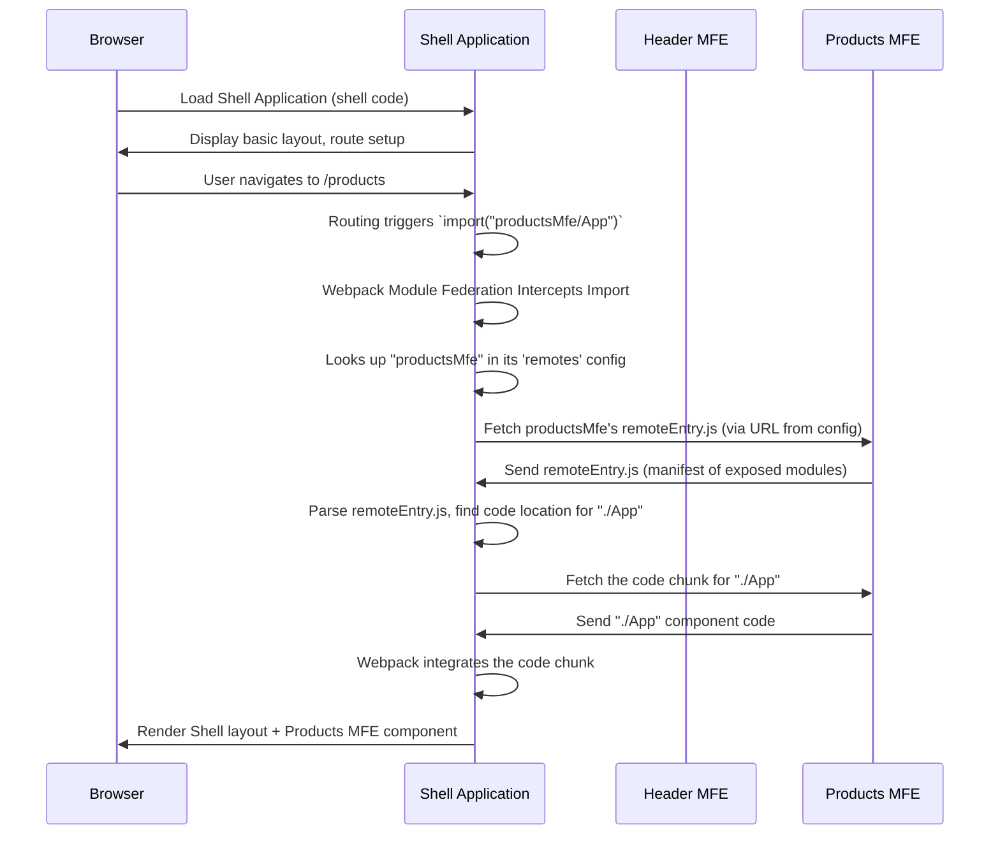

# Chapter 2: Webpack Module Federation Plugin

Welcome back! In [Chapter 1: Micro Frontend (MFE) Structure](01_micro_frontend__mfe__structure_.md), we learned that our big web application is split into smaller, independent applications (MFEs) and a main Shell application. We saw how the Shell application wants to use components, like the `Header` from the Header MFE or the main `App` from the Products MFE.

But how does the Shell, which is a completely separate project, actually find and load code that's running in another, independent MFE?

This is where the **Webpack Module Federation Plugin** comes in.

Think back to our shopping mall analogy. The Shell is the mall structure, and the MFEs are the individual shops. Module Federation is like the agreement and infrastructure (standardized doorways, shared loading docks, a directory map) that allows shops to exist within the mall, display their goods, and for visitors (the Shell) to easily find and access what's inside each shop.

Without this plugin, each MFE would be like a standalone shop in the middle of nowhere. The Shell wouldn't know where to find them or how to connect to them. The Webpack Module Federation Plugin is the "glue" that connects these independent applications, allowing them to share modules (like React components, functions, even entire pages) with each other at runtime.

It's a powerful feature built into Webpack 5 that makes building Micro Frontends much more practical.

## The Core Idea: Sharing and Consuming Modules

At its heart, the Module Federation plugin lets you do two main things:

1.  **Expose Modules:** An MFE can choose to make some of its internal code (like a specific React component or a utility function) available for other MFEs to use.
2.  **Consume Modules:** An MFE (or the Shell) can be configured to load and use modules that have been exposed by other MFEs.

It's like one shop saying, "Hey, I'm selling delicious coffee (exposing a 'Coffee' component)," and another shop (or the mall food court, the Shell) saying, "Okay, I know where that coffee shop is, I'll go grab some coffee to serve here (consuming the 'Coffee' component)."

Let's look at how we configure this in our project's Webpack files.

## Plugin Configuration: `name`, `filename`, `exposes`, `remotes`

The `ModuleFederationPlugin` is added to the `plugins` array in the `webpack.config.js` file of _each_ MFE and the Shell that participates in module sharing.

Here are the key options we use:

- **`name`**: This is the unique name for _this_ application (MFE or Shell) in the Module Federation network. Other applications will use this name to refer to it.
- **`filename`**: This is the name of the file that Webpack will generate which acts as a manifest or directory for this application. It tells other applications what modules are exposed and how to load them. It's typically named `remoteEntry.js`.
- **`exposes`**: This is an object where _this_ application lists the modules it wants to make available to others. The keys are the "public" names others will use to import the module, and the values are the paths to the actual files _within this project_.
- **`remotes`**: This is an object where _this_ application lists the other applications (remotes) it needs to consume modules _from_. The keys are the "local" names you'll use in your `import` statements, and the values specify the _remote application's name_ and the _URL_ where its `remoteEntry.js` file can be found.
- **`shared`**: This option is crucial for performance and stability, allowing applications to share common libraries (like React, React-DOM) instead of each loading its own copy. We will cover this in detail in [Chapter 3: Shared Dependencies](03_shared_dependencies_.md), but we'll see it in the code snippets.

Let's see how these options are used in our project.

### 1. Exposing Modules from an MFE (`header-mfe/webpack.config.js`)

Look at the `header-mfe/webpack.config.js` file. We configure it to expose its main `Header` component:

```javascript
// ... imports
const ModuleFederationPlugin = require("webpack/lib/container/ModuleFederationPlugin");
// ...

module.exports = {
  // ... other config
  plugins: [
    new ModuleFederationPlugin({
      name: "headerMfe", // <-- This MFE is named "headerMfe"
      filename: "remoteEntry.js", // <-- Its manifest is remoteEntry.js
      exposes: {
        // <-- It exposes modules
        "./Header": "./src/Header", // <-- It exposes ./src/Header under the key "./Header"
      },
      // ... shared modules config (explained in next chapter)
    }),
    // ... other plugins
  ],
  // ...
};
```

- `name: "headerMfe"`: This tells the world, "My name is 'headerMfe'."
- `filename: "remoteEntry.js"`: This tells Webpack to create a file named `remoteEntry.js` in the build output (`dist` folder). This file is the entry point for anyone wanting to consume modules from `headerMfe`.
- `exposes: { "./Header": "./src/Header" }`: This is key! It says, "I am making the module located at `./src/Header` available, and others can import it using the key `./Header`." The `./` prefix in the key is a common convention.

Similarly, the `products-mfe/webpack.config.js` exposes its main `App` component:

```javascript
// ... imports
const ModuleFederationPlugin = require("webpack/lib/container/ModuleFederationPlugin");
// ...

module.exports = {
  // ... other config
  plugins: [
    new ModuleFederationPlugin({
      name: "productsMfe", // <-- Named "productsMfe"
      filename: "remoteEntry.js", // <-- Has its own remoteEntry.js
      exposes: {
        // <-- Exposes modules
        "./App": "./src/App", // <-- Exposes ./src/App under the key "./App"
      },
      // ... remotes config (this MFE also consumes other MFEs)
      // ... shared modules config
    }),
    // ... other plugins
  ],
  // ...
};
```

And the `orders-mfe/webpack.config.js` exposes its `App` and another component:

```javascript
// ... imports
const ModuleFederationPlugin = require("webpack/lib/container/ModuleFederationPlugin");
// ...

module.exports = {
  // ... other config
  plugins: [
    new ModuleFederationPlugin({
      name: "ordersMfe", // <-- Named "ordersMfe"
      filename: "remoteEntry.js", // <-- Has its own remoteEntry.js
      exposes: {
        // <-- Exposes multiple modules
        "./App": "./src/App",
        "./CompletlyDifferentComp": "./src/CompletlyDifferentComp",
      },
      // ... shared modules config
    }),
    // ... other plugins
  ],
  // ...
};
```

Each MFE that wants to share code defines its `name`, `filename`, and what it `exposes`.

### 2. Consuming Modules in the Shell (`shell/webpack.config.js`)

Now, let's see how the Shell knows where to find these exposed modules. Look at the `shell/webpack.config.js` file:

```javascript
// ... imports
const ModuleFederationPlugin = require("webpack/lib/container/ModuleFederationPlugin");
// ... environment setup to get URLs ...

module.exports = {
  // ... other config
  plugins: [
    new ModuleFederationPlugin({
      name: "shell", // <-- The Shell is named "shell"
      remotes: {
        // <-- It lists remotes it needs to consume from
        // The format is: 'localName': 'remoteName@urlToRemoteEntry.js'
        headerMfe: `headerMfe@${getRemoteUrl(3001, "mfe/header-mfe")}`, // <-- It knows about "headerMfe"
        productsMfe: `productsMfe@${getRemoteUrl(3002, "mfe/products-mfe")}`, // <-- It knows about "productsMfe"
        ordersMfe: `ordersMfe@${getRemoteUrl(3003, "mfe/orders-mfe")}`, // <-- It knows about "ordersMfe"
      },
      // ... shared modules config
    }),
    // ... other plugins
  ],
  // ...
};

// Helper function `getRemoteUrl` determines the URL based on dev/prod environment
const getRemoteUrl = (port, name) => {
  if (isProduction) {
    // In production, it points to the deployed remoteEntry.js URL
    return `https://${process.env.CLOUD_FRONT_URL}/${name}/remoteEntry.js`;
  }
  // In development, it points to the local dev server URL and port
  return `http://localhost:${port}/remoteEntry.js`;
};
```

- `name: "shell"`: The Shell also has a name in the federation.
- `remotes`: This object lists the MFEs the Shell needs to talk to.
  - `headerMfe: 'headerMfe@...'`: This entry tells the Shell: "There is a remote application I want to call `headerMfe` (this is the _local_ name I'll use). Its official _remote name_ is also `headerMfe`, and you can find its `remoteEntry.js` file at the specified URL."
  - The `getRemoteUrl` helper function is used here to dynamically determine the correct URL for the remote MFE's `remoteEntry.js` file, depending on whether we are running locally (`localhost:port`) or in a deployed environment (like an S3 bucket via CloudFront).

### 3. Importing Exposed Modules (in `shell/src/App.js`)

Now that the Shell's Webpack config knows _where_ to find the `remoteEntry.js` files for `headerMfe`, `productsMfe`, and `ordersMfe`, we can actually _import_ modules from them in our React code!

Remember the `shell/src/App.js` from the previous chapter?

```jsx
// ... imports
import React, { Suspense, useContext, useState } from "react";
import {
  BrowserRouter as Router,
  Routes,
  Route,
  Navigate,
} from "react-router-dom";
// ... other imports

// Lazy load MFE components using special import paths
const HeaderMfe = React.lazy(() => import("headerMfe/Header")); // <-- Importing from headerMfe
const ProductsMfe = React.lazy(() => import("productsMfe/App")); // <-- Importing from productsMfe
const OrdersMfe = React.lazy(() => import("ordersMfe/App")); // <-- Importing from ordersMfe
// ... more lazy imports

const AppContent = () => {
  // ... context and loading logic

  return (
    <div className="app">
      <Router>
        {/* API Status Indicator */}
        {/* ... */}

        {/* Header MFE */}
        <Suspense fallback={<Loading message="Loading Header..." />}>
          <HeaderMfe /> {/* <- Using the imported component */}
        </Suspense>

        {/* Main Content */}
        <main style={{ minHeight: "calc(100vh - 120px)" }}>
          <Routes>
            <Route path="/" element={<Navigate to="/products" replace />} />

            <Route
              path="/products/*"
              element={
                <Suspense fallback={<Loading message="Loading Products..." />}>
                  <ProductsMfe /> {/* <- Using the imported component */}
                </Suspense>
              }
            />

            <Route
              path="/orders/*"
              element={
                <Suspense fallback={<Loading message="Loading Orders..." />}>
                  <OrdersMfe /> {/* <- Using the imported component */}
                  {/* We could also import "ordersMfe/CompletlyDifferentComp" here if needed */}
                </Suspense>
              }
            />
          </Routes>
        </main>

        {/* Learning Info */}
        {/* ... */}

        {/* Footer */}
        {/* ... */}
      </Router>
    </div>
  );
};

// ... rest of App component
```

Notice the import paths: `import("headerMfe/Header")`.

- `headerMfe`: This matches the _local name_ we defined for the remote in the Shell's `remotes` config (`shell/webpack.config.js`).
- `/Header`: This matches the _key_ that the Header MFE used in its `exposes` config (`header-mfe/webpack.config.js`, `exposes: { "./Header": ... }`).

Webpack, configured by the `ModuleFederationPlugin`, intercepts this special `import` statement. It knows: "Ah, `headerMfe` is a remote. Let me check my `remotes` config. Okay, `headerMfe` is defined, and its `remoteEntry.js` is at [some URL]. I need the module exposed under the key `./Header`. I will fetch the `remoteEntry.js`, find the location of the code chunk for `./Header`, and download that chunk."

Combined with `React.lazy` and `Suspense`, this makes it easy to load the remote components asynchronously only when they are needed (e.g., when the user navigates to the `/products` route).

## How it Works Under the Hood (The Magic!)

Let's visualize the process again with our diagram, specifically focusing on what Module Federation enables:



- When a user hits the Shell application, the Shell's own code is loaded.
- When the Shell encounters an import like `import("productsMfe/App")`, the Module Federation plugin in the Shell's Webpack build takes over.
- It uses the `remotes` configuration to find the URL of the `remoteEntry.js` file for the `productsMfe`.
- The Shell downloads this small `remoteEntry.js` file from the server where the Products MFE is hosted.
- The `remoteEntry.js` file doesn't contain the component code itself, but it acts as a map or registry. It knows which files (`.js` chunks) correspond to which exposed modules (`./App`, `./CompletlyDifferentComp`, etc.) and how to load them.
- The Shell then tells Webpack to dynamically download the specific code chunk needed for the `./App` module from the Products MFE's server.
- Once the code chunk is downloaded, Webpack makes it available to the Shell's application as if it were a locally imported module.
- React can then render the `ProductsMfe` component.

This dynamic loading is powerful because:

1.  The Shell doesn't need the Products MFE code bundled with it initially.
2.  The Products MFE can be deployed independently. If the Products MFE is updated, the Shell automatically loads the new version the next time a user visits the products page (browser caching notwithstanding).

## Example: Products MFE Consuming User Profile MFE

Module Federation isn't just for the Shell consuming MFEs. MFEs can also consume modules from _other_ MFEs!

In our project, the Products MFE needs to display some user information (like a username or profile link), which is managed by the User Profile MFE.

Look at `products-mfe/webpack.config.js` again:

```javascript
// ... imports
const ModuleFederationPlugin = require("webpack/lib/container/ModuleFederationPlugin");
// ... environment setup

module.exports = {
  // ... other config
  plugins: [
    new ModuleFederationPlugin({
      name: "productsMfe",
      filename: "remoteEntry.js",
      exposes: {
        "./App": "./src/App", // Exposes its own App component
      },
      remotes: {
        // <-- It also consumes a remote!
        userProfileMfe: `userProfileMfe@${getRemoteUrl(
          3004,
          "mfe/user-profile-mfe"
        )}`, // <-- It needs modules from "userProfileMfe"
      },
      // ... shared modules config
    }),
    // ... other plugins
  ],
  // ...
};
```

And the `user-profile-mfe/webpack.config.js` file exposes its `UserProfile` component:

```javascript
// ... imports
const ModuleFederationPlugin = require("webpack/lib/container/ModuleFederationPlugin");
// ...

module.exports = {
  // ... other config
  plugins: [
    new ModuleFederationPlugin({
      name: "userProfileMfe", // <-- Named "userProfileMfe"
      filename: "remoteEntry.js",
      exposes: {
        // <-- Exposes modules
        "./UserProfile": "./src/UserProfile", // <-- Exposes ./src/UserProfile
      },
      // ... shared modules config
    }),
    // ... other plugins
  ],
  // ...
};
```

Now, inside the Products MFE's code (`products-mfe/src/App.js` or another file within products-mfe), you can import the UserProfile component just like the Shell imports others:

```jsx
// In a file inside products-mfe, e.g., products-mfe/src/components/ProductDetail.js

// ... imports
import React, { Suspense } from "react";
// ... other imports

// Lazy load the UserProfile component from the User Profile MFE
const UserProfile = React.lazy(() => import("userProfileMfe/UserProfile")); // <-- Importing from userProfileMfe

const ProductDetail = ({ product }) => {
  // ... component logic

  return (
    <div>
      <h2>{product.name}</h2>
      {/* ... other product details */}

      {/* Use the UserProfile component imported from the remote MFE */}
      <Suspense fallback={<div>Loading User Profile...</div>}>
        <UserProfile userId={product.sellerId} /> {/* Pass necessary props */}
      </Suspense>
    </div>
  );
};

// ... export
```

This demonstrates the true power of Module Federation: _any_ MFE (Host) can consume modules from _any_ other MFE (Remote), provided the Host is configured with the Remote's information and the Remote is configured to expose the desired module. This creates a flexible, interconnected network of applications.

## Conclusion

The Webpack Module Federation Plugin is the cornerstone technology for building Micro Frontends with Webpack 5. It allows independent applications to dynamically expose and consume modules from each other at runtime.

We learned about the key configuration options:

- `name`: The unique identifier for an application.
- `filename`: The name of the manifest file (`remoteEntry.js`).
- `exposes`: What modules an application makes available.
- `remotes`: What remote applications an application needs to consume from.

By configuring these options in the Webpack builds of the Shell and each MFE, we create the "federation" that allows them to work together seamlessly in the user's browser, much like different shops operating harmoniously within a large shopping mall structure.

However, for these independent applications to work together smoothly, they often rely on common libraries (like React, ReactDOM, routing libraries). Loading multiple copies of these libraries is inefficient. In the next chapter, we'll explore the `shared` option of the Module Federation plugin, which helps solve this problem:

[Chapter 3: Shared Dependencies](03_shared_dependencies_.md)
