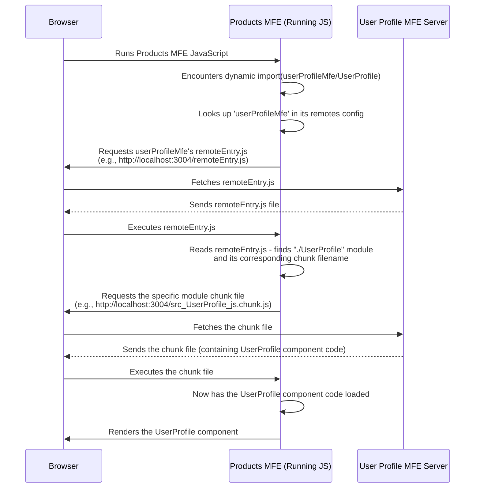

# Chapter 3: Remote Module (Exposed Module)

Welcome back! In [Chapter 1: Micro Frontend (MFE)](01_micro_frontend__mfe__.md), we learned that MFEs are independent pieces like Lego bricks. In [Chapter 2: Shell (Host) Application](02_shell__host__application_.md), we saw how the Shell acts as the baseplate and the builder, putting these bricks together to form the complete website.

But how does the Shell (or any other MFE) actually _get_ those Lego bricks from another MFE? How does the "Header MFE" factory make its "Header" brick available for the Shell house? This is where the concept of **Remote Modules (Exposed Modules)** comes in.

## The Problem: Sharing Specific Pieces

Imagine the `user-profile-mfe` is a factory that builds user profile forms and displays. The `products-mfe` is another factory building product listings. Now, the Products MFE factory decides it wants to show a small user profile section _within_ its product page layout.

How can the Products MFE use the actual React component (`UserProfile.js`) from the `user-profile-mfe`?

- Copying and pasting the code is a terrible idea (violates independence!).
- Loading the _entire_ `user-profile-mfe` application just to get one component is wasteful.

We need a way for an MFE to say, "Hey world, I have this specific piece (like a component or a function) that you are allowed to use, and here's how you can get _just that piece_."

## The Solution: Remote Modules (Exposed Modules)

A **Remote Module** is simply a piece of code (usually a file like a React component, a hook, a utility function, or even an entire small app component) that one MFE explicitly makes available for _other_ MFEs to use.

- **Remote:** It's code located in a _different_ MFE (hence "Remote").
- **Exposed:** The MFE that owns the code must _explicitly expose_ it, declaring "this particular file is available for consumption by others."

Think of it like an API for your code. Instead of exposing data via an API endpoint, you expose a specific JavaScript module or component.

In the context of Webpack Module Federation (which we'll cover fully in [Chapter 4: Webpack Module Federation Plugin](04_webpack_module_federation_plugin_.md)), Remote Modules are configured in the `exposes` section of a Remote MFE's Webpack config.

## How a Remote MFE Exposes Modules

The MFE that _owns_ the code and wants to share it needs to configure its Webpack build process to expose those specific files.

Let's look at the `user-profile-mfe`. It wants to share its main `UserProfile` component so the `products-mfe` (and potentially others) can embed it.

Here's a simplified look at the `exposes` section in `user-profile-mfe/webpack.config.js`:

```javascript
// From user-profile-mfe/webpack.config.js (simplified)
const ModuleFederationPlugin = require("webpack/lib/container/ModuleFederationPlugin");

module.exports = {
  // ... other config ...
  plugins: [
    new ModuleFederationPlugin({
      name: "userProfileMfe", // This MFE's unique name
      // ... remotes (if it consumed others) ...
      exposes: {
        // This is where we list what we offer
        "./UserProfile": "./src/UserProfile.js",
        // Key (left side): The *public name* other MFEs will use
        // Value (right side): The *local path* to the file being exposed
      },
      // ... shared dependencies ...
    }),
    // ... other plugins ...
  ],
  // ... rest of config ...
};
```

Explanation:

1.  `name: "userProfileMfe"`: This is the unique identifier for _this_ MFE. Consumers will use this name to refer to _us_.
2.  `exposes`: This is the list of modules this MFE is making available.
3.  `"./UserProfile": "./src/UserProfile.js"`: This line is key!
    - `"./UserProfile"`: This is the **public name** for this module. When another MFE wants to use our `UserProfile` component, they will request the module named `./UserProfile` _from_ the `userProfileMfe`. The `./` convention is common but you could technically name it anything valid, like `"./ProfileComponent"`.
    - `"./src/UserProfile.js"`: This is the **internal path** within _this_ `user-profile-mfe` project that points to the actual code file (`UserProfile.js`) we want to expose.

So, `userProfileMfe` is saying: "I am called `userProfileMfe`, and if you ask me for `./UserProfile`, I'll give you the code from my `./src/UserProfile.js` file."

Let's look at another example from `orders-mfe/webpack.config.js`:

```javascript
// From orders-mfe/webpack.config.js (simplified)
const ModuleFederationPlugin = require("webpack/lib/container/ModuleFederationPlugin");

module.exports = {
  // ... other config ...
  plugins: [
    new ModuleFederationPlugin({
      name: "ordersMfe", // This MFE's unique name
      // ... remotes ...
      exposes: {
        "./App": "./src/App.js", // Exposing the main App component
        "./CompletlyDifferentComp": "./src/CompletlyDifferentComp.js", // Exposing another component
      },
      // ... shared dependencies ...
    }),
    // ... other plugins ...
  ],
  // ... rest of config ...
};
```

Here, the `ordersMfe` exposes its main `App` component as `./App` and another component `CompletlyDifferentComp` as `./CompletlyDifferentComp`. This demonstrates that you can expose multiple modules from a single MFE.

## How a Consuming MFE Uses Remote Modules

Now, let's switch to the perspective of the MFE that wants to _use_ an exposed module – the **Consumer**. In our use case, the `products-mfe` wants to use the `UserProfile` component exposed by `user-profile-mfe`.

The Consumer MFE needs to tell its own Webpack configuration _where_ to find the MFEs it wants to consume and _what name_ it will use to refer to them. This is done in the `remotes` section.

Let's look at the `products-mfe/webpack.config.js`:

```javascript
// From products-mfe/webpack.config.js (simplified)
const ModuleFederationPlugin = require("webpack/lib/container/ModuleFederationPlugin");

// ... (getRemoteUrl function) ...

module.exports = {
  // ... other config ...
  plugins: [
    new ModuleFederationPlugin({
      name: "productsMfe", // This MFE's unique name
      remotes: {
        // Maps local name to remote location
        userProfileMfe: `userProfileMfe@${getRemoteUrl(
          3004,
          "mfe/user-profile-mfe"
        )}`,
        // Key (left side): The *local name* we will use in our code
        // Value (right side): The *remote name*@*remote url*
        // (The remote name 'userProfileMfe' must match the 'name' in the Remote's config)
      },
      // ... shared dependencies ...
    }),
    // ... other plugins ...
  ],
  // ... rest of config ...
};
```

Explanation:

1.  `name: "productsMfe"`: This is the unique identifier for _this_ MFE (`productsMfe`).
2.  `remotes`: This is the list of Remote MFEs this MFE (`productsMfe`) will consume modules from.
3.  `userProfileMfe: "userProfileMfe@..."`: This line maps a **local name** (`userProfileMfe`) to a **remote location**.
    - `userProfileMfe` (the key): This is the alias or name _we_ will use in our code (`products-mfe`) to refer to the `userProfileMfe`.
    - `userProfileMfe@${getRemoteUrl(3004, "mfe/user-profile-mfe")}` (the value): This tells Webpack where to find the remote. `userProfileMfe` is the _actual name_ of the remote MFE (must match the `name` property in `user-profile-mfe`'s config). `${getRemoteUrl(...)` constructs the URL to the remote's entry file (`remoteEntry.js`), which is how Webpack discovers the exposed modules.

The Shell application (`shell/webpack.config.js`) also has a `remotes` section, listing all the top-level MFEs it consumes:

```javascript
// From shell/webpack.config.js (simplified)
const ModuleFederationPlugin = require("webpack/lib/container/ModuleFederationPlugin");

// ... (getRemoteUrl function) ...

module.exports = {
  // ... other config ...
  plugins: [
    new ModuleFederationPlugin({
      name: "shell",
      remotes: {
        headerMfe: `headerMfe@${getRemoteUrl(3001, "mfe/header-mfe")}`,
        natashaChatbotMfe: `natashaChatbotMfe@${getRemoteUrl(
          3006,
          "mfe/natasha-chatbot-mfe"
        )}`,
        productsMfe: `productsMfe@${getRemoteUrl(3002, "mfe/products-mfe")}`,
        ordersMfe: `ordersMfe@${getRemoteUrl(3003, "mfe/orders-mfe")}`,
        // Note: shell *doesn't* list userProfileMfe directly here,
        // because productsMfe is loading it, not the shell.
      },
      // ... shared dependencies ...
    }),
    // ... other plugins ...
  ],
  // ... rest of config ...
};
```

This shows that the Shell consumes `headerMfe`, `natashaChatbotMfe`, `productsMfe`, and `ordersMfe`. Notice it doesn't need to list `userProfileMfe` in _its_ `remotes`, because only the `productsMfe` is directly importing from `userProfileMfe`.

## Importing and Using an Exposed Module

Once the consuming MFE's Webpack is configured with the `remotes` entry, you can import the exposed module in your code just like any other module, using the **local name** and the **public name** of the exposed module.

In `products-mfe/src/App.js`, we want to use the `UserProfile` component from `userProfileMfe`.

```javascript
// From products-mfe/src/App.js (simplified)
import React, { Suspense, useState, useEffect } from "react";
// ... other imports ...

// Import the Remote Module
// The string 'userProfileMfe/UserProfile' corresponds to:
// 'userProfileMfe' (local name from remotes config) + '/' + 'UserProfile' (public name from exposes config)
const UserProfileMfe = React.lazy(() => import("userProfileMfe/UserProfile"));

// ... component code ...

const App = () => {
  // ... state and effects ...

  return (
    <div className="products-mfe">
      {/* ... other parts of products MFE ... */}

      {/* Embed the User Profile MFE */}
      {showProfile && (
        <div /* ... styling ... */>
          <h3>👤 User Profile (This is Embedded MFE)</h3>
          {/* Use React.Suspense while the module is loading */}
          <Suspense fallback={<div>Loading User Profile MFE...</div>}>
            {/* Render the loaded component */}
            <UserProfileMfe user={user} /> {/* Pass props like a normal component */}
          </Suspense>
        </div>
      )}

      {/* ... rest of products MFE ... */}
    </div>
  );
};

export default App;
```

Explanation:

1.  `import("userProfileMfe/UserProfile")`: This is a **dynamic import**. Webpack sees `userProfileMfe` at the start of the string and looks it up in its `remotes` configuration.
2.  It finds the entry `userProfileMfe: "userProfileMfe@..."`.
3.  It knows that `userProfileMfe` refers to the remote MFE with that name, located at the configured URL.
4.  `"/UserProfile"` refers to the public name of the module exposed by that remote MFE in its `exposes` section (`"./UserProfile"`).
5.  `React.lazy` and `Suspense` are standard React features used with dynamic imports. `React.lazy` tells React to only load the code for `UserProfileMfe` when it's actually rendered (`showProfile` is true). `Suspense` displays the `fallback` content ("Loading...") while the code is being fetched over the network.
6.  Once loaded, `UserProfileMfe` is a regular React component that can be rendered and passed `props` (like the `user` object in this example).

This is the core idea: **Expose** specific parts from one MFE, **Configure** where to find them in the consuming MFE's `remotes`, and then **Import** them using the configured names, leveraging dynamic imports for performance.

## Under the Hood: How Loading Happens

So, what actually happens when the browser runs the code in `products-mfe` and encounters `import("userProfileMfe/UserProfile")`?

Here's a simplified sequence:



This diagram shows that when the `products-mfe` needs the `UserProfile` module, it doesn't already have the code. Instead, it dynamically fetches the `remoteEntry.js` file from the `user-profile-mfe`'s server. This entry file acts like a manifest or index. It tells the `products-mfe` _how_ to get the actual code for the specific module (`./UserProfile`) it requested (usually by providing the filename of the necessary JavaScript chunk). The `products-mfe` then requests that chunk, and only _after_ it loads is the component ready to be rendered.

This dynamic loading is powerful because:

- The code for `user-profile-mfe` isn't loaded unless the user navigates to a place where `products-mfe` decides to _show_ the profile.
- The `products-mfe` only loads the specific exposed module (`./UserProfile`), not the entire `user-profile-mfe` application bundle.

## Benefits of Remote/Exposed Modules

- **Code Reusability:** Share components, hooks, or utilities across independent MFEs without duplication.
- **Decoupling:** Consumers don't need to know the internal file structure of the Remote MFE, only the public name defined in `exposes`.
- **Performance:** Dynamic imports allow loading modules only when needed, reducing initial bundle size.

## Conclusion

In this chapter, we demystified the concept of Remote Modules (or Exposed Modules). We learned that they are specific pieces of code within an MFE that are intentionally made public for others to use. We saw how an MFE uses the `exposes` section in its Webpack configuration to define these public modules and how a consuming MFE uses the `remotes` section to locate them. Finally, we saw how dynamic imports (`React.lazy`) allow a consumer to load and use these remote components just like local ones, but with the magic of fetching the code at runtime.

This ability to share and consume specific modules is fundamental to stitching MFEs together. The technology that makes this all possible is the Webpack Module Federation Plugin.

Let's dive deeper into that in the next chapter!

[Webpack Module Federation Plugin](04_webpack_module_federation_plugin_.md)
