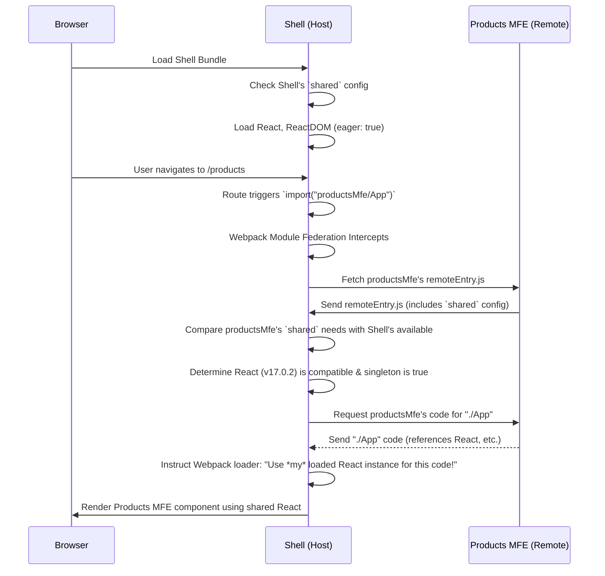

# Chapter 3: Shared Dependencies

Welcome back to our MFE learning journey! In the previous chapter, [Chapter 2: Webpack Module Federation Plugin](02_webpack_module_federation_plugin_.md), we saw how the Module Federation plugin allows our independent MFEs and the Shell to expose and consume modules from each other at runtime. This is the core mechanism that brings our distributed application together.

However, there's a potential issue. Imagine our Shell, the Header MFE, and the Products MFE all use the React library. Without special handling, when the Shell loads the Header MFE and then the Products MFE, the browser might end up downloading and running _three_ separate copies of React – one for the Shell, one for Header MFE, and one for Products MFE!

This is inefficient for several reasons:

1.  **Performance:** Downloading the same large library multiple times wastes bandwidth and increases page load time.
2.  **Memory:** Running multiple instances of the same library consumes more memory in the user's browser.
3.  **Consistency:** For libraries like React or state management tools, having multiple independent instances can lead to unexpected behavior and bugs because they aren't sharing the same underlying state or context.

Think back to our shopping mall analogy. This situation is like each shop having its own small, noisy generator to power its lights and cash register, instead of the mall providing a single, shared electricity grid for everyone. It's wasteful and complex.

The **Webpack Module Federation Plugin** offers a solution to this problem with the **`shared`** configuration option.

## The `shared` Option: Loading Libraries Only Once

The `shared` option allows you to specify which libraries or modules should be treated as **shared dependencies**. This tells Webpack that if multiple applications in the federation (the Shell and the MFEs) need the _same_ shared library (and a compatible version), it should only be loaded _once_ and shared among all of them.

It's like setting up that shared electricity grid in the mall. Each shop (MFE) declares it needs electricity (e.g., React), and the mall (Shell) or another designated source provides it from a central supply.

Let's look at the `shared` configuration in our project's Webpack files.

## Configuring Shared Dependencies

The `shared` option is an object within the `ModuleFederationPlugin` configuration for _each_ application (Shell and MFEs) that wants to participate in sharing or consuming shared modules.

Here's a simplified look at the `shared` section from `shell/webpack.config.js`:

```javascript
// Inside new ModuleFederationPlugin({...}) in shell/webpack.config.js

// ... other config like name, remotes
shared: {
  react: {
    singleton: true,
    requiredVersion: "^17.0.2",
    eager: true,
  },
  "react-dom": {
    singleton: true,
    requiredVersion: "^17.0.2",
    eager: true,
  },
  "react-router-dom": {
    singleton: true,
    requiredVersion: "^6.3.0",
    eager: false, // Note: router might not need to be eager
  },
  // ... other shared libraries
},
// ... rest of plugin config
```

And here's a simplified look from `header-mfe/webpack.config.js`:

```javascript
// Inside new ModuleFederationPlugin({...}) in header-mfe/webpack.config.js

// ... other config like name, filename, exposes
shared: {
  react: {
    singleton: true,
    requiredVersion: "^17.0.2",
  },
  "react-dom": {
    singleton: true,
    requiredVersion: "^17.0.2",
  },
  "react-router-dom": {
    singleton: true,
    requiredVersion: "^6.3.0",
  },
  // ... other shared libraries
},
// ... rest of plugin config
```

Notice that both configurations list `react`, `react-dom`, and `react-router-dom` under the `shared` property.

Let's break down the important options used for each shared library (like `react`):

- **`{ react: { ... } }`**: The key (`react`, `"react-dom"`, `"react-router-dom"`) is the name of the package you want to share. This name must match the package name in your `package.json` (e.g., `"react"`).
- **`singleton: true`**: This is crucial for libraries like React, ReactDOM, and state management libraries (like Redux, MobX, or React Context). It tells Webpack that _only one instance_ of this library should ever be loaded into the browser's memory, even if multiple MFEs try to load it. If an instance is already loaded, subsequent requests will use the existing one. If `singleton` was `false`, multiple compatible versions _could_ still be loaded, which defeats the purpose for these specific libraries.
- **`requiredVersion: "^17.0.2"`**: This specifies the version range of the library that _this specific application_ (Shell or MFE) expects. When an application consumes a shared module, Webpack checks if a compatible version is already loaded or available from another application in the federation. If multiple applications request different _compatible_ versions, Webpack will typically load the highest compatible version available. If a required version is _incompatible_ with what's available or already loaded, Webpack might throw an error or log a warning, depending on other configurations. Using semantic versioning ranges (`^`, `~`) here is standard.
- **`eager: true`** (seen on React/ReactDOM in the Shell config): This option tells Webpack to load this shared module _immediately_ when the application starts, even if the application doesn't directly import it initially, or if the import is lazy-loaded. This is often set to `true` for core libraries like React and ReactDOM in the _Shell_ application because the Shell often loads first and needs these libraries right away, ensuring they are available before any MFE that might need them starts loading. For libraries not needed immediately by the Shell (like `react-router-dom` in the Shell or React/ReactDOM in an MFE that is only loaded via a lazy route), `eager` can be `false` or omitted (default is `false`), allowing them to be loaded lazily when first needed.

## How Shared Dependencies Work Under the Hood

When you configure shared dependencies, Webpack's Module Federation plugin adds logic to the `remoteEntry.js` file and the application's main bundle.

Here's a simplified flow of what happens when the Shell loads and then loads an MFE that uses shared dependencies:

1.  **Shell Loads:** The browser loads the Shell application's initial bundle. Webpack sees the `shared` config in the Shell. For shared dependencies marked `eager: true` (like `react`, `react-dom`), Webpack tries to load them immediately. If they aren't already in the browser cache, it downloads the chunks for these libraries.
2.  **Shell Needs MFE:** The user navigates to a route requiring the Products MFE (e.g., `/products`), or the Shell renders a component from an MFE (e.g., the Header MFE). The Shell triggers an import like `import("productsMfe/App")`.
3.  **Federation Negotiation:** Webpack's Module Federation plugin intercepts this import. It first looks up `productsMfe` in the Shell's `remotes` config to find the URL for `productsMfe/remoteEntry.js`.
4.  **Fetching MFE Manifest:** The Shell downloads the `productsMfe/remoteEntry.js` file. This file contains information about the modules exposed by `productsMfe` _and_ its own `shared` configuration.
5.  **Checking Shared Dependencies:** The Shell compares the `shared` dependencies required by the Products MFE (from its `remoteEntry.js`) with the shared dependencies already loaded or available in the Shell.
6.  **Providing Shared Modules:** The Shell finds that the Products MFE needs `react` (version `^17.0.2`) and `react-dom` (version `^17.0.2`), and the Shell has already loaded a compatible (or identical) version (`17.0.2`) with `singleton: true`. Instead of telling the browser to download `react` and `react-dom` from the Products MFE's server, the Shell provides the _already loaded_ instance of `react` and `react-dom` to the Products MFE's code.
7.  **Loading MFE-Specific Code:** The Shell then proceeds to download only the code chunks specific to the `productsMfe/App` component (and any _other_ dependencies `productsMfe/App` needs that are _not_ shared or already loaded).
8.  **MFE Runs with Shared Modules:** The Products MFE's code runs using the React and ReactDOM instances provided by the Shell, ensuring all parts of the application are using the same core libraries.

Here's a sequence diagram illustrating the shared dependency check:



This negotiation and sharing process is managed automatically by the Webpack Module Federation plugin based on your `shared` configuration.

## Consistency is Key

It's important that _all_ applications in your federation that intend to share a library have a compatible `shared` configuration for that library, especially regarding `singleton: true` and `requiredVersion`. If they have conflicting configurations or vastly different required versions, sharing might fail, leading to errors or duplicate loads. In this project, we've configured the Shell and all MFEs to share `react`, `react-dom`, and `react-router-dom` with compatible versions and `singleton: true`.

You can see this configuration in the `webpack.config.js` files for `shell/`, `header-mfe/`, `products-mfe/`, `orders-mfe/`, and `user-profile-mfe/`.

Here's the relevant `shared` block from `products-mfe/webpack.config.js` as another example:

```javascript
// Inside new ModuleFederationPlugin({...}) in products-mfe/webpack.config.js

// ... other config
shared: {
  react: {
    singleton: true,
    requiredVersion: "^17.0.2", // Needs React v17.0.2 or compatible
  },
  "react-dom": {
    singleton: true,
    requiredVersion: "^17.0.2", // Needs ReactDOM v17.0.2 or compatible
  },
  "react-router-dom": {
    singleton: true,
    requiredVersion: "^6.3.0", // Needs React Router DOM v6.3.0 or compatible
    eager: false, // This MFE's App is lazy loaded by Shell, so no need to load this eagerly
  },
},
// ... rest of plugin config
```

This configuration tells the Module Federation plugin that the Products MFE _requires_ these versions of `react`, `react-dom`, and `react-router-dom`, they must be singletons, and ideally should be provided by the host if available.

By setting up this `shared` configuration across all applications, we ensure that core libraries like React are loaded efficiently and consistently, improving the overall performance and stability of our Micro Frontend application.

## Conclusion

In this chapter, we tackled the crucial concept of **Shared Dependencies** in Micro Frontends using Webpack Module Federation. We learned why avoiding duplicate library loads is vital for performance and consistency, and how the `shared` option in the `ModuleFederationPlugin` enables applications in the federation to load common libraries like React only once.

We explored the key configuration options within `shared` (`singleton`, `requiredVersion`, `eager`) and saw how they are used in our project's Webpack configurations to ensure efficient sharing of libraries like React and React DOM. Understanding this mechanism is fundamental to building performant and robust MFE applications.

With the core concepts of MFE structure, Module Federation, and Shared Dependencies covered, we are now ready to look at how these independent applications are actually started and run, both on their own and when integrated within the Shell. This leads us to the topic of bootstrap files.

[Chapter 4: Standalone vs. Integrated Modes (Bootstrap)](04_standalone_vs__integrated_modes__bootstrap__.md)
