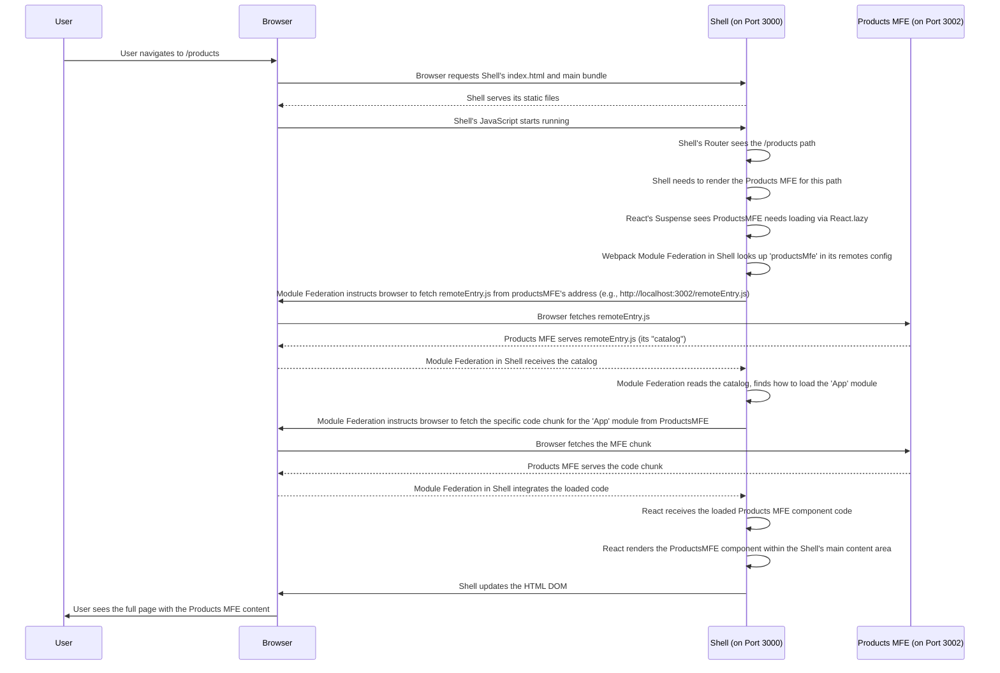

# Chapter 3: Shell (Host) Application

Welcome back to the `mfe-project` tutorial! In [Chapter 1: Webpack Module Federation](01_webpack_module_federation_.md), we learned about the underlying technology that lets different applications share code at runtime. In [Chapter 2: Micro Frontend (MFE)](02_micro_frontend__mfe_.md), we understood that our project is built as a collection of independent applications (MFEs).

But if we have multiple independent applications, how do they all come together to form one single experience for the user? This is where the **Shell (Host) Application** comes in!

## What is the Shell (Host) Application?

Think of our Micro Frontend project like a shopping mall again. Each **Micro Frontend (MFE)** is an independent store inside the mall. The **Shell Application** is the mall building itself – the structure that holds everything together, the main entrance, the hallways, and the directories.

The Shell application is the very first application that the user's browser loads when they visit your website's main address (like `www.your-mfe-mall.com`).

Its main jobs are:

1.  **Being the Entry Point:** It's where the user starts.
2.  **Providing the Overall Layout:** It defines the common parts of the page that usually stay the same, like the header, footer, and a main content area where the different MFEs will be displayed.
3.  **Managing Navigation and Routing:** It decides what MFE or content should be shown based on the URL (e.g., show the Products MFE when the URL is `/products`).
4.  **Loading and Displaying MFEs:** Using [Webpack Module Federation](01_webpack_module_federation_.md), it dynamically fetches the necessary code for other MFEs ("remote" applications) and renders them into the layout.

Essentially, the Shell is the orchestrator. It doesn't contain the detailed code for every feature (like products or orders), but it knows _where_ to find those features (in the Products MFE, in the Orders MFE, etc.) and how to load them into the page when needed.

## How the Shell Loads MFEs

The magic of bringing MFEs into the Shell happens thanks to [Webpack Module Federation](01_webpack_module_federation_.md). The Shell application is configured to know about the existence of other MFEs it might need to load. It does this using the `remotes` option in its `webpack.config.js`.

### 1. Telling the Shell Where to Find MFEs (`webpack.config.js`)

Let's look at a simplified snippet from the Shell's Webpack configuration (`shell/webpack.config.js`). This is where the Shell lists the "addresses" of the MFEs it plans to use.

```javascript
// --- File: shell/webpack.config.js (Snippet) ---
const ModuleFederationPlugin = require("webpack/lib/container/ModuleFederationPlugin");
// ... other imports and config ...

module.exports = {
  // ...
  plugins: [
    new ModuleFederationPlugin({
      name: "shell", // This app's unique name
      remotes: {
        // Here's where the Shell learns about other MFEs!
        // 'localName': 'remoteName@remoteUrl/remoteEntry.js'

        headerMfe: `headerMfe@http://localhost:3001/remoteEntry.js`, // Header MFE runs on port 3001
        productsMfe: `productsMfe@http://localhost:3002/remoteEntry.js`, // Products MFE runs on port 3002
        ordersMfe: `ordersMfe@http://localhost:3003/remoteEntry.js`, // Orders MFE runs on port 3003
        // ... add other MFEs here
      },
      shared: {
        // Libraries like React that apps will share (more in Chapter 6)
      },
    }),
    // ... other plugins
  ],
  // ...
};
```

In this `remotes` section:

- `headerMfe`, `productsMfe`, `ordersMfe` are the _local names_ you'll use within the Shell's code to refer to these remote MFEs.
- `headerMfe@http://localhost:3001/remoteEntry.js` is the full "address" of the remote MFE.
  - `headerMfe` is the `name` defined in the _remote_ MFE's `webpack.config.js`.
  - `http://localhost:3001/remoteEntry.js` is the URL where the Shell can find the `remoteEntry.js` file (the "catalog" or "manifest" from [Chapter 1](01_webpack_module_federation_.md)) for that specific MFE. This file tells the Shell _what_ modules the remote MFE exposes and _how_ to load them.

This `remotes` configuration is like the Shell having a directory of all the stores in the mall, listing their names and where to find their main office (the `remoteEntry.js`). We'll explore the `remotes` configuration in much more detail in the next chapter, [Chapter 4: Remotes Configuration](04_remotes_configuration_.md).

### 2. Loading and Rendering the MFE in React (`shell/src/App.js`)

Once the Shell knows where the MFEs are, its React code needs to actually request and display them. Because the MFE code is loaded _dynamically_ at runtime (not included in the Shell's initial build), we use React's `lazy` and `Suspense` features.

Look at this snippet from the Shell's main application file (`shell/src/App.js`):

```javascript
// --- File: shell/src/App.js (Snippet) ---
import React, { Suspense } from "react";
import {
  BrowserRouter as Router,
  Routes,
  Route,
  Navigate,
} from "react-router-dom";
// We also use ErrorBoundary here for robustness (more in Chapter 9)
import ErrorBoundary from "./components/ErrorBoundary";

// Lazy load MFE components/apps using the names defined in remotes
// 'localName/ExposedModule'
const HeaderMfe = React.lazy(() => import("headerMfe/Header"));
const ProductsMfe = React.lazy(() => import("productsMfe/App"));
const OrdersMfe = React.lazy(() => import("ordersMfe/App"));

// ... Loading and Fallback components ...

function App() {
  console.log("🚀 Shell App rendering...");

  return (
    <div className="app">
      {" "}
      {/* Basic Shell layout */}
      <Router>
        {" "}
        {/* Shell manages the main routing */}
        <div className="layout">
          {/* Header MFE: Loaded here and appears on all pages */}
          <ErrorBoundary fallback={<HeaderFallback />}>
            <Suspense fallback={<Loading message="Loading Header..." />}>
              <HeaderMfe /> {/* This component is dynamically loaded! */}
            </Suspense>
          </ErrorBoundary>

          {/* Main content area where Page MFEs will be rendered */}
          <main className="main-content">
            <Routes>
              {/* Route for the Products MFE */}
              <Route
                path="/products/*" // This route matches URLs starting with /products
                element={
                  <ErrorBoundary
                    fallback={<PageFallback pageName="Products" />}
                  >
                    <Suspense
                      fallback={<Loading message="Loading Products MFE..." />}
                    >
                      {/* The entire Products MFE App is loaded here! */}
                      <ProductsMfe />
                    </Suspense>
                  </ErrorBoundary>
                }
              />

              {/* Route for the Orders MFE */}
              <Route
                path="/orders/*" // This route matches URLs starting with /orders
                element={
                  <ErrorBoundary fallback={<PageFallback pageName="Orders" />}>
                    <Suspense
                      fallback={<Loading message="Loading Orders MFE..." />}
                    >
                      {/* The entire Orders MFE App is loaded here! */}
                      <OrdersMfe />
                    </Suspense>
                  </ErrorBoundary>
                }
              />

              {/* ... other routes managed by the Shell ... */}
            </Routes>
          </main>

          {/* ... Footer component ... */}
        </div>
      </Router>
    </div>
  );
}

export default App;
```

Here's what's happening:

- `const HeaderMfe = React.lazy(() => import('headerMfe/Header'));`
  - `React.lazy` tells React that this component will be loaded _dynamically_ the first time it's needed.
  - `import('headerMfe/Header')` is the special syntax used by Webpack Module Federation. It means "Go to the MFE we configured under the local name `headerMfe` in `remotes`, and load the module it exposed under the name `Header`". The module name `Header` corresponds to an entry in the remote MFE's `exposes` configuration ([Chapter 5: Exposed Modules](05_exposed_modules_.md)).
- `<Suspense fallback={<Loading message="Loading Header..." />}>`
  - The `<Suspense>` component is required when using `React.lazy`. It wraps the lazy-loaded component.
  - While the MFE's code is being fetched and loaded (which takes time, as it's a network request), React will render the component provided in the `fallback` prop (a simple "Loading..." message in this case).
- `<ErrorBoundary fallback={<HeaderFallback />}>`
  - Wrapping the `Suspense` (and thus the lazy-loaded MFE) in an `ErrorBoundary` is crucial in MFE architectures. If the MFE fails to load or render properly (e.g., the MFE server is down, network error), the `ErrorBoundary` can catch the error and display a friendly message instead of crashing the entire Shell application. We cover this in [Chapter 9: Error Boundary](09_error_boundary_.md).
- The Shell's `Routes` and `Route` setup (using `react-router-dom`) determines _when_ to load a Page MFE. When the URL matches `/products/*`, the `<ProductsMfe />` component is rendered in the `main` area, triggering its dynamic load via `Suspense` and `React.lazy`.

This combination of `remotes` configuration in Webpack and `React.lazy`/`Suspense` in your component code is how the Shell dynamically pulls in and displays content from other, independently running MFEs.

## How it Works Under the Hood (Simplified Flow)

Let's trace the path when a user visits the `/products` page:



This diagram shows how the Shell acts as the central coordinator. It doesn't _serve_ the Products MFE code itself; it tells the browser _where_ to get it (`http://localhost:3002/remoteEntry.js`) and _what specific part_ to load (`App` module) based on its configuration and the current route.

## The Shell in our `mfe-project`

In our project structure, the `shell` directory is where the Shell application lives.

- `shell/package.json`: Defines the dependencies and scripts for the Shell itself (like `npm run dev` to start the Shell server on port 3000).
- `shell/webpack.config.js`: Contains the Webpack and Module Federation configuration, including the `remotes` section listing other MFEs.
- `shell/public/index.html`: The main HTML file that the Shell serves as the entry point.
- `shell/src/index.js`: The main entry point for the Shell's JavaScript application, which bootstraps the React app.
- `shell/src/App.js`: Contains the main Shell layout, the `react-router-dom` setup for navigation, and uses `React.lazy` and `Suspense` to load MFEs based on the route.
- `shell/src/components/ErrorBoundary.js`: A crucial component used in the Shell to prevent a single MFE error from crashing the entire application ([Chapter 9: Error Boundary](09_error_boundary_.md)).

Running `npm run dev:shell` from the project root (or `npm run dev` inside the `shell` directory) starts the Shell application, typically on `http://localhost:3000`. When you open this URL in your browser, you'll see the Shell's basic structure, and as you navigate (e.g., to `/products`), the Shell will dynamically load the relevant MFE.

## Conclusion

The **Shell (Host) Application** is the foundation of our Micro Frontend architecture. It serves as the user's initial entry point, provides the overall structure and navigation, and dynamically loads other independent **Micro Frontends (MFEs)** using [Webpack Module Federation](01_webpack_module_federation_.md). It doesn't build the features itself but knows how to find, load, and display the parts provided by other MFEs based on the user's interaction and the current route.

We saw how the Shell's `webpack.config.js` uses the `remotes` option to list the addresses of other MFEs and how its React code uses `React.lazy` and `Suspense` to dynamically load components or full applications from those remotes.

In the next chapter, we'll take a closer look at the `remotes` configuration and understand exactly how the Shell is configured to locate and prepare to load the other MFEs.

[Next Chapter: Remotes Configuration](04_remotes_configuration_.md)
