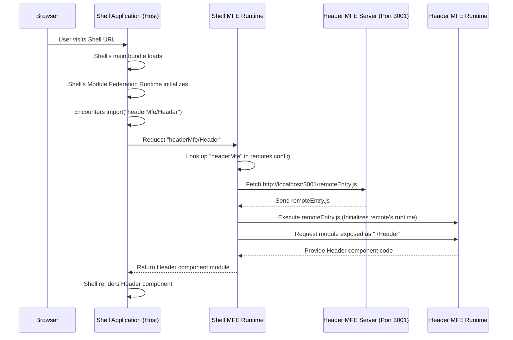

# Chapter 3: Webpack Module Federation

## [Shell Application (Host)](01_shell_application__host__.md)

# Chapter 3: Webpack Module Federation

Welcome back! In the previous chapters, we introduced the core players in our micro frontend setup: the [Shell Application (Host)](01_shell_application__host__.md), which acts as the main container, and the [Micro Frontend (MFE)](02_micro_frontend__mfe__.md), which is an independent building block.

We saw how the Shell uses `import()` to load MFEs like `import("headerMfe/Header")`, and how MFEs use the `exposes` config in their Webpack setup to make parts of their code available (like `exposes: { "./Header": ... }`).

But how does this magic `import("mfeName/moduleName")` actually work across separate applications that are built and deployed independently? This is where **Webpack Module Federation** comes in.

### What is Webpack Module Federation?

Think back to our shopping mall analogy. The Shell is the mall building, and MFEs are the individual stores. How does a customer (the browser) find a specific item (a component like the `Header`) in a specific store (`headerMfe`) without knowing the store's exact layout beforehand?

Webpack Module Federation is like the **standardized system** or **protocol** that the mall owner (Webpack) provides. This system allows each store (MFE) to:

1.  Declare its official name (`name` in config).
2.  Create a public directory or catalog (`remoteEntry.js`) listing everything it offers (`exposes`).
3.  Allows the mall building (Shell) or other stores (other MFEs) to look up a store by name and ask for specific items from its catalog (`remotes`).

In technical terms, Webpack Module Federation is a Webpack plugin that enables **JavaScript applications to dynamically load code from any other application** (as long as it's also configured with Module Federation) at runtime. It's like having applications that can _share_ parts of their built code directly, without needing to publish them to a package registry like npm first.

### The Core of the Magic: `ModuleFederationPlugin`

The heart of Webpack Module Federation is the `ModuleFederationPlugin` you've seen in the `webpack.config.js` files of both the Shell and the MFEs.

Let's revisit the simplified configurations:

**1. In the Shell (`shell/webpack.config.js`):**

```javascript
// shell/webpack.config.js (Simplified)
const ModuleFederationPlugin = require("webpack/lib/container/ModuleFederationPlugin");

new ModuleFederationPlugin({
  name: "shell", // Name of THIS app (the host)
  remotes: {
    // Listing the apps THIS app needs to load
    headerMfe: "headerMfe@http://localhost:3001/remoteEntry.js",
    productsMfe: "productsMfe@http://localhost:3002/remoteEntry.js",
    // ... others ...
  },
  shared: {
    // Libraries shared across applications
    // ... config for React, etc. ...
  },
}),
```

- `name: "shell"`: This gives our Shell application a name. While a host consuming others doesn't strictly need a name, it's good practice.
- `remotes: { ... }`: This is the key part for the Shell. It defines the applications it needs to connect to.
  - `headerMfe`: This is an _alias_ or _key_ we choose. This is what we use in our code when importing (`import("headerMfe/...")`).
  - `"headerMfe@http://localhost:3001/remoteEntry.js"`: This is the value that tells Webpack where to find the `headerMfe`. It follows the format `remoteName@remoteEntryUrl`.
    - `headerMfe`: This must match the `name` defined in the _remote_ application's Module Federation config (`header-mfe/webpack.config.js`).
    - `http://localhost:3001/remoteEntry.js`: This is the URL where the remote application's special `remoteEntry.js` file can be found.

**Explanation:** The `remotes` config in the Shell's Webpack tells the Shell's build system and runtime, "Okay, when you see an import like `import('headerMfe/...')`, you need to look for an application named `headerMfe`, and you can find its directory (`remoteEntry.js`) at this specific URL."

**2. In an MFE (`header-mfe/webpack.config.js`):**

```javascript
// header-mfe/webpack.config.js (Simplified)
const ModuleFederationPlugin = require("webpack/lib/container/ModuleFederationPlugin");

new ModuleFederationPlugin({
  name: "headerMfe", // Unique name of THIS MFE
  filename: "remoteEntry.js", // Name of the file THIS MFE will generate
  exposes: {
    // What THIS MFE makes available to others
    "./Header": "./src/Header", // Expose src/Header.js as "./Header"
  },
  shared: {
    // Libraries THIS app wants to share
    // ... config for React, etc. ...
  },
}),
```

- `name: "headerMfe"`: This is the unique name of this Micro Frontend. It's the name other applications (like the Shell) will use in their `remotes` config to refer to _this_ MFE.
- `filename: "remoteEntry.js"`: This tells Webpack to generate a file named `remoteEntry.js` in the build output directory (`dist`). This file is crucial – it's the manifest or directory listing the modules exposed by this MFE.
- `exposes: { ... }`: This is the key part for the MFE. It lists the modules (components, functions, etc.) that this MFE is willing to share with other applications.
  - `"./Header"`: This is the _public name_ or _key_ that other applications will use to request this module (`import("headerMfe/Header")`). The leading `./` is conventional but important.
  - `"./src/Header"`: This is the _internal path_ to the actual code file within this MFE's source code that should be exposed under the name `"./Header"`.

**Explanation:** The `exposes` config in the MFE's Webpack tells the MFE's build system, "When you build, create a manifest (`remoteEntry.js`) that says I have a module available under the name `./Header`, and the code for that module is located here, at `./src/Header.js`."

### The Link: `import("remoteName/exposedModuleName")`

Now we can see how the pieces fit together. When the Shell's `App.js` does:

```javascript
// shell/src/App.js (from Chapter 1, simplified)
const HeaderMfe = React.lazy(() => import("headerMfe/Header"));
```

1.  Webpack (specifically the Module Federation runtime included in the Shell's build) sees `import("headerMfe/Header")`.
2.  It looks up `"headerMfe"` in the Shell's `remotes` config (`shell/webpack.config.js`).
3.  It finds the URL `http://localhost:3001/remoteEntry.js`.
4.  It fetches and loads that `remoteEntry.js` file from the `header-mfe`.
5.  It then looks inside the loaded `remoteEntry.js` (which contains information about what the `headerMfe` exposes) and asks for the module exposed under the key `"./Header"`.
6.  The `header-mfe`'s runtime code (initialized by executing `remoteEntry.js`) provides the code for the module located at `./src/Header.js`.
7.  Webpack then loads this code and makes it available for `React.lazy` to render the `HeaderMfe` component.

This entire process happens **dynamically at runtime** in the user's browser, not during the build of the Shell application. This is what allows you to deploy an update to the `header-mfe` independently, and the Shell will pick up the new version the next time a user loads the page (after cache expiration, etc.).

### How It Works: The Runtime Flow

Let's visualize the loading process again, focusing on the role of Webpack Module Federation's runtime:



This sequence shows how the Shell's Module Federation runtime is the conductor. It uses the `remotes` config to find the `remoteEntry.js` of the requested MFE, loads it, and then uses the MFE's own runtime (initialized by its `remoteEntry.js`) to get the specific exposed module.

### Shared Modules

We briefly touched on the `shared` configuration in the `ModuleFederationPlugin`. This is another critical feature. When multiple applications (Shell and MFEs) all depend on the same library, like React, loading that library separately for each app is inefficient and can cause conflicts.

The `shared` config tells Webpack: "Treat these libraries specially. If a host application already loaded a compatible version of a shared library, the remote application should just use that existing version instead of loading its own copy."

Look at the `shared` config in any of the `webpack.config.js` files (Shell, Header MFE, Products MFE, etc.):

```javascript
// Example shared config (Simplified from shell/webpack.config.js)
shared: {
  react: {
    singleton: true, // Only allow one instance in the browser
    requiredVersion: "^17.0.2", // Minimum version required
    eager: true, // Load this immediately when the host loads
  },
  "react-dom": {
    singleton: true,
    requiredVersion: "^17.0.2",
    eager: true,
  },
  "react-router-dom": {
    singleton: true,
    requiredVersion: "^6.3.0",
    eager: false, // Load only when needed by a module
  },
},
```

- `singleton: true`: Ensures that even if multiple remotes and the host all declare React as shared, only one copy of React will actually be loaded into the browser's memory.
- `requiredVersion`: Allows you to specify version constraints to ensure compatibility.
- `eager`: Determines if the shared module should be loaded immediately when the host loads (`true`) or only when a remote that depends on it is loaded (`false`). `eager: true` is often used for core libraries like React that are needed by almost everything.

**Explanation:** By configuring `shared` libraries, Webpack Module Federation optimizes the loading process, preventing duplicate code downloads and potential version clashes, making the overall application more performant and stable. We will explore [Shared Modules/Libraries](06_shared_modules_libraries_.md) in more detail in a later chapter.

### Why is this powerful?

Webpack Module Federation is the backbone because it:

- Enables true **runtime integration**: Applications load code from each other _after_ they are deployed, not during their own build process.
- Supports **independent deployments**: You can update and deploy an MFE without needing to rebuild or redeploy the Shell or other MFEs (as long as the exposed interfaces and shared dependencies remain compatible).
- Facilitates **code sharing**: Allows different applications to share core libraries efficiently, reducing overall bundle size and improving performance.

It's the technology that makes the "mall" concept work – allowing independently managed "stores" to seamlessly plug into the main structure and offer their "goods" (components/modules) dynamically.

### Conclusion

In this chapter, we've uncovered the core technology behind our project: Webpack Module Federation. We learned that it provides the standardized system for applications to share code dynamically at runtime using the `ModuleFederationPlugin`.

Key takeaways:

- The `ModuleFederationPlugin` is configured in each application's `webpack.config.js`.
- Host applications (like the Shell) use the `remotes` config to define _where_ to find other applications' code.
- Remote applications (MFEs) use the `exposes` config to define _what_ parts of their code are available to others and specify the `filename` for their `remoteEntry.js`.
- The `import("remoteName/exposedModuleName")` syntax connects these two configurations, allowing the host to dynamically load specific modules from a remote MFE.
- The `shared` config helps optimize shared library loading across the federated applications.

Understanding these configurations is fundamental to working with this micro frontend architecture. We've repeatedly mentioned the special `remoteEntry.js` file and the concept of "Exposed Modules". In the next two chapters, we'll dive deeper into these specific pieces.

Let's first look closer at what it means for an MFE to expose a module.

[Remote Micro Frontend (Exposed Module)](04_remote_micro_frontend__exposed_module__.md)
