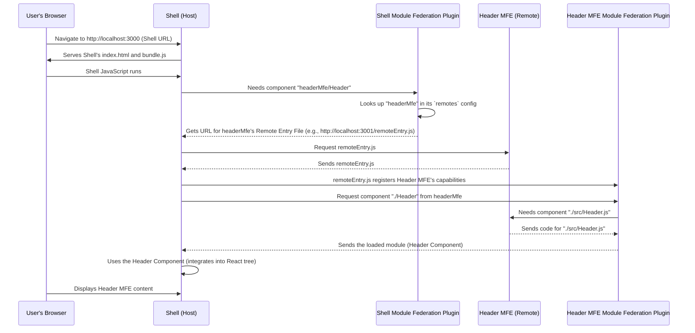

# Chapter 3: Webpack Module Federation

Welcome back to the `mfe-project` tutorial! In [Chapter 1: Micro Frontend (MFE)](01_micro_frontend__mfe__.md), we learned about breaking our large application into smaller, independent pieces (like shops). In [Chapter 2: Shell (Host Application)](02_shell__host_application__.md), we explored the main application (the mall building) that hosts these independent MFEs.

Now, we come to the crucial piece that makes this whole system work seamlessly: **Webpack Module Federation**.

## What is Webpack Module Federation?

Imagine your independent shops (MFEs) are built and ready to go. Your mall (Shell) application is also built. How does the Shell application _actually_ get the code for a specific shop's display or a component from another shop? How does it know _where_ to find the shop's code? And importantly, if both the mall and a shop use the same library, like React, how do you make sure the user's browser only downloads and runs React _once_?

Webpack Module Federation is the answer!

**Think of Webpack Module Federation as the special infrastructure and delivery system of the mall.**

- It's a feature built into the Webpack tool (which bundles our JavaScript code) that allows one Webpack build (like the Shell) to _dynamically load code_ from another Webpack build (like an MFE) _at runtime_.
- It's the technology that enables the Shell to discover and pull in components or modules exposed by the MFEs.
- Crucially, it helps manage shared dependencies (like React, ReactDOM, etc.) so the user's browser doesn't download the same library multiple times.

Without Module Federation, the Shell would have no easy, standardized way to grab code from a running MFE application. You'd have to build all the MFE code _into_ the Shell, which defeats the purpose of independent deployment, or come up with complex, custom loading mechanisms.

Module Federation provides a powerful, built-in mechanism for different parts of your application (built with Webpack) to share code.

## Key Concepts of Module Federation

Module Federation introduces a few core ideas:

1.  **Host (or Consumer):** An application that _consumes_ code from other applications. In our project, the `shell` is the main **Host**.
2.  **Remote:** An application that _exposes_ some of its code to be consumed by other applications. In our project, `header-mfe`, `products-mfe`, `orders-mfe`, and `user-profile-mfe` are **Remotes**. A single application can be both a Host _and_ a Remote (like `products-mfe` which exposes its App _and_ consumes the `user-profile-mfe`).
3.  **Exposed Modules:** The specific pieces of code (like components, functions, utility files) that a Remote application decides to make available for others to consume.
4.  **Remote Entry File:** A special file generated by Webpack for each Remote application. It acts like a directory or manifest, telling the Host application what modules are available and how to load them. (More on this in [Chapter 4: Remote Entry File](04_remote_entry_file_.md)).
5.  **Shared Modules:** Libraries or dependencies (like React, ReactDOM, etc.) that multiple applications agree to share. Module Federation ensures that if a shared module is needed, it tries to use an already loaded version from another application before downloading its own copy. (More on this in [Chapter 6: Shared Modules](06_shared_modules_.md)).

All of these concepts are configured using the `ModuleFederationPlugin` in each application's `webpack.config.js`.

## How Module Federation Works (Simplified)

Let's look at how the Shell (Host) uses Module Federation to load the Header MFE (Remote) component.



In essence:

1.  The Shell's `webpack.config.js` defines its `remotes` - a list of names it can `import` from, mapped to the URLs where their `remoteEntry.js` files can be found.
2.  A Remote MFE's `webpack.config.js` defines its `name`, `filename` (`remoteEntry.js` by default), and `exposes` - a list of internal modules mapped to external names that other apps can `import`.
3.  When the Shell's code executes and tries to `import("headerMfe/Header")` (often via `React.lazy`), Webpack's Module Federation runtime in the Shell intercepts this.
4.  It finds the URL for `headerMfe` from its `remotes` config.
5.  It downloads the `remoteEntry.js` file from the Header MFE's server.
6.  The `remoteEntry.js` file contains instructions on how to load the specific module `"./Header"` that the Shell requested (which maps to the actual file `./src/Header.js` within the Header MFE project, based on the MFE's `exposes` config).
7.  The Module Federation runtime fetches the actual code for `./src/Header.js`.
8.  Before running the code, it checks the `shared` configuration. If both Shell and Header MFE share React, it ensures only one version is used, prioritizing the Shell's version if compatible.
9.  Finally, the Header component code is made available to the Shell's application code, which can then render it.

This dynamic loading is powerful because the Shell doesn't need to know _anything_ about the MFE's internal code structure or dependencies _at build time_. It just needs to know the MFE's name and the URL of its `remoteEntry.js` file. The MFE can be built and deployed completely independently.

## Module Federation Configuration in `mfe-project`

Let's look at how this is set up in our project's `webpack.config.js` files, focusing on the core `ModuleFederationPlugin` configuration.

### Shell (Host) Configuration

The Shell needs to declare which Remotes it can connect to:

```javascript
// shell/webpack.config.js (Simplified)
const ModuleFederationPlugin = require("webpack/lib/container/ModuleFederationPlugin");

// getRemoteUrl function handles development (localhost) vs production URLs
const getRemoteUrl = (port, name) => {
  /* ... */
};

module.exports = {
  // ... other config
  plugins: [
    new ModuleFederationPlugin({
      name: "shell", // <-- 1. Name of THIS application
      remotes: {
        // <-- 2. Defines the "directory" of MFEs
        headerMfe: `headerMfe@${getRemoteUrl(3001, "mfe/header-mfe")}`, // Alias: url/remoteEntry.js
        productsMfe: `productsMfe@${getRemoteUrl(3002, "mfe/products-mfe")}`,
        ordersMfe: `ordersMfe@${getRemoteUrl(3003, "mfe/orders-mfe")}`,
      },
      shared: {
        /* ... shared dependencies ... */
      }, // <-- 3. What dependencies to share
    }),
    // ... other plugins
  ],
};
```

**Explanation:**

1.  `name: "shell"`: Gives this application a name for identification in the Module Federation network.
2.  `remotes`: This is an object where keys are the _aliases_ you'll use in your code (e.g., `headerMfe`) and values tell Module Federation _where_ to find that remote application. The value format is typically `RemoteName@RemoteEntryUrl`. `RemoteName` is the `name` property from the remote MFE's config, and `RemoteEntryUrl` is the full URL to its `remoteEntry.js` file.
3.  `shared`: We'll cover this in detail in [Chapter 6: Shared Modules](06_shared_modules_.md), but it lists dependencies that should be shared between applications to avoid duplication.

### MFE (Remote) Configuration

Each MFE needs to declare its own identity and what it exposes. Let's look at the Header MFE:

```javascript
// header-mfe/webpack.config.js (Simplified)
const ModuleFederationPlugin = require("webpack/lib/container/ModuleFederationPlugin");

module.exports = {
  // ... other config
  plugins: [
    new ModuleFederationPlugin({
      name: "headerMfe", // <-- 1. Name of THIS application (used in Shell's `remotes`)
      filename: "remoteEntry.js", // <-- 2. The file name for the Remote Entry file
      exposes: {
        // <-- 3. What modules THIS application makes available
        "./Header": "./src/Header", // External name: Internal path
      },
      shared: {
        /* ... shared dependencies ... */
      }, // <-- 4. What dependencies THIS application shares
    }),
    // ... other plugins
  ],
};
```

**Explanation:**

1.  `name: 'headerMfe'`: Gives this Remote application a name. This is the name the Shell uses in its `remotes` value (e.g., `headerMfe@...`).
2.  `filename: 'remoteEntry.js'`: Specifies the name of the file that will contain the manifest and loading logic for this remote. This file is what the Shell downloads.
3.  `exposes`: This object defines what parts of this MFE are accessible from the outside. The keys are the _external names_ (e.g., `./Header`) that the Host (Shell) will use in its `import` statements. The values are the _internal paths_ within this MFE's project (`./src/Header`).
4.  `shared`: Same as in the Shell, defines dependencies to be shared.

The configuration for `products-mfe`, `orders-mfe`, and `user-profile-mfe` follows a similar pattern for `name`, `filename`, and `shared`, but their `exposes` will list the specific components or modules they offer (like `./App` for `productsMfe` and `ordersMfe`, or `./UserProfile` for `userProfileMfe`).

Notice that `products-mfe/webpack.config.js` also has a `remotes` section:

```javascript
// products-mfe/webpack.config.js (Snippet)
// ... other config
new ModuleFederationPlugin({
  name: "productsMfe",
  filename: "remoteEntry.js",
  exposes: {
    "./App": "./src/App",
  },
  remotes: { // <-- productsMfe is ALSO a consumer!
    userProfileMfe: `userProfileMfe@${getRemoteUrl(
      3004,
      "user-profile-mfe"
    )}`,
  },
  shared: { /* ... */ },
}),
// ...
```

This shows that an application can be both a Remote (exposing its `./App`) and a Host (consuming the `userProfileMfe`). This allows MFEs to compose other MFEs if needed.

### Using the Remote Modules in the Shell

Once the `ModuleFederationPlugin` is configured, you can dynamically import the exposed modules in the Shell's code using the alias defined in `remotes` and the external name defined in `exposes`.

In `shell/src/App.js`:

```jsx
// shell/src/App.js (Simplified Import Section)
import React, { Suspense } from "react";
// ... other imports

// Lazy load MFE components using the Module Federation syntax
// Format: "remoteAlias/exposedName"
const HeaderMfe = React.lazy(() => import("headerMfe/Header"));
const ProductsMfe = React.lazy(() => import("productsMfe/App"));
const OrdersMfe = React.lazy(() => import("ordersMfe/App"));

const Loading = () => <div>Loading...</div>; // Simple placeholder
// ... rest of the App component
```

**Explanation:**

`React.lazy` is often used with Module Federation because the remote module's code isn't available immediately when the Shell application starts. `React.lazy` tells React to only load the component when it's needed (e.g., when it's about to be rendered).

The `import("headerMfe/Header")` syntax is the magic provided by Module Federation. Webpack understands this special syntax:

- `headerMfe`: This is the alias defined in the Shell's `remotes` config. Webpack looks this up to find the URL of the remote's `remoteEntry.js`.
- `/Header`: This is the external name defined in the Header MFE's `exposes` config (the key `./Header`, just without the leading `./`, or sometimes with it depending on configuration and convention). Webpack tells the remote entry file "Give me the module exposed as `Header`".

Webpack handles all the fetching and linking behind the scenes.

## Conclusion

Webpack Module Federation is the core technology that powers the dynamic loading and integration of Micro Frontends. It acts like the necessary infrastructure in our mall analogy, allowing the Shell (Host) to discover and load specific components or applications from independent MFEs (Remotes) using a defined configuration (`remotes`, `exposes`, `shared`).

You saw how we configure the `ModuleFederationPlugin` in both the Shell and MFE `webpack.config.js` files to define these relationships and how the Shell uses a special `import()` syntax (often with `React.lazy`) to load the exposed modules at runtime.

In the next chapters, we will delve deeper into the specific pieces that make this work: the [Remote Entry File](04_remote_entry_file_.md) (the directory), the [Remote Module (Exposed Component/App)](05_remote_module__exposed_component_app__.md) (the specific item you're fetching), and [Shared Modules](06_shared_modules_.md) (the shared resources).

[Next Chapter: Remote Entry File](04_remote_entry_file_.md)
