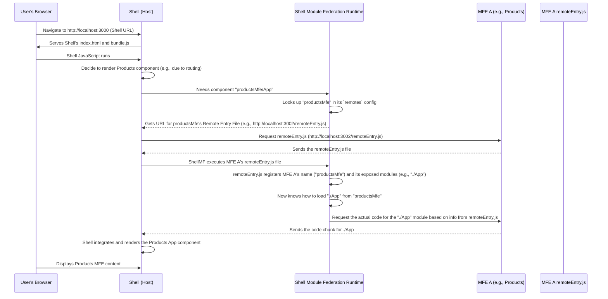

# Chapter 4: Remote Entry File

Welcome back to the `mfe-project` tutorial! So far, we've learned about the **[Micro Frontend (MFE)](01_micro_frontend__mfe__.md)** as an independent piece of our application (a shop), the **[Shell (Host Application)](02_shell__host_application__.md)** that brings everything together (the mall building), and **[Webpack Module Federation](03_webpack_module_federation_.md)** as the core technology enabling this dynamic loading and sharing (the mall's infrastructure).

Now, let's look at a very specific but crucial piece of this infrastructure: the **Remote Entry File**.

## What Problem Does the Remote Entry File Solve?

Imagine the Shell application is like a shopper entering the mall. The shopper knows they want to visit the "Products Shop" (the Products MFE) to look at some items.

How does the Shell application, which is running in the user's browser on, say, `http://localhost:3000`, know _where_ to find the Products MFE, which is running on `http://localhost:3002` during development? And once it finds the MFE, how does it know _what_ components or parts that MFE is willing to share?

This is where the Remote Entry File comes in. The Shell can't magically know the internal structure of every MFE. It needs a standardized way to ask an MFE, "Hey, what stuff do you have that I can use, and how do I get it?"

## What is a Remote Entry File?

**Think of the Remote Entry File (`remoteEntry.js`) as the 'Mall Directory' or a 'Signpost' for each individual MFE.**

- When you build an MFE using Webpack Module Federation, one of the files it generates is typically named `remoteEntry.js` (though you can name it something else).
- This file is small and contains just enough information for a Host application (like our Shell) to interact with this specific Remote MFE.
- It essentially tells the Host: "My name is [MFE Name], and I can give you these specific 'exposed' modules if you ask for them by their external names."

Every MFE that intends to expose modules to others will generate its own `remoteEntry.js` file during its build process.

## What's Inside the `remoteEntry.js` File (Conceptually)?

You don't usually need to read the raw `remoteEntry.js` file (it's machine-generated JavaScript), but it contains vital information:

1.  **The MFE's Name:** It identifies the MFE (e.g., "productsMfe", "headerMfe"). This matches the `name` property in the MFE's `webpack.config.js`.
2.  **A List of Exposed Modules:** It contains a mapping of the external names (like `./App` or `./Header`) that the MFE exposes to the actual code locations within the MFE that correspond to those modules.
3.  **Loading Logic:** It includes the necessary Webpack runtime code that allows a Host to request one of these exposed modules and load its actual code chunk dynamically.
4.  **Shared Module Information:** It registers the shared dependencies this MFE is participating in.

## How the Shell Uses the Remote Entry File

Let's revisit the process of the Shell loading an MFE component, now focusing on the Remote Entry File step:



As you can see, the Shell first downloads the small `remoteEntry.js` file from the MFE. This file doesn't contain the MFE's actual components _yet_. Instead, it teaches the Shell's Module Federation runtime _how_ to get those components when they are actually needed. It's the essential first step in the dynamic loading process.

## Configuring the Remote Entry File

You configure the generation of the `remoteEntry.js` file within the `ModuleFederationPlugin` in the MFE's `webpack.config.js`.

Here's a simplified look at the Products MFE's configuration:

```javascript
// products-mfe/webpack.config.js (Simplified)
const ModuleFederationPlugin = require("webpack/lib/container/ModuleFederationPlugin");

module.exports = {
  // ... other config
  plugins: [
    new ModuleFederationPlugin({
      name: "productsMfe", // <-- This MFE's name
      filename: "remoteEntry.js", // <-- This tells Webpack to generate this file
      exposes: {
        // <-- These are the modules listed in remoteEntry.js
        "./App": "./src/App",
      },
      shared: {
        /* ... */
      },
    }),
    // ... other plugins
  ],
};
```

- `name: 'productsMfe'`: This is the name registered within the `remoteEntry.js` file. The Shell will use this name.
- `filename: 'remoteEntry.js'`: This is the option that tells Webpack to create this specific file and put the Module Federation metadata into it. By default, it's `remoteEntry.js`.
- `exposes`: The modules listed here are the ones whose existence and loading instructions are described _within_ the `remoteEntry.js` file. When the Shell requests `"productsMfe/App"`, the `remoteEntry.js` file helps the Shell's runtime locate the code for `./src/App`.

In the Shell's `webpack.config.js`, the `remotes` configuration points directly to this file:

```javascript
// shell/webpack.config.js (Simplified)
const ModuleFederationPlugin = require("webpack/lib/container/ModuleFederationPlugin");

const getRemoteUrl = (port, name) => {
  /* ... returns http://localhost:3002 */
};

module.exports = {
  // ... other config
  plugins: [
    new ModuleFederationPlugin({
      name: "shell",
      remotes: {
        productsMfe: `productsMfe@${getRemoteUrl(3002, "mfe/products-mfe")}`, // <-- URL pointing to the MFE's remoteEntry.js
        // ... other remotes
      },
      shared: {
        /* ... */
      },
    }),
    // ... other plugins
  ],
};
```

The value `productsMfe@${getRemoteUrl(3002, 'mfe/products-mfe')}` is critical. It tells the Shell's Module Federation runtime: "When you see an import like `productsMfe/...`, go to the URL provided by `getRemoteUrl(3002, 'mfe/products-mfe')`, download the `remoteEntry.js` file located there, and use the information inside it."

## Conclusion

The Remote Entry File (`remoteEntry.js`) is the cornerstone of Webpack Module Federation's dynamic loading. It's a small, generated file that acts as a manifest and entry point for an MFE, providing the necessary information (name, exposed modules, loading instructions) for a Host application (like the Shell) to discover and load code from it at runtime.

Each MFE that exposes modules needs its own `remoteEntry.js`. The Shell's configuration points to these files, enabling the dynamic fetching process illustrated by the sequence diagram.

Now that we understand how the Shell finds the MFE using the Remote Entry File, let's look at what exactly the Shell is trying to load from the MFE: the **Remote Module**.

[Next Chapter: Remote Module (Exposed Component/App)](05_remote_module__exposed_component_app__.md)
