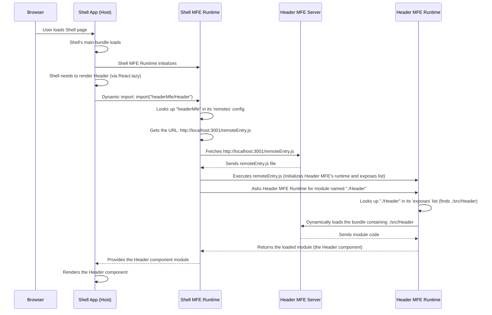

# Chapter 4: Remote Micro Frontend (Exposed Module)

Welcome back! In the last chapter, [Chapter 3: Webpack Module Federation](03_webpack_module_federation_.md), we learned that Webpack Module Federation is the technology that allows our independent Micro Frontends (MFEs) and the Shell to share code dynamically at runtime. We saw how the `ModuleFederationPlugin` with its `remotes` and `exposes` configurations makes this connection possible.

Now, let's focus on one crucial part of this system from the MFE's perspective: the **Exposed Module**.

### What is a Remote Micro Frontend (Exposed Module)?

Let's return to our shopping mall analogy. The Shell is the mall building, and each Micro Frontend is an independent store.

When you are inside the Shell (the mall), how do you find something specific, like the "Header" component from the "Header Store" (`headerMfe`)? You don't go rummaging through the Header store's entire inventory! Instead, the Header store explicitly tells the mall (via its directory or catalog, which will be `remoteEntry.js`) what key items it offers to the public.

An **Exposed Module** is simply a specific piece of code (like a React component, a function, or even a utility class) inside a Micro Frontend that the MFE's developers have decided to make available for _other_ applications (like the Shell or other MFEs) to use.

It's like a store putting up a sign that says, "We offer 'The Header Component' – find it here!"

### Why Expose Modules?

You expose modules for a few key reasons:

1.  **Controlled Access:** You only share _exactly_ what you want others to use. Internal code, implementation details, or components not meant for external use stay private within the MFE.
2.  **Clear Interface:** Exposing a module defines a clear contract. Other applications know what they can import and what name to use.
3.  **Independence:** The MFE can change its _internal_ file structure or code implementation (`./src/Header.js`) without affecting applications that consume its exposed module, as long as the _exposed name_ (`./Header`) and the functionality remain the same.

### How Does an MFE Expose a Module?

MFEs use the `exposes` option within their `ModuleFederationPlugin` configuration in `webpack.config.js` to declare which internal modules they make available to the outside world.

Let's look at the `header-mfe/webpack.config.js` file again, focusing on the `exposes` section:

```javascript
// header-mfe/webpack.config.js (Simplified)
const ModuleFederationPlugin = require("webpack/lib/container/ModuleFederationPlugin");

module.exports = {
  // ... other Webpack config ...
  plugins: [
    new ModuleFederationPlugin({
      name: "headerMfe", // The unique name of THIS MFE (used by consumers in 'remotes')
      filename: "remoteEntry.js", // The manifest file others will fetch
      exposes: {
        // What parts of this MFE are available to others?
        // Public name: Internal path
        "./Header": "./src/Header", // Expose src/Header.js as "./Header"
      },
      shared: {
        // ... shared library config ...
      },
    }),
    // ... other plugins ...
  ],
  // ... other Webpack config ...
};
```

**Explanation:**

- `name: 'headerMfe'`: This is the unique name of this specific Micro Frontend (`header-mfe`). When the Shell (or any other MFE) wants to load something from _this_ application, it will use this name in its `remotes` configuration.
- `filename: 'remoteEntry.js'`: This tells Webpack to generate a special file named `remoteEntry.js` when it builds the `header-mfe`. This file is essentially a manifest or index that lists everything defined in the `exposes` section. It's the "directory" for this MFE. We'll look at this file in detail in [Chapter 5: `remoteEntry.js`](05__remoteentry_js__.md).
- `exposes: { './Header': './src/Header' }`: This is the core part for exposing a module.
  - `'./Header'`: This is the **public name** or **alias** that other applications will use when they want to import this module. The leading `./` is a common convention in Module Federation aliases. Think of this as the 'entry number' in the directory.
  - `'./src/Header'`: This is the **internal path** within the `header-mfe`'s source code that points to the actual module (in this case, likely the `Header` React component) that should be exposed under the public name `'./Header'`.

So, this configuration tells Webpack: "When you build `header-mfe`, create a `remoteEntry.js` file. In that file, list that I am exposing a module under the name `./Header`, and the code for that module can be found at `./src/Header.js` within my build output."

Similarly, the `products-mfe` exposes its main `App` component:

```javascript
// products-mfe/webpack.config.js (Simplified exposes)
new ModuleFederationPlugin({
  name: 'productsMfe',
  filename: 'remoteEntry.js',
  exposes: {
    './App': './src/App', // Expose src/App.js as "./App"
  },
  // ... remotes, shared, etc. ...
}),
```

And the `user-profile-mfe` exposes its `UserProfile` component:

```javascript
// user-profile-mfe/webpack.config.js (Simplified exposes)
new ModuleFederationPlugin({
  name: 'userProfileMfe',
  filename: 'remoteEntry.js',
  exposes: {
    './UserProfile': './src/UserProfile', // Expose src/UserProfile.js as "./UserProfile"
  },
  // ... shared, etc. ...
}),
```

Each MFE decides exactly _what_ it wants to expose and _what public name_ to give it.

### How a Host Consumes an Exposed Module

Now, let's look at the consuming side (the Shell or another MFE that needs to load this module).

In [Chapter 1](01_shell_application__host__.md), we saw how the Shell's `shell/src/App.js` loads the `Header` component:

```javascript
// shell/src/App.js (Simplified import)
import React, { Suspense } from "react";

// Lazy load MFE components
const HeaderMfe = React.lazy(() => import("headerMfe/Header"));
const ProductsMfe = React.lazy(() => import("productsMfe/App"));
// ... other imports ...

// ... later in the component ...
<Suspense fallback={<div>Loading Header...</div>}>
  <HeaderMfe />
</Suspense>;
```

**Explanation:**

- `import("headerMfe/Header")`: This is the standard dynamic `import()` syntax, but Webpack Module Federation intercepts it.
- `"headerMfe"`: This part before the slash must match one of the _keys_ defined in the Shell's `remotes` configuration (`shell/webpack.config.js`). This tells Webpack _which remote application_ to look in.
- `"/Header"`: This part _after_ the slash must match the **public name** (the key) defined in the _remote MFE's_ `exposes` configuration (specifically, `'./Header'`).

Webpack uses the `remotes` config (`headerMfe` -> `headerMfe@http://localhost:3001/remoteEntry.js`) to find the `header-mfe`'s directory (`remoteEntry.js`), then uses the requested module name (`Header` which maps to `./Header`) to find the actual code listed in that directory.

This shows the connection: the name used in the `import()` statement on the consumer side (`headerMfe/Header`) directly links to the `name` (`headerMfe`) and an `exposes` key (`./Header`) defined in the remote MFE's Webpack configuration.

### How it Works: Requesting an Exposed Module

Let's trace the process when the Shell tries to load the `Header` component from the `headerMfe`, focusing on the Module Federation runtime.



This flow illustrates how the Shell's runtime acts as an intermediary. It uses the `remotes` config to find the remote MFE's directory (`remoteEntry.js`), loads it, and then interacts with the remote MFE's _own_ runtime (initialized by `remoteEntry.js`) to request a specific module by its _exposed name_ (`./Header`). The remote MFE's runtime knows where to find the code for that exposed name and provides it.

### Conclusion

An **Exposed Module** is a fundamental concept in Webpack Module Federation, representing a specific, named piece of code that a Remote Micro Frontend explicitly makes available for other applications to consume.

- The remote MFE uses the `exposes` property in its `ModuleFederationPlugin` to define the public name (alias) and the internal file path for each module it wants to share.
- Host applications use the `import("remoteName/ExposedModuleName")` syntax to dynamically load these exposed modules at runtime.

This mechanism provides a clean, version-aware way for independent applications to share functionality and build a cohesive user interface.

The magic file that holds the map between exposed names and the actual code locations is the `remoteEntry.js`. In the next chapter, we'll lift the lid and see what's inside this crucial file.

[remoteEntry.js](05__remoteentry_js__.md)
