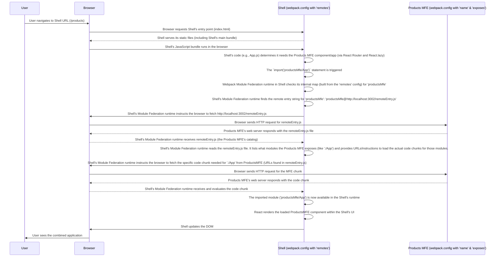

# Chapter 4: Remotes Configuration

Welcome back to the `mfe-project` tutorial! In our last chapter, [Chapter 3: Shell (Host) Application](03_shell__host__application_.md), we learned that the Shell application is the central orchestrator, responsible for providing the main layout and dynamically loading other independent Micro Frontends (MFEs).

But how exactly does the Shell _know_ where to find these other MFEs? If the Products MFE and the Header MFE are running as entirely separate applications, how does the Shell's code manage to load components from them?

This is where the **Remotes Configuration** in Webpack Module Federation comes in.

## The Shell's Directory: What is `remotes`?

Imagine our Shell application is like the management office of a large shopping mall. Different stores (our MFEs) are located at different places (different web addresses or ports). The management office doesn't keep all the products from every store inside its own office, but it _does_ need a directory or map of the mall. This directory lists the names of the stores and where they are located.

In Webpack Module Federation, the `remotes` configuration is precisely this directory for the Shell application (or any MFE that wants to load code from _other_ MFEs). It's a setting within the `ModuleFederationPlugin` that tells the current application (the "host") where to find the `remoteEntry.js` file of the "remote" applications it wants to consume.

The `remoteEntry.js` file, as we touched upon in [Chapter 1: Webpack Module Federation](01_webpack_module_federation_.md), is like the store's main office or catalog. It's a small file generated by the remote MFE's build process that lists _what_ components or modules the remote MFE is making available and provides the instructions needed to load them dynamically.

So, the `remotes` configuration is the map that links a friendly local name (like `headerMfe`) to the _actual address_ (`http://localhost:3001/remoteEntry.js`) where the Shell can find the remote MFE's catalog.

## How `remotes` is Configured

The `remotes` configuration is an object within the `ModuleFederationPlugin` in your `webpack.config.js` file. The keys of this object are the _local names_ you want to use in your code to refer to the remote MFE. The values are strings that specify the _remote name_ and the _location_ of its `remoteEntry.js` file.

The format for the value string is typically: `'[remoteName]@[url]/remoteEntry.js'`

- `[remoteName]`: This is the `name` value defined in the `ModuleFederationPlugin` of the _remote_ application you want to connect to.
- `[url]`: This is the base URL where the remote application is hosted (including the port in development).
- `/remoteEntry.js`: This is the default filename for the catalog file generated by the remote MFE's Module Federation plugin.

Let's look at the `remotes` section in the Shell's `webpack.config.js` again.

```javascript
// --- File: shell/webpack.config.js (Snippet focusing on remotes) ---
const ModuleFederationPlugin = require("webpack/lib/container/ModuleFederationPlugin");

// Helper function to get the correct URL based on environment
const getRemoteUrl = (port, name) => {
  // In production, this would be a deployed URL (like S3)
  if (process.env.NODE_ENV === "production") {
    return `https://your-s3-bucket.s3.amazonaws.com/${name}/remoteEntry.js`;
  }
  // In development, use localhost and the MFE's dev server port
  return `http://localhost:${port}/remoteEntry.js`;
};

module.exports = {
  // ... other webpack settings ...
  plugins: [
    new ModuleFederationPlugin({
      name: "shell", // The name of THIS application
      remotes: {
        // Configure the MFEs the Shell wants to use:
        // 'localName': 'remoteName@remoteEntryUrl'

        // Configuration for the Header MFE:
        headerMfe: `headerMfe@${getRemoteUrl(3001, "header-mfe")}`,

        // Configuration for the Products MFE:
        productsMfe: `productsMfe@${getRemoteUrl(3002, "products-mfe")}`,

        // Configuration for the Orders MFE:
        ordersMfe: `ordersMfe@${getRemoteUrl(3003, "orders-mfe")}`,

        // Add more MFEs here as needed...
      },
      // ... shared dependencies configuration (Chapter 6) ...
    }),
    // ... other plugins ...
  ],
  // ... other webpack settings ...
};
```

Let's break down one line from the `remotes` object:

```javascript
headerMfe: `headerMfe@${getRemoteUrl(3001, 'header-mfe')}`,
```

- `headerMfe`: This is the **local name**. Within the Shell's React code (like `shell/src/App.js`), you will use `headerMfe` in your `import` statements to refer to this remote MFE. For example, `import('headerMfe/Header')`.
- `headerMfe@${getRemoteUrl(3001, 'header-mfe')}`: This is the **remote entry string**.
  - `headerMfe`: This matches the `name: 'headerMfe'` setting in the _Header MFE's_ `webpack.config.js`. Webpack uses this name internally to ensure it's connecting the correct applications.
  - `${getRemoteUrl(3001, 'header-mfe')}`: This resolves to the URL where the Header MFE's `remoteEntry.js` file can be found. In development, this will be `http://localhost:3001/remoteEntry.js`, because the `header-mfe` application is configured to run on port 3001 (see its `package.json` scripts or `webpack.config.js`).

Similarly:

- `productsMfe: `productsMfe@${getRemoteUrl(3002, 'products-mfe')}`,` configures the Shell to know about the `productsMfe` remote application, which is expected to be running (in development) on `http://localhost:3002` and has named itself `productsMfe`.
- `ordersMfe: `ordersMfe@${getRemoteUrl(3003, 'orders-mfe')}`configures the Shell for the`ordersMfe`remote application on port 3003, named`ordersMfe`.

This configuration is static at build time for the Shell. It tells the Shell's build process the _potential_ locations of other MFEs. The actual loading happens dynamically at runtime when the Shell's code tries to import something from one of these remotes.

## How it Works Under the Hood

When you build the Shell application, Webpack processes the `ModuleFederationPlugin` configuration. When it sees the `remotes` section, it understands that any imports in the Shell's code starting with `headerMfe/`, `productsMfe/`, or `ordersMfe/` are not local modules to be bundled. Instead, it prepares a mechanism to fetch these modules from the specified remote URLs _when the Shell application is running in the browser_.

Let's revisit the process from [Chapter 3](03_shell__host__application_.md) with a specific focus on the role of the `remotes` configuration and the `remoteEntry.js` file:



The `remotes` configuration is the crucial first step in this runtime loading process. Without it, the Shell's Module Federation runtime wouldn't know _where_ to look for `productsMfe` or `headerMfe` when the `import()` call is made.

Notice that the `getRemoteUrl` helper function is important here. In a real-world scenario, your MFEs would be deployed to static hosting (like S3) or a CDN, and their `remoteEntry.js` files would be served from there in production. Using an environment variable (`process.env.NODE_ENV`) allows you to easily switch between `localhost` URLs for development and deployed URLs for production.

## Connecting Remotes to Exposed Modules

The `remotes` configuration in the _host_ application (like the Shell) works hand-in-hand with the `exposes` configuration in the _remote_ application (like `header-mfe` or `products-mfe`).

In the Shell's `remotes`:
`headerMfe: 'headerMfe@...'`

This tells the Shell where to find the MFE named `headerMfe`.

In the Header MFE's `webpack.config.js`:

```javascript
// --- File: header-mfe/webpack.config.js (Snippet focusing on name and exposes) ---
const ModuleFederationPlugin = require("webpack/lib/container/ModuleFederationPlugin");

module.exports = {
  // ... other webpack settings ...
  plugins: [
    new ModuleFederationPlugin({
      name: "headerMfe", // This MFE's unique name (matches the remoteName in the Shell's remotes)
      filename: "remoteEntry.js", // The name of the catalog file it generates
      exposes: {
        // The modules THIS MFE makes available for others to import:
        "./Header": "./src/Header", // Exposing the Header component
        // Add more exposed modules here if needed...
      },
      // ... shared dependencies ...
    }),
    // ... other plugins ...
  ],
  // ... other webpack settings ...
};
```

When the Shell's code does `import('headerMfe/Header')`:

1.  Webpack's runtime uses the `remotes` config to find the URL for `headerMfe`.
2.  It fetches the `remoteEntry.js` from that URL.
3.  It looks inside the `remoteEntry.js` for an exposed module named `Header`.
4.  If found, it fetches the code chunk for that specific exposed module and makes it available to the Shell's code.

The string `'headerMfe/Header'` used in the Shell's `import` statement is a combination of the _local remote name_ (`headerMfe`) defined in the Shell's `remotes` config and the _exposed module name_ (`./Header`) defined in the remote's `exposes` config. Webpack joins them with a slash (`/`) to create this special import path. We will dive deeper into `exposes` in the next chapter.

## Conclusion

The **Remotes Configuration** is a fundamental part of setting up a Module Federation host application like our Shell. It's the directory that tells the Shell _where_ to find the independent **Micro Frontends (MFEs)** it needs to load at runtime. By mapping local names (`headerMfe`, `productsMfe`) to the addresses of the remote MFEs' `remoteEntry.js` files, the Shell's Webpack Module Federation runtime knows exactly where to look when an `import()` request for a remote module is made.

Understanding `remotes` is key to connecting your independent MFEs together. However, simply knowing where to find a remote MFE isn't enough. The remote MFE also needs to explicitly declare _what parts_ of its code it is willing to share.

In the next chapter, we will explore the other side of this connection: **Exposed Modules**, which is how a remote MFE makes its components or code available for others (like the Shell) to consume.

[Next Chapter: Exposed Modules](05_exposed_modules_.md)
