# Chapter 4: Standalone vs. Integrated Modes (Bootstrap)

Welcome back! In the previous chapters, we learned about the [Micro Frontend (MFE) Structure](01_micro_frontend__mfe__structure_.md), how the [Webpack Module Federation Plugin](02_webpack_module_federation_plugin_.md) allows independent applications to share modules, and how [Shared Dependencies](03_shared_dependencies_.md) help load common libraries efficiently.

Now, let's talk about how each of our independent MFEs is structured so that it can serve two purposes:

1.  **Standalone Mode:** The MFE can be run completely on its own for development and testing purposes. This is like testing a single shop before it opens in the mall.
2.  **Integrated Mode:** The MFE's code (or specific parts of it) can be loaded and used by the Shell application. This is how the shop operates _within_ the mall structure.

How do we set up our MFE projects to handle both of these scenarios seamlessly? This is where the common Module Federation pattern involving `index.js` and `bootstrap.js` comes into play.

## The Need for Two Modes

Imagine you are a developer working on the `products-mfe`. You want to build and test the product listing page and product detail page. Do you really need to start the Shell application and _all_ other MFEs (`header-mfe`, `orders-mfe`, `user-profile-mfe`) just to work on the Products MFE? That would be slow and cumbersome!

Ideally, you want to be able to go into the `products-mfe` directory, run a command like `npm start`, and see _just_ the Products MFE running in your browser, rendering its pages as if it were a regular, standalone application. This is **Standalone Mode**.

However, when the full application is running, the Shell needs to be able to load the Products MFE's code (specifically, its main `App` component) and render it within the Shell's layout, alongside the Header MFE. This is **Integrated Mode**.

Module Federation facilitates the Integrated Mode by allowing the Shell to import exposed components. The `index.js` and `bootstrap.js` pattern is a convention used in many Module Federation projects to make this dual nature (Standalone and Integrated) manageable.

## The `index.js` and `bootstrap.js` Pattern

Let's look inside one of our MFE directories, like `products-mfe/src/`. You'll find two key files related to the application's entry point:

```
products-mfe/src/
├── App.js          # The main React component for the MFE
├── bootstrap.js    # Contains the code to mount/render the App
├── index.js        # The primary entry file, imports bootstrap.js
└── ... other files
```

This pattern is intentional:

1.  **`index.js`**: This file is typically very minimal. Its main job is to _asynchronously_ import `bootstrap.js`.

    ```javascript
    // File: products-mfe/src/index.js

    // Asynchronously import the bootstrap file
    // This is crucial for Module Federation to work correctly,
    // especially with shared dependencies loading.
    import("./bootstrap");
    ```

    Why the async import (`import('./bootstrap')`)? This is a Webpack and Module Federation best practice. It ensures that Webpack has had a chance to load all the necessary shared dependencies (like React, ReactDOM) _before_ the application's core rendering code (`bootstrap.js`) starts executing. If `bootstrap.js` were imported synchronously, it might try to use React before React is fully loaded and shared by the host (the Shell).

2.  **`bootstrap.js`**: This file contains the actual code that starts your application. In a React application, this usually means the `ReactDOM.render()` call that mounts your main application component (`App.js` in this case) into the HTML page.

    ```javascript
    // File: products-mfe/src/bootstrap.js

    import React from "react";
    import ReactDOM from "react-dom";
    import { BrowserRouter } from "react-router-dom";
    import App from "./App"; // Imports the main App component
    import "./styles.css";

    // This code runs when bootstrap.js is executed.
    // In Standalone mode, this is the entry point.
    // In Integrated mode, this block is typically NOT executed directly by the Shell.

    // Find the root element where the app should be mounted
    const rootElement = document.getElementById("root");

    // Render the App component into the root element
    ReactDOM.render(
      // Wrap with BrowserRouter for standalone mode routing
      <BrowserRouter>
        <App /> {/* This is the main component */}
      </BrowserRouter>,
      rootElement
    );
    ```

    Notice that `bootstrap.js` imports the main `App.js` component. It then uses `ReactDOM.render` to put this `App` component onto the page. The `BrowserRouter` wrapper is included here because, in **Standalone Mode**, the MFE needs its own routing capabilities.

## How the Pattern Enables Both Modes

Here's how this simple pattern allows for both Standalone and Integrated modes:

### Standalone Mode (Running the MFE Directly)

When you run `npm start` inside, say, the `products-mfe` directory, Webpack is configured to use `src/index.js` as the main entry point (`entry: './src/index.js'` in `products-mfe/webpack.config.js`).

1.  The browser loads the `index.html` file in `products-mfe/public/`.
2.  This `index.html` includes a script tag that loads the bundled JavaScript from `products-mfe` (starting from `index.js`).
3.  The code in `products-mfe/src/index.js` runs.
4.  `index.js` asynchronously imports `bootstrap.js`.
5.  The code in `products-mfe/src/bootstrap.js` runs.
6.  `bootstrap.js` executes `ReactDOM.render(<BrowserRouter><App /></BrowserRouter>, document.getElementById('root'))`.
7.  The `App` component from `products-mfe/src/App.js` is rendered onto the `#root` element of `products-mfe/public/index.html`.

The MFE runs completely independently, using its own HTML page, its own routing (`BrowserRouter`), and rendering its own main component.

### Integrated Mode (Loaded by the Shell)

When the Shell application runs and needs to display the Products MFE (e.g., when navigating to `/products`), it does _not_ load the Products MFE's `index.js` or `bootstrap.js`.

Instead, the Shell's code (specifically `shell/src/App.js`) uses a dynamic import configured by Module Federation:

```javascript
// File: shell/src/App.js (snippet)
// ...
const ProductsMfe = React.lazy(() => import("productsMfe/App")); // <-- Imports the App component directly!
// ...
// Later, in the Shell's render method:
// <Suspense fallback={<Loading message="Loading Products..." />}>
//   <ProductsMfe /> {/* <-- Shell renders the imported component */}
// </Suspense>
// ...
```

Here's what happens:

1.  The Shell application's code (`shell/src/App.js`) executes the `import("productsMfe/App")`.
2.  Webpack's Module Federation plugin in the Shell intercepts this import.
3.  It uses the Shell's `remotes` config to find the location of the `productsMfe`'s `remoteEntry.js`.
4.  It downloads `productsMfe/remoteEntry.js`.
5.  `remoteEntry.js` tells the Shell where to find the code chunk for the exposed module `./App` (which corresponds to `products-mfe/src/App.js`).
6.  The Shell downloads the code chunk for `products-mfe/src/App.js`.
7.  The Shell then renders this downloaded `App` component using _its own_ `ReactDOM.render` call (or equivalent, via the `React.lazy` and `Suspense` mechanism within the Shell's render tree).

Crucially, the `ReactDOM.render` call _inside_ `products-mfe/src/bootstrap.js` is **never executed** in Integrated Mode. The Shell only loads the `App` component itself and integrates it into the Shell's existing React tree and DOM.

The MFE's `App.js` component is designed to be flexible enough to run both when mounted by its own `bootstrap.js` (Standalone) and when mounted by the Shell's rendering process (Integrated).

Here's a simplified illustration of the two paths:

```mermaid
graph TD
    subgraph Standalone_Mode
        A[Browser Loads products-mfe/index.html] --> B(Loads products-mfe bundle starting at index.js)
        B --> C{Does it import bootstrap module?}
        C --> D(Execute products-mfe/bootstrap.js)
        D --> E(Render <BrowserRouter><App /></BrowserRouter> into #root of products-mfe)
    end

    subgraph Integrated_Mode_Shell_Loads_Products_MFE
        F[Browser Loads shell/index.html] --> G(Loads shell bundle starting at index.js)
        G --> H(User Navigates to /products)
        H --> I{Shell tries to load productsMfe/App}
        I --> J(Module Federation resolves productsMfe/App)
        J --> K(Fetches productsMfe/remoteEntry.js)
        K --> L(Downloads products-mfe/src/App.js chunk)
        L --> M(Shell renders <App /> into Shell's DOM)
    end

    style A fill:#f9f,stroke:#333,stroke-width:2px
    style F fill:#f9f,stroke:#333,stroke-width:2px
    style E fill:#ccf,stroke:#333,stroke-width:2px
    style M fill:#ccf,stroke:#333,stroke-width:2px

```



This pattern effectively separates the MFE's "startup and mounting" logic (`bootstrap.js`) from its core functionality and UI (`App.js`). The startup logic is used for standalone running, while the core component is exposed and consumed by the Shell.

All MFEs in this project (`header-mfe`, `products-mfe`, `orders-mfe`, `user-profile-mfe`) follow this `index.js` -> `bootstrap.js` pattern, even the Shell does (`shell/src/index.js` -> `shell/src/bootstrap.js`) although the Shell doesn't need to be _consumed_ by another MFE in this project. This consistency simplifies development and understanding.

## Analogy: The Shop Entrance vs. The Shop Interior

Think of the MFE as a physical shop.

- **Standalone Mode:** You walk up to the shop's **main entrance** (`index.js`), step inside the **foyer** (`bootstrap.js`), which then leads you into the main **shop area** (`App.js`) where everything is displayed. This is how you visit the shop when it's not part of a larger structure.
- **Integrated Mode:** You are already inside the shopping mall (the Shell). You walk directly into the Products MFE's designated **space within the mall** (`import("productsMfe/App")`), bypassing the external main entrance and foyer (`index.js` and `bootstrap.js`). The mall provides the floor space, the ceiling, the lighting, etc., and you see the shop's interior contents arranged within that space.

The `index.js` and `bootstrap.js` pattern provides that "main entrance and foyer" structure necessary for the shop to function independently, while Module Federation allows direct access to the "shop area" for integration within the mall.

## Conclusion

The `index.js` and `bootstrap.js` file structure is a standard pattern in Module Federation projects that gracefully handles the need for MFEs to run in both **Standalone Mode** (for isolated development) and **Integrated Mode** (when loaded by a host like the Shell).

By having `index.js` asynchronously import `bootstrap.js`, we ensure shared dependencies are handled correctly. By placing the `ReactDOM.render` call within `bootstrap.js` and exposing the main MFE component (like `App.js`) via Webpack Module Federation, we create a separation that allows the Shell to bypass the standalone startup logic and simply integrate the core MFE component into its own rendering process.

This pattern is fundamental to the flexibility and independence of MFEs. Now that we understand _how_ MFEs are structured to run, let's look at the different _kinds_ of MFEs we might build – those that represent entire pages versus those that are smaller, reusable components.

[Chapter 5: Page MFEs vs. Component MFEs](05_page_mfes_vs__component_mfes_.md)
