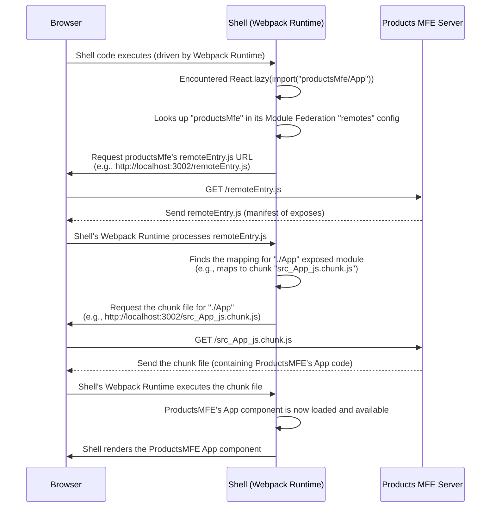

# Chapter 4: Webpack Module Federation Plugin

Welcome back to the `mfe-project` tutorial! In our journey so far, we've learned about:

- [Micro Frontends (MFEs)](01_micro_frontend__mfe__.md) as independent pieces of a larger application.
- The [Shell (Host) Application](02_shell__host__application_.md) as the orchestrator that loads and displays these pieces.
- [Remote Modules (Exposed Modules)](03_remote_module__exposed_module__.md) as the specific components or code snippets that an MFE makes available for others to use.

But how does the Shell actually _magically_ load the code for a Remote MFE's exposed module from a different development server or hosting location? This is where the star of this chapter comes in: the **Webpack Module Federation Plugin**.

## The Problem: How to Load Code from _Another_ App?

Imagine you have your Shell application running on `localhost:3000`, and your Products MFE running independently on `localhost:3002`. Your Shell's code needs to somehow say, "Go fetch the `App` component from the MFE running on `localhost:3002`."

In a traditional Webpack build, you can only `import` modules that are part of _your own_ project's build process. You can't just import code from an entirely separate, independently built and deployed application.

This is the core challenge that Webpack Module Federation was created to solve.

## The Solution: The Webpack Module Federation Plugin

The **Webpack Module Federation Plugin** is a powerful feature built into Webpack (specifically for Webpack 5 and later). It allows multiple independent Webpack builds to form a single application. It achieves this by enabling a Webpack build (the **Host** or **Shell**) to dynamically load code ("modules") from another independent Webpack build (the **Remote** or **MFE**) at runtime.

Think of it as setting up agreements between different applications:

- "I am called [MyName], and I'm offering these specific pieces of my code ([Exposed Modules])." (This is what a **Remote** MFE configures).
- "I need a piece of code called [ExposedModuleName] from the application called [RemoteName], which I can find at [Remote URL]." (This is what a **Host** MFE configures).

The Module Federation Plugin handles all the complex wiring behind the scenes to make this possible.

## Key Concepts & Configuration

The plugin is configured within the `plugins` section of your `webpack.config.js` file in _each_ MFE project (both the Shell and the Remotes). Let's look at the main options:

```javascript
// Inside webpack.config.js for any MFE
const ModuleFederationPlugin = require("webpack/lib/container/ModuleFederationPlugin");

// ... other webpack config ...

plugins: [
  new ModuleFederationPlugin({
    name: "...", // <--- This MFE's unique name
    filename: "remoteEntry.js", // <--- The manifest file name (common practice)
    remotes: {
      /* ... */
    }, // <--- What other MFEs this MFE will consume
    exposes: {
      /* ... */
    }, // <--- What parts of this MFE are available to others
    shared: {
      /* ... */
    }, // <--- Common libraries to share (more in Chapter 5!)
  }),
  // ... other plugins ...
];
```

Let's break down the most important options:

### 1. `name`

- **What it is:** This is the **unique name** for your MFE. Every MFE participating in module federation _must_ have a `name`.
- **Why it's needed:** This name is how other MFEs will refer to _your_ MFE when they want to load a module from it.
- **Example (from `user-profile-mfe/webpack.config.js`):**

```javascript
// From user-profile-mfe/webpack.config.js (simplified ModuleFederationPlugin part)
new ModuleFederationPlugin({
  name: "userProfileMfe", // This MFE's unique identity
  filename: "remoteEntry.js",
  exposes: {
    /* ... */
  },
  shared: {
    /* ... */
  },
});
```

The `user-profile-mfe` declares itself as `userProfileMfe`.

- **Example (from `shell/webpack.config.js`):**

```javascript
// From shell/webpack.config.js (simplified ModuleFederationPlugin part)
new ModuleFederationPlugin({
  name: "shell", // The Shell is also an MFE, needs a name
  filename: "remoteEntry.js", // It also publishes an entry file (though often doesn't expose modules)
  remotes: {
    /* ... */
  }, // It consumes other MFEs
  shared: {
    /* ... */
  },
});
```

The Shell declares itself as `shell`.

### 2. `exposes` (For Remote MFEs)

- **What it is:** An object where you list the modules (**Remote Modules**) from _your_ MFE that you want to make available for others to consume.
- **Why it's needed:** This is how a Remote MFE explicitly says, "Here are the pieces of my code you're allowed to take."
- **Structure:** Keys are the **public names** other MFEs will use, values are the **local paths** within _your_ project to the actual files.
- **Example (from `user-profile-mfe/webpack.config.js`):**

```javascript
// From user-profile-mfe/webpack.config.js (exposes part)
new ModuleFederationPlugin({
  name: "userProfileMfe",
  filename: "remoteEntry.js",
  exposes: {
    // Public name        : Local path to the file
    "./UserProfile": "./src/UserProfile", // Makes UserProfile component available as './UserProfile'
  },
  shared: {
    /* ... */
  },
});
```

The `userProfileMfe` exposes its main component `src/UserProfile.js` (or `.jsx`) under the public name `"./UserProfile"`.

- **Example (from `orders-mfe/webpack.config.js`):**

```javascript
// From orders-mfe/webpack.config.js (exposes part)
new ModuleFederationPlugin({
  name: "ordersMfe",
  filename: "remoteEntry.js",
  exposes: {
    "./App": "./src/App", // Exposing the main Orders App component
    "./CompletlyDifferentComp": "./src/CompletlyDifferentComp", // Exposing another component
  },
  shared: {
    /* ... */
  },
});
```

The `ordersMfe` exposes multiple components with different public names.

### 3. `remotes` (For Host/Consuming MFEs)

- **What it is:** An object where you list the **Remote MFEs** that _this_ MFE wants to consume modules from.
- **Why it's needed:** This tells Webpack where to find the `remoteEntry.js` file for each MFE you depend on.
- **Structure:** Keys are the **local alias** you'll use in your `import` statements, values are the **remote name** (matching the Remote MFE's `name`) followed by `@` and the **URL** of its `remoteEntry.js` file.
- **Example (from `products-mfe/webpack.config.js`, which consumes `userProfileMfe`):**

```javascript
// From products-mfe/webpack.config.js (remotes part)
const getRemoteUrl = (port, name) => {
  // ... logic to determine dev or prod URL ...
  return `http://localhost:${port}/remoteEntry.js`; // Example dev URL
};

new ModuleFederationPlugin({
  name: "productsMfe", // This MFE's name
  filename: "remoteEntry.js", // It also publishes its own entry file
  exposes: {
    /* ... */
  }, // It exposes its own components (like './App')
  remotes: {
    // Local alias     : RemoteName@RemoteEntryUrl
    userProfileMfe: `userProfileMfe@${getRemoteUrl(
      3004,
      "mfe/user-profile-mfe"
    )}`,
    // When we 'import' using 'userProfileMfe/...'
    // Webpack knows to look for the MFE named 'userProfileMfe'
    // at the URL provided by getRemoteUrl(3004, ...)
  },
  shared: {
    /* ... */
  },
});
```

The `products-mfe` uses the local alias `userProfileMfe` to refer to the Remote MFE named `userProfileMfe` located at `http://localhost:3004/remoteEntry.js` (during development).

- **Example (from `shell/webpack.config.js`, which consumes multiple MFEs):**

```javascript
// From shell/webpack.config.js (remotes part)
const getRemoteUrl = (port, name) => {
  // ... logic to determine dev or prod URL ...
  return `http://localhost:${port}/remoteEntry.js`; // Example dev URL
};

new ModuleFederationPlugin({
  name: "shell",
  filename: "remoteEntry.js",
  remotes: {
    headerMfe: `headerMfe@${getRemoteUrl(3001, "mfe/header-mfe")}`,
    natashaChatbotMfe: `natashaChatbotMfe@${getRemoteUrl(
      3006,
      "mfe/natasha-chatbot-mfe"
    )}`,
    productsMfe: `productsMfe@${getRemoteUrl(3002, "mfe/products-mfe")}`,
    ordersMfe: `ordersMfe@${getRemoteUrl(3003, "mfe/orders-mfe")}`,
    // Note: It doesn't list userProfileMfe here because productsMfe consumes it directly.
  },
  shared: {
    /* ... */
  },
});
```

The Shell defines local aliases for the MFEs it directly uses (`headerMfe`, `natashaChatbotMfe`, etc.) and provides the URL to their respective `remoteEntry.js` files.

### 4. `shared` (Optimization)

- **What it is:** A list of dependencies (like React, React-DOM) that participating MFEs agree to share.
- **Why it's needed:** To avoid loading multiple copies of the same large library if several MFEs use it. If MFEs share React, only one copy is loaded and used by everyone.
- **Details:** This is a crucial optimization. We will cover [Shared Dependencies](05_shared_dependencies_.md) in detail in the next chapter.

## How It Works Under the Hood

Let's revisit the process from [Chapter 3](03_remote_module__exposed_module__.md) with a focus on what the Module Federation Plugin enables.

Imagine the user navigates to `/products` in the browser, and the Shell needs to render the `ProductsMfe` component.



This sequence shows that the Module Federation Plugin essentially sets up a dynamic discovery and loading mechanism. The `remoteEntry.js` file acts as a manifest that tells the Host/Consumer which modules are available and how to fetch their corresponding code chunks from the Remote MFE's server. Webpack's runtime code, which is included in the built bundles, orchestrates this fetching and execution at the moment the dynamic `import()` is encountered.

## `filename: "remoteEntry.js"`

This configuration option (usually set to `"remoteEntry.js"`) tells Webpack to build a special file. This file doesn't contain your application's main code, but rather:

1.  Information about your MFE (its `name`).
2.  A list of the modules it `exposes`.
3.  Instructions on how a Host can load the actual code chunks for those exposed modules.

When a Host MFE requests `http://localhost:3002/remoteEntry.js`, it gets this manifest file, which allows its own Webpack runtime to understand what's available and how to get it.

## Putting It Together (Simplified Code)

Let's look at the bare minimum `webpack.config.js` for a simple Remote and a simple Host using the plugin.

**Simple Remote (`remote-mfe/webpack.config.js`):**

```javascript
// remote-mfe/webpack.config.js
const ModuleFederationPlugin = require("webpack/lib/container/ModuleFederationPlugin");

module.exports = {
  mode: "development", // Or production
  entry: "./src/index.js", // Entry for standalone mode

  output: {
    // ... output config ...
  },

  plugins: [
    new ModuleFederationPlugin({
      name: "remoteMfe", // <<-- Unique name
      filename: "remoteEntry.js", // <<-- Manifest file name
      exposes: {
        // <<-- What we offer to others
        "./Widget": "./src/Widget.js", // Exposing Widget component
      },
      shared: {
        react: { singleton: true, requiredVersion: "^17.0.2" },
        "react-dom": { singleton: true, requiredVersion: "^17.0.2" },
      },
    }),
    // ... html-webpack-plugin for standalone ...
  ],
  // ... module/rules etc. ...
};
```

This Remote MFE is called `remoteMfe` and exposes a component called `Widget`.

**Simple Host (`host-mfe/webpack.config.js`):**

```javascript
// host-mfe/webpack.config.js
const ModuleFederationPlugin = require("webpack/lib/container/ModuleFederationPlugin");

module.exports = {
  mode: "development", // Or production
  entry: "./src/index.js", // Host entry

  output: {
    // ... output config ...
  },

  plugins: [
    new ModuleFederationPlugin({
      name: "host", // <<-- Unique name
      filename: "remoteEntry.js", // <<-- It also has one, though might not expose
      remotes: {
        // <<-- Who we consume from
        remoteMfe: "remoteMfe@http://localhost:3001/remoteEntry.js",
        // Local alias : RemoteName@RemoteEntryUrl
        // We'll refer to the remoteMfe using the alias 'remoteMfe'
      },
      shared: {
        react: { singleton: true, requiredVersion: "^17.0.2" },
        "react-dom": { singleton: true, requiredVersion: "^17.0.2" },
      },
    }),
    // ... html-webpack-plugin ...
  ],
  // ... module/rules etc. ...
};
```

This Host MFE is called `host` and knows to find `remoteMfe` at `http://localhost:3001/remoteEntry.js`.

**Using the Remote Module in the Host (`host-mfe/src/App.js`):**

```javascript
// host-mfe/src/App.js
import React, { Suspense } from "react";

// Use React.lazy and dynamic import with the remote alias and exposed name
const RemoteWidget = React.lazy(() => import("remoteMfe/Widget"));
//                       alias^    ^exposed name

const App = () => {
  return (
    <div>
      <h1>This is the Host App</h1>
      <Suspense fallback={<div>Loading Remote Widget...</div>}>
        <RemoteWidget /> {/* Render the loaded component */}
      </Suspense>
    </div>
  );
};

export default App;
```

This code demonstrates how, thanks to the Webpack Module Federation Plugin configuration, you can use a seemingly normal `import` statement (`import('remoteMfe/Widget')`) to load a component whose code lives in a completely separate Webpack build (`remoteMfe`).

## Benefits Enabled by the Plugin

- **Runtime Code Loading:** Code isn't bundled together during the build; it's fetched when needed at runtime.
- **Independent Builds & Deployments:** Each MFE can be built and deployed separately, as long as its `remoteEntry.js` is accessible at the configured URL.
- **Code Sharing:** Makes sharing specific modules (components, hooks, utilities) between independent applications straightforward.
- **Shared Dependencies:** Crucial optimization to prevent duplicate code loading (more on this next!).

## Conclusion

The Webpack Module Federation Plugin is the engine that powers the Micro Frontend architecture in our `mfe-project`. By configuring `name`, `exposes`, and `remotes` in each MFE's Webpack config, we enable applications to share and consume code dynamically at runtime, breaking free from the limitations of traditional monolithic builds.

While `name`, `exposes`, and `remotes` allow the applications to find and load each other's code, handling common libraries like React efficiently across multiple independent builds is equally important. That's where the `shared` option comes in.

Let's dive into how [Shared Dependencies](05_shared_dependencies_.md) help optimize this process in the next chapter!

[Shared Dependencies](05_shared_dependencies_.md)
