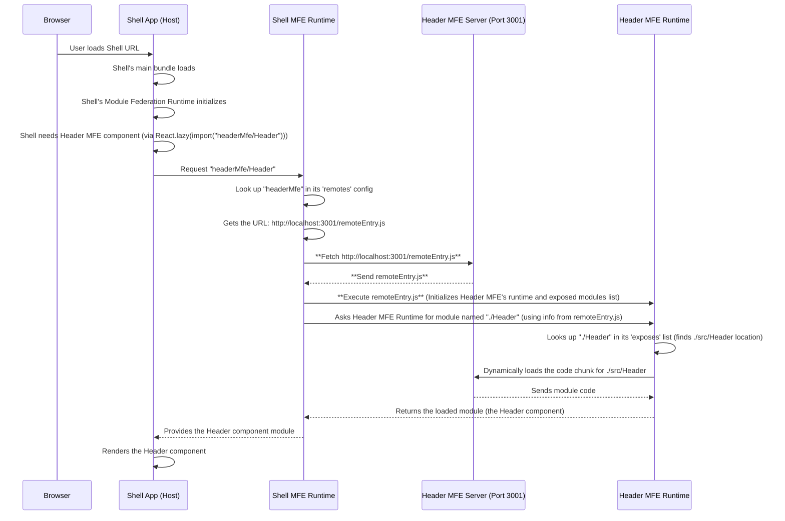

# Chapter 5: `remoteEntry.js`

Welcome back! In our journey through the `mfe-project`, we've introduced the main players: the [Shell Application (Host)](01_shell_application__host__.md) as the container and the [Micro Frontend (MFE)](02_micro_frontend__mfe__.md) as the independent building block. We then saw how [Webpack Module Federation](03_webpack_module_federation_.md) acts as the system allowing them to interact dynamically. In [Chapter 4: Remote Micro Frontend (Exposed Module)](04_remote_micro_frontend__exposed_module__.md), we focused on how an MFE uses the `exposes` config to declare what it makes available.

Now, we need to understand the crucial piece that connects these concepts: the `remoteEntry.js` file.

### What Problem Does `remoteEntry.js` Solve?

Imagine our shopping mall again. The Shell is the mall building. Each MFE is a store inside. The Shell knows it needs a "Header" component from the "Header Store" (`headerMfe`), but how does the Shell _find_ the Header Store within the vast mall and know _exactly_ where to get its "Header" component?

This is where `remoteEntry.js` comes in. For each MFE that wants to share its code, `remoteEntry.js` acts like the store's **public directory or catalog**.

- It tells the Shell (or any other consuming application) its official name (`headerMfe`).
- It lists everything this MFE offers to the outside world (`exposes`).
- It provides the mechanism for the Shell to request and load the specific code for an exposed module (like the `Header`).

It's the essential handshake file that allows the Shell to discover and load capabilities provided by a remote MFE.

### What is `remoteEntry.js`?

`remoteEntry.js` is a **small JavaScript file** automatically generated by Webpack Module Federation when you build a Micro Frontend that exposes modules.

- It's the **entry point** for any other application wanting to consume code from this MFE.
- It contains the necessary Webpack runtime code to manage module loading and sharing _for that specific MFE_.
- It acts as a **manifest or directory**, mapping the public names you defined in `exposes` (like `"./Header"`) to the actual code chunks or files within the MFE's build output.

When the Shell loads an MFE, the _very first thing_ it fetches from that MFE's server is this `remoteEntry.js` file.

### How is `remoteEntry.js` Generated?

This file is created because of the configuration you put in the MFE's `webpack.config.js` file, specifically within the `ModuleFederationPlugin`.

Let's look at the `header-mfe/webpack.config.js` file again:

```javascript
// header-mfe/webpack.config.js (Simplified)
const ModuleFederationPlugin = require("webpack/lib/container/ModuleFederationPlugin");

module.exports = {
  // ... other Webpack config ...
  plugins: [
    new ModuleFederationPlugin({
      name: "headerMfe", // The unique name of THIS MFE
      filename: "remoteEntry.js", // <-- THIS line tells Webpack to generate the file
      exposes: {
        "./Header": "./src/Header", // What's listed IN the file
      },
      // ... shared config ...
    }),
    // ... other plugins ...
  ],
  // ... other Webpack config ...
};
```

**Explanation:**

- `name: 'headerMfe'`: As we learned, this gives the MFE its unique identity.
- `filename: 'remoteEntry.js'`: This is the line that instructs Webpack Module Federation to create a file named `remoteEntry.js` in the build output directory (`dist`). This name is conventional and widely used, but you _could_ technically name it something else if needed (though sticking to `remoteEntry.js` is highly recommended).
- `exposes: { ... }`: The contents of this `exposes` object determine _what information goes into_ the `remoteEntry.js` file regarding available modules.

Webpack looks at the `name` and `exposes` config for the MFE and bundles this information into the `remoteEntry.js` file during the MFE's build process.

You'll find this line (`filename: 'remoteEntry.js'`) in the `ModuleFederationPlugin` config for any MFE that exposes modules in our project, like `products-mfe`, `orders-mfe`, and `user-profile-mfe`.

### What's Inside `remoteEntry.js` (Conceptually)?

The actual generated `remoteEntry.js` file is Webpack-generated code and can look complex. **You generally don't need to read or understand the internal code of `remoteEntry.js`**. Its purpose is for the Module Federation runtime to use.

Conceptually, the `remoteEntry.js` file does a few key things when executed by a host application:

1.  **Initializes the Remote:** It sets up the necessary environment for the remote MFE's code to run within the host's context.
2.  **Registers Itself:** It registers its existence and its unique `name` (e.g., `"headerMfe"`) with the host's Module Federation runtime.
3.  **Publishes its Catalog:** It provides the host's runtime with the mapping defined in its `exposes` config. For example, it tells the host, "If you ask for `./Header`, the code is located over here (and points to the actual bundle chunk)."
4.  **Handles Shared Modules:** It includes logic to interact with the host regarding [Shared Modules/Libraries](06_shared_modules_libraries_.md), checking if a compatible version is already loaded and using it if possible.

Think of it as the receptionist at the Header Store's front desk. When the Shell building's manager (Shell Runtime) arrives, the receptionist (`remoteEntry.js`) greets them, confirms this is the "Header Store" (matches `name`), gives them a map (`exposes`) of where to find publicly available items (like the `"./Header"` component), and explains the store's policy on using shared mall resources (like React).

### How the Shell Uses `remoteEntry.js`

We saw in [Chapter 1: Shell Application (Host)](01_shell_application__host__.md) that the Shell's `webpack.config.js` includes the location of the `remoteEntry.js` files in its `remotes` config:

```javascript
// shell/webpack.config.js (Simplified remotes)
const getRemoteUrl = (port, name) => {
  // ... logic to determine URL ...
  return `http://localhost:${port}/remoteEntry.js`; // The crucial part!
};

new ModuleFederationPlugin({
  name: "shell",
  remotes: {
    headerMfe: `headerMfe@${getRemoteUrl(3001, "mfe/header-mfe")}`, // Points to remoteEntry.js
    productsMfe: `productsMfe@${getRemoteUrl(3002, "mfe/products-mfe")}`, // Points to remoteEntry.js
    // ... others ...
  },
  // ... shared ...
}),
```

**Explanation:**

- `headerMfe: "headerMfe@http://localhost:3001/remoteEntry.js"`: This line tells the Shell's Webpack runtime: "To find the application named `headerMfe`, go to `http://localhost:3001` and first load the file named `remoteEntry.js`."

When the Shell application runs in the browser and needs to load a component from `headerMfe` (like `import("headerMfe/Header")`), its Module Federation runtime follows these steps:

1.  Looks up `"headerMfe"` in its `remotes` configuration.
2.  Finds the URL `http://localhost:3001/remoteEntry.js`.
3.  Makes a network request to download the `remoteEntry.js` file from the `header-mfe`'s server.
4.  Executes the downloaded `remoteEntry.js` script. This registers the `headerMfe` with the Shell's runtime and makes its exposed modules known.
5.  Now, when the Shell needs the specific module `"./Header"`, its runtime knows (from the just-executed `remoteEntry.js`) where to find the actual code for that module within the `headerMfe`'s build output and dynamically fetches it.

This dynamic loading of `remoteEntry.js` at runtime is key to Module Federation. It allows the Shell to connect to an MFE _after_ both have been deployed independently.

### How it Works: The Role of `remoteEntry.js` in Loading

Let's visualize the loading process again, highlighting where `remoteEntry.js` fits in:



The `remoteEntry.js` file is the crucial middle step that allows the Shell's runtime to connect with the remote MFE's runtime and understand its capabilities (its exposed modules) before requesting specific code.

### Why is `remoteEntry.js` Important?

- **Discovery:** It's how a host application discovers what modules a remote MFE exposes.
- **Connection:** It establishes the communication channel between the host's and the remote's Module Federation runtimes.
- **Flexibility:** Because the host fetches `remoteEntry.js` at runtime based on the URL in its `remotes` config, you can update the remote MFE and deploy a new version of its `remoteEntry.js` and associated code chunks without needing to touch or redeploy the host application. This is fundamental to achieving independent deployments.

It's the public face and directory of each Micro Frontend, enabling the dynamic composition of the application.

### Conclusion

In this chapter, we demystified the `remoteEntry.js` file. We learned that it's automatically generated by Webpack Module Federation for any MFE that exposes modules, acting as its public directory or manifest. The Shell application uses its `remotes` configuration to find the URL of an MFE's `remoteEntry.js`, fetches and executes it at runtime, which allows the Shell's Module Federation runtime to discover and subsequently load the specific modules exposed by that MFE.

Understanding `remoteEntry.js` is key to understanding how the dynamic connections between your independent Micro Frontends are established.

Now that we know how MFEs expose and hosts consume modules, let's look at how they efficiently share common libraries like React to keep things performant and avoid conflicts.

[Shared Modules/Libraries](06_shared_modules_libraries_.md)
