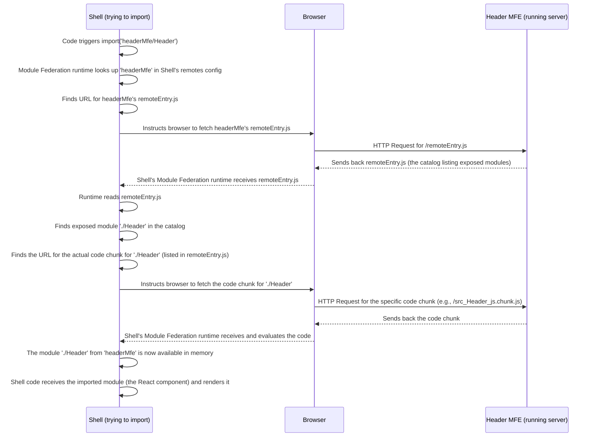

# Chapter 5: Exposed Modules

Welcome back to the `mfe-project` tutorial! In the previous chapter, [Chapter 4: Remotes Configuration](04_remotes_configuration_.md), we learned how a Shell application (or any MFE wanting to consume code) lists the other MFEs it _might_ need to load by configuring `remotes` in its `webpack.config.js`. This is like the mall manager having a directory of all the stores in the mall.

But just knowing where a store is isn't enough to buy something from it. The store also needs to decide _what_ specific items it wants to sell to customers or even make available for other stores to use (like a bakery selling bread to a sandwich shop).

In Micro Frontend architecture with Webpack Module Federation, this is the role of **Exposed Modules**.

## What are Exposed Modules?

**Exposed Modules** are specific pieces of code (like components, functions, or even entire applications) _within_ a Micro Frontend that that MFE explicitly decides to make available for _other_ MFEs (like the Shell or other remotes) to import and use.

Think of a store (our MFE, say the `header-mfe`). It has lots of code inside: its own internal components, utility functions, styles, etc. But it might only want to share one specific thing with the outside world: its main `Header` component.

Exposing a module is like the store putting that `Header` component on a special display shelf right by its entrance and saying, "Anyone who comes to my store can take _this specific item_ (the Header component) and use it."

Only modules listed in the `exposes` configuration can be loaded dynamically by other MFEs using Webpack Module Federation. Everything else inside that MFE remains private and inaccessible from the outside.

## How to Configure Exposed Modules (`webpack.config.js`)

An MFE makes its modules available by adding an `exposes` object to the `ModuleFederationPlugin` configuration in its `webpack.config.js` file.

The `exposes` configuration is an object where:

- **The keys** are the _public names_ you give to the exposed modules. These are the names that other MFEs will use when they try to import the module. These names often start with `./` by convention, making them look like file paths relative to the remote MFE's root.
- **The values** are the _actual file paths_ within your MFE project that point to the code you want to expose. These paths are relative to the root of the MFE project.

Let's look at the `header-mfe`'s `webpack.config.js` to see this in action. We saw this snippet in [Chapter 1](01_webpack_module_federation_.md) and [Chapter 2](02_micro_frontend__mfe_.md), but now we'll focus specifically on the `exposes` part:

```javascript
// --- File: header-mfe/webpack.config.js (Snippet) ---
const ModuleFederationPlugin = require("webpack/lib/container/ModuleFederationPlugin");

module.exports = {
  // ... other webpack settings ...
  plugins: [
    new ModuleFederationPlugin({
      name: "headerMfe", // This MFE's unique name (used by consumers in their 'remotes')
      filename: "remoteEntry.js", // The name of the catalog file
      exposes: {
        // --- THIS IS THE EXPOSES CONFIG ---
        // 'Public Name': 'Path to the actual code file'
        "./Header": "./src/Header",
      },
      shared: {
        // ... libraries shared by this MFE (Chapter 6) ...
      },
    }),
    // ... other plugins ...
  ],
  // ... other webpack settings ...
};
```

In this example:

- `name: 'headerMfe'` is the unique name of this MFE. Consumers will use this name in their `remotes` configuration (e.g., `shell/webpack.config.js` has `headerMfe: 'headerMfe@...'`).
- `exposes: { './Header': './src/Header' }` is the important part here.
  - `'./Header'`: This is the _public name_ we've chosen for the Header component. When another MFE wants to import this component, it will refer to it using this name.
  - `'./src/Header'`: This is the actual file path _inside the `header-mfe` project_ where the code for the Header component lives (`src/Header.js` or `src/Header.jsx`).

This line tells Webpack, "When you build `header-mfe`, make the code from `./src/Header` available under the public name `./Header` in the `remoteEntry.js` catalog file."

## Connecting `remotes` and `exposes`

Now let's see how the Shell (or any consuming MFE) uses this. Back in the Shell's code (`shell/src/App.js`), we used this import syntax:

```javascript
// --- File: shell/src/App.js (Snippet) ---
// ... other imports ...

// Lazy load MFE components/apps using the names defined in remotes and exposes
// The format is 'localRemoteName/ExposedModuleName'
const HeaderMfe = React.lazy(() => import('headerMfe/Header'));
// ... other lazy imports ...

function App() {
  return (
    <div className="app">
      {/* ... layout ... */}
      <Suspense fallback={/* ... loading */}>
        <HeaderMfe /> {/* Using the imported component */}
      </Suspense>
      {/* ... rest of the app ... */}
    </div>
  );
}
// ...
```

Look closely at the `import('headerMfe/Header')` part:

- `headerMfe`: This matches the **local name** we defined in the Shell's `remotes` configuration ([Chapter 4](04_remotes_configuration_.md)) for the Header MFE. This tells Webpack _which remote MFE_ to look at.
- `/Header`: This matches the **public name** (`./Header`) that the Header MFE defined in its `exposes` configuration. This tells Webpack _which specific module_ from that remote MFE to load.

Webpack combines these two names with a slash (`/`) to create the unique path used in the import statement.

So, the chain of connection is:

1.  Shell's `remotes` config maps `headerMfe` to `headerMfe@http://localhost:3001/remoteEntry.js`.
2.  Shell's code uses `import('headerMfe/Header')`.
3.  Webpack Module Federation runtime in the Shell looks up `headerMfe` in its `remotes`.
4.  It fetches `remoteEntry.js` from `http://localhost:3001`.
5.  It reads the `remoteEntry.js` catalog provided by the remote MFE named `headerMfe`.
6.  It looks in the catalog for an exposed module with the public name `./Header`.
7.  If found, it fetches the actual code for that module and makes it available for the Shell to use as the `HeaderMfe` component.

## What Happens Under the Hood (Simplified)

When you build an MFE that has an `exposes` configuration:

1.  Webpack processes your application's code.
2.  It bundles the specific files you listed in the `exposes` object (e.g., `./src/Header` for `header-mfe`) into separate JavaScript chunks.
3.  It generates the `remoteEntry.js` file (based on the `filename` you specified).
4.  The `remoteEntry.js` file contains metadata:
    - The `name` of the remote MFE (`headerMfe`).
    - A list of the **public names** of the modules being exposed (`./Header`).
    - Instructions and URLs for how a consumer can download the specific code chunks corresponding to those public names.

When a consumer (like the Shell) tries to dynamically `import('headerMfe/Header')`:



So, the `exposes` configuration is how an MFE advertises _what_ it has to offer, and the `remoteEntry.js` is the physical catalog that holds this advertisement along with the instructions for picking up the items.

## `Exposes` in Other MFEs in `mfe-project`

Let's look at the `exposes` configurations in some other MFEs in our project:

From `products-mfe/webpack.config.js`:

```javascript
// --- File: products-mfe/webpack.config.js (Snippet) ---
// ... imports ...
const ModuleFederationPlugin = require('webpack/lib/container/ModuleFederationPlugin');
// ... config ...
plugins: [
  new ModuleFederationPlugin({
    name: "productsMfe",
    filename: "remoteEntry.js",
    exposes: {
      // We expose the main App component as './App'
      "./App": "./src/App",
    },
    remotes: {
      // ... This MFE also consumes others (userProfileMfe) ...
    },
    shared: { /* ... */ },
  }),
  // ... other plugins ...
],
// ... rest of config ...
```

Here, `productsMfe` exposes its entire main `App` component under the public name `./App`. The Shell ([Chapter 3](03_shell__host__application_.md)) uses `import('productsMfe/App')` to load and render this MFE as a full page. Notice that `productsMfe` also has a `remotes` section because it _consumes_ another MFE (`userProfileMfe`). MFEs can be both _hosts_ (consuming others) and _remotes_ (being consumed by others) simultaneously!

From `orders-mfe/webpack.config.js`:

```javascript
// --- File: orders-mfe/webpack.config.js (Snippet) ---
// ... imports ...
const ModuleFederationPlugin = require('webpack/lib/container/ModuleFederationPlugin');
// ... config ...
plugins: [
  new ModuleFederationPlugin({
    name: 'ordersMfe',
    filename: 'remoteEntry.js',
    exposes: {
      // Orders MFE exposes its main App component
      './App': './src/App'
    },
    shared: { /* ... */ },
  }),
  // ... other plugins ...
],
// ... rest of config ...
```

Similarly, `ordersMfe` exposes its main `App` component as `./App` for the Shell to consume via `import('ordersMfe/App')`.

From `user-profile-mfe/webpack.config.js`:

```javascript
// --- File: user-profile-mfe/webpack.config.js (Snippet) ---
// ... imports ...
const ModuleFederationPlugin = require('webpack/lib/container/ModuleFederationPlugin');
// ... config ...
plugins: [
  new ModuleFederationPlugin({
    name: 'userProfileMfe',
    filename: 'remoteEntry.js',
    exposes: {
      // User Profile MFE exposes just the UserProfile component
      './UserProfile': './src/UserProfile'
    },
    shared: { /* ... */ },
  }),
  // ... other plugins ...
],
// ... rest of config ...
```

The `userProfileMfe` exposes its `UserProfile` component as `./UserProfile`. This MFE is consumed by the `products-mfe` (see `products-mfe/webpack.config.js` `remotes` section) which uses `import('userProfileMfe/UserProfile')` to show a user profile card within the Products MFE page.

In all these cases, the `exposes` configuration is the explicit declaration of _what_ parts of this independent MFE are intended for public use by other applications in the federation.

## Conclusion

**Exposed Modules** are the pieces of code that a Micro Frontend explicitly makes available for other applications to consume. This is configured using the `exposes` option in the MFE's `ModuleFederationPlugin` setup in `webpack.config.js`. An MFE lists public names for the modules it wants to expose, mapping them to the actual file paths within its project.

Together with the `remotes` configuration in the consuming application ([Chapter 4: Remotes Configuration](04_remotes_configuration_.md)), `exposes` forms the core mechanism by which Webpack Module Federation allows independent applications to import and use code from each other dynamically at runtime. The `remoteEntry.js` file acts as the public catalog listing these exposed modules and providing the means to load them.

Now that we understand how MFEs declare what they can share (`exposes`) and how hosts declare where to find remotes (`remotes`), we need to address a crucial aspect of performance and consistency: how to handle shared libraries like React. Loading React multiple times (once for the Shell, once for Header MFE, once for Products MFE, etc.) would be inefficient.

In the next chapter, we'll explore **Shared Dependencies**, which allows multiple MFEs to agree on using a single version of common libraries.

[Next Chapter: Shared Dependencies](06_shared_dependencies_.md)
