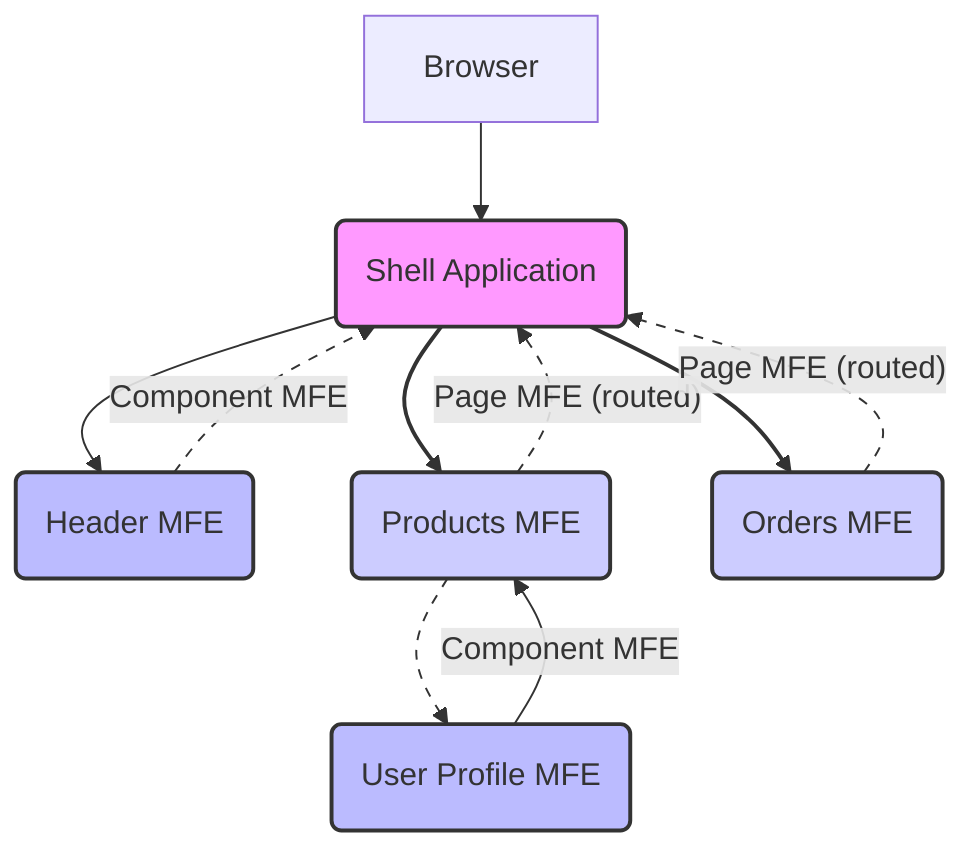

# Chapter 5: Page MFEs vs. Component MFEs

Welcome back to our MFE learning project! In the last chapter, [Chapter 4: Standalone vs. Integrated Modes (Bootstrap)](04_standalone_vs__integrated_modes__bootstrap__.md), we learned how each MFE is structured to run both independently and when loaded by the Shell, thanks to the `index.js` and `bootstrap.js` pattern.

Now, let's look at _what kind_ of functionality each MFE typically provides and how that influences its design and how the Shell uses it. Not all MFEs are created equal! Some represent a large portion of the application's user interface, while others are smaller, reusable pieces.

This project categorizes MFEs into two main types based on their purpose and size: **Page MFEs** and **Component MFEs**. Understanding this distinction helps organize our architecture, makes development clearer, and dictates how the Shell application integrates them.

Think about our shopping mall analogy again:

- Some shops are large **department stores** (like Macy's or Nordstrom). You go _to_ the department store to browse specific sections like Electronics, Clothing, or Home Goods. They take up a lot of space and often have their own internal layout.
- Other shops are smaller, specialized stores or **kiosks** (like a coffee stand, a phone repair kiosk, or a specific brand's small shop). You encounter these as you walk through the mall's common areas or even _within_ a larger store. They are smaller and designed to be placed in various locations.

In our Micro Frontend architecture:

- **Page MFEs** are like the department stores. They represent a significant section or a full "page" of the application.
- **Component MFEs** are like the kiosks or smaller shops. They are smaller, reusable UI pieces that can be placed in different parts of the Shell or even within other MFEs.

Let's explore each type.

## Page MFEs: Full Sections of the Application

**What they are:**

- Represent a major section or a primary "page" in the application (e.g., Products listing, User Orders, Admin Dashboard).
- Typically loaded by the Shell application when the user navigates to a specific route (like `/products` or `/orders`).
- Often manage complex state and may include their own internal routing within their section (e.g., `/products/list` vs `/products/detail/:id`).

**In our project:**

- `products-mfe`: This handles displaying all products, potentially product details, etc. It's accessed via the `/products` route.
- `orders-mfe`: This handles displaying user orders and order details. It's accessed via the `/orders` route.

**How the Shell uses them:**
The Shell application (`shell/src/App.js`) imports Page MFEs and renders them within specific routes defined by `react-router-dom`.

Look at the `shell/src/App.js` snippet:

```jsx
// File: shell/src/App.js (simplified)
import React, { Suspense } from "react";
import { Routes, Route } from "react-router-dom";

// Lazy load Page MFEs
const ProductsMfe = React.lazy(() => import("productsMfe/App")); // Page MFE
const OrdersMfe = React.lazy(() => import("ordersMfe/App")); // Page MFE

const AppContent = () => {
  return (
    <div className="app">
      {/* ... Header MFE or other layout */}

      <main>
        <Routes>
          {/* Route for Products Page MFE */}
          <Route
            path="/products/*" // * allows internal routing within the MFE
            element={
              <Suspense fallback={<div>Loading Products Page...</div>}>
                <ProductsMfe /> {/* Render the entire Products MFE App */}
              </Suspense>
            }
          />

          {/* Route for Orders Page MFE */}
          <Route
            path="/orders/*" // * allows internal routing within the MFE
            element={
              <Suspense fallback={<div>Loading Orders Page...</div>}>
                <OrdersMfe /> {/* Render the entire Orders MFE App */}
              </Suspense>
            }
          />
        </Routes>
      </main>
      {/* ... Footer */}
    </div>
  );
};
// ... rest of App component
```

In this snippet:

- `ProductsMfe` and `OrdersMfe` are imported using `React.lazy` and the special Module Federation import paths (`"productsMfe/App"`, `"ordersMfe/App"`).
- They are rendered within `<Route>` components. The `path="/products/*"` tells React Router that any route starting with `/products` should render the `ProductsMfe`. The `*` is important because Page MFEs often handle sub-routes internally (e.g., `/products/123` for a detail page).
- The `Suspense` fallback provides a loading indicator while the MFE's code is being fetched.

**How they are exposed (Webpack Config):**
A Page MFE typically exposes its main application component (often named `App` or `Page`) which contains its layout and internal routing.

Example from `products-mfe/webpack.config.js`:

```javascript
// File: products-mfe/webpack.config.js (simplified)
const ModuleFederationPlugin = require("webpack/lib/container/ModuleFederationPlugin");

module.exports = {
  plugins: [
    new ModuleFederationPlugin({
      name: "productsMfe",
      filename: "remoteEntry.js",
      exposes: {
        // Expose the main App component for the Shell (or others) to use
        "./App": "./src/App",
      },
      // ... other configs (remotes, shared)
    }),
    // ... other plugins
  ],
  // ...
};
```

Here, the `productsMfe` exposes its `./src/App.js` file under the public key `"./App"`. The Shell then imports `"productsMfe/App"` to get this component.

## Component MFEs: Reusable UI Pieces

**What they are:**

- Smaller, focused, reusable components or pieces of functionality.
- Do not represent a whole page or major application section.
- Can be embedded in the Shell's layout or within other MFEs (both Page and other Component MFEs).
- Typically do not handle application-level routing themselves, although they might respond to route changes or navigation events.

**In our project:**

- `header-mfe`: The navigation header that appears on every page.
- `user-profile-mfe`: A component that displays user profile information. This MFE is even consumed _by_ another MFE (`products-mfe`).

**How the Shell uses them:**
The Shell application imports Component MFEs and renders them directly into its main layout, often outside of the routed content area.

Look at the `shell/src/App.js` snippet again, focusing on the Header MFE:

```jsx
// File: shell/src/App.js (simplified)
import React, { Suspense } from "react";
import { Routes, Route } from "react-router-dom";

// Lazy load Component MFE
const HeaderMfe = React.lazy(() => import("headerMfe/Header")); // Component MFE

const AppContent = () => {
  return (
    <div className="app">
      {/* Header MFE - rendered directly, not inside a Route */}
      <Suspense fallback={<div>Loading Header...</div>}>
        <HeaderMfe /> {/* Render the Header Component MFE */}
      </Suspense>

      {/* Main Content - where Page MFEs are rendered */}
      <main>
        <Routes>{/* ... Routes for Page MFEs */}</Routes>
      </main>
      {/* ... Footer */}
    </div>
  );
};
// ... rest of App component
```

In this snippet:

- `HeaderMfe` is imported using `React.lazy` and `"headerMfe/Header"`.
- It's rendered directly within the main `div` with the class `app`, outside the `<main>` section that contains the routes. This is because the Header is part of the Shell's overall layout, not tied to a specific page route.

**How Other MFEs can use them:**
Component MFEs are reusable! The Products MFE (`products-mfe`) consumes the User Profile MFE (`user-profile-mfe`) to display profile information within its own page.

Look at the `products-mfe/src/App.js` snippet:

```jsx
// File: products-mfe/src/App.js (simplified)
import React, { Suspense, useState } from "react";
// ... other imports

// Import User Profile MFE (a Component MFE)
const UserProfileMfe = React.lazy(() => import("userProfileMfe/UserProfile"));

const App = () => {
  const [showProfile, setShowProfile] = useState(false);
  const [user, setUser] = useState(null); // User state, potentially from shared context

  // ... useEffect to get/update user

  return (
    <div className="products-mfe">
      {/* ... Products MFE's own header/layout */}

      {/* Button to show/hide the embedded User Profile MFE */}
      <button onClick={() => setShowProfile(!showProfile)}>
        View Profile (from User Profile MFE)
      </button>

      {/* Conditionally render the embedded User Profile MFE */}
      {showProfile && (
        <div style={{ border: "1px solid blue", padding: "10px" }}>
          <h3>👤 Embedded User Profile:</h3>
          <Suspense fallback={<div>Loading User Profile MFE...</div>}>
            {/* Render the imported Component MFE */}
            <UserProfileMfe user={user} /> {/* Pass data via props */}
          </Suspense>
        </div>
      )}

      {/* ... Products MFE's main content and routes */}
    </div>
  );
};
// ... export
```

In this snippet from the Products MFE:

- It imports `UserProfileMfe` from `"userProfileMfe/UserProfile"`.
- It renders `<UserProfileMfe user={user} />` directly within its own JSX. It treats the User Profile MFE just like any other React component, passing data down via props (`user={user}`).
- The User Profile MFE is rendered _inside_ the Products MFE's layout, not controlling the main page route.

This demonstrates the reusability of Component MFEs – they aren't limited to being used only by the Shell; they can be embedded anywhere within the MFE federation where their functionality is needed.

**How they are exposed (Webpack Config):**
A Component MFE exposes the specific component(s) it wants to make reusable.

Example from `header-mfe/webpack.config.js`:

```javascript
// File: header-mfe/webpack.config.js (simplified)
const ModuleFederationPlugin = require("webpack/lib/container/ModuleFederationPlugin");

module.exports = {
  plugins: [
    new ModuleFederationPlugin({
      name: "headerMfe",
      filename: "remoteEntry.js",
      exposes: {
        // Expose the specific Header component
        "./Header": "./src/Header",
      },
      // ... other configs (shared)
    }),
    // ... other plugins
  ],
  // ...
};
```

Example from `user-profile-mfe/webpack.config.js`:

```javascript
// File: user-profile-mfe/webpack.config.js (simplified)
const ModuleFederationPlugin = require("webpack/lib/container/ModuleFederationPlugin");

module.exports = {
  plugins: [
    new ModuleFederationPlugin({
      name: "userProfileMfe",
      filename: "remoteEntry.js",
      exposes: {
        // Expose the specific UserProfile component
        "./UserProfile": "./src/UserProfile",
      },
      // ... other configs (shared)
    }),
    // ... other plugins
  ],
  // ...
};
```

Both Component MFEs expose a single, specific component (`./Header` or `./UserProfile`) via their `exposes` configuration, rather than an entire `App` component that includes layout and routing.

## Visualizing the Structure

Here's a simple diagram showing how the Shell loads different types of MFEs and how one MFE can load another:



- The **Shell** is the central orchestrator.
- It loads **Component MFEs** like the Header directly into its layout (dashed line, indicating embedding).
- It loads **Page MFEs** like Products and Orders based on routes, effectively handing over the main content area to that MFE (solid line, indicating routing).
- A **Page MFE** (like Products) can also load and embed a **Component MFE** (like User Profile) within its own layout (dashed line).

This hierarchical structure, where the Shell orchestrates Page and Component MFEs, and Page MFEs can in turn use Component MFEs, is a common and powerful pattern in Micro Frontend architectures.

## Why is this Distinction Important?

1.  **Organization:** It provides a clear mental model for developers about the purpose and expected behavior of each MFE.
2.  **Reusability:** Component MFEs are explicitly designed to be embedded anywhere they are needed, promoting code reuse.
3.  **Development Focus:** Teams working on a Page MFE can focus on the end-to-end user flow for that section, while teams on a Component MFE can focus on building a robust, reusable piece that works in different contexts.
4.  **Deployment:** While all MFEs are independently deployable, you might update a small Component MFE more frequently than a large Page MFE or the Shell.

By classifying our MFEs this way, we make the overall application architecture easier to understand, manage, and scale.

## Conclusion

In this chapter, we explored the distinction between **Page MFEs** and **Component MFEs** in our project. We learned that Page MFEs represent full sections or pages loaded via routes by the Shell (like Products and Orders), while Component MFEs are smaller, reusable pieces embedded within the Shell or other MFEs (like the Header and User Profile).

We saw how the Shell's routing and rendering logic in `shell/src/App.js` differs for each type and how this distinction is reflected in the `exposes` configuration of their `webpack.config.js` files. This classification helps us organize the project and think about how these independent pieces fit together.

Now that we understand the different types of MFEs and how they are loaded, let's look at how they can communicate with each other, even though they are independent applications running in the same browser. This leads us to the concept of an Event Bus.

[Chapter 6: Event Bus (window.mfeEventBus)](06_event_bus__window_mfeeventbus__.md)
