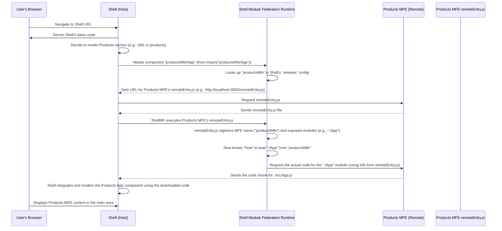

# Chapter 5: Remote Module (Exposed Component/App)

Welcome back to the `mfe-project` tutorial! In our journey through Micro Frontends, we've covered the **[Micro Frontend (MFE)](01_micro_frontend__mfe__.md)** itself (the independent shop), the **[Shell (Host Application)](02_shell__host_application__.md)** that houses everything (the mall), **[Webpack Module Federation](03_webpack_module_federation_.md)** as the enabling technology (the mall infrastructure), and the **[Remote Entry File](04_remote_entry_file_.md)** (the directory for each shop).

Now, let's talk about the most exciting part from the Shell's perspective: **What specific "products" or "services" can it get from the Remote MFEs?** This is where the concept of the **Remote Module (Exposed Component/App)** comes in.

## What is a Remote Module?

Imagine our Shell application (the mall) has found the Products MFE (the Products Shop) using its `remoteEntry.js` file (the shop directory). But the Shell doesn't want _everything_ from the Products MFE; it just needs the main component that displays the list of products, or perhaps a specific button component that the Products MFE developed and wants to share.

A **Remote Module** is a specific piece of code – typically a React Component or a JavaScript module – that a Micro Frontend (the Remote) explicitly decides to make available for other applications (Hosts) to use.

**Think of a Remote Module as the specific item on the shop's shelves that the mall (Shell) or another shop might want to put on display or use.**

In our `mfe-project`:

- The `header-mfe` exposes its `Header` component.
- The `products-mfe` exposes its main `App` component (which represents the entire products page/section).
- The `orders-mfe` exposes its main `App` component (representing the orders page/section).
- The `user-profile-mfe` exposes its `UserProfile` component.

These are the "remote modules" that the Shell application can load and render.

## How Does an MFE "Expose" a Module?

An MFE tells the world what modules it offers using the `exposes` property within its `ModuleFederationPlugin` configuration in `webpack.config.js`.

Let's look at the `user-profile-mfe` as an example. It wants to share its `UserProfile.js` component:

```javascript
// user-profile-mfe/webpack.config.js (Simplified exposes)
const ModuleFederationPlugin = require("webpack/lib/container/ModuleFederationPlugin");

module.exports = {
  // ... other config
  plugins: [
    new ModuleFederationPlugin({
      name: "userProfileMfe", // The MFE's name
      filename: "remoteEntry.js", // The directory file
      exposes: {
        // <-- This is where modules are exposed!
        "./UserProfile": "./src/UserProfile", // <--- External name: Internal path
      },
      shared: {
        /* ... */
      },
    }),
    // ... other plugins
  ],
};
```

**Explanation:**

- `exposes`: This is an object where each key-value pair defines one exposed module.
- `'./UserProfile'`: This is the **external name** or alias that other applications (like the Shell or potentially `products-mfe` which consumes it) will use to refer to this module when importing it. The leading `./` is a common convention, indicating it's a module _within_ the remote.
- `'./src/UserProfile'`: This is the **internal path** within the `user-profile-mfe` project that points to the actual file being exposed. This is usually the main file that exports the Component or module you want to share.

When Webpack builds the `user-profile-mfe`, it processes this `exposes` configuration. It ensures that the `remoteEntry.js` file knows how to provide the code located at `./src/UserProfile` whenever a consumer asks for the module named `'./UserProfile'`.

Other MFEs expose their main `App` components similarly:

```javascript
// products-mfe/webpack.config.js (Simplified exposes)
new ModuleFederationPlugin({
  name: 'productsMfe',
  filename: 'remoteEntry.js',
  exposes: {
    './App': './src/App' // Exposing the main App component
  },
  remotes: { /* ... */ }, // Products MFE is also a consumer
  shared: { /* ... */ }
}),
```

```javascript
// header-mfe/webpack.config.js (Simplified exposes)
new ModuleFederationPlugin({
  name: 'headerMfe',
  filename: 'remoteEntry.js',
  exposes: {
    './Header': './src/Header' // Exposing the Header component
  },
  shared: { /* ... */ }
}),
```

## How Does a Host "Consume" a Remote Module?

Once an MFE has exposed its modules, the Host application (like the Shell) can import and use them just like regular modules, but with a special syntax that Webpack Module Federation understands.

In the Shell's code (`shell/src/App.js`), it imports these remote modules using `React.lazy` and the Module Federation import string:

```jsx
// shell/src/App.js (Simplified imports)
import React, { Suspense, useContext } from "react";
// ... other imports

// Lazy load MFE components using the Module Federation syntax
// Format: "remoteAlias/exposedName"
const HeaderMfe = React.lazy(() => import("headerMfe/Header")); // <-- Consuming './Header' from 'headerMfe'
const ProductsMfe = React.lazy(() => import("productsMfe/App")); // <-- Consuming './App' from 'productsMfe'
const OrdersMfe = React.lazy(() => import("ordersMfe/App")); // <-- Consuming './App' from 'ordersMfe'

// ... rest of the Shell App component where these are rendered
```

**Explanation:**

- `import("headerMfe/Header")`: This is the special Module Federation syntax.
  - `headerMfe`: This matches the key/alias defined in the Shell's `remotes` config (in `shell/webpack.config.js`). Webpack uses this to find the URL of the remote's `remoteEntry.js`.
  - `/Header`: This matches the external name defined in the `header-mfe`'s `exposes` config (the key `'./Header'`, often used without the `./` in the import string). Webpack tells the `remoteEntry.js` "Give me the module you expose as `Header`".
- `React.lazy()`: This is a standard React feature. It tells React to only load the code for the `HeaderMfe` component when it's actually needed for rendering. This is perfect for MFEs, as we don't need to download _all_ MFE code upfront.
- `Suspense`: Another React feature, used with `React.lazy`. It provides a fallback (like a "Loading..." message) to display while the remote component's code is being fetched.

When the Shell's code execution reaches a point where it needs to render `HeaderMfe`, the `import("headerMfe/Header")` call is triggered. Webpack Module Federation intercepts this call and begins the dynamic loading process using the steps we saw in previous chapters (find remote URL, download `remoteEntry.js`, then ask for and download the specific exposed module).

Once the code for the exposed module (the `Header` component) is downloaded and ready, `React.lazy` resolves, and React renders the actual component provided by the remote MFE.

## Under the Hood: Loading an Exposed Module

Let's refine the sequence diagram from the previous chapter to show the final step of getting the _specific_ exposed module.



The key takeaway is that the Shell doesn't just load _an_ MFE; it loads a _specific, named module_ that the MFE has explicitly made available through its `exposes` configuration.

## Conclusion

The Remote Module (often a Component or the main App of an MFE) is the actual "product" or "service" that a Remote Micro Frontend makes available for consumption. An MFE defines these using the `exposes` property in its `ModuleFederationPlugin` configuration, mapping an external name to an internal file path. A Host application (like the Shell) then uses a special `import("remoteAlias/exposedName")` syntax, often combined with `React.lazy`, to dynamically load and use these remote modules at runtime.

Understanding Remote Modules is crucial because they are the building blocks you fetch and assemble in your Shell application to create the final, unified user experience.

Now that we know how to expose and consume specific pieces of code, let's look at how Module Federation handles shared code like libraries (like React) to keep our application performant and efficient.

[Next Chapter: Shared Modules](06_shared_modules_.md)
