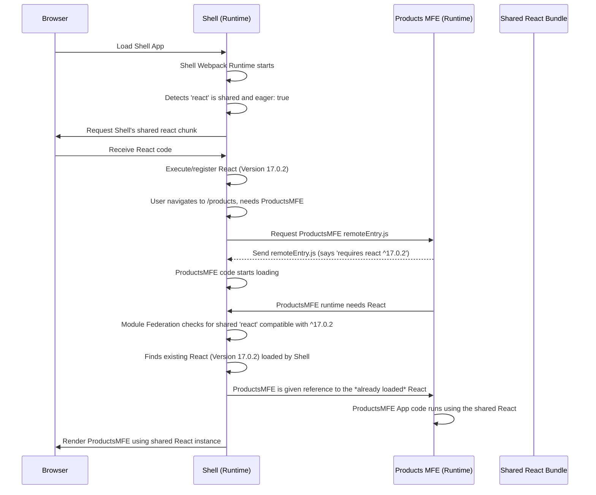

# Chapter 5: Shared Dependencies

Welcome back to the `mfe-project` tutorial! So far, we've learned about independent [Micro Frontends (MFEs)](01_micro_frontend__mfe__.md), the [Shell application](02_shell__host__application_.md) that hosts them, the specific [Remote Modules](03_remote_module__exposed_module__.md) that MFEs share, and the [Webpack Module Federation Plugin](04_webpack_module_federation_plugin_.md) that makes all this dynamic loading possible.

Now, let's talk about a crucial optimization and potential pitfall in MFE architectures: dealing with common libraries.

## The Problem: Duplicate Libraries are Wasteful

Imagine you have multiple MFEs, and they _all_ use a popular library like **React** or **React Router**.

- Your `shell` uses React and React Router.
- Your `header-mfe` uses React and React Router.
- Your `products-mfe` uses React and React Router.
- Your `orders-mfe` uses React and React Router.
- Your `user-profile-mfe` uses React.
- Your `natasha-chatbot-mfe` uses React.

If each of these MFEs is built completely independently, their final JavaScript bundles will each include their _own copy_ of React, React Router, and any other common dependencies.

When a user visits your site, the browser might end up downloading React multiple times – once for the Shell, once for the Header MFE, once for the Products MFE, and so on, depending on which MFEs are loaded.

```mermaid
graph TD
    Browser --> Shell (Bundle 1: React + App)
    Browser --> Header MFE (Bundle 2: React + Header)
    Browser --> Products MFE (Bundle 3: React + Products)
    Browser --> Orders MFE (Bundle 4: React + Orders)
    Browser --> Profile MFE (Bundle 5: React + Profile)

    subgraph Problem
        Bundle 1 -- contains --> React
        Bundle 2 -- contains --> React
        Bundle 3 -- contains --> React
        Bundle 4 -- contains --> React
        Bundle 5 -- contains --> React
    end

    Problem --> WastefulDownloads(Wasteful Downloads);
    Problem --> ConflictingState(Potential Conflicts);

```

This leads to:

1.  **Larger Download Sizes:** The total amount of JavaScript the user has to download is much larger than necessary.
2.  **Slower Page Load Times:** Downloading and parsing duplicate code takes time.
3.  **Increased Memory Usage:** The browser might hold multiple copies of the same library in memory.
4.  **Potential Conflicts:** For stateful libraries like React, having multiple independent copies running on the same page can cause tricky bugs, especially with features like Hooks or Context, as different parts of the application might be interacting with different "instances" of the library.

We need a way for MFEs to agree on using a _single_ version of common libraries, like having a single shared toolbox instead of each worker bringing their own duplicate hammers.

## The Solution: Shared Dependencies

The Webpack Module Federation Plugin offers the `shared` option specifically to solve this problem. It allows you to specify dependencies that should be loaded _once_ and shared among all participating MFEs that require them.

When you configure a dependency as `shared`, you tell Webpack:

- "This library (`react`, `react-dom`, etc.) is a shared resource."
- "If another MFE has already loaded a compatible version of this library, use that version instead of bundling my own."
- "If no compatible version is loaded when _my_ MFE needs it, then I will load it, and other MFEs can potentially use the version _I_ loaded."

This means the first MFE that needs a shared library will load it, and subsequent MFEs needing the _same_ library can then reuse the already loaded code.

```mermaid
graph TD
    Browser --> Shell (Bundle 1: App)
    Shell --> SharedLibraryServer(Shared Library Server)
    Shell -- Loads first --> ReactLibrary(React Library)
    Shell -- Loads first --> ReactRouterLibrary(React Router Library)

    Shell -- Consumes --> HeaderMFE(Header MFE Bundle: Header Code)
    Shell -- Consumes --> ProductsMFE(Products MFE Bundle: Products Code)
    Shell -- Consumes --> OrdersMFE(Orders MFE Bundle: Orders Code)
    ProductsMFE -- Consumes --> ProfileMFE(Profile MFE Bundle: Profile Code)

    HeaderMFE -- Needs React --> ReactLibrary
    ProductsMFE -- Needs React --> ReactLibrary
    ProductsMFE -- Needs Profile --> ProfileMFE
    ProfileMFE -- Needs React --> ReactLibrary

    ReactLibrary --> SingleInstance(Single Instance in Browser Memory)

    subgraph Solution
        Shell -- Configures Shared --> ReactLibrary
        Shell -- Configures Shared --> ReactRouterLibrary
        HeaderMFE -- Configures Shared --> ReactLibrary
        ProductsMFE -- Configures Shared --> ReactLibrary
        OrdersMFE -- Configures Shared --> ReactLibrary
        ProfileMFE -- Configures Shared --> ReactLibrary
    end

    Solution --> EfficientDownloads(Efficient Downloads);
    Solution --> UnifiedState(Unified Library State);
```

The result? Much smaller individual MFE bundles (because they don't include the shared libraries) and only one copy of common libraries downloaded and running.

## Configuring Shared Dependencies

The `shared` option is part of the `ModuleFederationPlugin` configuration in each MFE's `webpack.config.js`.

It's an object where keys are the package names you want to share (e.g., `"react"`, `"react-dom"`) and values are configuration options for how that package should be shared.

Let's look at the `shared` configuration in one of the MFEs, like `user-profile-mfe/webpack.config.js`:

```javascript
// From user-profile-mfe/webpack.config.js (simplified ModuleFederationPlugin)
const ModuleFederationPlugin = require("webpack/lib/container/ModuleFederationPlugin");

module.exports = {
  // ... other config ...
  plugins: [
    new ModuleFederationPlugin({
      name: "userProfileMfe",
      filename: "remoteEntry.js",
      exposes: {
        "./UserProfile": "./src/UserProfile",
      },
      shared: {
        // Shared React library configuration
        react: {
          singleton: true, // Use only one instance
          requiredVersion: "^17.0.2", // Must be compatible with this version
        },
        // Shared React-DOM library configuration
        "react-dom": {
          singleton: true, // Use only one instance
          requiredVersion: "^17.0.2", // Must be compatible with this version
        },
      },
    }),
    // ... other plugins ...
  ],
  // ... rest of config ...
};
```

Let's break down the common options within the `shared` object:

- **`react`**: This is the name of the NPM package we want to share.
- **`singleton: true`**: This is very important, especially for stateful libraries like React, React-DOM, or React Router. It tells Webpack's Module Federation runtime that _only one instance_ of this library should exist on the page at any time. If one MFE loads a version, all other MFEs configured as `singleton: true` for the same library _must_ use that exact instance, assuming the versions are compatible. This prevents the "multiple instances" bug.
- **`requiredVersion: "^17.0.2"`**: This specifies the version range of the shared library that this MFE _expects_ to use (using standard [npm semver ranges](https://docs.npmjs.com/cli/v6/using-npm/semver)). When the Module Federation runtime is deciding which version to load or use, it checks this requirement. If a loaded version doesn't meet this requirement (and `singleton` is true), it might throw an error or warn you. The goal is for all MFEs to agree on a compatible version range or preferably the exact same version.
- **`eager: false`** (This is the default, often omitted): The shared dependency is loaded lazily, only when the MFE that needs it is requested and the dependency isn't already loaded.
- **`eager: true`**: The shared dependency will be loaded immediately when the _container_ (the MFE whose Webpack config is being processed, typically the Shell) starts, regardless of whether any consumed Remote needs it yet. This is useful for core libraries that you know the Shell or most Remote MFEs will need right away, like React and React-DOM in the Shell.

Let's look at the `shell/webpack.config.js` to see the `eager: true` example:

```javascript
// From shell/webpack.config.js (simplified ModuleFederationPlugin)
const ModuleFederationPlugin = require("webpack/lib/container/ModuleFederationPlugin");

module.exports = {
  // ... other config ...
  plugins: [
    new ModuleFederationPlugin({
      name: "shell",
      remotes: {
        /* ... */
      },
      shared: {
        react: {
          singleton: true,
          requiredVersion: "^17.0.2",
          eager: true, // Load React when the Shell starts
        },
        "react-dom": {
          singleton: true,
          requiredVersion: "^17.0.2",
          eager: true, // Load React-DOM when the Shell starts
        },
        "react-router-dom": {
          singleton: true,
          requiredVersion: "^6.3.0",
          eager: false, // Default - load when first needed by Shell or a Remote
        },
      },
    }),
    // ... other plugins ...
  ],
  // ... rest of config ...
};
```

Here, the Shell marks `react` and `react-dom` as `eager: true`. This means when the browser loads the Shell's initial bundle, the Module Federation runtime will immediately fetch and load React and React-DOM (if they aren't already cached). Since the Shell needs them right away anyway, and other MFEs depend on them, loading them eagerly ensures they are available when the first Remote MFE that needs them is loaded. `react-router-dom` is not marked eager, so it's loaded only when the Shell or a Remote specifically imports something from it.

All participating MFEs in the `mfe-project` share `react` and `react-dom` with `singleton: true`. The Shell, Header, Products, and Orders MFEs also share `react-router-dom`. This ensures that the entire application uses a single, consistent version of these core libraries.

## How Shared Dependencies Work Under the Hood

When you build each MFE, Webpack's Module Federation Plugin looks at the `shared` configuration.

1.  **During Build:** For each shared dependency, Webpack might _exclude_ it from the MFE's main bundle and instead create a separate smaller bundle (a chunk) for that dependency _or_ rely on it being provided by a host. The `remoteEntry.js` file (the manifest) for each MFE is updated to list its shared dependencies, the version it provides (if it's configured to provide one, usually implied by having it in `package.json`), and the version range it requires.

2.  **At Runtime:** When a Host MFE (like the Shell) loads:
    - It first loads its own main bundle and the `remoteEntry.js` for any Remotes listed in its `remotes` config.
    - Webpack's Module Federation runtime begins loading shared dependencies marked as `eager: true` from the Host itself.
    - When the Shell needs to load a Remote MFE's code (e.g., via `React.lazy(() => import('productsMfe/App'))`), it fetches the Remote's `remoteEntry.js`.
    - The runtime compares the Remote's `requiredVersion` for its shared dependencies with the versions _already loaded_ on the page (from the Host or other previously loaded Remotes).
    - Based on the `singleton` setting and version compatibility, the runtime decides whether it can use an existing loaded version or if a new version needs to be fetched.
    - If a compatible `singleton` version is already present, the Remote MFE's code will use that existing library instance.
    - If the Remote MFE requires a shared dependency that isn't loaded, the runtime will load it, potentially from the Host or another source depending on config.

Here's a simplified sequence focusing on a shared library:



This flow highlights that the shared library (`React`) is loaded once by the Shell (because it was `eager`). When the Products MFE is loaded and requires React, the Module Federation runtime smartly points it to the already loaded version instead of downloading it again.

## Benefits of Shared Dependencies

- **Performance:** Significantly reduces total JavaScript download size and improves initial page load times.
- **Resource Efficiency:** Less memory consumed by avoiding duplicate library instances.
- **Stability:** Eliminates potential bugs caused by multiple instances of stateful libraries like React.
- **Simplified Development:** You don't have to manually ensure every MFE uses the exact same version; `requiredVersion` helps manage compatibility.

## Conclusion

Shared Dependencies are a cornerstone of efficient Micro Frontend architectures using Webpack Module Federation. By configuring common libraries like React and React-DOM as `shared` (especially with `singleton: true`), we ensure that only one copy is loaded and used across all participating MFEs, leading to better performance and fewer runtime issues. The Shell application often loads critical shared dependencies `eagerly` to make them immediately available for other MFEs.

Now that we know how to share code and libraries between MFEs, let's look at a common pattern for how MFEs are initialized when they are loaded by the Shell: the Bootstrap Pattern.

[Bootstrap Pattern](06_bootstrap_pattern_.md)
