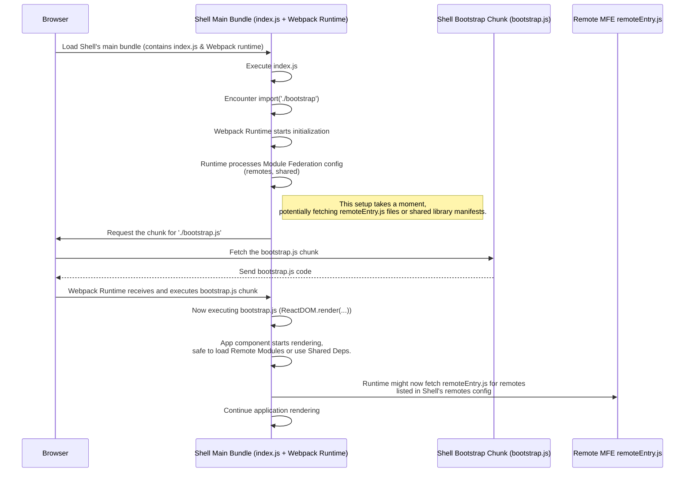

# Chapter 6: Bootstrap Pattern

Welcome back! In the last chapter, [Shared Dependencies](05_shared_dependencies_.md), we learned how the `shared` configuration in the Webpack Module Federation Plugin helps us avoid loading multiple copies of libraries like React, ensuring our application is faster and more efficient.

Now that we've covered how the Webpack Module Federation Plugin works ([Chapter 4](04_webpack_module_federation_plugin_.md)) and how it handles shared libraries ([Chapter 5](05_shared_dependencies_.md)), let's look at a specific pattern used in the `mfe-project` (and commonly in Module Federation applications) to make sure everything starts up correctly. This is called the **Bootstrap Pattern**.

## The Problem: Getting the App Started with Module Federation Ready

When your browser loads the main HTML file for the Shell application, it eventually loads the main JavaScript file (usually something like `main.js` or `bundle.js`) generated by Webpack. This bundle contains the Webpack runtime code, your application's code, and potentially some eagerly loaded shared libraries.

If your main application code (the part that renders your React app, sets up routing, etc.) runs _immediately_ as soon as that main bundle loads, it might try to do things that depend on the Webpack Module Federation runtime being fully initialized. For example:

- Trying to resolve a [Remote Module](03_remote_module__exposed_module__.md) import before Webpack has finished setting up the mechanisms to fetch `remoteEntry.js` files.
- Depending on a [Shared Dependency](05_shared_dependencies_.md) that Webpack hasn't finished resolving or loading yet.

Imagine you're trying to turn on a complex machine. You flip the main power switch (Webpack bundle loads), but the internal systems need a moment to power up and become ready (Webpack runtime initialization, shared dependency resolution). If you immediately press the "Start Operation" button (your app's main rendering logic) before the systems are ready, the machine might fail or behave unexpectedly.

We need a way to tell our main application code, "Hold on for just a moment! Let Webpack do its thing, set up the Module Federation magic, and then you can start running."

## The Solution: The Bootstrap Pattern (`index.js` and `bootstrap.js`)

The Bootstrap Pattern addresses this by splitting your application's entry point into two files:

1.  **`index.js`:** This is the _actual_ file referenced in your `webpack.config.js` as the `entry` point. Its sole purpose is typically to perform a _dynamic import_ of the second file, `bootstrap.js`.
2.  **`bootstrap.js`:** This file contains the _real_ application startup logic – rendering your main React component (like `<App />`), initializing libraries, setting up global contexts, etc.

Here's the core idea:

- `index.js` is minimal.
- It uses `import('./bootstrap')` instead of a static `import './bootstrap'`.

The crucial part is the **dynamic `import('./bootstrap')`**. Unlike a static `import` (like `import React from 'react'`), a dynamic `import()` is asynchronous and tells Webpack to create a _separate chunk_ for the imported module (`bootstrap.js` in this case). Webpack's runtime handles loading this chunk.

By doing this, you give Webpack the necessary time to:

1.  Load its initial runtime code (from the main bundle loaded by `index.js`).
2.  Process the Module Federation configuration (resolve `remotes`, identify `shared` modules).
3.  Set up the internal mechanisms needed for dynamic loading and shared module resolution.

Only _after_ the dynamic import resolves and the `bootstrap.js` chunk is fetched and executed does your core application logic (`ReactDOM.render`, etc.) actually run. This ensures that the Webpack environment, including Module Federation capabilities and shared dependencies, is fully ready.

It's like flipping the main power switch (`index.js` loads) and waiting for the "System Ready" light to turn on before pressing the "Start Operation" button (`bootstrap.js` executes after dynamic import resolves).

## How It Looks in Code

Let's look at the standard structure for both the Shell and Remote MFEs in the `mfe-project`.

### Shell Application (`shell`)

**`shell/src/index.js`**

```javascript
// File: shell/src/index.js
// Bootstrap pattern for Module Federation
// This ensures shared modules are loaded before the app starts
import("./bootstrap");

// That's it! This file is very minimal.
```

Explanation:
This is the very first JavaScript code that runs. It does nothing but trigger the loading of `./bootstrap.js`. The dynamic `import()` makes `./bootstrap.js` a separate bundle chunk.

**`shell/src/bootstrap.js`**

```javascript
// File: shell/src/bootstrap.js
import React from "react";
import ReactDOM from "react-dom";
import App from "./App"; // Your main Shell application component
import "./styles.css";

// Bootstrap the Shell application - this runs AFTER index.js's import resolves
ReactDOM.render(<App />, document.getElementById("root"));
```

Explanation:
This file contains the actual startup code. It imports the main `App` component and renders it into the DOM. Because this code runs only after the dynamic import in `index.js` resolves, the Webpack Module Federation runtime has had time to prepare.

### Remote MFEs (e.g., `user-profile-mfe`)

Remote MFEs use the same pattern, even if they are primarily consumed as [Remote Modules](03_remote_module__exposed_module__.md) by the Shell. This pattern is also important for when you run a Remote MFE _standalone_ during development (which most MFEs in `mfe-project` can do).

**`user-profile-mfe/src/index.js`**

```javascript
// File: user-profile-mfe/src/index.js
// Bootstrap the application asynchronously to ensure Module Federation works properly
import("./bootstrap");

// Again, very simple!
```

Explanation:
Same pattern as the Shell's `index.js`. Triggers the dynamic import of `bootstrap.js`.

**`user-profile-mfe/src/bootstrap.js`**

```javascript
// File: user-profile-mfe/src/bootstrap.js
import React from "react";
import ReactDOM from "react-dom";
// If running standalone, this needs routing
import { BrowserRouter } from "react-router-dom";
// The main component exposed by this MFE
import UserProfile from "./UserProfile";
import "./styles.css";

// --- This part is for standalone development ---
// Provides dummy data and BrowserRouter if you run this MFE by itself
const userDataForStandalone = {
  id: "yogendr_123",
  name: "Yogendra Saxena",
  email: "yogendrasaxena56@gmail.com",
  role: "Software Engineer",
  avatar: "👨",
};
// --- End standalone part ---

// Bootstrap the User Profile MFE - runs AFTER index.js's import
ReactDOM.render(
  // BrowserRouter is needed here for standalone mode
  // When consumed by Shell, Shell provides the router
  <BrowserRouter>
    {/* Render the component, passing props (like dummy data for standalone) */}
    <UserProfile user={userDataForStandalone} />
  </BrowserRouter>,
  document.getElementById("root")
);
```

Explanation:
This file contains the startup logic for the `user-profile-mfe`. It renders the `UserProfile` component. The `BrowserRouter` and `userDataForStandalone` parts are included specifically to make this MFE runnable on its own during development (e.g., using `npm start` in its directory). When this MFE is loaded as a [Remote Module](03_remote_module__exposed_module__.md) by the Shell, this `bootstrap.js` code might not even run directly; the Shell might just load the `UserProfile` component module itself using `React.lazy` and `import('userProfileMfe/UserProfile')`, as seen in [Chapter 3](03_remote_module__exposed_module__.md). However, having the Bootstrap Pattern is still good practice for Remotes, especially if they have complex standalone setup or might themselves consume other remotes later.

All MFEs in the `mfe-project` follow this pattern (`header-mfe`, `products-mfe`, `orders-mfe`, `natasha-chatbot-mfe` all have `index.js` calling `import('./bootstrap')` and their main render logic in `bootstrap.js`).

## Under the Hood: Why the Dynamic Import Helps

Let's visualize what happens when the browser loads the Shell application, focusing on the `index.js` -> `bootstrap.js` flow and Webpack's role.



As you can see, the dynamic import creates a pause point. The code inside `bootstrap.js` doesn't run until its chunk is fetched and executed, which happens _after_ the initial bundle has loaded and the Webpack runtime has had a chance to configure itself, including the complexities introduced by Module Federation and shared dependencies.

## Benefits of the Bootstrap Pattern

- **Reliable Initialization:** Ensures the Webpack Module Federation runtime is fully prepared before your application code tries to use its features (like loading remote modules or using shared dependencies).
- **Standard Practice:** A common and recommended pattern in Module Federation setups.
- **Clear Separation:** Keeps the minimal entry point (`index.js`) separate from the main application setup logic (`bootstrap.js`).

## Conclusion

The Bootstrap Pattern, using a dynamic `import('./bootstrap')` from a minimal `index.js` file, is a simple yet crucial technique in Module Federation applications like `mfe-project`. It guarantees that the Webpack runtime, with its knowledge of remotes and shared modules, is fully initialized before your main application code begins execution, preventing potential race conditions and errors.

With this pattern in place, our MFEs can confidently load each other's code and use shared libraries. But how do these independent MFEs talk to each other? For example, how does the Products MFE notify the Header MFE when items are added to a cart? This requires a communication mechanism.

Let's explore one such mechanism used in `mfe-project`: the Event Bus.

[Event Bus (window.mfeEventBus)](07_event_bus__window_mfeeventbus__.md)
