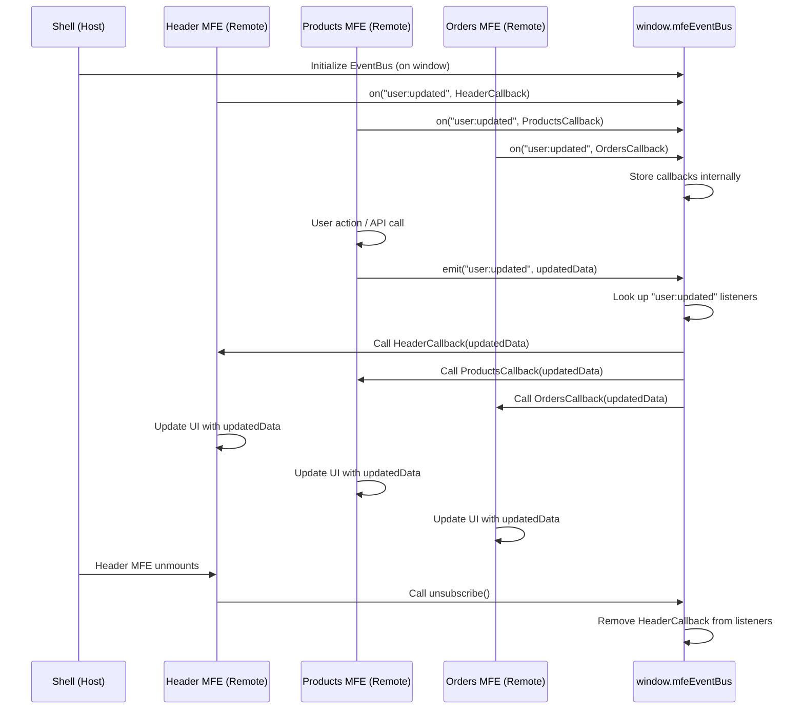

# Chapter 6: Event Bus (window.mfeEventBus)

Welcome back! In the last chapter, [Chapter 5: Page MFEs vs. Component MFEs](05_page_mfes_vs__component_mfes_.md), we saw how our independent Micro Frontends (MFEs) are categorized by purpose – as full "Page" sections or smaller "Component" pieces – and how the Shell loads them using Webpack Module Federation.

Now, we face a common challenge in MFE architectures: **How do these independent MFEs communicate with each other?**

Imagine the Products MFE updates the user's profile information (like their name or email) by calling an API. The Header MFE, which displays the user's name, needs to know about this change immediately so it can update its display. Similarly, the Orders MFE might also show user details and needs to react to the update.

How can the Products MFE tell the Header MFE and Orders MFE about the update when these MFEs are independent applications that don't have direct references to each other?

- The Products MFE doesn't know if the Header MFE is currently loaded.
- The Header MFE doesn't know _which_ MFE might update the user data.

Trying to make them call methods on each other directly (`productsMfe.getHeaderMfe().updateUserDisplay()`) would tightly couple them together, which goes against the core principle of MFE independence. This is like one shop in the mall needing to know the exact name and location of another shop and having a direct phone line to call them for every little announcement. This becomes a messy web of connections as more shops are added.

We need a mechanism for one part of the application to announce something has happened ("Hey, the user data changed!") without needing to know who specifically is listening, and for other parts to listen for announcements they care about ("Okay, I heard the user data changed, I should update my display").

This is where the **Event Bus** comes in.

## The Solution: A Central Announcement System

In our project, we use a simple custom implementation of an **Event Bus**. Think of it as the central announcement system in our shopping mall.

- The mall management (the Shell) sets up the announcement system.
- Any shop (MFE) or management can go to a central microphone and **broadcast a message** (emit an event) about something that happened (e.g., "Attention shoppers, store 'X' has a flash sale!").
- Other shops (MFEs) or even shoppers (other parts of the application) can **listen** (subscribe) to specific types of announcements they care about (e.g., the shoe store listens for "flash sale" announcements, the cafe listens for "mall closing time" announcements).

The key benefit is **decoupling**. The broadcaster doesn't need to know _who_ is listening, and the listeners don't need to know _who_ is broadcasting. They only need to agree on the **name** of the announcement (the "event name", like `"user:updated"`).

In our project, this central announcement system is available globally in the browser as `window.mfeEventBus`.

## How to Use the Event Bus

The `window.mfeEventBus` object provides two main methods:

1.  **`on(eventName, callback)`**: Use this to **subscribe** or **listen** for a specific type of event. When an event with `eventName` is emitted, your `callback` function will be called. This function returns another function that you can call later to stop listening (unsubscribe).
2.  **`emit(eventName, data)`**: Use this to **publish** or **broadcast** an event. Anyone listening for `eventName` will have their callback function executed. You can optionally pass `data` along with the event.

Let's look at our user data update example using `window.mfeEventBus`.

### Emitting an Event (The Publisher)

When the Products MFE successfully updates user data via an API call, it uses `emit` to tell everyone:

```javascript
// Snippet from products-mfe/src/userApiService.js
// (Similar logic exists in orders-mfe and shell's API services)

class UserApiService {
  // ... other methods

  /**
   * Helper method to update user and notify other MFEs
   * @param {Object} updates - User data updates
   */
  static async updateUserAndNotify(updates) {
    try {
      // ... API call to update user data ...
      const apiResponse = await this.updateUser(updatedUserData); // Assume this works

      // 🔥 Broadcast the 'user:updated' event!
      if (window.mfeEventBus) {
        // Always good practice to check if it exists
        window.mfeEventBus.emit("user:updated", apiResponse); // <-- Emitting the event
        console.log("📡 Products MFE: Notified all MFEs about user update");
      }

      return apiResponse;
    } catch (error) {
      // ... handle error, maybe emit an error event ...
      console.error("❌ Products MFE: Failed to update user:", error.message);
      throw error;
    }
  }
}
```

In this snippet:

- `window.mfeEventBus.emit("user:updated", apiResponse);` is the key line.
- `"user:updated"` is the event name (a string). It's like the specific topic of the announcement. Using a consistent naming convention (like `topic:action`) is helpful.
- `apiResponse` is the data payload (the updated user object) sent along with the event. Listeners will receive this data.

This single line tells the entire application federation, "Hey, the user data just got updated to this new object!", without needing to know _which_ MFEs or components might be interested.

### Listening for Events (The Subscribers)

Any MFE or component that cares about user data updates can use `on` to listen for the `"user:updated"` event.

Here's how the Header MFE listens and updates its local state:

```javascript
// Snippet from header-mfe/src/Header.js
import React, { useState, useEffect } from "react";
// ... other imports

const Header = () => {
  const [user, setUser] = useState(null);

  useEffect(() => {
    if (window.mfeEventBus) {
      // ... get initial user data from global context (covered in next chapter) ...

      // ✅ Listen for the 'user:updated' event
      const unsubscribeUser = window.mfeEventBus.on(
        "user:updated",
        (userData) => {
          console.log("👂 Header MFE: Received user data update");
          setUser(userData); // Update local state with the new user data
        }
      );

      // 🧹 Clean up the listener when the component unmounts
      return () => {
        unsubscribeUser(); // Stop listening
      };
    }
  }, []); // Effect runs once on mount

  // ... rest of Header component using the 'user' state ...
};
```

And similarly, the Orders MFE:

```javascript
// Snippet from orders-mfe/src/App.js
import React, { useState, useEffect } from "react";
// ... other imports

const App = () => {
  const [user, setUser] = useState(null);

  useEffect(() => {
    if (window.mfeEventBus) {
      // ... get initial user data from global context ...

      // ✅ Listen for the 'user:updated' event
      const unsubscribeUser = window.mfeEventBus.on(
        "user:updated",
        (userData) => {
          console.log("👂 Orders MFE: Received user data update");
          setUser(userData); // Update local state
        }
      );

      // 🧹 Clean up the listener
      return unsubscribeUser;
    }
  }, []); // Effect runs once on mount

  // ... rest of Orders MFE component using the 'user' state ...
};
```

In these snippets:

- `window.mfeEventBus.on("user:updated", callback)` registers a function to be called whenever `"user:updated"` is emitted.
- The callback function receives the `data` (`userData`) that was passed during `emit`.
- Crucially, the `useEffect` hook returns the `unsubscribeUser` function. This is essential for cleanup! When the component that registered the listener is removed from the page, we must call this function to prevent memory leaks and ensure the callback isn't called after the component is gone.

Any number of MFEs or components can listen to the _same_ event without interfering with each other.

Another example is the button in the Header MFE that updates the title in the Products MFE. The Header MFE _emits_ a specific event, and the Products MFE _listens_ for it:

```javascript
// Snippet from header-mfe/src/Header.js (Publisher)

const Header = () => {
  // ... other state and effects ...

  return (
    <header className="mfe-header">
      {/* ... other header content ... */}
      <button
        onClick={() => {
          // 🔥 Emit a different event!
          if (window.mfeEventBus) {
            window.mfeEventBus.emit(
              "update-title",
              "Title Changed via event bus" // Pass some data
            );
            console.log("📢 Header MFE: Emitted 'update-title' event");
          }
        }}
      >
        click me to update Product title
      </button>
      {/* ... rest of header */}
    </header>
  );
};
```

```javascript
// Snippet from products-mfe/src/App.js (Subscriber)
import React, { Suspense, useState, useEffect } from "react";
// ... other imports

const App = () => {
  // ... other state ...
  const [title, setTitle] = useState("Products Management");

  useEffect(() => {
    if (window.mfeEventBus) {
      // ... listen for user updates ...

      // ✅ Listen for the 'update-title' event from Header MFE
      const unsubscribeTitle = window.mfeEventBus.on(
        "update-title",
        (newTitle) => {
          console.log(
            "👂 Products MFE: Received 'update-title' event:",
            newTitle
          );
          setTitle(newTitle); // Update local state to change the displayed title
        }
      );

      // 🧹 Clean up both listeners
      return () => {
        // unsubscribeUser(); // (if user listener is also in this effect)
        unsubscribeTitle(); // Stop listening for title updates
      };
    }
  }, []); // Effect runs once on mount

  return (
    <div className="products-mfe">
      {/* ... display the title state ... */}
      <h1>📦 {title}</h1>
      {/* ... rest of component ... */}
    </div>
  );
};
```

This illustrates that the Event Bus is not just for data synchronization, but can be used for various types of cross-MFE communication, like triggering actions or updating simple UI elements.

## How it Works Under the Hood

The `window.mfeEventBus` in this project is a very simple JavaScript class implemented in `shell/src/EventBus.js`. It's not a complex message queue; it's just an object that holds lists of functions.

Here's a high-level look at what happens:

1.  **Initialization:** When the Shell application loads, it imports and runs the code in `shell/src/EventBus.js`. This file creates a single instance of the `EventBus` class and attaches it to `window.mfeEventBus`.
2.  **Subscribing (`on`):** When an MFE calls `window.mfeEventBus.on("someEvent", callback)`, the `EventBus` instance stores that `callback` function in an array associated with the key `"someEvent"` in its internal `events` object.
3.  **Emitting (`emit`):** When an MFE calls `window.mfeEventBus.emit("someEvent", data)`, the `EventBus` instance looks up the array of callbacks associated with `"someEvent"`. It then loops through that array and calls each registered `callback` function, passing the `data` to it.
4.  **Unsubscribing (`off` / return function):** When an MFE needs to stop listening, it calls the function returned by `on` (or directly calls `off`). This removes its callback function from the list for that event, so it won't be called anymore.

Here's a simple sequence diagram:



Let's peek at the simplified implementation code for the `EventBus` class:

```javascript
// Snippet from shell/src/EventBus.js

class EventBus {
  constructor() {
    this.events = {}; // Object to hold event names and their listeners
  }

  // Register a callback for an event
  on(event, callback) {
    if (!this.events[event]) {
      this.events[event] = []; // Create array for this event if it doesn't exist
    }
    this.events[event].push(callback); // Add the callback to the list

    // Return a function to remove this specific listener later
    return () => {
      this.events[event] = this.events[event].filter((cb) => cb !== callback);
    };
  }

  // Remove a specific callback (less common with the return function pattern)
  off(event, callback) {
    if (this.events[event]) {
      this.events[event] = this.events[event].filter((cb) => cb !== callback);
    }
  }

  // Trigger all callbacks for an event
  emit(event, data) {
    if (this.events[event]) {
      // Loop through all registered callbacks and call them
      this.events[event].forEach((callback) => {
        try {
          callback(data); // Call the callback with the data
        } catch (error) {
          console.error(`Error in event listener for ${event}:`, error);
        }
      });
    }
  }
}

// Create the single instance and put it on the window object
const eventBus = new EventBus();
window.mfeEventBus = eventBus;
```

This code is quite straightforward. The `events` object acts like a dictionary where keys are event names (strings) and values are arrays of functions (the callbacks). `on` adds functions to these arrays, and `emit` iterates over an array and calls the functions. Attaching it to `window` makes it accessible globally.

The Shell ensures this `EventBus.js` file is included early in its build process (by importing it in `shell/src/App.js`) so that `window.mfeEventBus` is available before MFEs loaded by the Shell try to use it.

```javascript
// Snippet from shell/src/App.js
import React, { Suspense, useContext, useState } from "react";
// ... other imports ...

import "./EventBus"; // ✨ Import the EventBus file to initialize window.mfeEventBus

// Lazy load MFE components
const HeaderMfe = React.lazy(() => import("headerMfe/Header"));
// ... other lazy imports ...
```

This import ensures the `EventBus` code runs and sets up `window.mfeEventBus` before any of the `React.lazy` imports (which load the MFE code) are potentially triggered.

## Benefits of Using an Event Bus

- **Decoupling:** MFEs don't need direct references to each other. They interact via a neutral third party (`window.mfeEventBus`).
- **Flexibility:** You can add new listeners or emitters for an event without changing the existing code. If a new MFE needs user data, it just subscribes to `"user:updated"`.
- **Simplicity:** For simple communication needs like broadcasting state changes or triggering UI updates, an Event Bus is often easier to set up and understand than more complex solutions.

## Limitations

- **Global Namespace:** Placing the Event Bus on `window` is simple but pollutes the global namespace. Care must be taken with naming (`mfeEventBus`) to avoid conflicts.
- **Debugging:** Tracking which MFE emitted an event or which listeners reacted can sometimes be tricky in a complex application, though console logs (like those in the code snippets) help!
- **Complexity:** For very complex cross-MFE interactions (e.g., shared state management, complex workflows), more sophisticated patterns or libraries might be needed.

For our learning project, this simple `window.mfeEventBus` provides an effective and easy-to-understand way for MFEs to communicate.

## Conclusion

In this chapter, we introduced the **Event Bus** (`window.mfeEventBus`) as a crucial mechanism for enabling communication between independent MFEs in our project. We learned how `emit` is used to broadcast messages and `on` is used to listen for them, providing a decoupled way for MFEs to react to changes happening elsewhere in the application, such as user data updates. We also took a look at the simple internal implementation of the `EventBus` class.

While the Event Bus is great for broadcasting events _after_ something has happened (like data being updated), what if MFEs need to access shared data _synchronously_ or trigger actions on shared services? This leads us to the concept of a shared Global Context.

[Chapter 7: Global Context (window.mfeGlobalContext)](07_global_context__window_mfeglobalcontext__.md)
