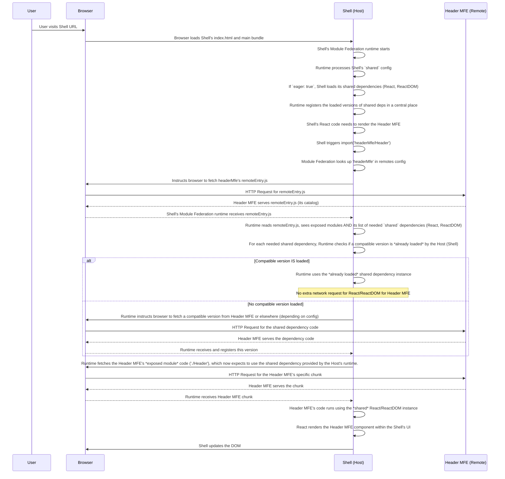

# Chapter 6: Shared Dependencies

Welcome back to the `mfe-project` tutorial! In our journey so far, we've learned that our application is composed of independent **Micro Frontends (MFEs)** ([Chapter 2: Micro Frontend (MFE)](02_micro_frontend__mfe__.md)), orchestrated by a **Shell (Host) Application** ([Chapter 3: Shell (Host) Application](03_shell__host__application_.md)). We've seen how the Shell finds MFEs using **Remotes Configuration** ([Chapter 4: Remotes Configuration](04_remotes_configuration_.md)) and how MFEs declare what code they offer using **Exposed Modules** ([Chapter 5: Exposed Modules](05_exposed_modules_.md)).

When the Shell loads the Header MFE, and then the Products MFE, and then the Orders MFE, what happens if all of these independent applications _each_ use the same libraries, like React, React DOM, or a styling library?

Without a special mechanism, each MFE would likely bundle its _own copy_ of React. When a user visits the site, their browser would download React multiple times – once for the Shell, once for the Header MFE, once for the Products MFE, and so on. This wastes bandwidth, slows down the page load, and could even lead to subtle bugs if different MFEs end up with slightly different versions of the same library running simultaneously.

## The Problem: Duplicate Libraries

Imagine our shopping mall again. Each store needs a basic set of tools: a cash register, shelving units, perhaps a ladder. If every single store has to buy its _own_ cash register, its _own_ shelves, its _own_ ladder, that's a lot of duplicate tools taking up space and costing extra money (bandwidth and load time in our web analogy).

Wouldn't it be better if the mall provided a central pool of these common tools that any store could borrow and use?

## The Solution: Shared Dependencies

This is exactly what **Shared Dependencies** in Webpack Module Federation allows us to do. It's a feature that lets multiple independent applications (our Shell and MFEs) agree to use a _single instance_ of specified libraries or modules when they run together in the browser.

Instead of each MFE bundling its own copy of React, they can all agree to use _one_ version of React provided by one of the applications (usually the Shell). This saves a significant amount of data from being downloaded and ensures consistency across the application.

## Configuring Shared Dependencies

Shared Dependencies are configured within the `ModuleFederationPlugin` in each application's `webpack.config.js`. Both the _host_ (like the Shell) and the _remote_ MFEs that participate in the sharing need to list which dependencies they want to share.

This is done using the `shared` option, which is an object where:

- **The keys** are the _names of the packages_ you want to share (like `'react'`, `'react-dom'`, `'react-router-dom'`). These should typically match the names used in your `package.json`.
- **The values** are configuration objects for each shared package. These objects tell Webpack how to handle the sharing for that specific library.

Let's look at the `shared` configuration from the Shell's `webpack.config.js`:

```javascript
// --- File: shell/webpack.config.js (Snippet focusing on shared) ---
const ModuleFederationPlugin = require("webpack/lib/container/ModuleFederationPlugin");

module.exports = {
  // ... other webpack settings ...
  plugins: [
    new ModuleFederationPlugin({
      name: "shell",
      remotes: {
        /* ... configured remotes ... */
      },
      shared: {
        // --- THIS IS THE SHARED CONFIG ---
        react: {
          // Package name
          singleton: true, // Ensure only one instance is loaded
          requiredVersion: "^17.0.2", // Compatible versions
          eager: true, // Load immediately when Shell loads
        },
        "react-dom": {
          // Package name
          singleton: true,
          requiredVersion: "^17.0.2",
          eager: true,
        },
        "react-router-dom": {
          // Package name
          singleton: true,
          requiredVersion: "^6.3.0",
          eager: false, // Load only when needed by a lazy-loaded component
        },
      },
    }),
    // ... other plugins ...
  ],
  // ... other webpack settings ...
};
```

Let's break down the configuration for `react`:

```javascript
react: {
  singleton: true,
  requiredVersion: '^17.0.2',
  eager: true
}
```

- `react`: This is the name of the package from `node_modules` that we want to share.
- `singleton: true`: This is very important for stateful libraries like React. It tells Module Federation that _only one instance_ of this library should ever be loaded into the browser's memory. If multiple MFEs try to load React, Module Federation will ensure they all use the same single instance. This prevents issues with contexts, hooks, etc., that expect a single React environment.
- `requiredVersion: '^17.0.2'`: This specifies the version range that the current application expects. Webpack Module Federation uses semantic versioning (`^`, `~`) to check compatibility. If the _host_ provides a version that is compatible with a _remote_'s `requiredVersion`, the remote will use the host's version. If the host's version is _not_ compatible, Module Federation might try to load the remote's version (depending on `strictVersion: true/false`, which defaults to `true`, meaning it will fail if no compatible version is found). It's crucial that all participating MFEs use compatible versions of shared dependencies. In our project, we aim to use the exact same version (`^17.0.2` for React/ReactDOM, `^6.3.0` for React Router DOM) across all MFEs for simplicity and guaranteed compatibility.
- `eager: true`: This tells Webpack to load this shared dependency _immediately_ when the container (the Shell application's main bundle) starts executing, rather than waiting until a component that uses it is lazy-loaded. For core rendering libraries like `react` and `react-dom`, marking them as `eager: true` in the _Shell_ is often necessary because the Shell needs them right away to render its initial structure and lazy-load other MFEs. In remotes, `eager: true` means it will load when the remote's `remoteEntry.js` is loaded.

Notice that `react-router-dom` in the Shell is configured with `eager: false`. The Shell uses React Router DOM immediately, but the _remotes_ that also use `react-router-dom` might not need it until their routes are activated. With `eager: false`, the dependency is loaded only when a module that requires it is imported (often via dynamic `import()`).

## Shared Configuration in Remote MFEs

Every MFE that uses these common libraries and participates in the federation should also list them in its `shared` configuration. This tells Module Federation that this MFE _needs_ these libraries and _is willing_ to share them or use a shared version.

Here's the `shared` configuration from the `header-mfe/webpack.config.js`:

```javascript
// --- File: header-mfe/webpack.config.js (Snippet focusing on shared) ---
const ModuleFederationPlugin = require("webpack/lib/container/ModuleFederationPlugin");

module.exports = {
  // ... other webpack settings ...
  plugins: [
    new ModuleFederationPlugin({
      name: "headerMfe",
      filename: "remoteEntry.js",
      exposes: { "./Header": "./src/Header" },
      shared: {
        // Header MFE also shares/needs these dependencies
        react: {
          singleton: true,
          requiredVersion: "^17.0.2",
          // eager: false // Default is false, but could be true if MFE needs it immediately on load
        },
        "react-dom": {
          singleton: true,
          requiredVersion: "^17.0.2",
          // eager: false
        },
        "react-router-dom": {
          singleton: true,
          requiredVersion: "^6.3.0",
          // eager: false
        },
      },
    }),
    // ... other plugins ...
  ],
  // ... other webpack settings ...
};
```

Notice that the `shared` configuration for `react`, `react-dom`, and `react-router-dom` is similar across all MFEs in the project. They all specify `singleton: true` and compatible `requiredVersion`s. This consistency is key for Module Federation to work correctly and efficiently.

The `eager` flag is omitted here for brevity, which defaults to `false` for shared dependencies in remotes unless explicitly set. However, in the full project code snippets provided earlier, `eager: true` is actually configured for `react` and `react-dom` in the remotes as well. This means these core libraries will be loaded when the remote MFE's `remoteEntry.js` is loaded by the host. This is a valid strategy, especially if the remote MFE immediately uses React/ReactDOM upon being loaded.

## How Shared Dependencies Work Under the Hood

When you build your applications with shared dependencies configured, Webpack does the following:

1.  **Building the Host (Shell):** Webpack bundles the Shell's code. For modules listed in `shared` with `eager: true`, it includes the code or prepares it for immediate loading. It also generates metadata about which shared dependencies it has available and their versions.
2.  **Building Remotes:** Webpack bundles the remote MFE's code. It _doesn't_ include the code for shared dependencies _unless_ explicitly configured otherwise (or if no compatible shared version can be guaranteed). The `remoteEntry.js` file for the remote MFE includes metadata about which shared dependencies _it needs_ and their `requiredVersion`.

At Runtime (in the browser):



This diagram illustrates how Module Federation intercepts the dependency loading. Instead of letting each MFE load its own full set of libraries, it coordinates and reuses existing, compatible versions of shared libraries, significantly reducing the total code downloaded and executed.

## Benefits of Shared Dependencies

- **Reduced Bundle Size:** Libraries like React are downloaded and parsed only once, rather than multiple times.
- **Faster Load Times:** Less data to download means pages load quicker.
- **Single Instance Guarantee (`singleton: true`):** Essential for libraries that rely on global state or context (like React). Prevents subtle bugs caused by multiple instances running in parallel.
- **Version Compatibility:** The `requiredVersion` check helps prevent runtime errors that could occur if MFEs tried to use drastically different versions of the same library.

## Conclusion

**Shared Dependencies** are a powerful feature of Webpack Module Federation that addresses the common problem of duplicate library code in distributed applications. By configuring the `shared` option in each MFE's `webpack.config.js`, we instruct Module Federation to coordinate the loading of common libraries like React, React DOM, and React Router DOM. This ensures that ideally only one compatible version of these libraries is loaded, improving performance and stability by guaranteeing a single instance for stateful libraries.

We saw how options like `singleton` and `requiredVersion` are crucial for this coordination, and how `eager` can control when these dependencies are loaded.

Now that we understand the core concepts of Module Federation, MFEs, Shells, Remotes, Exposed Modules, and Shared Dependencies, we're ready to look at the specific types of MFEs in our project. In the next chapter, we'll examine **Component MFEs**, which are designed to expose reusable UI components.

[Next Chapter: Component MFE](07_component_mfe_.md)
