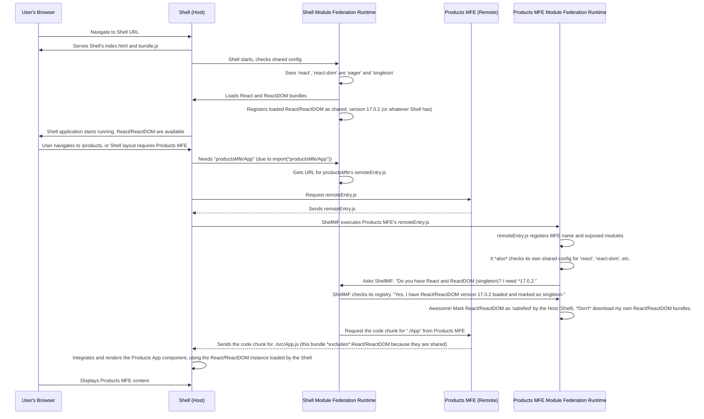

# Chapter 6: Shared Modules

Welcome back to the `mfe-project` tutorial! We've seen how **[Micro Frontends (MFEs)](01_micro_frontend__mfe__.md)** work as independent units, how the **[Shell (Host Application)](02_shell__host_application__.md)** brings them together, how **[Webpack Module Federation](03_webpack_module_federation_.md)** enables this dynamic loading, how the **[Remote Entry File](04_remote_entry_file_.md)** acts as an MFE's directory, and how we load **[Remote Modules (Exposed Components)](05_remote_module__exposed_component_app__.md)** – the specific pieces of UI or logic exposed by MFEs.

Now, let's talk about something common that _all_ or _many_ of our independent pieces might need: foundational libraries like React, ReactDOM, or potentially a shared styling library.

## The Problem: Duplicated Dependencies

Imagine you're building your Products MFE using React and ReactDOM. You install them in your `products-mfe/package.json`, and Webpack bundles them into the Products MFE's code.

Now, the Orders MFE team does the same. They install React and ReactDOM, and Webpack bundles them into the Orders MFE's code.

The Header MFE team? Same story.

And the Shell application itself, which uses React to render these MFEs? Yep, it installs React and ReactDOM and bundles them into its own code.

What happens when a user visits the Shell application and it loads the Header, Products, and Orders MFEs?

```mermaid
graph LR
    UserBrowser["User's Browser"]
    ShellApp["Shell App Bundle"]
    HeaderMFE["Header MFE Bundle"]
    ProductsMFE["Products MFE Bundle"]
    OrdersMFE["Orders MFE Bundle"]

    ShellApp --> React1["React (Shell's copy)"]
    HeaderMFE --> React2["React (Header's copy)"]
    ProductsMFE --> React3["React (Products' copy)"]
    OrdersMFE --> React4["React (Orders' copy)"]

    ShellApp --> ReactDOM1["ReactDOM (Shell's copy)"]
    HeaderMFE --> ReactDOM2["ReactDOM (Header's copy)"]
    ProductsMFE --> ReactDOM3["ReactDOM (Products' copy)"]
    OrdersMFE --> ReactDOM4["ReactDOM (Orders' copy)"]

    UserBrowser -- downloads --> ShellApp
    UserBrowser -- downloads --> HeaderMFE
    UserBrowser -- downloads --> ProductsMFE
    UserBrowser -- downloads --> OrdersMFE

    note right of UserBrowser: Lots of downloading!
```

The user's browser ends up downloading React (and other common libraries) multiple times – once within the Shell's bundle, once within the Header MFE's bundle, once within the Products MFE's bundle, and so on. This is like every shop in the mall building its _own_ separate restroom facility, even though a single shared one would suffice.

This leads to:

- **Larger bundle sizes:** The total amount of code downloaded is much bigger than necessary.
- **Slower loading times:** More code means longer download times.
- **Wasted resources:** The browser has to parse and execute the same library code multiple times.
- **Potential conflicts:** Different versions of the same library might behave unexpectedly.

We need a way for applications to agree to use a _single, shared instance_ of common libraries.

## The Solution: Shared Modules

Webpack Module Federation provides a powerful feature specifically for this: **Shared Modules**.

**Think of Shared Modules as the common facilities and infrastructure of the mall, like the main escalators or the shared restrooms.**

- Instead of each shop building its own, the mall (Shell) provides and manages a single, shared version.
- All shops (MFEs) and the mall (Shell) agree to use _this_ shared version whenever possible.
- This significantly reduces duplication and makes the overall mall more efficient and pleasant for visitors (users).

In Webpack Module Federation, you declare which dependencies (like `react`, `react-dom`, `react-router-dom`) should be treated as shared. Module Federation then ensures that at runtime, if a shared module is needed by an MFE, it first checks if that module has _already been loaded_ by another application (often the Shell) that also declared it as shared. If a compatible version is found, the MFE will use the already loaded version instead of downloading and running its own copy.

## Configuring Shared Modules

You configure shared modules within the `shared` property of the `ModuleFederationPlugin` in _every_ application's `webpack.config.js` that needs to participate in sharing.

Let's look at the `shell`'s `webpack.config.js`:

```javascript
// shell/webpack.config.js (Snippet focusing on shared)
const ModuleFederationPlugin = require("webpack/lib/container/ModuleFederationPlugin");

module.exports = {
  // ... other config
  plugins: [
    new ModuleFederationPlugin({
      name: "shell",
      remotes: {
        /* ... */
      },
      shared: {
        // <-- Declare shared dependencies here
        react: {
          // Sharing the 'react' package
          singleton: true, // Only one version allowed in the whole app
          requiredVersion: "^17.0.2", // Minimum version required by the Shell
          eager: true, // Load this package immediately when the Shell starts
        },
        "react-dom": {
          // Sharing the 'react-dom' package
          singleton: true,
          requiredVersion: "^17.0.2",
          eager: true, // Load this package immediately when the Shell starts
        },
        "react-router-dom": {
          // Sharing the 'react-router-dom' package
          singleton: true,
          requiredVersion: "^6.3.0",
          eager: false, // Load this when first needed (e.g., via dynamic import)
        },
        // ... other shared libraries
      },
    }),
    // ... other plugins
  ],
  // ... other config
};
```

**Explanation of `shared` options:**

- **`dependencyName`**: The key (e.g., `react`, `"react-dom"`) is the name of the NPM package you want to share.
- **`singleton: true`**: This is crucial for libraries like React or React-DOM that manage application state or context. `singleton: true` tells Module Federation: "There should only ever be ONE instance of this library loaded across the entire application (Shell + all MFEs)." If multiple applications declare a dependency as `singleton: true`, Module Federation will ensure only the first loaded application's version is used by all others, provided their versions are compatible.
- **`requiredVersion`**: Specifies the version range that this application needs. Module Federation uses this to determine compatibility. If a different application tries to share a version that doesn't meet this requirement, a warning or error might occur, or the application might fall back to loading its own copy (depending on other options). Using compatible `requiredVersion` across all apps is important.
- **`eager: true`**: This tells Webpack to _always_ include and load this shared dependency as part of the _initial bundle_ for this application, regardless of whether it's immediately needed by this application's entry point. The Shell uses `eager: true` for `react` and `react-dom`. This is a common pattern because the Shell will likely be the first part of the application to load, and forcing it to load React/ReactDOM ensures these core dependencies are available _before_ any MFEs that might need them are requested. Without `eager: true`, React/ReactDOM might only be loaded _when_ the Shell needs them, which could be _after_ an MFE is requested, potentially causing a race condition or error. For `react-router-dom`, the Shell sets `eager: false` because it's not needed immediately on page load; it's used later by the routing logic.

Now let's look at an MFE's `webpack.config.js`, like the `header-mfe`:

```javascript
// header-mfe/webpack.config.js (Snippet focusing on shared)
const ModuleFederationPlugin = require("webpack/lib/container/ModuleFederationPlugin");

module.exports = {
  // ... other config
  plugins: [
    new ModuleFederationPlugin({
      name: "headerMfe",
      filename: "remoteEntry.js",
      exposes: {
        /* ... */
      },
      shared: {
        // <-- Also declare shared dependencies here
        react: {
          // Sharing the 'react' package
          singleton: true, // Must match Shell's singleton setting for this library
          requiredVersion: "^17.0.2", // Must be compatible with Shell's required version
        },
        "react-dom": {
          // Sharing the 'react-dom' package
          singleton: true, // Must match Shell's singleton setting
          requiredVersion: "^17.0.2", // Must be compatible
        },
        "react-router-dom": {
          // Sharing the 'react-router-dom' package
          singleton: true, // Must match Shell's singleton setting
          requiredVersion: "^6.3.0", // Must be compatible
        },
        // Note: eager: true is NOT typically set on shared libraries in MFEs unless they *must* load them immediately.
        // They rely on the Host (Shell) providing it.
      },
    }),
    // ... other plugins
  ],
};
```

Every MFE that uses React, React-DOM, or React Router DOM _must_ also declare them in its `shared` configuration. This tells Module Federation that these dependencies _can_ be shared. The `singleton` and `requiredVersion` should generally align with what the Shell expects for these fundamental libraries.

By setting `shared` configuration in _all_ applications (Shell and MFEs) that use these common dependencies, you enable Module Federation's magic.

## How Shared Modules Work (Under the Hood)

Let's trace what happens when the Shell loads and then the Products MFE is requested:



This flow demonstrates the efficiency gain: the Products MFE's bundle is smaller because it doesn't need to include React and ReactDOM. It relies on the version already provided by the Shell. This happens automatically thanks to the `shared` configuration and the Module Federation runtime.

## Benefits of Shared Modules

- **Reduced Bundle Size:** The biggest win. Users download significantly less code, especially if many MFEs use the same large libraries.
- **Improved Performance:** Faster downloads, less code to parse and execute in the browser.
- **Consistent Experience:** Using a single instance of libraries like React helps prevent unexpected behavior that can sometimes arise from running multiple different versions or instances.
- **Version Management:** While complex, `requiredVersion` helps establish rules for which versions are compatible across the ecosystem.

## Conclusion

Shared Modules are a fundamental concept in Micro Frontend architectures using Webpack Module Federation. By explicitly declaring common libraries like React and ReactDOM as `shared` with appropriate options like `singleton` and `requiredVersion` in the `ModuleFederationPlugin` configuration of all participating applications (Shell and MFEs), you enable the Module Federation runtime to efficiently manage dependencies. This prevents duplication, reduces bundle sizes, and significantly improves application loading performance.

Understanding shared modules is key to building performant and maintainable Micro Frontend applications. It's like ensuring your mall has efficient, centralized services everyone can use, rather than forcing every shop to build its own!

With shared modules configured, our Shell can now efficiently load and run MFEs. But what about making these independent MFEs talk to each other? That's the topic of our next chapter.

[Next Chapter: Inter-MFE Communication (Event Bus & Context)](07_inter_mfe_communication__event_bus___context__.md)
