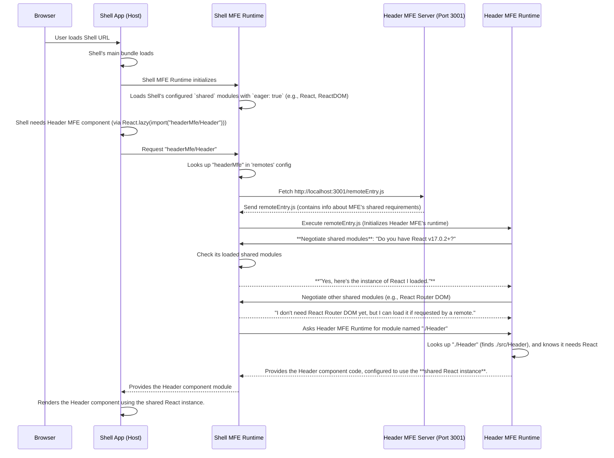

# Chapter 6: Shared Modules/Libraries

Welcome back! In the last chapter, [Chapter 5: `remoteEntry.js`](05__remoteentry_js__.md), we explored the `remoteEntry.js` file and how it acts as the directory or manifest that allows a host application (like our Shell) to discover and load specific modules exposed by a remote Micro Frontend (MFE).

Now, let's tackle another important concept related to efficiency and consistency in our micro frontend architecture: **Shared Modules/Libraries**.

### What Problem Do Shared Modules Solve?

Imagine our shopping mall again. The Shell is the mall building, and each MFE is a store. All the stores, and maybe even the mall itself, use common supplies – like cleaning products, light bulbs, or maybe a specific type of plastic bag.

If every single store had to buy, store, and manage its _own_ supply of these common items, it would be very inefficient. You'd need more storage space in each store, you'd spend more money buying in bulk but separately, and you might end up with different brands or versions of the same product across stores.

In our web application, the "common supplies" are often popular JavaScript libraries like **React**, **React DOM**, or **React Router**. Almost every MFE and the Shell in our project depends on these libraries to work.

If we didn't use shared modules, what would happen?

- Each MFE would include its _own copy_ of React, React DOM, etc., when it's built.
- When the Shell loads multiple MFEs, the user's browser would potentially download React multiple times (once for the Shell, once for the Header MFE, once for the Products MFE, and so on). This wastes bandwidth and increases the initial load time.
- Having multiple copies of the same library (especially stateful ones like React) running in the same browser memory space can lead to unexpected behavior, bugs, or performance issues.

This is where Shared Modules come to the rescue!

### What are Shared Modules/Libraries?

**Shared Modules** are common code libraries (like React, React DOM, React Router, or even shared utility functions you write) that multiple Micro Frontends and the Shell application need.

Instead of each application bundling its own private copy, Webpack Module Federation allows you to configure these libraries as **shared**. This means:

- Applications agree on using a single copy of the library loaded into the browser's memory.
- Typically, the **Host (Shell)** loads the main, agreed-upon version of the shared libraries first.
- When a **Remote (MFE)** needs a shared library, the Module Federation runtime checks if a compatible version is _already loaded by the host_.
- If a compatible version exists, the MFE uses the host's already-loaded copy.
- If not, the MFE might load its own version or show an error, depending on the configuration.

Using our analogy, it's like the mall providing a central loading dock and supply service for common items. Stores don't store everything themselves; they just request what they need, and the central service provides it from a shared stock. This saves space, money, and ensures consistency.

### Benefits of Shared Modules

- **Reduced Bundle Size:** The overall amount of JavaScript the user downloads is significantly smaller because libraries are not duplicated.
- **Improved Performance:** Faster initial load times due to smaller downloads.
- **Consistency:** Ensures that all parts of your application are using the same version (or compatible versions) of key libraries, preventing potential conflicts or version mismatch issues.
- **Efficiency:** Less memory usage in the browser as only one copy of the library is running.

### How to Configure Shared Modules

Shared modules are configured in the `ModuleFederationPlugin` in the `webpack.config.js` file of _each_ application that needs to either **provide** or **consume** those shared modules. In our project, the Shell provides the main versions, and all MFEs consume them.

Look at the `shared` section within the `ModuleFederationPlugin` in `shell/webpack.config.js`:

```javascript
// shell/webpack.config.js (Simplified shared config)
new ModuleFederationPlugin({
  // ... remotes config ...
  shared: {
    // List libraries to be shared
    react: {
      singleton: true, // Ensure only one copy is loaded
      requiredVersion: "^17.0.2", // Shell needs at least this version
      eager: true, // Load React immediately with the Shell
    },
    "react-dom": {
      singleton: true,
      requiredVersion: "^17.0.2",
      eager: true, // Load ReactDOM immediately with the Shell
    },
    "react-router-dom": {
      singleton: true,
      requiredVersion: "^6.3.0",
      eager: false, // Lazy load if not immediately needed
    },
    // ... other shared libraries ...
  },
  // ... other config ...
}),
```

Now, look at the `shared` section in one of the MFE configs, like `header-mfe/webpack.config.js`:

```javascript
// header-mfe/webpack.config.js (Simplified shared config)
new ModuleFederationPlugin({
  name: 'headerMfe',
  filename: 'remoteEntry.js',
  exposes: { './Header': './src/Header' },
  shared: {
    // List libraries THIS MFE uses and wants to share/consume
    react: {
      singleton: true,
      requiredVersion: '^17.0.2' // This MFE needs at least this version
      // eager: false by default if not specified
    },
    'react-dom': {
      singleton: true,
      requiredVersion: '^17.0.2'
    },
    'react-router-dom': {
      singleton: true,
      requiredVersion: '^6.3.0'
    }
  }
  // ... other plugins ...
}),
```

You'll see similar `shared` blocks in the `webpack.config.js` files for `products-mfe`, `orders-mfe`, and `user-profile-mfe`.

Let's break down the key options within the `shared` configuration:

1.  **`react: { ... }`**: The key here (`react`) is the name of the package as it would appear in your `package.json` (`dependencies` or `devDependencies`). Webpack recognizes this name.
2.  **`singleton: true`**: This is very important for stateful libraries like React. It tells Webpack Module Federation, "Ensure that only _one instance_ of this library is ever loaded and running in the browser's memory, even if multiple remotes and the host all depend on it." This prevents conflicts and ensures everyone is using the same React context, hooks, etc.
3.  **`requiredVersion: "^17.0.2"`**: This specifies the version requirements.
    - When the **host** (Shell) is built, it declares the version it needs and will load (its installed version, usually matching this requirement).
    - When a **remote** (MFE) is built, it declares the minimum compatible version _it_ needs.
    - When the **remote is loaded at runtime**, the Module Federation runtime checks if the version of the shared library _already loaded by the host_ meets the remote's `requiredVersion`. If it does, the remote uses the host's copy. If not, it might try to load its own version (if allowed) or fail. Using consistent versions across all applications simplifies this greatly.
4.  **`eager: true`**: This tells Webpack to load this shared module _immediately_ when the application (in this case, the Shell) loads its main bundle, _before_ any remote modules are even requested. This is typically used for core libraries like React and React DOM that are almost certainly needed by any MFE you might load, making them available upfront.
5.  **`eager: false` (or omitted)**: This is the default behavior. The shared module is _not_ loaded immediately. It's only loaded when a remote that depends on it is fetched and its code is needed. This is suitable for libraries like `react-router-dom` which might only be required if the user navigates to a specific route handled by an MFE that uses it.

By listing these core libraries (`react`, `react-dom`, `react-router-dom`) in the `shared` config with `singleton: true` and appropriate `requiredVersion`, we ensure our micro frontend applications efficiently share these fundamental dependencies.

### How Shared Modules Work (Runtime)

Let's visualize the process when the Shell (Host) loads the Header MFE (Remote), focusing on how shared modules are handled:



This diagram highlights the "Negotiate shared modules" step. When the remote's `remoteEntry.js` is executed, the remote's runtime communicates with the host's runtime to figure out which shared dependencies it can use from the host's already loaded modules, based on the `shared` configurations in both applications' Webpack setups. This dynamic negotiation is what prevents duplicate downloads and ensures a single instance.

### Conclusion

Shared Modules/Libraries are a fundamental feature of Webpack Module Federation that allows multiple independent applications to efficiently share common dependencies. By configuring libraries like React with options like `singleton` and `requiredVersion` in the `shared` section of the `ModuleFederationPlugin`, we dramatically reduce application size, improve load times, and prevent potential conflicts, making our micro frontend architecture more robust and performant.

Now that we understand how independent MFEs can share code and libraries, how do they share data or communicate with each other _while running_? This is often done through shared state or events. In the next chapter, we'll look at a common pattern for communication: the [Event Bus (`window.mfeEventBus`)](07_event_bus___window_mfeeventbus___.md).

[Event Bus (`window.mfeEventBus`)](07_event_bus___window_mfeeventbus___.md)
