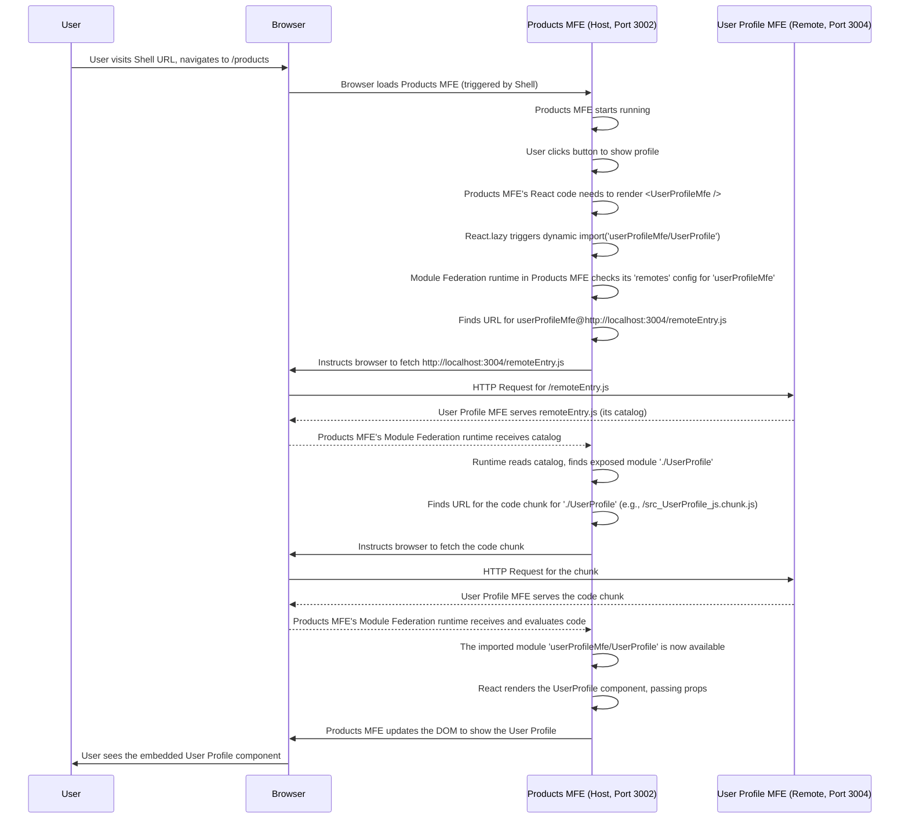

# Chapter 7: Component MFE

Welcome back to the `mfe-project` tutorial! So far, we've covered the foundational concepts: [Webpack Module Federation](01_webpack_module_federation_.md) (the tech enabling code sharing), [Micro Frontends (MFEs)](02_micro_frontend__mfe_.md) (the independent application parts), the [Shell (Host) Application](03_shell__host__application_.md) (the orchestrator), [Remotes Configuration](04_remotes_configuration_.md) (how hosts find remotes), [Exposed Modules](05_exposed_modules_.md) (how remotes offer code), and [Shared Dependencies](06_shared_dependencies_.md) (how they efficiently share libraries).

Now, let's look at different _types_ of MFEs you might build in a Micro Frontend architecture. In this chapter, we'll focus on the **Component MFE**.

## What is a Component MFE?

Imagine our shopping mall again. We have independent stores ([MFEs](02_micro_frontend__mfe_.md)). But what about smaller services within the mall, like a phone charging station, a mini-ATM, or a digital directory? These aren't full stores, but small, self-contained service points that can be placed _inside_ different stores or in common areas.

A **Component MFE** is just like one of these service kiosks. It's an independent Micro Frontend application whose primary purpose is to expose **one or a few reusable UI components** that can be embedded _within_ other applications (the Shell or other MFEs).

Its goal is not to render an entire page, but to provide a specific piece of functionality or UI that can be used wherever it's needed across your larger application.

Examples in our `mfe-project`:

- The **Header MFE** (`header-mfe`): Exposes a `Header` component used by the Shell.
- The **User Profile MFE** (`user-profile-mfe`): Exposes a `UserProfile` component intended to be embedded where a user's profile details are needed (in our case, within the Products MFE).

## Why Use Component MFEs?

- **Reusability:** Build a common component once (like a fancy button, a date picker, or a user card) and use it in multiple MFEs without copying code.
- **Independent Development:** A team can own, develop, and deploy this component MFE independently, even if it's used by many other teams.
- **Isolation:** Styles and logic for the component are contained within its own MFE, reducing conflicts with the host environment.
- **Graceful Degradation:** As we'll see in [Chapter 9: Error Boundary](09_error_boundary_.md), if a Component MFE fails to load, you can show a fallback within the specific area it was supposed to occupy, without breaking the entire page.

## How Does a Component MFE Work?

A Component MFE is fundamentally set up just like any other MFE participating in Module Federation, but with a specific focus on _what_ it exposes.

Let's use the `user-profile-mfe` as our example. Its purpose is to provide a `<UserProfile />` component.

### Step 1: The Component MFE Defines What It Exposes (`webpack.config.js`)

Just like any MFE that provides code, the Component MFE uses the `exposes` configuration in its `webpack.config.js`. This tells the world what specific component(s) are available.

From `user-profile-mfe/webpack.config.js` (Simplified):

```javascript
// --- File: user-profile-mfe/webpack.config.js ---
const ModuleFederationPlugin = require("webpack/lib/container/ModuleFederationPlugin");

module.exports = {
  // ... other webpack settings ...
  plugins: [
    new ModuleFederationPlugin({
      name: "userProfileMfe", // This MFE's unique name
      filename: "remoteEntry.js", // The catalog file name
      exposes: {
        // 🔑 Expose the UserProfile component under a public name
        "./UserProfile": "./src/UserProfile",
      },
      shared: {
        /* ... shared dependencies like react ... */
      },
    }),
    // ... other plugins ...
  ],
  // ... rest of config ...
};
```

This configuration is key. `exposes: { './UserProfile': './src/UserProfile' }` tells Webpack to:

1.  Find the code at the local path `./src/UserProfile` (which is `user-profile-mfe/src/UserProfile.js`).
2.  Bundle it into a separate chunk.
3.  List it in the `remoteEntry.js` catalog under the public name `./UserProfile`.

This public name (`./UserProfile`) is what other MFEs will use to request this specific component.

### Step 2: The Component MFE Implements the Component (`src/UserProfile.js`)

The code for the component itself is just standard React code. It can have its own state, props, styling, and logic, completely independent of where it will be used.

From `user-profile-mfe/src/UserProfile.js` (Simplified):

```javascript
// --- File: user-profile-mfe/src/UserProfile.js ---
import React, { useState } from "react";
import "./styles.css"; // Component has its own styles

const UserProfile = ({ user }) => {
  // Component state and logic
  const [isEditing, setIsEditing] = useState(false);
  // ... form data state ...

  // ... handleSave, handleCancel functions ...

  if (!user) {
    return <div className="user-profile error">No user data</div>;
  }

  return (
    <div className="user-profile">
      {" "}
      {/* Component's main container */}
      {/* ... UI based on isEditing state ... */}
      <div className="mfe-info">
        <span className="mfe-badge">User Profile MFE :3004</span>
      </div>
      {/* ... profile fields, buttons ... */}
    </div>
  );
};

export default UserProfile; // Export the component
```

This is a basic React component. It receives `user` data via props (showing how data can be passed _into_ a Component MFE) and manages its own editing state and form data. It also includes an info badge showing which MFE it is and its port, which is helpful for debugging in development.

The important part is that this component (`UserProfile`) is the one being `export default`-ed and pointed to in the `exposes` config.

### Step 3: A Consuming MFE Configures the Remote (`webpack.config.js`)

Now, let's look at the MFE that _wants_ to use the `UserProfile` component. In our project, the `products-mfe` uses the `user-profile-mfe`.

The consuming MFE needs to know where to find the `user-profile-mfe`'s catalog (`remoteEntry.js`). It does this using the `remotes` configuration, just like the Shell does for its remotes.

From `products-mfe/webpack.config.js` (Simplified):

```javascript
// --- File: products-mfe/webpack.config.js ---
const ModuleFederationPlugin = require("webpack/lib/container/ModuleFederationPlugin");
const getRemoteUrl = (port, name) => {
  /* ... logic for dev/prod URLs ... */ return `http://localhost:${port}/remoteEntry.js`;
};

module.exports = {
  // ... other webpack settings ...
  plugins: [
    new ModuleFederationPlugin({
      name: "productsMfe", // THIS MFE's name
      filename: "remoteEntry.js",
      exposes: {
        /* ... exposes its own modules like './App' ... */
      },
      remotes: {
        // 🔑 Configure the remote Component MFE here
        userProfileMfe: `userProfileMfe@${getRemoteUrl(
          3004,
          "user-profile-mfe"
        )}`,
      },
      shared: {
        /* ... shared dependencies ... */
      },
    }),
    // ... other plugins ...
  ],
  // ... rest of config ...
};
```

The line `userProfileMfe: `userProfileMfe@${getRemoteUrl(3004, 'user-profile-mfe')}`,` is crucial. It tells the `products-mfe` that:

1.  It can refer to this remote MFE using the local name `userProfileMfe`.
2.  The remote MFE it's referring to is named `userProfileMfe` (matching the `name` in the remote's config).
3.  It can find the catalog (`remoteEntry.js`) for this remote MFE at the specified URL (e.g., `http://localhost:3004/remoteEntry.js` in development).

### Step 4: The Consuming MFE Imports and Uses the Component (e.g., `products-mfe/src/App.js`)

Finally, in the React code of the consuming MFE, you can import and render the exposed component. Because it's loaded dynamically at runtime, you must use `React.lazy` and wrap it in `<Suspense>`. Using an `<ErrorBoundary>` around it is also highly recommended for robustness.

From `products-mfe/src/App.js` (Simplified):

```javascript
// --- File: products-mfe/src/App.js ---
import React, { Suspense, useState } from "react";
// ... other imports ...
import ErrorBoundary from "./components/ErrorBoundary"; // Assuming ErrorBoundary exists

// 🔑 Lazy load the component MFE using the local remote name and exposed module name
const UserProfileMfe = React.lazy(() => import("userProfileMfe/UserProfile"));

const App = () => {
  // ... state and other logic ...
  const [showProfile, setShowProfile] = useState(false);

  // Mock user data to pass as props
  const currentUser = {
    id: 1,
    name: "John Doe",
    email: "john.doe@example.com",
    role: "Manager",
    avatar: "👨‍💼",
  };

  return (
    <div className="products-mfe">
      {/* ... Products MFE's own layout ... */}

      <div className="user-section">
        <button onClick={() => setShowProfile(!showProfile)}>
          {currentUser.avatar} {currentUser.name} {showProfile ? "▼" : "▶"}
        </button>
      </div>

      {/* 🔑 Render the Component MFE when needed */}
      {showProfile && (
        <div className="embedded-profile">
          <h3>👤 User Profile (Embedded MFE)</h3>
          {/* Use ErrorBoundary for graceful failure */}
          <ErrorBoundary fallback={<div>Error loading User Profile</div>}>
            {/* Use Suspense for loading state */}
            <Suspense fallback={<div>Loading User Profile...</div>}>
              {/* 🔑 Use the lazy-loaded component like any other React component */}
              <UserProfileMfe user={currentUser} />
            </Suspense>
          </ErrorBoundary>
        </div>
      )}

      {/* ... Rest of Products MFE content ... */}
    </div>
  );
};

export default App;
```

Notice how `import('userProfileMfe/UserProfile')` uses the `localRemoteName/ExposedModuleName` format we discussed in [Chapter 5: Exposed Modules](05_exposed_modules_.md). Webpack Module Federation intercepts this import. It looks up `userProfileMfe` in its `remotes` config, fetches the `remoteEntry.js` from the specified URL, and then fetches the specific code chunk for the exposed module named `./UserProfile`.

The `UserProfileMfe` component is then rendered using `<Suspense>` and can receive props (`user={currentUser}`), just like a locally defined component.

## How it Works Under the Hood (Simplified)

Let's trace the loading of the `UserProfileMfe` within the `ProductsMfe`:



This flow shows how the `ProductsMFE` acts as the _host_ in this scenario, dynamically loading the `UserProfileMFE` which acts as the _remote Component MFE_.

Crucially, because React and other common libraries are marked as [Shared Dependencies](06_shared_dependencies_.md) with `singleton: true`, both the `ProductsMFE` and `UserProfileMFE` will use the _same single instance_ of React provided by the Shell, preventing multiple copies from loading and ensuring compatibility.

## Conclusion

**Component MFEs** are a powerful pattern in Micro Frontend architectures, allowing you to build and deploy small, reusable UI components independently. They expose specific components using the `exposes` configuration in their Webpack setup. Other MFEs or the Shell can then consume these components by configuring the Component MFE in their `remotes` and dynamically importing the exposed module using `React.lazy`, `Suspense`, and recommended `ErrorBoundary` wrappers.

This pattern is ideal for elements like headers, footers, navigation menus, user profile cards, notification components, and other UI pieces that need to appear in various places across your application.

While Component MFEs provide reusable UI pieces, often a Micro Frontend needs to manage an entire section or page of the application, potentially with its own internal routing and complex logic. This is the concept of a **Page MFE**, which we will explore in the next chapter.

[Next Chapter: Page MFE](08_page_mfe_.md)
