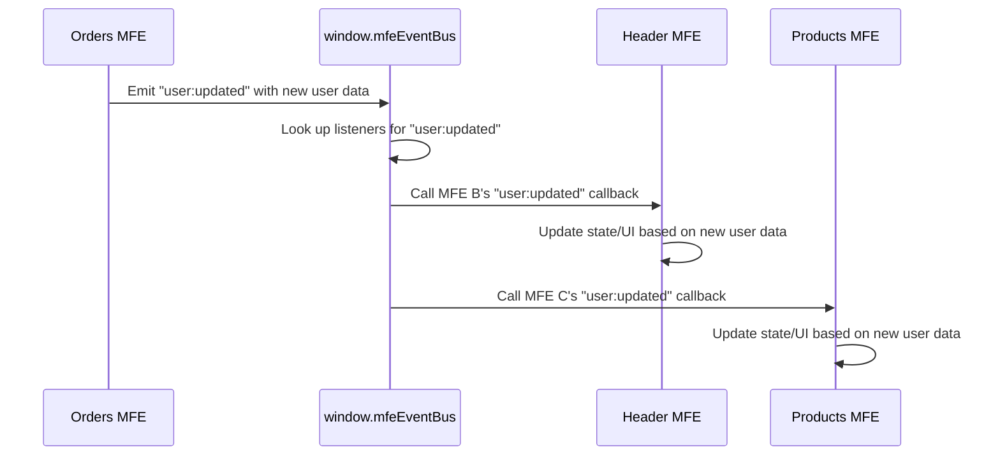

# Chapter 7: Event Bus (`window.mfeEventBus`)

Welcome back! In the previous chapter, [Chapter 6: Shared Modules/Libraries](06_shared_modules_libraries_.md), we learned how Webpack Module Federation helps our independent Micro Frontends (MFEs) and the Shell application efficiently share common code libraries like React. This saves download size and prevents conflicts.

Now, let's think about how these separate MFEs communicate with each other _while they are running_. If a user updates their profile picture in one part of the application (handled by one MFE), how does the header (handled by a different MFE) get updated automatically? Direct communication between MFEs is tricky because they are built and deployed independently – they don't know _where_ the other MFE is located or _how_ to call its functions directly.

### What Problem Does the Event Bus Solve?

Imagine our shopping mall again. The Shell is the mall building, and MFEs are independent stores. What if the shoe store has a big sale, and the sign shop in the mall needs to know so it can quickly print new promotional posters? Or what if a customer updates their loyalty points in the electronics store, and their points balance displayed in the header of the mall's website needs to reflect that?

The stores (MFEs) are separate and don't have direct phone lines to each other. Trying to connect every store to every other store directly would be a tangled mess!

We need a way for one MFE to broadcast a message that _any_ other MFE or the Shell can hear and react to, without needing to know _who_ is listening or _how_ to reach them.

This is where the **Event Bus** comes in.

### What is an Event Bus?

Using our mall analogy, the Event Bus is like the **public announcement system** for the entire mall.

- It's a **central channel** accessible to everyone.
- Any store (MFE) or the mall management (Shell) can make an **announcement** (emit an event). They just broadcast the message to the system, like "Attention shoppers, the shoe store is having a sale!" They don't need to know _which_ specific shops (like the sign shop) care about sales announcements.
- Other stores (MFEs) or mall management can choose to **listen** (subscribe) to specific types of announcements. The sign shop listens for "sale" announcements, the security office might listen for "lost child" announcements. They only react when they hear an announcement they are interested in.

In technical terms, an Event Bus is a pattern where different parts of an application can communicate indirectly by sending and receiving messages (events).

- Components **emit** (publish) events when something happens (e.g., `user:updated`, `product:added`, `order:placed`).
- Other components **subscribe** (listen) to specific event types and execute a function (callback) when that event is emitted.

This decouples the sender from the receiver. The sender of the event doesn't need to know _who_ is listening, and the listener doesn't need to know _who_ sent the event. They only need to agree on the name of the event (e.g., `"user:updated"`) and the format of the data sent with it.

### The `window.mfeEventBus` in Our Project

In our `mfe-project`, the Shell application sets up a single, global instance of a simple Event Bus and attaches it to the browser's `window` object as `window.mfeEventBus`. This makes the event bus accessible to _any_ MFE or the Shell running on the page.

Think of `window.mfeEventBus` as the handle for the mall's public announcement microphone and the receiver for tuning into specific announcement types.

The core functions provided by `window.mfeEventBus` are:

1.  **`on(eventName, callback)`**: Subscribe to an event. When `eventName` is emitted, the `callback` function will be called.
2.  **`emit(eventName, data)`**: Emit an event. This triggers all callbacks that are subscribed to `eventName`, passing them the `data`.
3.  **`off(eventName, callback)`**: Unsubscribe from an event (less commonly used directly, as `on` often returns an unsubscribe function).

### Use Case: User Data Updates

Let's look at the example where updating the user's name or email in one MFE needs to be reflected everywhere.

In our project, the `Products MFE` (`products-mfe`) and the `Orders MFE` (`orders-mfe`) both have components that allow editing user details (name in Products, email in Orders). The `Header MFE` (`header-mfe`) displays the user's name and email.

The Shell application loads the initial user data using a shared service ([User API Service (`UserApiService`)](09_user_api_service___userapiservice__.md)) and makes it available initially via a [Shared Context (`window.mfeGlobalContext`)](08_shared_context___window_mfeglobalContext__.md), which we'll cover in the next chapter. But when an MFE _updates_ the user data, the other MFEs need to know _immediately_.

Here's how the Event Bus makes this real-time update possible:

1.  **Orders MFE (or Products MFE) Updates User:** The user edits their email in the Orders MFE and clicks "Save".
2.  **Orders MFE Emits Event:** The Orders MFE calls a shared service function (`UserApiService.updateUserAndNotify()`) which updates the backend user data _and then emits_ the `"user:updated"` event on the `window.mfeEventBus`, including the new user data.
3.  **Header MFE Listens:** The Header MFE has subscribed to the `"user:updated"` event. Its callback function receives the new user data.
4.  **Header MFE Reacts:** The Header MFE's callback updates its local state with the new user data. Because it's React state, the Header component re-renders, showing the updated email.
5.  **Products MFE Listens & Reacts:** The Products MFE has also subscribed to the `"user:updated"` event. Its callback also receives the new user data and updates its local state/UI (like the user name display).

This happens seamlessly without the Orders MFE knowing or caring that the Header or Products MFE is listening.

### How to Subscribe to Events

MFEs typically subscribe to events when they mount and unsubscribe when they unmount to prevent memory leaks. This is perfectly handled using React's `useEffect` hook.

Look at the `useEffect` hook in `header-mfe/src/Header.js`:

```javascript
// header-mfe/src/Header.js (Simplified)
import React, { useState, useEffect } from "react";
// ... other imports ...

const Header = () => {
  const [user, setUser] = useState(null);

  useEffect(() => {
    if (window.mfeEventBus) {
      // Listen for user updates
      const unsubscribeUser = window.mfeEventBus.on(
        "user:updated",
        (userData) => {
          console.log("📡 Header MFE: Received user data update:", userData);
          setUser(userData); // Update local state
        }
      );

      // Clean up the subscription when the component unmounts
      return unsubscribeUser;
    }
  }, []); // Empty dependency array means this runs once on mount

  // ... rest of component logic ...
  return (
    // ... JSX that displays user.name and user.email ...
  );
};
```

**Explanation:**

- `if (window.mfeEventBus)`: Checks if the Event Bus has been set up by the Shell (important because the Shell might not always load first in complex scenarios, though it does in this project).
- `window.mfeEventBus.on("user:updated", (userData) => { ... })`: This is the subscription call.
  - `"user:updated"`: The name of the event we are interested in.
  - `(userData) => { ... }`: The callback function that will run whenever the `"user:updated"` event is emitted. The data sent with the `emit` call (`userData` in this case) is passed to this function.
- `const unsubscribeUser = ...`: The `on` method returns a function specifically designed to remove this listener.
- `return unsubscribeUser;`: Returning a function from `useEffect` tells React to run that function when the component unmounts or when the dependencies change (empty array means only on unmount). This is the standard way to clean up event listeners.

You can find similar `useEffect` blocks listening to `"user:updated"` in `products-mfe/src/App.js` and `orders-mfe/src/App.js`.

The `products-mfe` also listens to a different event emitted by the header:

```javascript
// products-mfe/src/App.js (Simplified)
import React, { Suspense, useState, useEffect } from "react";
// ... other imports ...

const App = () => {
  const [title, setTitle] = useState("Products Management");

  useEffect(() => {
    if (window.mfeEventBus) {
      // Listen for title updates from the Header
      const unsubscribeTitle = window.mfeEventBus.on(
        "update-title",
        (newTitle) => {
          console.log("📡 Products MFE: Received title update:", newTitle);
          setTitle(newTitle); // Update local state
        }
      );

      // Clean up the subscription
      return unsubscribeTitle;
    }
  }, []);

  // ... rest of component logic ...
  return (
    // ... JSX that displays the title state ...
  );
};
```

Here, the Products MFE subscribes to an event named `"update-title"`.

### How to Emit Events

Emitting an event is simpler – you just call the `emit` method on the bus.

In `header-mfe/src/Header.js`, there's a button that emits an event:

```javascript
// header-mfe/src/Header.js (Simplified JSX snippet)
<button
  onClick={() => {
    window.mfeEventBus.emit(
      "update-title", // Event name
      "Title Changed via event bus" // Data payload
    );
  }}
>
  click me to update Product title
</button>
```

**Explanation:**

- `window.mfeEventBus.emit("update-title", "Title Changed via event bus")`: This call broadcasts the `"update-title"` event to everyone listening on the bus, sending the string `"Title Changed via event bus"` as data.

When the user clicks this button, the Products MFE's `"update-title"` listener (shown above) is triggered, and the title on the Products page updates.

The `"user:updated"` event is emitted slightly differently in this project. The `updateUser` functions in both `products-mfe/src/App.js` and `orders-mfe/src/App.js` call a shared service ([User API Service (`UserApiService`)](09_user_api_service___userapiservice__.md)) which is responsible for _both_ updating the user data (e.g., calling an API) _and_ then emitting the `"user:updated"` event on the bus with the fresh user data. This keeps the event emission logic consistent and centralized within the service.

```javascript
// orders-mfe/src/App.js (Simplified function)
const updateUser = async (updates) => {
  try {
    // Calls a service that updates user AND emits the event
    await UserApiService.updateUserAndNotify(updates);
    console.log("🔄 Orders MFE: User update flow completed");
  } catch (error) {
    console.error("❌ Orders MFE: Failed to update user:", error.message);
    // ... handle error ...
  }
};
```

When `UserApiService.updateUserAndNotify` finishes successfully, it internally calls `window.mfeEventBus.emit("user:updated", latestUserData)`. We'll see the service implementation later.

### How it Works: Event Bus Flow

Here's a simple flow showing how an event travels:



The Event Bus acts as a central switchboard, directing the emitted event to all registered listeners for that specific event name.

### Internal Implementation Details

The `window.mfeEventBus` is a simple instance of a custom `EventBus` class defined in `shell/src/EventBus.js`.

Let's look at the core of this class:

```javascript
// shell/src/EventBus.js (Simplified class)
class EventBus {
  constructor() {
    this.events = {}; // Stores event names mapping to arrays of callbacks
  }

  on(event, callback) {
    if (!this.events[event]) {
      this.events[event] = []; // Create array for this event if needed
    }
    this.events[event].push(callback); // Add the callback to the list

    // Return a function to remove this specific listener
    return () => {
      this.events[event] = this.events[event].filter((cb) => cb !== callback);
    };
  }

  emit(event, data) {
    // Check if there are any listeners for this event
    if (this.events[event]) {
      // Call each listener with the provided data
      this.events[event].forEach((callback) => {
        try {
          callback(data);
        } catch (error) {
          console.error(`Error in event listener for ${event}:`, error);
        }
      });
    }
  }

  // off method is also there, but 'on' returning unsubscribe is preferred
}
```

**Explanation:**

- The `events` object is the heart of the bus. The keys are the event names (like `"user:updated"`), and the values are arrays containing all the callback functions (`[callback1, callback2, ...]`) that have subscribed to that event.
- `on()` adds a callback function to the appropriate array in the `events` object. It also returns a cleanup function.
- `emit()` looks up the event name in the `events` object. If it finds an array of callbacks, it loops through that array and calls each function, passing the `data` it received.

The Shell application creates a single instance of this class and puts it on the window:

```javascript
// shell/src/EventBus.js (End of file)
const eventBus = new EventBus();

// Make it globally accessible for all MFEs
window.mfeEventBus = eventBus;
```

This ensures that all MFEs and the Shell are using the _same_ instance of the Event Bus, allowing messages to flow between them.

### Conclusion

The Event Bus (`window.mfeEventBus`) provides a simple and effective way for independent Micro Frontends and the Shell application to communicate with each other in a decoupled manner. By emitting events when something significant happens and subscribing to events they care about, different parts of the application can react to changes across the system without needing direct knowledge of each other's internal structure or location. This is particularly useful for broadcasting updates like user data changes.

We saw how MFEs subscribe using `window.mfeEventBus.on()` within `useEffect` for proper lifecycle management and how events are emitted using `window.mfeEventBus.emit()`.

While the Event Bus is great for broadcasting notifications and triggering actions, sometimes MFEs need to access or share common data that isn't event-driven but more like a shared state. In the next chapter, we'll explore the [Shared Context (`window.mfeGlobalContext`)](08_shared_context___window_mfeglobalcontext___.md), which provides another mechanism for sharing information across MFEs.

[Shared Context (`window.mfeGlobalContext`)](08_shared_context___window_mfeglobalcontext___.md)
