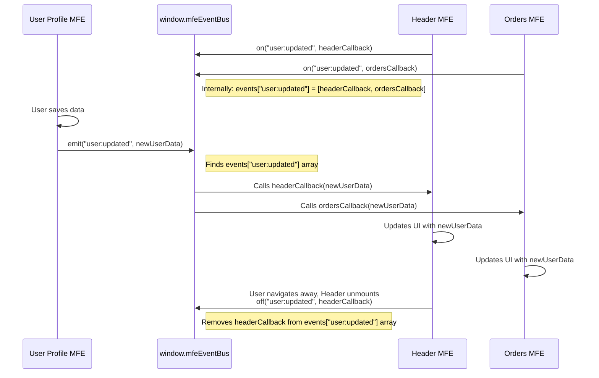

# Chapter 7: Event Bus (window.mfeEventBus)

Welcome back! In our last chapter, [Bootstrap Pattern](06_bootstrap_pattern__.md), we learned how `index.js` and `bootstrap.js` work together to ensure our Micro Frontends (MFEs) start up correctly after Webpack Module Federation has initialized.

Now that our independent MFEs can load and display side-by-side, we face a new challenge: **How do these independent pieces talk to each other?**

## The Problem: MFEs Need to Coordinate

Imagine you have a website built with MFEs:

- The **Header MFE** displays the user's name.
- The **User Profile MFE** allows the user to change their name.
- The **Orders MFE** might show orders associated with the user's email.

If the user updates their email address in the **User Profile MFE**, how does the **Orders MFE** know to update its display to reflect the new email for future lookups? How does the **Header MFE** know the user's name has changed so it can update what it shows?

We could try having the User Profile MFE directly call a function inside the Orders MFE or Header MFE, but this breaks the independence we worked so hard to build! The User Profile MFE shouldn't need to know the internal details or even _existence_ of every other MFE that might care about a user update. That would make our MFEs tightly coupled, defeating the purpose of a Micro Frontend architecture.

We need a way for MFEs to announce things that happen ("Hey, the user updated their profile!") without caring _who_ is listening, and for other MFEs to listen for specific announcements _without_ caring _who_ made them.

## The Solution: The Event Bus (window.mfeEventBus)

This is where the **Event Bus** comes in. Think of the Event Bus as a **central announcement board** or a simple **messaging system** that exists in the browser's memory, accessible to _any_ JavaScript running on the page, including all our loaded MFEs.

In our `mfe-project`, this central announcement board is exposed globally on the browser's `window` object as `window.mfeEventBus`.

The Event Bus provides two main actions:

1.  **`emit` (Broadcast/Post):** An MFE can `emit` an **event**. This is like writing a message and pinning it to the announcement board under a specific category (the event name). Any other MFE that is subscribed to that category will receive the message.
2.  **`on` (Listen/Subscribe):** An MFE can `on` (listen for) an event of a specific name. This is like telling the announcement board, "Notify me whenever someone posts a message under the category 'user:updated'". You provide a function (a "callback") that the Event Bus will call whenever that event is emitted.

This pattern is often called **Publish/Subscribe** or **Pub/Sub**. One MFE publishes (emits) an event, and multiple other MFEs can subscribe (listen) to it.

Using our example:

- The **User Profile MFE** `emits` an event named `"user:updated"` whenever a user successfully saves their profile changes. It includes the new user data as part of the message.
- The **Header MFE** uses `on` to listen for the `"user:updated"` event. When it receives the event, it updates its display using the new data provided in the message.
- The **Orders MFE** also uses `on` to listen for the `"user:updated"` event. When it receives the event, it might store the new user data or re-fetch information using the updated email.

Neither the User Profile MFE knows which MFEs listened, nor do the listeners know that it was specifically the User Profile MFE that emitted the event. They only interact through the central `window.mfeEventBus` and the agreed-upon event name (`"user:updated"`). This keeps them nicely decoupled!

## How to Use the Event Bus

The `window.mfeEventBus` object is available to all your MFE code once the Shell application has initialized it (as part of the [Bootstrap Pattern](06_bootstrap_pattern__.md)).

### 1. Emitting an Event

When something important happens in your MFE that other MFEs might care about, you `emit` an event.

Let's look at the `user-profile-mfe`. After successfully saving user data (often via an API service owned by the Shell, as seen in [Chapter 9](09_api_service_pattern_.md)), it needs to notify others. This logic is often handled within an API service layer for consistency, but conceptually, the `emit` happens after the update is confirmed.

Here's a simplified look at where the `emit` happens, likely within a function that handles saving user data in `user-profile-mfe` (or perhaps in a shared API service layer if the Shell owns the API calls):

```javascript
// Inside a function in user-profile-mfe that handles saving user data
// ... after successfully saving user data via API ...

const updatedUserData = {
  /* ... the newly saved data ... */
}; // Example data

console.log("📢 User Profile MFE: Emitting 'user:updated' event");

// Emit the event with the new data
window.mfeEventBus.emit("user:updated", updatedUserData);
```

Explanation:

- `window.mfeEventBus`: Accesses the global Event Bus instance.
- `.emit("user:updated", updatedUserData)`: Calls the `emit` method.
  - `"user:updated"`: This is the name (or "type") of the event being emitted. It's a good practice to use descriptive names, often with a colon (`:`), like `domain:action` or `mfeName:event`.
  - `updatedUserData`: This is the data payload sent with the event. You can pass any JavaScript value here (objects, strings, numbers, etc.). Listeners will receive this data.

When this line of code runs, the Event Bus receives the event name and the data. It then finds all the functions that have subscribed to `"user:updated"` and calls each one, passing the `updatedUserData` to them.

### 2. Listening for an Event (`on`)

In any MFE that needs to react to an event, you `on` (listen for) it. This is typically done when the MFE component mounts or initializes, often using a React `useEffect` hook to manage subscriptions correctly.

Let's see how the `header-mfe` listens for `user:updated`:

```javascript
// Inside header-mfe/src/Header.js component
import React, { useState, useEffect } from "react";
// ... other imports ...

const Header = () => {
  const [user, setUser] = useState(null);

  useEffect(() => {
    // Check if the Event Bus exists (it should, initialized by Shell)
    if (window.mfeEventBus) {
      console.log("👂 Header MFE: Subscribing to 'user:updated'");

      // Define the function that will run when 'user:updated' is emitted
      const handleUserUpdated = (userData) => {
        console.log(
          "🎉 Header MFE: Received 'user:updated' event with data:",
          userData
        );
        setUser(userData); // Update the header's state with new user data
      };

      // Subscribe to the event
      window.mfeEventBus.on("user:updated", handleUserUpdated);

      // *** CLEANUP IS CRUCIAL ***
      // Return a cleanup function that unsubscribes when the component unmounts
      return () => {
        console.log("🧹 Header MFE: Unsubscribing from 'user:updated'");
        window.mfeEventBus.off("user:updated", handleUserUpdated);
      };
    }
    // Empty dependency array means this effect runs only once on mount/unmount
  }, []);

  // ... rest of the component logic using the 'user' state ...
};

export default Header;
```

Explanation:

- `useEffect(() => { ... }, [])`: This hook is used to perform side effects (like setting up subscriptions) when the component mounts and clean them up when it unmounts. The empty `[]` dependency array ensures it runs only once on mount and cleanup on unmount.
- `window.mfeEventBus.on("user:updated", handleUserUpdated)`: Calls the `on` method.
  - `"user:updated"`: The name of the event to listen for. This must exactly match the name used when emitting.
  - `handleUserUpdated`: The callback function that the Event Bus will execute whenever the `"user:updated"` event is emitted. This function receives the data payload sent with the event (the `updatedUserData` object in the `emit` example).
- **Cleanup (`return () => { ... }`):** This is vital for preventing memory leaks. When the `Header` component is removed from the page (e.g., navigating away), the `useEffect` cleanup function runs. Inside it, `window.mfeEventBus.off("user:updated", handleUserUpdated)` is called. This removes the `handleUserUpdated` function from the list of listeners for the `"user:updated"` event, ensuring that the function isn't accidentally called after the component is gone. This prevents errors and memory leaks.

Similarly, the `orders-mfe` and `products-mfe` can listen for the same `user:updated` event in their own `useEffect` hooks to react to the user data changes.

```javascript
// Inside orders-mfe/src/App.js (simplified)
// ... imports ...
const App = () => {
  const [user, setUser] = useState(null);

  useEffect(() => {
    if (window.mfeEventBus) {
      const handleUserUpdated = (userData) => {
        console.log("🎉 Orders MFE: Received 'user:updated' event");
        setUser(userData); // Update Orders MFE's state
      };
      window.mfeEventBus.on("user:updated", handleUserUpdated);
      return () => window.mfeEventBus.off("user:updated", handleUserUpdated);
    }
  }, []);
  // ... rest of component ...
};
```

```javascript
// Inside products-mfe/src/App.js (simplified)
// ... imports ...
const App = () => {
  const [user, setUser] = useState(null);

  useEffect(() => {
    if (window.mfeEventBus) {
      const handleUserUpdated = (userData) => {
        console.log("🎉 Products MFE: Received 'user:updated' event");
        setUser(userData); // Update Products MFE's state
      };
      window.mfeEventBus.on("user:updated", handleUserUpdated);
      return () => window.mfeEventBus.off("user:updated", handleUserUpdated);
    }
  }, []);
  // ... rest of component ...
};
```

These examples show how multiple independent MFEs can all react to the _same_ event emitted by _another_ MFE, facilitating one-to-many communication.

## Under the Hood: How the Event Bus Works

The `window.mfeEventBus` is a very simple custom implementation. It's just a plain JavaScript object with a few methods.

### Non-Code Walkthrough

1.  **Initialization:** When the Shell application starts up (as part of its bootstrap process), it creates a single instance of the `EventBus` class and attaches it to `window.mfeEventBus`.
2.  **Storing Listeners:** Inside the `EventBus` instance, there's an object (let's call it `events`). The keys of this object are event names (like `"user:updated"`), and the value for each key is an _array_ of the callback functions that have subscribed to that event name.
3.  **Subscribing (`on`):** When an MFE calls `window.mfeEventBus.on("some-event", callbackFunction)`, the Event Bus finds or creates the array for `"some-event"` in its `events` object and adds `callbackFunction` to that array.
4.  **Emitting (`emit`):** When an MFE calls `window.mfeEventBus.emit("some-event", data)`, the Event Bus looks up `"some-event"` in its `events` object. If it finds an array of callbacks, it loops through that array and calls _each_ function in the array, passing the `data` to it.
5.  **Unsubscribing (`off`):** When an MFE calls `window.mfeEventBus.off("some-event", callbackFunction)`, the Event Bus finds the array for `"some-event"` and removes the specific `callbackFunction` from it.



This diagram illustrates how the Event Bus acts as an intermediary, decoupling the emitter from the listeners.

### Code Implementation Details

The actual implementation of the `EventBus` class is quite simple and lives in `shell/src/EventBus.js`:

```javascript
// From shell/src/EventBus.js (simplified)

/**
 * Simple Event Bus for MFE Communication
 */
class EventBus {
  constructor() {
    // Store event names and their listener functions
    this.events = {};
  }

  // Method to subscribe to an event
  on(event, callback) {
    // If no listeners yet for this event, create an empty array
    if (!this.events[event]) {
      this.events[event] = [];
    }
    // Add the callback function to the list for this event
    this.events[event].push(callback);

    // Optional: Return a function to easily unsubscribe later
    return () => {
      this.events[event] = this.events[event].filter((cb) => cb !== callback);
    };
  }

  // Method to unsubscribe from an event
  off(event, callback) {
    // Find the list of listeners for this event
    if (this.events[event]) {
      // Filter out the specific callback function
      this.events[event] = this.events[event].filter((cb) => cb !== callback);
    }
  }

  // Method to emit (broadcast) an event
  emit(event, data) {
    // Find the list of listeners for this event
    if (this.events[event]) {
      // Call every single listener function, passing the data
      this.events[event].forEach((callback) => {
        try {
          callback(data); // Call the listener!
        } catch (error) {
          console.error(`Error in event listener for ${event}:`, error);
          // Handle errors in listeners gracefully
        }
      });
    }
  }
}

// Create a single instance of the EventBus
const eventBus = new EventBus();

// Attach the instance to the global window object
window.mfeEventBus = eventBus;

// Note: This EventBus.js file is typically imported once in the Shell's
// bootstrap or main entry file (like shell/src/App.js) to ensure it's
// initialized and available before MFEs try to use it.
```

This code confirms the simple implementation described: an `events` object stores arrays of callbacks per event name, and `on`, `off`, and `emit` manage these arrays and trigger the callbacks. Attaching `eventBus` to `window.mfeEventBus` makes it globally accessible to all scripts loaded on the page, regardless of which MFE they belong to.

The Shell's `App.js` imports `./EventBus` early:

```javascript
// From shell/src/App.js (simplified)
// ... imports ...
import "./EventBus"; // Initialize event bus

// ... rest of App.js ...
```

This ensures the `window.mfeEventBus` object is created and available in the global scope as soon as the Shell's `App.js` script runs, well before any Remote MFEs are loaded dynamically.

## Benefits of Using an Event Bus

- **Decoupling:** MFEs don't need direct references to each other. Communication happens indirectly through the Event Bus.
- **Flexibility:** New MFEs can subscribe to existing events without requiring changes to the emitting MFE.
- **One-to-Many:** A single event emitted can be received by any number of interested listeners.
- **Simplicity:** The core concept of emit/listen is easy to understand and implement.

## When to Use the Event Bus vs. Other Methods

The Event Bus is great for broadcasting _events_ or _notifications_ about something that happened. It's less ideal for:

- **Requesting Data:** If an MFE needs specific data _right now_ (like initial user details when it loads), querying an [API Service](09_api_service_pattern_.md) or accessing a [Global Context](08_global_context__window_mfeglobalcontext__.md) is usually more appropriate than emitting an event and waiting for a response.
- **Direct Commands:** If one MFE needs to tell another MFE to perform a very specific action that _only_ that other MFE can do, sometimes a more direct (but still decoupled) approach like calling an exposed function might be considered, though Semantic Actions ([Chapter 10](10_semantic_actions__.md)) combined with the Event Bus are often preferred for complex workflows owned by the Shell.

In our `mfe-project`, the Event Bus is primarily used for broadcasting changes (like `user:updated`) or requesting high-level actions from the Shell (like Natasha Chatbot emitting `natasha:navigate` to ask the Shell to change the page, as seen in [Chapter 2](02_shell__host__application__.md)).

## Conclusion

The Event Bus, exposed globally as `window.mfeEventBus`, is a powerful and simple mechanism for enabling communication between independent Micro Frontends in the `mfe-project`. By using the `emit` and `on` methods, MFEs can broadcast events and subscribe to notifications without creating tight dependencies on each other, promoting a decoupled and maintainable architecture. Remember the importance of cleaning up subscriptions with `off` to avoid memory issues.

While the Event Bus is excellent for broadcasting events, sometimes MFEs just need to access shared information or state that doesn't change constantly. This is where the Global Context comes in.

Let's explore that in the next chapter!

[Global Context (window.mfeGlobalContext)](08_global_context__window_mfeglobalcontext__.md)
