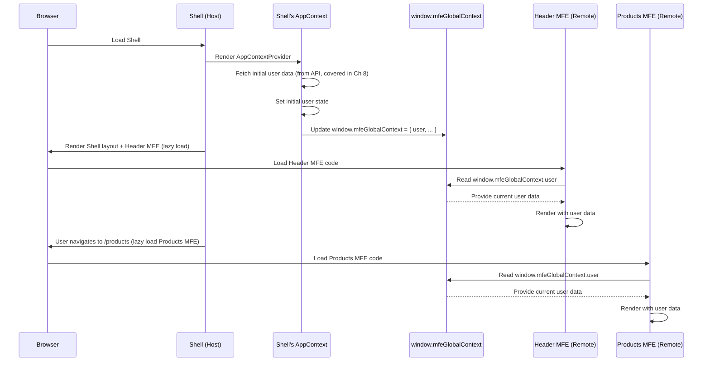

# Chapter 7: Global Context (window.mfeGlobalContext)

Welcome back! In the previous chapter, [Chapter 6: Event Bus (window.mfeEventBus)](06_event_bus__window_mfeeventbus__.md), we learned how independent Micro Frontends (MFEs) can communicate by broadcasting and listening for events using a central Event Bus (`window.mfeEventBus`). This is great for _notifying_ other parts of the application when something _happens_ (like user data being updated).

But what if an MFE needs to know the _current_ state of something as soon as it loads? For example, when the Header MFE or the Products MFE loads, they immediately need to know who the currently logged-in user is so they can display the username or avatar. They don't want to wait for a `"user:updated"` event; they need the information _now_.

This is where the **Global Context** comes in.

Think of our shopping mall analogy again. The Event Bus is the announcement system. The Global Context is like the central "Information Board" or "Directory" located in the mall's common area. It contains important, shared information like the mall's opening hours, a list of shops, or maybe the current promotions happening _today_.

- If a shop has a flash sale, they use the **Announcement System (Event Bus)** to tell everyone _immediately_.
- If a shopper needs to find the list of all stores or the mall's current hours, they look at the **Information Board (Global Context)** to _read_ the current, stable information.

The Global Context provides a simple way for any MFE to _read_ shared application state whenever it needs it, acting like that shared information board available to all.

## The Solution: A Shared Information Board (`window.mfeGlobalContext`)

In our project, the Shell application is responsible for setting up and maintaining a global JavaScript object available at `window.mfeGlobalContext`. This object holds key pieces of shared application state that multiple MFEs might need to read.

Currently, this context primarily includes:

- **`user`**: The data object for the currently logged-in user (e.g., name, email, role, avatar).
- **`loading`**: A boolean indicating if the initial shared data (like user) is still being fetched.
- **`error`**: Any error message related to fetching the initial shared data.
- **`apiStatus`**: A string indicating the status of the main application API (e.g., `"connected"`, `"error"`).

Any MFE loaded by the Shell can access this `window.mfeGlobalContext` object directly to read this information.

## How to Access Global Context in an MFE

Accessing the global context is straightforward because it's attached to the standard `window` object in the browser, which is globally accessible by all scripts running on the page.

Here's how an MFE (like the Header MFE or Products MFE) can read the current user data when it first loads:

```javascript
// Snippet from header-mfe/src/Header.js or products-mfe/src/App.js

import React, { useState, useEffect } from "react";
// ... other imports

const Header = () => {
  // Or App = () => { ... }
  const [user, setUser] = useState(null);
  // ... other state

  useEffect(() => {
    // ✅ Read the initial user data from the global context
    const initialContext = window.mfeGlobalContext;

    if (initialContext && initialContext.user) {
      console.log(
        "📖 MFE: Read initial user from global context:",
        initialContext.user
      );
      setUser(initialContext.user); // Use the user data from the context
    } else {
      console.log("⚠️ MFE: Global context or user data not yet available.");
      // Handle case where context isn't ready or user is null
    }

    // We ALSO subscribe to events to catch future updates (as seen in prev chapter)
    if (window.mfeEventBus) {
      const unsubscribeUser = window.mfeEventBus.on(
        "user:updated",
        (userData) => {
          console.log("👂 MFE: Received user data update via event bus");
          setUser(userData); // Update local state based on event
        }
      );
      return unsubscribeUser; // Cleanup event listener
    }

    // Cleanup function for useEffect (important for event listeners)
    return () => {}; // Return an empty function if no listener was subscribed
  }, []); // Empty dependency array means this runs once on mount

  // ... rest of component uses the 'user' state ...
};
```

In this snippet:

- We access `window.mfeGlobalContext` directly.
- We check if it exists and contains the `user` property. This is important because the MFE might load slightly before the Shell has fully initialized the context, especially with lazy loading.
- We use the data (`initialContext.user`) to set the component's initial state (`user`).
- Notice this code is often combined with the Event Bus listener from the previous chapter. Reading from the Global Context gets the _initial_ state, and listening to the Event Bus ensures the MFE reacts to _subsequent changes_.

This pattern allows the MFE to render with the user data as soon as it's available in the global context, providing a faster initial render compared to waiting for an event.

Similarly, an MFE could read the `apiStatus`:

```javascript
// Snippet example (could be anywhere in an MFE component)

const App = () => {
  // ... other state

  useEffect(() => {
    const context = window.mfeGlobalContext;
    if (context) {
      console.log("📖 MFE: Current API Status:", context.apiStatus);
      // You could update a local state or display based on context.apiStatus
    }
    // ... potentially listen for API status change events if needed ...
  }, []);

  // ... rest of component
};
```

This provides a simple, synchronous way to get the current state of globally shared information.

## How it Works Under the Hood

The Shell application (`shell/`) is responsible for managing the `window.mfeGlobalContext`.

1.  **Shell Initialization:** When the Shell application starts, it typically fetches initial shared data (like the user data, often from an API). In this project, this happens in `shell/src/AppContext.js`.
2.  **Creating the Global Context:** The `AppContextProvider` in `shell/src/AppContext.js` creates a simple JavaScript object containing the shared state (`user`, `loading`, `error`, `apiStatus`).
3.  **Attaching to Window:** The Shell attaches this object to the global `window` object: `window.mfeGlobalContext = { user, loading, error, apiStatus };`. This makes it accessible from _any_ other script running on the page, including the code from other MFEs loaded via Module Federation.
4.  **Updating the Context:** When the shared state changes within the Shell (e.g., because an MFE triggered a user update API call, and the Shell received the update via the Event Bus listener it set up), the Shell updates its internal state (`user`, `error`, etc. within `AppContext`). The `useEffect` in `AppContext.js` that attaches the object to `window` runs again whenever these state variables change, ensuring `window.mfeGlobalContext` is always up-to-date with the Shell's latest knowledge.
5.  **MFEs Read:** MFEs can then access `window.mfeGlobalContext` whenever they need the current state.

Here's a simplified diagram showing how the Shell manages and MFEs read the global context:



Let's look at the relevant code snippet from the Shell's `AppContext.js`:

```javascript
// Snippet from shell/src/AppContext.js

import React, { createContext, useContext, useState, useEffect } from "react";
// ... import UserApiService

// ... createContext and fallbackUserData ...

export const AppContextProvider = ({ children }) => {
  const [user, setUser] = useState(fallbackUserData);
  const [loading, setLoading] = useState(true);
  const [error, setError] = useState(null);

  // useEffect 1: Fetch initial data (Covered in Chapter 8)
  useEffect(() => {
    // ... fetches user data ...
  }, []);

  // useEffect 2: Update global context when shell state changes
  useEffect(() => {
    // ✨ This is where the global context is created/updated!
    window.mfeGlobalContext = {
      user, // Latest user data from shell's state
      loading, // Latest loading status from shell's state
      error, // Latest error status from shell's state
      apiStatus: error ? "error" : "connected",
    };
    console.log("✅ Shell: Global context updated:", window.mfeGlobalContext);

    // We ALSO listen for updates from MFEs via Event Bus here
    const handleUserUpdated = (updatedUserData) => {
      console.log(
        "📡 Shell: Received user data update from MFE:",
        updatedUserData
      );
      setUser(updatedUserData); // Update Shell's state (triggers useEffect 2 again)
      setError(null);
    };

    // Ensure EventBus is initialized before subscribing (imported in App.js)
    if (window.mfeEventBus) {
      window.mfeEventBus.on("user:updated", handleUserUpdated);
      // Cleanup listener when context provider unmounts (unlikely in Shell)
      // return () => window.mfeEventBus.off("user:updated", handleUserUpdated);
    }
  }, [user, loading, error]); // This effect runs whenever user, loading, or error state changes

  // useEffect 3: Broadcast user updates via Event Bus (Covered in Chapter 6)
  useEffect(() => {
    // ... emits "user:updated" event when user state changes ...
  }, [user, loading]);

  // ... provide context value ...
  return (
    <AppContext.Provider
      value={{ user, loading, error, apiStatus: error ? "error" : "connected" }}
    >
      {children}
    </AppContext.Provider>
  );
};

// ... export AppContext ...
```

This simplified snippet from `AppContext.js` shows that the Shell's core application state (`user`, `loading`, `error`) is used to construct the `window.mfeGlobalContext` object whenever that state changes. This keeps the global context synchronized with the Shell's source of truth.

## Global Context vs. React Context

You might notice that the Shell uses `React.createContext` (`AppContext` in `shell/src/AppContext.js`) internally. This is different from `window.mfeGlobalContext`.

- **React Context:** This is a feature _within_ the Shell's React application tree. It's used to pass state down to components _within the Shell itself_. It works nicely for components that are part of the _same_ React application instance.
- **Global Context (`window.mfeGlobalContext`):** This is a plain JavaScript object attached to the browser's `window`. It's outside of any specific React tree. It's designed to be accessed by _any_ MFE, regardless of its framework (though ours are all React) or whether it's in the Shell's React tree. It's for sharing state across completely independent applications running in the same browser environment.

The Shell uses its internal React Context (`AppContext`) to manage its state and make it available to its _own_ components (if any). It then takes that state and _mirrors_ key parts of it onto the `window.mfeGlobalContext` object for the benefit of the independent MFEs.

## Benefits of Using Global Context

- **Immediate Access:** MFEs can read the current state synchronously when they need it, without waiting for an event.
- **Simplicity for Reading:** Accessing `window.mfeGlobalContext.propertyName` is very straightforward code.
- **Shared Source of Truth:** Provides a common place for key application state that all MFEs can rely on for reading.

## Limitations

- **No Reactivity (Directly):** Accessing `window.mfeGlobalContext` doesn't automatically re-render your component if the context _later_ changes. You need the Event Bus (`window.mfeEventBus`) _in addition_ if you want to react to changes.
- **Global Namespace:** Like the Event Bus, it pollutes the global `window` object.
- **Read-Only Convention:** It's strongly recommended that MFEs _only read_ from this context and do _not_ try to modify it directly. Updates should go through appropriate channels (like API calls, which might then trigger Event Bus events, which the Shell reacts to and updates the global context).
- **Initialization Order:** MFEs need to be mindful that the context might not be fully populated the _instant_ their code runs, hence the checks (`if (window.mfeGlobalContext && window.mfeGlobalContext.user)`).

In this project, the Global Context and the Event Bus work hand-in-hand: The Global Context provides the current state for reading, and the Event Bus provides notifications for changes to that state.

## Conclusion

In this chapter, we explored the **Global Context** (`window.mfeGlobalContext`). We learned that it's a simple, shared JavaScript object managed by the Shell application and attached to the browser's `window` object. Its purpose is to provide independent MFEs with a convenient and immediate way to _read_ key shared application state, such as user data and API status.

We saw how MFEs access this context directly and how it complements the Event Bus by providing the _current_ state, while the Event Bus notifies of _changes_. The Shell is responsible for keeping this global context updated based on its own state and events it receives.

This shared context often contains data fetched from backend services. In the next chapter, we'll look at how our MFEs interact with the User API Service to get and update this shared user data:

[Chapter 8: User API Service](08_user_api_service_.md)
