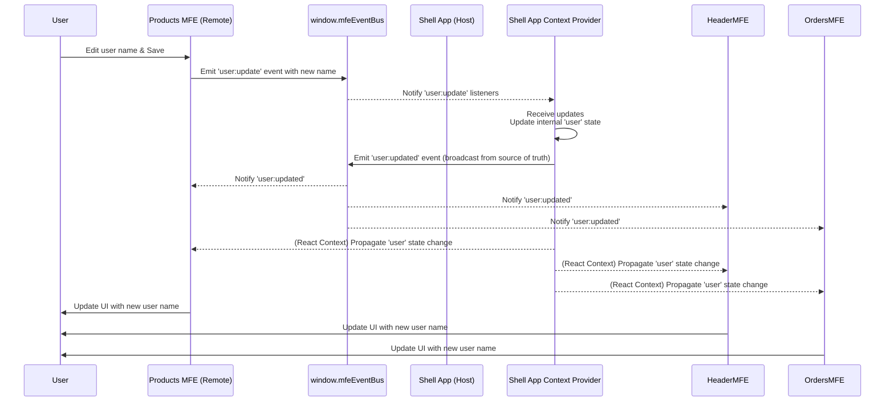

# Chapter 7: Inter-MFE Communication (Event Bus & Context)

Welcome back to the `mfe-project` tutorial! In our previous chapters, we've assembled quite the setup: we understand **[Micro Frontends (MFEs)](01_micro_frontend__mfe__.md)** as independent pieces (shops), the **[Shell (Host Application)](02_shell__host_application__.md)** that brings them together (the mall building), **[Webpack Module Federation](03_webpack_module_federation_.md)** as the underlying tech (the infrastructure), the **[Remote Entry File](04_remote_entry_file_.md)** (the shop's directory), **[Remote Modules](05_remote_module__exposed_component_app__.md)** (the specific products/services from a shop), and **[Shared Modules](06_shared_modules_.md)** (the common facilities like restrooms).

Now, imagine a customer is browsing products in the "Products Shop" (Products MFE) and updates their profile information using a special profile editor embedded right there. This user profile information is important for the "Header Shop" (Header MFE) to display the user's name, and for the "Orders Shop" (Orders MFE) to show their order history.

How do these completely independent 'shops' know that the user data has changed? How do they communicate with each other to stay updated? This is the challenge of **Inter-MFE Communication**.

## The Problem: Independent Pieces Need to Talk

Because MFEs are independent and deployed separately, they don't inherently know about each other's internal state or even necessarily exist in the same part of the page at the same time.

- The Products MFE can't directly call a function inside the Header MFE.
- The User Profile MFE component (which is even embedded _inside_ the Products MFE in our example!) can't directly update the state of the Orders MFE.

We need a standardized, loosely coupled way for MFEs (and the Shell) to share information or notify each other of events without becoming tightly dependent.

## The Analogy: Mall Communication Systems

In our mall analogy, having every shop call every _other_ shop directly to share news would be chaotic and inefficient. Instead, a mall uses:

1.  **A central intercom system:** The mall office or a shop can broadcast announcements ("Attention shoppers, the clothing store is having a flash sale!") that anyone listening can hear and react to. This is like an **Event Bus**.
2.  **A central bulletin board or information desk:** The mall office maintains important, shared information like opening hours, security notices, or lost & found items. Shops and customers can check this central source for common data. This is like **Shared Context**.

Our `mfe-project` uses both an Event Bus and a Shared Context managed by the Shell to facilitate communication between independent MFEs.

## Solution 1: The Event Bus (Intercom System)

The Event Bus is a simple pattern: it's a central place where you can:

- **Emit (broadcast) an event:** "Something happened! Here's some data about it." You don't care who hears it.
- **On (subscribe) to an event:** "Let me know if this specific type of event happens, and I'll run this function." You don't care who sent it.

In our project, the Shell sets up a simple global Event Bus instance on the `window` object so that all MFEs (which run within the same browser window) can access it easily: `window.mfeEventBus`.

**How it's used:**

When the user updates their profile _within the Products MFE_ (specifically using the simple editor provided _inside_ the Products MFE, not the full User Profile MFE embedded component):

1.  The `UserEditor` component in the Products MFE gets the new user data.
2.  It wants to tell the rest of the application that the user has been updated.
3.  It uses the global event bus to emit an event, specifically `'user:update'`, sending the updated data along with it.

Here's a simplified look at that part of the `products-mfe/src/App.js` code:

```javascript
// products-mfe/src/App.js (Simplified UserEditor save handler)

// ... inside UserEditor component ...

const handleSave = () => {
  if (username.trim() && username !== user.name) {
    // Use the global event bus to broadcast the update request
    if (window.mfeEventBus) {
      // Check if the bus exists (set by Shell)
      window.mfeEventBus.emit("user:update", { name: username.trim() }); // Emit the event!
    }
    setIsEditing(false);
  }
};
```

This is like the Products MFE sending an announcement over the mall intercom: "User profile update request! New name is [name]!"

The **Shell application** is listening for this specific announcement. It has subscribed to the `'user:update'` event on the same global event bus.

Here's a simplified look at the Shell's `AppContext.js` where it listens:

```javascript
// shell/src/context/AppContext.js (Simplified useEffect)
// ... inside AppContextProvider component ...

useEffect(() => {
  // ... code to set initial user context ...

  // Listen for user update REQUESTS from MFEs via the event bus
  const unsubscribeUserUpdate = window.mfeEventBus.on(
    "user:update",
    (updates) => {
      // Subscribe to the event!
      console.log("Shell received user:update event", updates); // See it in console
      // When an update is received, update the Shell's central user state
      setUser((prev) => ({ ...prev, ...updates })); // Update the state
    }
  );

  // Clean up the subscription when the component unmounts
  return () => {
    unsubscribeUserUpdate();
  };
}, []); // Dependency array carefully managed, but simplified here.
```

The Shell hears the "user:update" announcement and, as a result, updates its own internal state for the user data.

This combination of emitting and subscribing allows MFEs to trigger actions or share information without needing direct references to each other. The Event Bus is great for "fire and forget" notifications or triggering actions across different parts of the application.

## Solution 2: Shared Context (Central Bulletin Board)

While the Event Bus is good for notifications, what about sharing common _data_ that multiple MFEs need to read? This is where Shared Context comes in.

The Shell application is the ideal place to manage truly shared, application-wide data (like the currently logged-in user, application settings, etc.). It acts as the central source of truth.

In our project, the Shell uses React's Context API to create an `AppContext`. This context holds the current `user` data. The Shell's main `App` component wraps everything in an `AppContextProvider`, making the `user` data available to _all_ components rendered inside it, including our remote MFEs.

**How it's used:**

1.  The Shell initializes the `user` state in its `AppContextProvider` (`shell/src/context/AppContext.js`).
2.  This `AppContextProvider` makes the `user` state available via `AppContext.Provider`.
3.  The Header MFE, Orders MFE, and Products MFE (which are rendered _within_ the Shell's context provider tree) can use React's `useContext` hook to access this shared `user` data.

Here's a simplified look at how MFEs consume the shared context:

```javascript
// header-mfe/src/Header.js (Simplified)
import React, { useState, useEffect, useContext } from "react";
// ... other imports
import AppContext from "shell/context/AppContext"; // Import the shared context

const Header = () => {
  // Access the shared user data from the Shell's context
  const { user } = useContext(AppContext); // <-- Consume the context!

  // ... rest of the Header component ...

  return (
    <header className="mfe-header">
      {/* ... other header parts ... */}
      {user && ( // Use the user data to display name/avatar
        <div className="user-info">
          <span>{user.avatar}</span>
          <span>{user.name}</span>
        </div>
      )}
      {/* ... rest of header */}
    </header>
  );
};
// ... export
```

The Orders MFE and Products MFE use the same pattern to get the `user` data.

```javascript
// orders-mfe/src/App.js (Simplified)
import React, { useState, useEffect, useContext } from "react";
// ... other imports
import AppContext from "shell/context/AppContext"; // Import the shared context

const App = () => {
  // Access the shared user data
  const { user } = useContext(AppContext); // <-- Consume the context!

  // ... rest of Orders App component ...

  return (
    <div className="orders-mfe">
      {/* ... other parts ... */}
      {user && ( // Use the user data
        <div className="user-context">
          <span>{user.avatar}</span>
          <div>Welcome, {user.name}!</div>
        </div>
      )}
      {/* ... rest of Orders App */}
    </div>
  );
};
// ... export
```

This is like shops reading the central bulletin board to get the latest customer information maintained by the mall office.

## Putting It Together: The User Update Flow

Let's trace the user update example again, now seeing how the Event Bus and Shared Context work together:

1.  **User Action:** The user changes their name in the Products MFE's mini user editor and clicks "Save".
2.  **MFE Emits Event:** The Products MFE calls `window.mfeEventBus.emit("user:update", { name: "New Name" })`.
3.  **Shell Listens and Updates Context:** The Shell's `AppContextProvider` has a subscription (`window.mfeEventBus.on`) to "user:update". It receives the new name and updates its internal `user` state using `setUser`.
4.  **Context Update Triggers Re-renders:** Because the `user` state in the `AppContextProvider` changed, React automatically flags all components (including the Header, Orders, and Products MFEs) that consume `AppContext` for a re-render.
5.  **MFEs Receive Updated Data:** The Header, Orders, and Products MFEs re-render. Their `useContext(AppContext)` hook now returns the _new_ `user` object with the updated name.
6.  **UI Updates:** Each MFE updates its display to show the user's new name.



*(Note: The 'user:updated' event is emitted by the Shell *after* updating its state. While not strictly necessary if all MFEs *only* use the context, it's a good pattern for the source of truth to broadcast *its* changes. In this project, MFEs *do* subscribe to 'user:updated' in their `useEffect` hooks to sync their internal state or react, although the primary mechanism for getting the data seems to be `useContext`.)*

This combined approach provides both a way to trigger actions (Event Bus) and a central source for shared data that automatically updates consuming MFEs (Shared Context).

## Implementation Details

The `EventBus.js` is very simple:

```javascript
// shell/src/utils/EventBus.js (Simplified)
class EventBus {
  constructor() {
    this.events = {}; // Stores event names and their listeners
  }

  on(event, callback) {
    // Add a listener for an event
    if (!this.events[event]) {
      this.events[event] = [];
    }
    this.events[event].push(callback);
    // Returns a function to remove the listener later
    return () => {
      /* remove callback */
    };
  }

  emit(event, data) {
    // Trigger an event
    if (this.events[event]) {
      this.events[event].forEach((callback) => {
        callback(data); // Call all listeners
      });
    }
  }
}

// Create *one* instance and attach it globally
const eventBus = new EventBus();
window.mfeEventBus = eventBus; // Makes it accessible everywhere!
```

This code creates a single instance of `EventBus` and puts it on `window`, making it the central hub for all MFEs running in that browser tab.

The `AppContext.js` in the Shell ties the context and the event bus together:

```javascript
// shell/src/context/AppContext.js (Simplified)
import React, { createContext, useContext, useState, useEffect } from "react";

export const AppContext = createContext(); // Create the React Context

export const AppContextProvider = ({ children }) => {
  const [user, setUser] = useState(/* initial user data */); // State for shared data

  useEffect(() => {
    // Set initial data globally (for quick access/debugging, also useful for some MFE patterns)
    window.mfeGlobalContext = { user };

    // Listen for user update requests from the Event Bus
    const unsubscribe = window.mfeEventBus.on("user:update", (updates) => {
      setUser((prev) => ({ ...prev, ...updates })); // Update the shared state
    });

    // Broadcast *our* (Shell's) user state changes via Event Bus
    // This lets MFEs react even if they don't use context directly for *reading* user data
    // window.mfeEventBus.emit("user:updated", user); // (example, might be needed for certain patterns)

    return () => unsubscribe(); // Clean up listener
  }, []); // Dependencies carefully managed

  // Provide the shared 'user' data via React Context
  return <AppContext.Provider value={{ user }}>{children}</AppContext.Provider>;
};

export default AppContext;
```

The `AppContextProvider` holds the state, listens to the global event bus for _requests_ to change that state (`user:update`), updates its state, and provides the _current_ state value through the `AppContext.Provider`. React handles propagating the context value changes down the component tree to the consuming MFEs.

The MFEs then simply use `useContext(AppContext)` to read the data provided by the Shell.

This pattern ensures that the Shell remains the authority for shared data while providing MFEs with simple, decoupled mechanisms (Event Bus for events, Context for data) to interact and stay synchronized.

## Conclusion

Inter-MFE communication is essential for a unified user experience. Instead of direct, brittle connections, our `mfe-project` uses two key patterns managed by the Shell:

1.  **Event Bus:** A global message broker (`window.mfeEventBus`) allowing MFEs to broadcast events ('user:update') and others (like the Shell) to subscribe and react.
2.  **Shared Context:** A central place (Shell's `AppContext`) to hold common data (like user information) that MFEs can consume. When this data changes (often triggered by an Event Bus message handled by the Shell), consuming MFEs automatically re-render.

Together, these patterns allow independent MFEs to communicate and share vital information, keeping the different 'shops' in our 'mall' synchronized and providing a seamless experience for the user.

Now that our MFEs can talk to each other, the next crucial piece is how the user navigates between the different 'shops' or sections of our application.

[Next Chapter: Routing](08_routing_.md)
