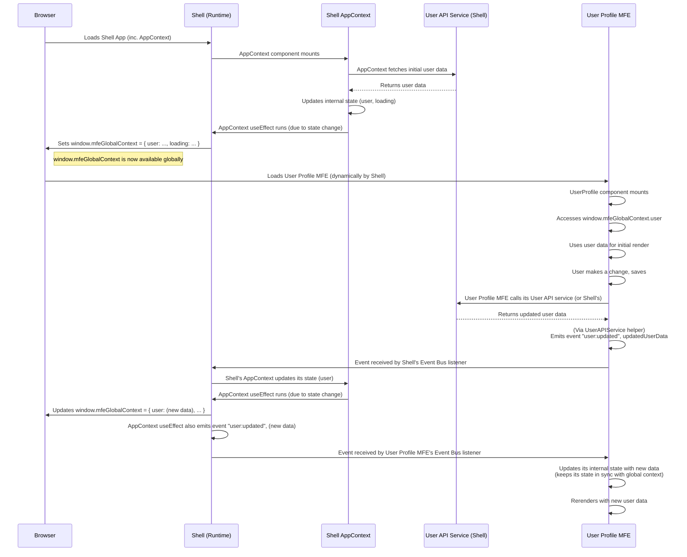

# Chapter 8: Global Context (window.mfeGlobalContext)

Welcome back to the **mfe-project** tutorial! In the last chapter, [Event Bus (window.mfeEventBus)](07_event_bus__window_mfeeventbus__.md), we explored how Micro Frontends (MFEs) can communicate with each other by broadcasting and listening for events. This is great for notifying others about something that _happened_ (like a user update).

But what if an MFE just needs to access common information that's already available, like the currently logged-in user's details or the status of an API connection? This data might be needed when the MFE first loads, or it might be read occasionally. Using an Event Bus for this feels a bit like shouting "What's the user's name?" every time you need it.

## The Problem: Needing Easy Access to Shared Information

Imagine your **Header MFE** needs to display the logged-in user's name and avatar. Your **Products MFE** might need the user's ID to show personalized content. Your **Orders MFE** needs the user's email to fetch their order history.

This user information is the same for everyone across the entire application, regardless of which MFE they are viewing. Where should this common data live, and how can every MFE easily get it without resorting to:

- Each MFE fetching the user data separately (wasteful!).
- Passing user data down through many layers of components via props ("prop drilling," which is cumbersome).
- Relying _only_ on the Event Bus (which is better for reactive updates, not initial reads).

We need a simple, central place where common, widely-needed data can be stored and easily accessed by any MFE.

## The Solution: The Global Context (window.mfeGlobalContext)

The **Shell application** is the ideal place to manage common data that's relevant across multiple MFEs. It acts as the main orchestrator and knows about the overall application state.

In the `mfe-project`, the Shell establishes a **Global Context** by attaching a plain JavaScript object to the browser's `window` object. This object is named `window.mfeGlobalContext`.

Think of `window.mfeGlobalContext` as a **shared reference book** kept on a table in the main hall (the Shell). Any resident (MFE) can walk up to the table, open the book, and read the information inside whenever they need it.

This object holds data that many MFEs might find useful, such as:

- The current user's information (`user`).
- Application-wide loading states (`loading`).
- Global error information (`error`).
- Status of shared resources like the API (`apiStatus`).

This provides a simple, direct way for any MFE to access this shared, read-only information.

## How to Access Data from Global Context

Accessing data from the global context is straightforward because it's just a property on the standard `window` object. Any JavaScript code running on the page can read from it.

MFEs typically access `window.mfeGlobalContext` when they initialize or when they need to display information that comes from this shared source.

Let's see how an MFE might access user data when it mounts using a React `useEffect` hook:

```javascript
// Inside an MFE component (e.g., Header, Products, Orders)

import React, { useState, useEffect } from "react";

const SomeMFEComponent = () => {
  const [currentUser, setCurrentUser] = useState(null);

  useEffect(() => {
    // Check if the global context object exists
    if (window.mfeGlobalContext) {
      console.log("🎯 MFE: Accessing global context for initial data.");
      // Read the user data from the global context
      const user = window.mfeGlobalContext.user;
      setCurrentUser(user);
      console.log("✅ MFE: Initial user data from context:", user);

      // You could also read other properties:
      // const apiStatus = window.mfeGlobalContext.apiStatus;
      // console.log("API Status:", apiStatus);
    } else {
      console.warn("⚠️ MFE: window.mfeGlobalContext not available yet.");
      // Handle case where context isn't ready (less likely with Bootstrap Pattern)
    }
  }, []); // Empty dependency array means this runs once on mount

  // ... rest of your component using currentUser state ...

  return (
    <div>
      {currentUser ? (
        <p>Welcome, {currentUser.name}!</p>
      ) : (
        <p>Loading user...</p>
      )}
      {/* ... */}
    </div>
  );
};

export default SomeMFEComponent;
```

Explanation:

- We use a `useEffect` hook that runs once when the component mounts (`[]` dependency array).
- Inside the effect, we directly access `window.mfeGlobalContext`.
- We read the `user` property from this object and update the component's local state (`currentUser`). This ensures the component renders with the initial user data.
- The `?.` operator (optional chaining, like `window.mfeGlobalContext?.user`) is often used for safety, although with the [Bootstrap Pattern](06_bootstrap_pattern__.md) and the Shell initializing the context early, `window.mfeGlobalContext` should usually exist when MFE components mount.

You can see similar patterns in the actual code for `header-mfe/src/Header.js`, `products-mfe/src/App.js`, `orders-mfe/src/App.js`, and `natasha-chatbot-mfe/src/NatashaChatbot.js`, where they read `window.mfeGlobalContext?.user` in their initial `useEffect` hooks.

```javascript
// From header-mfe/src/Header.js (simplified useEffect)
useEffect(() => {
  if (window.mfeEventBus) {
    // Get initial context
    const context = window.mfeGlobalContext;
    if (context) {
      setUser(context.user); // Use context data
    }

    // Listen for future user updates via Event Bus
    window.mfeEventBus.on("user:updated", setUser);
  }
}, []);
```

```javascript
// From natasha-chatbot-mfe/src/NatashaChatbot.js (simplified useEffect)
useEffect(() => {
  if (window.mfeGlobalContext) {
    setUser(window.mfeGlobalContext.user); // Use context data
  }

  // Listen for future user updates via Event Bus
  if (window.mfeEventBus) {
    const unsubscribe = window.mfeEventBus.on("user:updated", (updatedUser) => {
      setUser(updatedUser);
    });
    return unsubscribe;
  }
}, []);
```

Notice that these components _also_ subscribe to the `"user:updated"` event on the [Event Bus](07_event_bus__window_mfeeventbus__.md). This is important! `window.mfeGlobalContext` gives you a snapshot of the data _when you read it_. To react to _changes_ in that data that happen _after_ your component mounts, you still need to listen to events emitted when the data is updated. The Global Context provides the initial value, and the Event Bus provides subsequent updates.

## How Global Context is Populated and Managed

The **Shell application** is responsible for creating and maintaining `window.mfeGlobalContext`. It fetches the initial data, sets up the global object, and updates it when necessary.

In the `mfe-project`, this is handled within the Shell's `AppContextProvider` component (`shell/src/AppContext.js`). This component uses React state to hold the user data and other context information. It fetches the initial data from an API and then updates the global context object whenever its internal state changes.

Let's look at the relevant parts of `shell/src/AppContext.js`:

```javascript
// From shell/src/AppContext.js (simplified)
import React, { createContext, useContext, useState, useEffect } from "react";
import UserApiService from "./userApiService"; // Shell's API service

// ... fallbackUserData ...

export const AppContextProvider = ({ children }) => {
  const [user, setUser] = useState(fallbackUserData);
  const [loading, setLoading] = useState(true);
  const [error, setError] = useState(null);

  // Effect 1: Fetch initial user data when Shell mounts
  useEffect(() => {
    const fetchInitialUserData = async () => {
      try {
        // ... fetch data using UserApiService.getUser() ...
        setUser(userData); // Update React state
        // ... set loading/error ...
      } catch (err) {
        // ... handle error, maybe set fallback user ...
        setError(err.message);
      } finally {
        setLoading(false);
      }
    };
    fetchInitialUserData();
  }, []); // Runs once on mount

  // Effect 2: Update the global context object whenever state changes
  useEffect(() => {
    console.log("🌐 Shell: Updating window.mfeGlobalContext");
    // This object is attached to the window
    window.mfeGlobalContext = {
      user, // User data from Shell's state
      loading, // Loading status from Shell's state
      error, // Error status from Shell's state
      apiStatus: error ? "error" : "connected", // Derived status
    };

    // Note: Shell also listens to 'user:updated' events HERE
    // to keep its OWN state (and thus the global context) in sync
    // This part was shown in the Event Bus chapter's context code example.
    // window.mfeEventBus.on("user:updated", handleUserUpdated);
    // return () => { window.mfeEventBus.off("user:updated", handleUserUpdated); };
  }, [user, loading, error]); // Runs whenever user, loading, or error state changes

  // Effect 3: Broadcast user updates when SHELL's user state changes
  // (This makes the Shell also an emitter of the user:updated event)
  useEffect(() => {
    if (!loading) {
      window.mfeEventBus.emit("user:updated", user);
      console.log("📢 Shell: Broadcasting user data to all MFEs:", user);
    }
  }, [user, loading]); // Runs when user or loading state changes

  return (
    <AppContext.Provider
      value={{ user, loading, error, apiStatus: error ? "error" : "connected" }}
    >
      {children} {/* Renders Shell's components and all Remotes */}
    </AppContext.Provider>
  );
};
```

Explanation:

1.  The Shell's `AppContextProvider` component is rendered high up in the application tree ([shell/src/App.js](##%20File:%20shell/src/App.js)).
2.  The first `useEffect` runs once on mount (`[]`). It calls `UserApiService.getUser()` (which the Shell uses) to fetch the initial data and update the Shell's internal `user`, `loading`, and `error` states.
3.  The second `useEffect` has `[user, loading, error]` as dependencies. This means it runs _any_ time the user data, loading status, or error status in the Shell's state changes.
4.  Inside this second effect, the `window.mfeGlobalContext` object is _created or updated_ with the current values from the Shell's state (`user`, `loading`, `error`). This makes the latest information available globally.
5.  The Shell also listens for `user:updated` events _from other MFEs_ within this same `useEffect`. When another MFE successfully updates the user via an API call and emits the event, the Shell receives it, updates its _own_ state (`setUser`), which then triggers this `useEffect` again, updating `window.mfeGlobalContext`. This keeps the global context in sync regardless of _who_ initiated the change.
6.  The third `useEffect` broadcasts the `user:updated` event _from the Shell_ whenever the Shell's user state changes (e.g., after fetching initial data or receiving an update from another MFE). This ensures all MFEs are notified of changes originating from the Shell or propagated through the Event Bus back to the Shell.
7.  The React Context API (`AppContext.Provider`) is also used, but primarily to pass this state down to components _within the Shell_ that might need it. Remote MFEs generally access the data via `window.mfeGlobalContext`.

## Under the Hood: Global Context Lifecycle

Here's a simplified look at how the Global Context is initialized and used:



This diagram shows that the Shell's `AppContext` is the source of truth for the global context data. It populates `window.mfeGlobalContext` initially and keeps it updated. MFEs read from this global object for their initial data and use the [Event Bus](07_event_bus__window_mfeeventbus__.md) to react to changes.

## Benefits of Global Context

- **Easy Read Access:** Any MFE can read common data with a simple `window.mfeGlobalContext.propertyName`.
- **Avoids Prop Drilling:** Data doesn't need to be passed down through intermediate components that don't need it.
- **Centralized Data Management:** The Shell owns and manages the core shared data, providing a single source of truth (at least for the global context values).
- **Decoupling:** MFEs needing the data don't need to know _how_ the Shell fetched it or _where_ the Shell stores it internally (as long as they agree on the shape of the object in `window.mfeGlobalContext`).

## When to Use Global Context vs. Event Bus

- **Use Global Context** for accessing **snapshot or infrequently changing data** when an MFE loads or needs to display a current value (e.g., "What is the user's name _right now_?"). It's good for initial reads.
- **Use Event Bus** for **broadcasting notifications or reacting to transient events** that happen over time (e.g., "The user's name _changed_!" or "Something happened!"). It's good for reactive updates and one-to-many communication about actions or state changes.

In the `mfe-project`, MFEs often use Global Context on mount to get the initial user data and then subscribe to the `user:updated` event on the Event Bus to stay updated if the user data changes later. The Shell is the main component that updates the Global Context and emits the corresponding Event Bus notifications when its core data changes.

## Conclusion

The Global Context (`window.mfeGlobalContext`) is a simple yet effective pattern in the `mfe-project` for sharing common, often read-only, data across independent Micro Frontends. Managed by the Shell application, it provides a central object accessible on the browser's `window` where data like user information and API status are stored. MFEs can easily read from this context to get initial data, complementing the Event Bus which is used for reacting to subsequent changes. This pattern helps avoid prop drilling and centralizes shared data management.

Now that we understand how to share state, let's look at how MFEs can interact with backend services, including the recommended pattern for API calls in this project.

Let's move on to the next chapter!

[API Service Pattern](09_api_service_pattern_.md)
