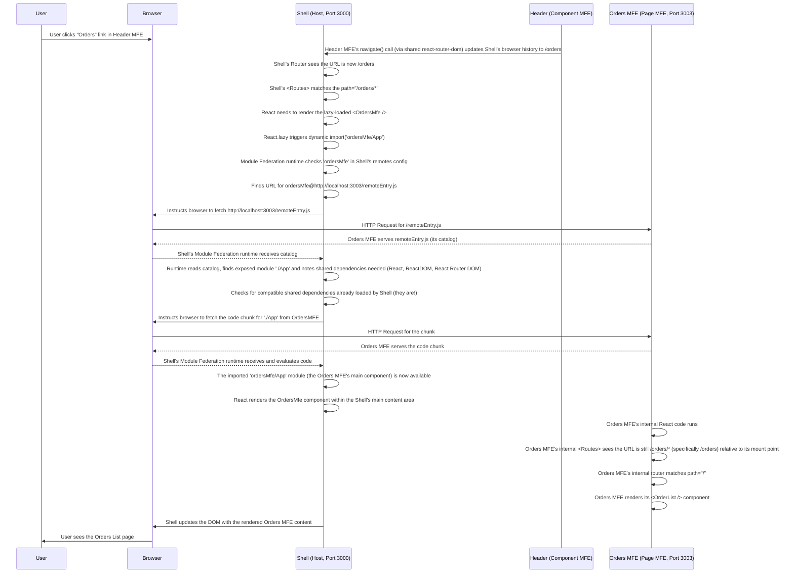

# Chapter 8: Page MFE

Welcome back to the `mfe-project` tutorial! In our previous chapter, [Chapter 7: Component MFE](07_component_mfe_.md), we explored Micro Frontends that expose specific, reusable UI components, like the Header or a User Profile card, which can be embedded anywhere.

But sometimes, a Micro Frontend needs to be more than just a small piece of a page. It needs to be a major section or even take over the entire main content area when the user navigates to a specific part of your application. This is the concept of a **Page MFE**.

## What is a Page MFE?

Imagine our large shopping mall again. While Component MFEs are like the small kiosks (a coffee stand, a phone charger), **Page MFEs** are like the large anchor stores – the department store, the electronics superstore, the large bookstore.

When you go to the mall, you might visit the department store. Once you step inside, you are fully within the department store's world. It has its own layout, different departments (clothing, cosmetics, home goods), and you can move around freely within that store. You don't see the main mall hallway anymore; the store takes over your experience.

Similarly, a **Page MFE** is an independent Micro Frontend designed to handle a significant section or the main content area of the Shell application. When the user navigates to a specific route (like `/products` or `/orders`), the Shell loads and renders the _entire Page MFE_ into the main part of the screen.

Key characteristics of a Page MFE:

1.  **Takes Over Main Content:** It's not just a small component; it manages the primary view for a specific part of the site.
2.  **Often Has Internal Routing:** Once loaded, a Page MFE might have its own internal views and routes (e.g., `/products` could show a list, and `/products/add` could show an add form, both managed _within_ the Products MFE).
3.  **Independent Business Domain:** Typically represents a major feature or business domain (Products, Orders, Customers, etc.).
4.  **Loaded by the Shell:** The Shell's router determines _when_ to load a specific Page MFE based on the URL.

In our `mfe-project`, the **Products MFE** (`products-mfe`) and the **Orders MFE** (`orders-mfe`) are prime examples of Page MFEs. When you click "Products" or "Orders" in the Header (which is itself a [Component MFE](07_component_mfe_.md)), the Shell application dynamically loads and renders the corresponding Page MFE into the main content area.

## How Does a Page MFE Work with the Shell?

The interaction between the Shell and a Page MFE follows the same fundamental principles of [Webpack Module Federation](01_webpack_module_federation_.md) that we've already discussed: the Shell is the host, the Page MFE is a remote, the Shell uses `remotes` config, the Page MFE uses `exposes` config, and they share dependencies using `shared`.

The main difference is _what_ the Page MFE exposes and _how_ the Shell uses it.

### Step 1: The Page MFE Exposes Its Main Application (`webpack.config.js`)

A Page MFE typically exposes its main entry point component, which often contains its internal routing and layout. In React applications, this is commonly the top-level `App` component.

Let's look at the `products-mfe/webpack.config.js`:

```javascript
// --- File: products-mfe/webpack.config.js (Snippet) ---
const ModuleFederationPlugin = require("webpack/lib/container/ModuleFederationPlugin");
// ... other imports ...

module.exports = {
  // ... other webpack settings ...
  plugins: [
    new ModuleFederationPlugin({
      name: "productsMfe", // This MFE's unique name
      filename: "remoteEntry.js", // The catalog file name
      exposes: {
        // 🔑 Expose the main App component
        "./App": "./src/App",
      },
      remotes: {
        // Products MFE also consumes another MFE (UserProfile MFE)
        userProfileMfe: "userProfileMfe@http://localhost:3004/remoteEntry.js",
      },
      shared: {
        /* ... shared dependencies like react, react-router-dom ... */
      },
    }),
    // ... other plugins ...
  ],
  // ... rest of config ...
};
```

This configuration is similar to our [Component MFE](07_component_mfe_.md) example, but instead of exposing a small component like `./UserProfile`, it exposes the main application file `./src/App` under the public name `./App`. This signals that this remote offers a complete application entry point.

### Step 2: The Shell Configures the Page MFE as a Remote (`webpack.config.js`)

The Shell needs to know where to find the Page MFE's catalog (`remoteEntry.js`). This is done via the `remotes` configuration in the Shell's `webpack.config.js`, just like for any other remote.

From `shell/webpack.config.js` (Snippet focusing on Products MFE remote):

```javascript
// --- File: shell/webpack.config.js (Snippet) ---
const ModuleFederationPlugin = require("webpack/lib/container/ModuleFederationPlugin");
const getRemoteUrl = (port, name) => {
  /* ... */ return `http://localhost:${port}/remoteEntry.js`;
};

module.exports = {
  // ... other webpack settings ...
  plugins: [
    new ModuleFederationPlugin({
      name: "shell",
      remotes: {
        headerMfe: `headerMfe@${getRemoteUrl(3001, "header-mfe")}`,
        // 🔑 Configure the Products Page MFE here
        productsMfe: `productsMfe@${getRemoteUrl(3002, "products-mfe")}`,
        ordersMfe: `ordersMfe@${getRemoteUrl(3003, "orders-mfe")}`,
      },
      shared: {
        /* ... shared dependencies ... */
      },
    }),
    // ... other plugins ...
  ],
  // ... rest of config ...
};
```

The line `productsMfe: `productsMfe@${getRemoteUrl(3002, 'products-mfe')}`,` tells the Shell how to find the `productsMfe` remote. This is identical to how it lists the `headerMfe` [Component MFE](07_component_mfe_.md). The Shell just needs the address; it doesn't initially care _what_ is exposed, only that _something_ is available under the name `productsMfe`.

### Step 3: The Shell Uses the Page MFE on a Specific Route (`shell/src/App.js`)

The key difference in usage lies in how the Shell's React code handles the dynamically loaded component. Instead of embedding it directly in the layout like the Header, the Shell renders the Page MFE's exposed component _only_ when the user navigates to a specific route range using `react-router-dom`.

From `shell/src/App.js` (Snippet focusing on Products MFE route):

```javascript
// --- File: shell/src/App.js (Snippet) ---
import React, { Suspense } from "react";
import {
  BrowserRouter as Router,
  Routes,
  Route,
  Navigate,
} from "react-router-dom";
import ErrorBoundary from "./components/ErrorBoundary";
// ... other imports ...

// 🔑 Lazy load the Page MFE's main App component
const ProductsMfe = React.lazy(() => import("productsMfe/App"));
const OrdersMfe = React.lazy(() => import("ordersMfe/App"));

// ... Fallback components ...

function App() {
  console.log("🚀 Shell App rendering...");

  return (
    <div className="app">
      <Router>
        {" "}
        {/* Shell manages the main browser history */}
        {/* ... Header MFE loaded here ... */}
        <main className="main-content">
          <Routes>
            {" "}
            {/* Shell defines top-level routes */}
            <Route path="/" element={<Navigate to="/products" replace />} />
            {/* 🔑 Route for the Products Page MFE */}
            <Route
              path="/products/*" // Match any URL starting with /products
              element={
                <ErrorBoundary fallback={<PageFallback pageName="Products" />}>
                  <Suspense
                    fallback={<Loading message="Loading Products MFE..." />}
                  >
                    {/* 🔑 Render the dynamically loaded Products MFE App */}
                    <ProductsMfe />
                  </Suspense>
                </ErrorBoundary>
              }
            />
            {/* 🔑 Route for the Orders Page MFE */}
            <Route
              path="/orders/*" // Match any URL starting with /orders
              element={
                <ErrorBoundary fallback={<PageFallback pageName="Orders" />}>
                  <Suspense
                    fallback={<Loading message="Loading Orders MFE..." />}
                  >
                    {/* 🔑 Render the dynamically loaded Orders MFE App */}
                    <OrdersMfe />
                  </Suspense>
                </ErrorBoundary>
              }
            />
            {/* ... other Shell routes ... */}
          </Routes>
        </main>
        {/* ... Footer ... */}
      </Router>
    </div>
  );
}

export default App;
```

This snippet from the Shell's `App.js` shows the familiar pattern:

- `React.lazy(() => import('productsMfe/App'))` dynamically imports the module named `./App` from the `productsMfe` remote (as configured in `remotes` and exposed by the remote).
- `<Suspense>` shows a loading fallback while the code is fetched.
- `<ErrorBoundary>` wraps it to catch potential errors.
- The crucial part is the `<Route path="/products/*" element={<ProductsMfe />} />`. The `path="/products/*"` tells the Shell's router that _any_ URL starting with `/products/` (e.g., `/products`, `/products/add`, `/products/product/123`) should render the `ProductsMfe` component into the `main-content` area.

### Step 4: The Page MFE Handles its Own Internal Routing (`products-mfe/src/App.js`)

Once the Shell loads and renders the `ProductsMfe` component (which is the `App` component exposed by the Products MFE), that component takes over the specified area. This exposed `App` component itself contains its _own_ routing setup using `react-router-dom`.

From `products-mfe/src/App.js` (Simplified focusing on internal routing):

```javascript
// --- File: products-mfe/src/App.js (Snippet) ---
import React, { Suspense, useState } from "react";
import { Routes, Route, useNavigate, useLocation } from "react-router-dom";
import "./styles.css"; // Products MFE has its own styles
import ErrorBoundary from "./components/ErrorBoundary";
import ProductList from "./components/ProductList";
import ProductDetail from "./components/ProductDetail";
import AddProduct from "./components/AddProduct";

// Products MFE also uses a Component MFE internally
const UserProfileMfe = React.lazy(() => import("userProfileMfe/UserProfile"));

const App = () => {
  // ... state and logic for this MFE ...
  const navigate = useNavigate(); // This navigate is linked to the Shell's router history

  return (
    <div className="products-mfe">
      {" "}
      {/* This MFE's main container */}
      {/* ... Products MFE's own layout elements (header, user profile toggle, etc.) ... */}
      {/* 🔑 Internal Navigation */}
      <nav className="products-nav">
        <button onClick={() => navigate("/products")}>📋 All Products</button>{" "}
        {/* Note: uses full path */}
        <button onClick={() => navigate("/products/add")}>
          ➕ Add Product
        </button> {/* Note: uses full path */}
      </nav>
      {/* 🔑 This MFE's internal content area */}
      <main className="products-content">
        {/* 🔑 Internal Routes managed by THIS MFE */}
        <Routes>
          <Route path="/" element={<ProductList />} /> {/* Matches /products */}
          <Route path="/add" element={<AddProduct />} /> {/* Matches /products/add */}
          <Route path="/product/:id" element={<ProductDetail />} />{" "}
          {/* Matches /products/product/:id */}
        </Routes>
      </main>
      {/* ... other parts of this MFE ... */}
    </div>
  );
};

export default App;
```

Here's what's important:

- The `ProductsMfe` component (which is `products-mfe/src/App.js`) uses its _own_ `<Routes>` component.
- The `Route path` values inside the Page MFE's `Routes` are _relative_ to the path the Shell mounted it on (`/products/*`). So, a `Route path="/add"` within the Products MFE's `Routes` will match the full browser URL `/products/add`.
- Because `react-router-dom` is configured as a [Shared Dependency](06_shared_dependencies_.md) with `singleton: true` across all MFEs and the Shell, the `useNavigate` hook (and other router hooks) within the Page MFE automatically use the _same_ router history instance that the Shell initialized. This allows seamless navigation between the Shell's routes and the Page MFE's internal routes using the browser's history.

This allows the Page MFE to fully control the content and navigation within the `/products` path space, while the Shell remains in control of the overall layout (Header, Footer) and routing to other top-level Page MFEs like `/orders`.

## How it Works Under the Hood (Simplified Flow)

Let's trace the path when a user clicks a link in the Header MFE that navigates to `/orders`:



This flow highlights that the Shell initiates the loading of the Page MFE based on the URL. Once loaded, the Page MFE's _own_ internal routing mechanism (`react-router-dom` using the shared instance) takes over to render the correct view within the area provided by the Shell.

## Page MFEs in `mfe-project`

You can explore the `products-mfe` and `orders-mfe` directories in the project to see how this pattern is implemented.

- Each has its own `webpack.config.js` exposing `./src/App`.
- Each has its own `src/App.js` with its own `react-router-dom` `<Routes>` and `<Route>` definitions (like `/`, `/add`, `/product/:id` in Products MFE, and `/`, `/order/:id` in Orders MFE).
- Each manages its own components (e.g., `ProductList`, `AddProduct` in Products MFE; `OrderList`, `OrderDetail` in Orders MFE).
- Each uses [Shared Dependencies](06_shared_dependencies_.md) for common libraries like React and React Router DOM.
- The Shell's `shell/src/App.js` defines the top-level routes (`/products/*`, `/orders/*`) that trigger the loading of these Page MFEs.

This setup allows the Products team and the Orders team to work on their features in isolation, build and deploy their MFEs independently, while the Shell seamlessly integrates them into a single user experience based on navigation.

## Conclusion

**Page MFEs** are a crucial pattern for structuring larger Micro Frontend applications. Unlike Component MFEs that expose reusable UI pieces, Page MFEs represent full, independent applications responsible for entire sections or pages of the user interface. They are loaded by the Shell application based on top-level routes and then manage their own internal views and routing within the space provided by the Shell.

This pattern, combined with [Remotes Configuration](04_remotes_configuration_.md), [Exposed Modules](05_exposed_modules_.md), and [Shared Dependencies](06_shared_dependencies_.md), allows teams to develop and deploy major features independently while still presenting a cohesive application to the end user. Wrapping the lazy-loaded Page MFEs in the Shell with [Error Boundaries](09_error_boundary_.md) is vital for maintaining application stability, which is the topic of our next chapter.

[Next Chapter: Error Boundary](09_error_boundary_.md)
