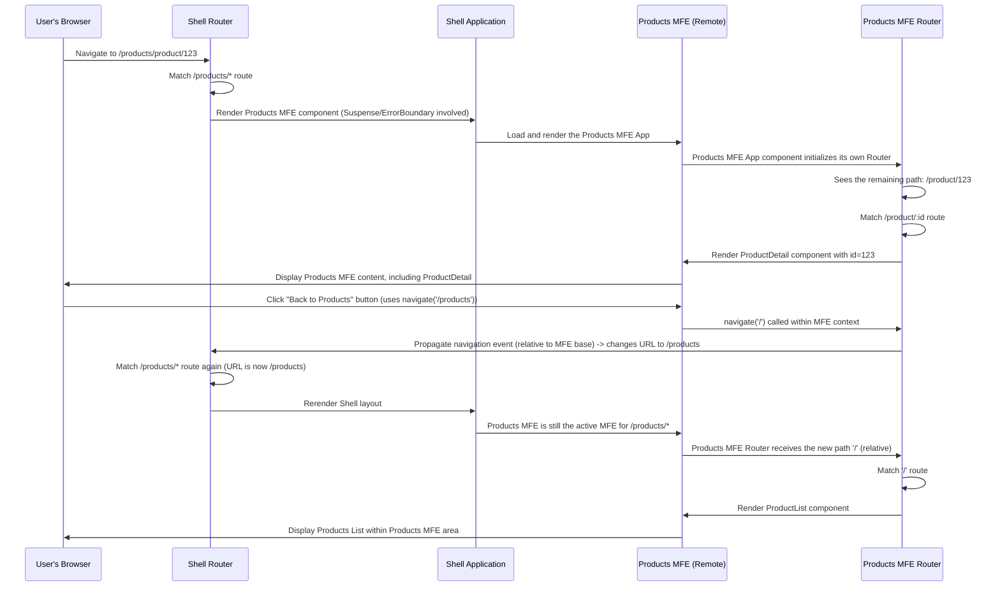

# Chapter 8: Routing

Welcome back to the `mfe-project` tutorial! In our last chapter, [Chapter 7: Inter-MFE Communication (Event Bus & Context)](07_inter_mfe_communication__event_bus___context__.md), we explored how our independent Micro Frontends (MFEs) can share information and react to events, allowing them to stay synchronized even though they are separate applications.

Now, let's think about how users actually move around in our unified application. In a traditional single-page application, a routing library handles navigation when you click a link or type a URL, deciding which component or page to show.

In a Micro Frontend architecture, we have multiple independent applications (the Shell and the MFEs), each potentially wanting to handle its own navigation. How does this work?

This brings us to the concept of **Routing** in a Micro Frontend system.

## The Problem: Navigating the Mall and the Shops

Imagine our mall analogy again. A customer (user) enters the mall (Shell application). They need to be able to:

1.  **Navigate between major sections of the mall:** Go from the main entrance to the "Products Shop" floor, or from the "Products Shop" floor to the "Orders Shop" section. This is like navigating between `/products` and `/orders` in our web application.
2.  **Navigate _within_ a specific shop:** Once inside the "Products Shop", the customer needs to go from the main product display area to look at the details of a _specific_ product, or perhaps go to the checkout counter within that shop. This is like navigating from `/products` to `/products/product/123` or `/products/checkout`.

The challenge is that the Shell application needs to control the first type of navigation (which MFE to load), but the MFE itself needs to control the second type (where to go _within_ its loaded area). How do we coordinate this without tight coupling?

## The Solution: Two Levels of Routing

The solution in our MFE architecture is to have **two levels of routing**:

1.  **Shell-Level Routing:** Managed by the Shell application. This handles the **top-level navigation** and determines **which MFE** should be loaded and displayed based on the initial part of the URL path (like `/products` or `/orders`).
2.  **MFE Internal Routing:** Managed by each individual MFE. This handles **navigation _within_ the MFE's own area** once it has been loaded by the Shell. This controls the specific views or components displayed inside the MFE's container (like `/product/123` or `/add` when the Products MFE is active).

This is like the mall directory guiding you to the right shop entrance (Shell routing), and then the signs inside the shop guiding you to the specific aisle or counter (MFE internal routing).

Both the Shell and the MFEs in our `mfe-project` use the popular React routing library, `react-router-dom`, to achieve this.

## Shell-Level Routing: Directing Users to the Right MFE

The Shell application's primary routing responsibility is to look at the URL path and decide which major MFE "section" the user wants to visit.

Let's look at a simplified version of the Shell's main `App.js` again:

```jsx
// shell/src/App.js (Simplified Shell Routing)
import React, { Suspense } from "react";
import {
  BrowserRouter as Router,
  Routes,
  Route,
  Navigate,
} from "react-router-dom";
import ErrorBoundary from "./components/ErrorBoundary";

// Lazy load MFE components (defined via Module Federation remotes)
const ProductsMfe = React.lazy(() => import("productsMfe/App"));
const OrdersMfe = React.lazy(() => import("ordersMfe/App"));
// ... other lazy imports

const Loading = () => <div>Loading MFE...</div>;

const AppContent = () => {
  return (
    <div className="app">
      <Router>
        {" "}
        {/* Shell's main router */}
        {/* Header MFE (often always visible, so might not need route) */}
        {/* <HeaderMfe /> */}
        <main>
          <Routes>
            {" "}
            {/* Defines Shell-level routes */}
            {/* Default route: Redirect / to /products */}
            <Route path="/" element={<Navigate to="/products" replace />} />
            {/* Route for Products MFE */}
            {/* IMPORTANT: Notice the /* */}
            <Route
              path="/products/*"
              element={
                <ErrorBoundary fallback={<div>Products MFE failed</div>}>
                  <Suspense fallback={<Loading />}>
                    <ProductsMfe /> {/* Load and render Products MFE */}
                  </Suspense>
                </ErrorBoundary>
              }
            />
            {/* Route for Orders MFE */}
            <Route
              path="/orders/*"
              element={
                <ErrorBoundary fallback={<div>Orders MFE failed</div>}>
                  <Suspense fallback={<Loading />}>
                    <OrdersMfe /> {/* Load and render Orders MFE */}
                  </Suspense>
                </ErrorBoundary>
              }
            />
            {/* ... other Shell routes */}
          </Routes>
        </main>
      </Router>
    </div>
  );
};
// ... App wrapper with context etc.
```

**Explanation:**

- **`<Router>`:** The Shell application uses its own instance of `BrowserRouter` (or a similar router from `react-router-dom`). This is the _main_ router for the entire application.
- **`<Routes>` and `<Route>`:** These define the Shell's routing rules.
- **`path="/products/*"`:** This is the key part for MFE routing! It tells the Shell's router:
  - "If the URL path **starts with** `/products`..."
  - "...match this route."
  - "...and render the `ProductsMfe` component (`element={<ProductsMfe />}`)."
  - "...The `/*` at the end means 'match anything else that comes after `/products/`, but don't _consume_ it completely. Just leave it there in the URL.'"
- **`element={<ProductsMfe />}`:** When the path matches `/products/*`, the Shell loads the `ProductsMfe` using `React.lazy` (enabled by [Webpack Module Federation](03_webpack_module_federation_.md)) and renders it in the `<main>` content area.

So, if a user navigates to `/products`, the Shell's router matches `/products/*` and renders the `ProductsMfe`. If they navigate to `/products/product/123`, the Shell's router _still_ matches `/products/*`, renders the `ProductsMfe`, and leaves the rest of the path (`/product/123`) untouched in the browser's address bar.

## MFE Internal Routing: Navigating Within the Shop

Once an MFE component (like the `ProductsMfe`) is loaded by the Shell because its top-level route matched (e.g., `/products/*`), the MFE takes over the rendering within its designated area. This MFE application _also_ has its own routing setup using `react-router-dom`.

Let's look at the simplified `products-mfe/src/App.js`:

```jsx
// products-mfe/src/App.js (Simplified MFE Internal Routing)
import React from "react";
import { Routes, Route, useNavigate, useLocation } from "react-router-dom"; // Import React Router hooks

// Import MFE components (these are regular components within the MFE)
import ProductList from "./components/ProductList";
import ProductDetail from "./components/ProductDetail";
import AddProduct from "./components/AddProduct";

const App = () => {
  // navigate and location hooks work relative to the MFE's route context
  const navigate = useNavigate();
  const location = useLocation();

  // ... state and effects (like listening to events from Shell)

  return (
    <div className="products-mfe">
      {/* ... MFE Header, User Editor, Embedded MFE ... */}

      <nav className="products-nav">
        {/* Internal navigation links */}
        <button onClick={() => navigate("/")}>
          {" "}
          {/* Navigates relative to MFE's base */}
          📋 All Products
        </button>
        <button onClick={() => navigate("/add")}>
          {" "}
          {/* Navigates relative to MFE's base */}➕ Add Product
        </button>
      </nav>

      <main className="products-content">
        <Routes>
          {" "}
          {/* Defines MFE-level routes */}
          {/* Route for the Product List (matches /products because Shell handled /products) */}
          <Route path="/" element={<ProductList />} />
          {/* Route for a specific Product Detail (matches /products/product/:id) */}
          <Route path="/product/:id" element={<ProductDetail />} />
          {/* Route for the Add Product form (matches /products/add) */}
          <Route path="/add" element={<AddProduct />} />
          {/* IMPORTANT: Add a catch-all route within the MFE */}
          {/* This handles unknown paths *within* /products */}
          <Route path="*" element={<div>Not Found within Products MFE</div>} />
        </Routes>
      </main>
    </div>
  );
};

export default App;
```

**Explanation:**

- **`<Routes>` and `<Route>`:** The Products MFE _also_ uses `<Routes>` and `<Route>`. Importantly, since the Shell's router already matched and consumed `/products` (or rather, directed traffic for `/products/*` to this MFE), the Products MFE's router effectively operates on the _remaining_ part of the URL path.
- **`path="/"`:** Within the Products MFE, `path="/"` matches the base `/products` path (because the Shell already took care of `/products`).
- **`path="/product/:id"`:** This matches `/products/product/123` when the Shell has loaded this MFE. The `:id` part is a route parameter that can be read using `useParams`.
- **`path="/add"`:** This matches `/products/add`.
- **`useNavigate`:** When calling `navigate("/add")` inside the Products MFE, `react-router-dom` understands that this navigation is relative to the current route context provided by the Shell. If the Shell route was `/products/*`, navigating to `/add` inside the MFE changes the browser URL to `/products/add`.
- **`useParams`:** Components rendered by the MFE's router (like `ProductDetail`) can use `useParams()` to extract route parameters, such as the `id` from `/product/:id`.

Here's an example of how `ProductList.js` might navigate:

```jsx
// products-mfe/src/components/ProductList.js (Simplified Navigation)
import React from "react";
import { useNavigate } from "react-router-dom";

const ProductList = () => {
  const navigate = useNavigate();

  const handleViewProduct = (productId) => {
    // Navigate to the specific product detail page *within* the MFE
    navigate(`/product/${productId}`); // <-- Uses navigate relative to MFE's current path
  };

  return (
    <div>
      <h2>Product List</h2>
      {/* ... map through products ... */}
      <button onClick={() => handleViewProduct(123)}>
        View Product 123 {/* Clicking changes URL to /products/product/123 */}
      </button>
      {/* ... */}
    </div>
  );
};

export default ProductList;
```

And `ProductDetail.js` reading the ID:

```jsx
// products-mfe/src/components/ProductDetail.js (Simplified useParams)
import React from "react";
import { useParams } from "react-router-dom";

const ProductDetail = () => {
  const { id } = useParams(); // <-- Get the 'id' parameter from the URL segment after /product/

  // ... fetch and display product details based on 'id' ...

  return (
    <div>
      <h2>Product Detail for ID: {id}</h2>{" "}
      {/* Will display "Product Detail for ID: 123" */}
      {/* ... rest of the component */}
    </div>
  );
};

export default ProductDetail;
```

## How Two Routers Work Together (Under the Hood)

Here's a simplified sequence of what happens when a user enters the URL `/products/product/123`:



The key is that the Shell's router handles the initial routing decision based on the top-level path (`/products`, `/orders`), and then the MFE's router takes over for the remaining part of the URL path (`/product/123`, `/add`). This is seamlessly handled by libraries like `react-router-dom` when nested within each other.

## Benefits of Nested Routing

- **Independence:** MFEs can define their internal URL structure and navigation logic without the Shell needing to know or manage every single sub-route. The Products MFE team can add a new route like `/products/reviews` without changing the Shell's routing config.
- **Clear Ownership:** Shell owns top-level navigation, MFEs own their internal navigation.
- **Flexibility:** Different MFEs can potentially use different routing libraries (though using the same one, like `react-router-dom`, is highly recommended for consistency and performance with shared modules).
- **Encapsulation:** The internal details of an MFE's navigation are encapsulated within the MFE itself.

## Conclusion

Routing in a Micro Frontend architecture involves coordination between the Shell application and the individual MFEs. The Shell manages the top-level routes (like `/products`, `/orders`) to determine which MFE to load, often using a wildcard (`/*`) in its route path to allow the MFE to handle sub-paths. Each MFE then uses its own internal router instance to manage navigation _within_ its loaded area (like `/product/123` or `/add`).

By using nested routing instances (Shell's router wrapping the MFE's router), we achieve a flexible and independent navigation system where users can seamlessly move between major application sections (Shell routing) and specific views within those sections (MFE internal routing).

With our application structure defined, components loaded, communication enabled, and routing handled, the next crucial topic is how to handle errors gracefully when one of our independent MFEs encounters a problem.
