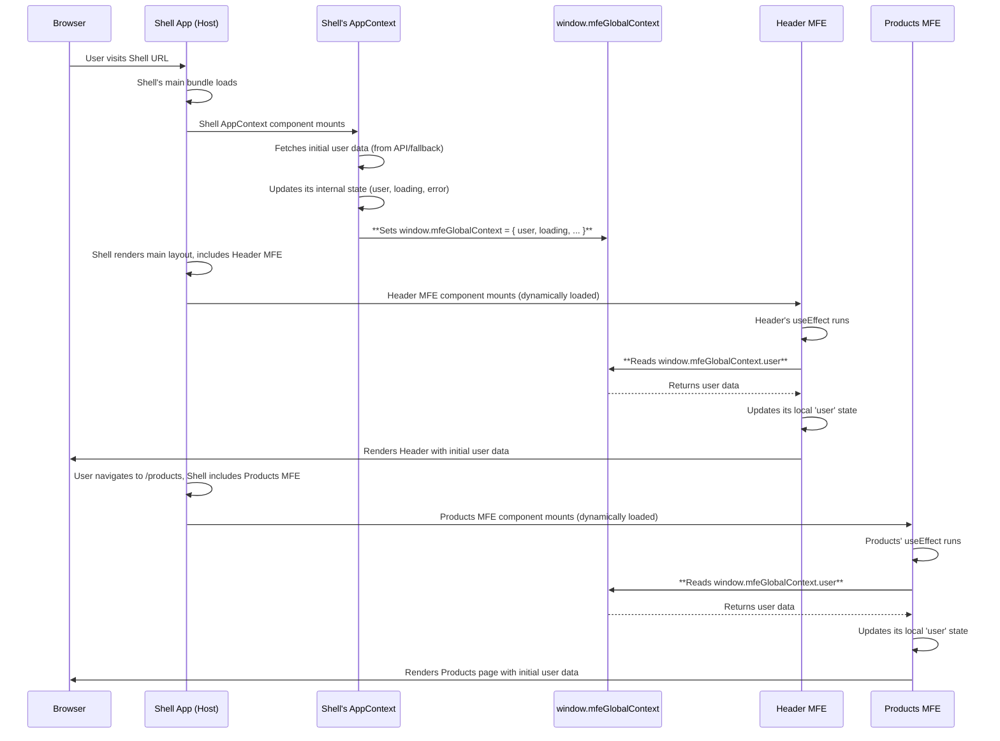

# Chapter 8: Shared Context (`window.mfeGlobalContext`)

Welcome back! In our previous chapter, [Chapter 7: Event Bus (`window.mfeEventBus`)](07_event_bus___window_mfeeventbus___.md), we learned how independent Micro Frontends (MFEs) and the Shell can communicate by sending and receiving messages (events) without needing direct knowledge of each other. This is great for reacting to _actions_ or _notifications_ (like "user data was updated!").

But what if an MFE just needs to know the _current_ state of some common data, like who the logged-in user is, or whether the application's main API is working, right when it loads? It doesn't need to wait for an event; it just needs to read this information directly.

Trying to get this common information into every MFE independently would be messy and repetitive. Each MFE would have to know how to fetch user details or check the API status itself.

### What Problem Does Shared Context Solve?

Imagine our shopping mall again. The Shell is the mall building, and MFEs are independent stores. Besides the public announcement system (Event Bus), the mall also has a central information desk or a shared bulletin board near the entrance.

- Mall management (the Shell) is responsible for keeping the information desk updated with things like the mall's operating hours, today's special events, or the location of the main restrooms.
- Any store (MFE) or even a customer (though typically a store in our analogy) can walk up to the information desk or bulletin board and just **read** the current information directly whenever they need it. They don't have to _ask_ the information desk every time, nor do they have to wait for an announcement. They just go and read.

In a micro frontend application, the **Shared Context** is like this central information desk or bulletin board. It's a place where the Shell application can put common data that any MFE can easily access and read directly at any time.

In our `mfe-project`, this shared context is available globally on the browser's `window` object as `window.mfeGlobalContext`.

### What is `window.mfeGlobalContext`?

`window.mfeGlobalContext` is a simple **JavaScript object** attached to the browser's global `window` object by the Shell application.

- It acts as a **single source of truth** for certain pieces of common data that all MFEs might need.
- The **Shell** is typically responsible for initializing this object and keeping it updated.
- Any **MFE** can access `window.mfeGlobalContext` directly to read the current values of the data it contains.

Think of it as a shared plain object available everywhere, holding simple data like:

```javascript
// Conceptually, what window.mfeGlobalContext might look like
window.mfeGlobalContext = {
  user: {
    // Details about the logged-in user
    id: "...",
    name: "...",
    email: "...",
    avatar: "...",
  },
  apiStatus: "connected" | "error", // Status of the main API
  loading: boolean, // Is the app currently loading initial data?
  error: string | null, // Any global error message
  // ... other common data ...
};
```

### Use Case: Accessing User Data and API Status

In our project, the Shell loads initial user data and checks the status of the JSON Server API when the application starts. This information is needed by the Header MFE (to show user name/email), the Products MFE (to show user name and potentially pass user ID to embedded components), and the Orders MFE (to show user name).

Instead of each MFE duplicating the logic to fetch or check this, the Shell fetches it once and populates `window.mfeGlobalContext`.

Here's how MFEs access this shared data:

### How MFEs Read from `window.mfeGlobalContext`

MFEs can simply read from `window.mfeGlobalContext` like any other global variable. A common pattern is to read the initial state when the MFE component mounts.

Look at the `useEffect` hook in `header-mfe/src/Header.js`:

```javascript
// header-mfe/src/Header.js (Simplified)
import React, { useState, useEffect } from "react";
// ... other imports ...

const Header = () => {
  const [user, setUser] = useState(null);

  useEffect(() => {
    // Check if the global context object exists
    if (window.mfeGlobalContext) {
      console.log(
        "🎯 Header MFE: Reading initial context:",
        window.mfeGlobalContext
      );
      // Read the 'user' data from the global context
      setUser(window.mfeGlobalContext.user);
    }

    // Listen for updates via Event Bus (covered in Chapter 7)
    // This ensures the Header updates if user data changes LATER
    if (window.mfeEventBus) {
      const unsubscribeUser = window.mfeEventBus.on("user:updated", setUser);
      return unsubscribeUser; // Clean up event listener
    }
  }, []); // Empty dependency array: runs once on mount

  // ... rest of component logic using the 'user' state ...
};
```

**Explanation:**

- `if (window.mfeGlobalContext)`: This check is good practice to ensure the Shell has initialized the context before trying to read it.
- `const context = window.mfeGlobalContext;`: Get a reference to the global context object.
- `setUser(context.user);`: We access the `user` property directly from the `context` object and use it to set the local state of the Header MFE. This provides the initial user data when the Header component first loads.

Similarly, in `products-mfe/src/App.js` and `orders-mfe/src/App.js`, you'll find similar logic in their initial `useEffect` calls to read the `user` data from `window.mfeGlobalContext` and set their local state.

```javascript
// products-mfe/src/App.js (Simplified initial useEffect)
useEffect(() => {
  if (window.mfeGlobalContext) {
    console.log(
      "🎯 Products MFE: Reading initial context:",
      window.mfeGlobalContext
    );
    // Read the 'user' data from the global context
    setUser(window.mfeGlobalContext.user);
    // Note: products-mfe also listens for "update-title" event here
  }

  // Also set up listener for user updates via Event Bus (from Chapter 7)
  if (window.mfeEventBus) {
    const unsubscribeUser = window.mfeEventBus.on("user:updated", setUser);
    // Also listen for "update-title"
    const unsubscribeTitle = window.mfeEventBus.on("update-title", setTitle);
    return () => {
      unsubscribeUser();
      unsubscribeTitle();
    };
  }
}, []); // Empty dependency array
```

By reading from `window.mfeGlobalContext` on mount, each MFE gets access to the core common data (like the user object) right away, allowing it to render correctly with the initial information provided by the Shell.

**Important Note on Updates:** While MFEs can read the _current_ state from `window.mfeGlobalContext` at any time, simply reading it won't automatically make your React component re-render if the context changes _later_. For dynamic updates, you still need the Event Bus (as seen in the code snippets above, where MFEs also subscribe to `"user:updated"`). When an update occurs (e.g., user name changes via API), the Shell updates the context _and_ emits an event. The MFEs listening to the event receive the new data (often provided directly in the event payload) and update their local state, triggering a re-render. The context is primarily useful for the initial state and perhaps for components that mount _after_ the initial load but still need the current state snapshot.

### How it Works: The Flow

Here's a simplified flow showing how the Shared Context provides initial data:



This diagram shows how the Shell initializes the global context, and then any MFE that loads afterwards can immediately access that context on the `window` object to get the current state of the shared data.

### Internal Implementation: How the Shell Manages the Context

The `window.mfeGlobalContext` object is managed by the Shell application, specifically within `shell/src/AppContext.js`.

Let's look at key parts of `AppContext.js`:

```javascript
// shell/src/AppContext.js (Simplified)
import React, { createContext, useContext, useState, useEffect } from "react";
import UserApiService from "./userApiService"; // We'll cover this next!

// ... fallbackUserData ...
// ... AppContext = createContext() ...

export const AppContextProvider = ({ children }) => {
  const [user, setUser] = useState(fallbackUserData);
  const [loading, setLoading] = useState(true);
  const [error, setError] = useState(null);

  // Effect 1: Fetch initial user data on mount
  useEffect(() => {
    const fetchInitialUserData = async () => {
      try {
        // ... fetch data using UserApiService ...
        setUser(userData); // Update Shell's internal state
      } catch (err) {
        // ... handle error, use fallback ...
        setUser(fallbackUserData);
        setError(err.message);
      } finally {
        setLoading(false);
      }
    };
    fetchInitialUserData();
  }, []); // Runs once on mount

  // Effect 2: Keep window.mfeGlobalContext updated & Listen for events
  useEffect(() => {
    // 1. Update the global context object whenever internal state changes
    window.mfeGlobalContext = {
      user,
      loading,
      error,
      apiStatus: error ? "error" : "connected",
    };
    console.log(
      "🔄 Shell: Updated window.mfeGlobalContext:",
      window.mfeGlobalContext
    );

    // 2. Listen for user data updates from MFEs via Event Bus
    const handleUserUpdated = (updatedUserData) => {
      console.log(
        "👂 Shell: Received user data update via Event Bus:",
        updatedUserData
      );
      // Update Shell's internal state based on event data
      // This also triggers Effect 2 again, updating window.mfeGlobalContext
      setUser(updatedUserData);
      setError(null); // Assume update clears previous API error
    };
    // Subscribe to the event
    window.mfeEventBus.on("user:updated", handleUserUpdated);

    // Return cleanup function for the event listener
    return () => {
      // Note: EventBus `on` usually returns unsubscribe function
      // A proper implementation would store/use that
      // For simplicity, relying on EventBus instance existing
      console.log("🧼 Shell: Cleaning up user:updated listener");
      // window.mfeEventBus.off("user:updated", handleUserUpdated); // If EventBus had a proper 'off'
    };
  }, [user, loading, error]); // Re-run this effect if user, loading, or error state changes

  // Effect 3: Broadcast user updates via Event Bus (when Shell's state changes)
  // This is slightly redundant with Effect 2 handling updates from MFEs,
  // but ensures IF Shell's state changes for other reasons, it broadcasts.
  // In this project, updates mostly come via MFEs -> EventBus -> Effect 2.
  // But for simplicity, it also broadcasts whenever Shell's user/loading state changes.
  useEffect(() => {
    if (!loading) {
      // Emit event AFTER the user data is finalized and loading is false
      window.mfeEventBus.emit("user:updated", user);
      console.log(
        "📢 Shell: Broadcasting user data to all MFEs via Event Bus:",
        user
      );
    }
  }, [user, loading]); // Re-run this effect if user or loading state changes

  // ... return AppContext.Provider ...
};
```

**Explanation:**

- `useState` hooks: Manage the Shell's internal state for `user`, `loading`, and `error`.
- Effect 1 (`[]` dependency): Fetches the _initial_ user data when the `AppContextProvider` first mounts. It uses a shared `UserApiService` (which we'll explore in the next chapter) for this.
- Effect 2 (`[user, loading, error]` dependency): This is crucial.
  - It runs whenever the Shell's internal `user`, `loading`, or `error` state changes.
  - Inside this effect, `window.mfeGlobalContext` is _overwritten_ or updated with the _latest_ values from the Shell's internal state. This is how the "bulletin board" is updated.
  - It _also_ sets up the listener for the `"user:updated"` event on the `window.mfeEventBus`. This listener's purpose is to catch updates initiated by _MFEs_ (via the API Service, which we'll see). When an MFE update occurs, this listener updates the Shell's internal state (`setUser`), which in turn triggers _this same effect again_, thus updating `window.mfeGlobalContext` with the fresh data received from the MFE event.
- Effect 3 (`[user, loading]` dependency): This effect is there to ensure that after the initial data is loaded (`!loading`) or whenever the `user` state changes within the Shell, an event is emitted on the `window.mfeEventBus`. This ensures any MFE that just mounted or needs the latest user data is notified via the Event Bus mechanism as well. While Effect 2 also handles updates _from_ the bus, this effect ensures the initial data fetch _also_ results in an event broadcast once loading is complete.

So, the Shell's `AppContextProvider` is the central manager: it fetches initial data, maintains the "source of truth" state for this common data, publishes that state to `window.mfeGlobalContext` so any MFE can read it, and listens for updates (from MFEs via the Event Bus) to keep its state and the global context current.

### Shared Context vs. Event Bus

It's important to understand the difference:

- **Shared Context (`window.mfeGlobalContext`)**: Good for providing access to the **current state** of common data at any point in time. MFEs _read_ from it. Useful for initial data loading or checking status.
- **Event Bus (`window.mfeEventBus`)**: Good for **broadcasting notifications** when something happens ("user data changed!") or triggering **actions**. MFEs _emit_ and _listen_ to events. Useful for reacting to changes that occur _after_ initial load.

In this project, they work together: the Context holds the state, and the Event Bus signals _when_ that state might have changed, allowing MFEs (and the Shell itself) to react and potentially read the latest data (often delivered within the event payload itself).

### Conclusion

In this chapter, we explored the concept of **Shared Context** using `window.mfeGlobalContext`. We learned that it provides a convenient "bulletin board" on the global `window` object where the Shell application publishes common data like user details and API status. This allows any Micro Frontend to easily read this information directly, particularly useful for initializing their state when they first load. We also saw how the Shell's `AppContext` is responsible for managing this context, fetching initial data, and keeping the global context updated based on its internal state, often reacting to events received via the Event Bus.

Understanding Shared Context is key to efficiently sharing static or semi-static data across your independently developed MFEs, complementing the dynamic communication provided by the Event Bus.

Now that we know how data is shared, let's look at how we get that user data in the first place! In the next chapter, we'll dive into the [User API Service (`UserApiService`)](09_user_api_service___userapiservice__.md), which handles interacting with our mock backend.

[User API Service (`UserApiService`)](09_user_api_service___userapiservice___.md)
