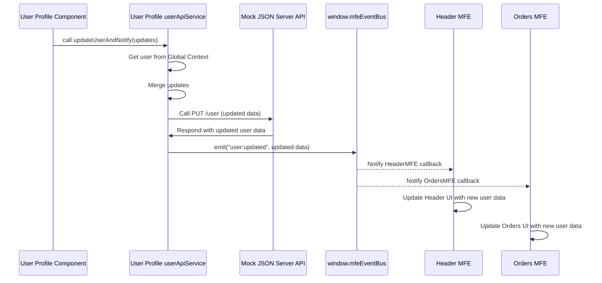

# Chapter 8: User API Service

Welcome back! In the last couple of chapters, we've learned some powerful ways our independent Micro Frontends (MFEs) can work together. [Chapter 6: Event Bus (window.mfeEventBus)](06_event_bus__window_mfeeventbus__.md) showed us how MFEs can broadcast and listen for events to notify each other about things that happen. [Chapter 7: Global Context (window.mfeGlobalContext)](07_global_context__window_mfeglobalcontext__.md) showed us how the Shell provides a central "information board" where MFEs can read shared data like the current user details.

But where does this user data come from in the first place? And how does it get updated when the user changes their name or email? This data usually lives on a backend server and needs to be fetched and updated by making API calls.

In a traditional application, you might have one central place that handles all API calls related to users. In our Micro Frontend architecture, where independence is key, things are set up a bit differently.

This chapter introduces the **User API Service** concept in our `mfe-project`.

## The Concept: API Logic within Each MFE

In this project, each MFE (and the Shell) that needs to interact with the user API has its own file dedicated to that logic, typically named `userApiService.js`.

This might seem a little unusual at first because it means the code for fetching and updating user data is **duplicated** across multiple MFEs. Why is it done this way?

The purpose here is to demonstrate that each MFE is **independent** and **owns its domain** end-to-end, including data fetching concerns. Even though the underlying API is the same (`db.json` served by a mock server), this structure shows how an MFE could potentially interact with its _own_ specific backend service or API endpoint if the architecture required it. It highlights that the MFE is responsible for its own data needs.

Think of our shopping mall again. While there might be a central security office, each shop might manage its own specific supply chain logistics or checkout system. They have their own internal processes for handling their data (inventory, sales, etc.), even if some high-level information (like daily foot traffic) is shared with the mall management.

## Basic API Calls (`getUser`, `updateUser`)

Each `userApiService.js` file contains simple methods to interact with our mock JSON server API (`http://localhost:3005`).

Here's a look at the `getUser` method, similar across the different `userApiService.js` files:

```javascript
// Snippet from user-profile-mfe/src/userApiService.js (or others)
const API_BASE_URL = "http://localhost:3005";

class UserApiService {
  /**
   * Fetch user data from the API
   * @returns {Promise<Object>} User data object
   */
  static async getUser() {
    try {
      const response = await fetch(`${API_BASE_URL}/user`);
      if (!response.ok) {
        throw new Error(`HTTP error! status: ${response.status}`);
      }
      const userData = await response.json();
      console.log(`✅ MFE: User data fetched successfully:`, userData); // Console log helps identify which MFE fetched it
      return userData;
    } catch (error) {
      console.error(`❌ MFE: Error fetching user data:`, error);
      throw error;
    }
  }

  // ... updateUser method below ...
}

export default UserApiService;
```

This is standard JavaScript fetching data from an API endpoint. The key point is that this exact same logic is present in `shell/src/userApiService.js`, `user-profile-mfe/src/userApiService.js`, and `orders-mfe/src/userApiService.js`. They all talk to the same mock API URL.

Similarly, the `updateUser` method sends updated data:

```javascript
// Snippet from user-profile-mfe/src/userApiService.js (or others)
const API_BASE_URL = "http://localhost:3005";

class UserApiService {
  // ... getUser method above ...

  /**
   * Update user data via API
   * @param {Object} userData - Updated user data (e.g., { name: "New Name" })
   * @returns {Promise<Object>} Updated user data object from the API
   */
  static async updateUser(userData) {
    try {
      const response = await fetch(`${API_BASE_URL}/user`, {
        method: "PUT",
        headers: { "Content-Type": "application/json" },
        body: JSON.stringify(userData),
      });
      if (!response.ok) {
        throw new Error(`HTTP error! status: ${response.status}`);
      }
      const updatedUserData = await response.json();
      console.log(`✅ MFE: User data updated successfully:`, updatedUserData); // Which MFE made the update call?
      return updatedUserData;
    } catch (error) {
      console.error(`❌ MFE: Error updating user data:`, error);
      throw error;
    }
  }

  // ... updateUserAndNotify method below ...
}

export default UserApiService;
```

Again, this is a standard `PUT` request, identical across the different `userApiService.js` files.

## The `updateUserAndNotify` Helper

Making the API call is only half the job when dealing with shared data in an MFE architecture. As we learned in [Chapter 6: Event Bus (window.mfeEventBus)](06_event_bus__window_mfeeventbus__.md), if one MFE updates shared data, others need to be _notified_ so they can update their UI.

To handle this consistently, each `userApiService.js` file includes a helper method called `updateUserAndNotify`. This method encapsulates the pattern: **Perform API Update -> If successful, Notify via Event Bus.**

Here's the `updateUserAndNotify` method found in `user-profile-mfe/src/userApiService.js` and `orders-mfe/src/userApiService.js`:

```javascript
// Snippet from user-profile-mfe/src/userApiService.js (or orders-mfe)
const API_BASE_URL = "http://localhost:3005";

class UserApiService {
  // ... getUser and updateUser methods ...

  /**
   * Helper method to update user via API and notify other MFEs
   * This is the recommended way to update user data from an MFE
   * @param {Object} updates - User data updates (e.g., { name: "New Name" })
   */
  static async updateUserAndNotify(updates) {
    try {
      // 1. Get current user data (often from Global Context, see Ch 7)
      // This helps ensure we merge updates correctly.
      const currentUser = window.mfeGlobalContext?.user || {};

      // 2. Merge updates with current data
      const updatedUserData = { ...currentUser, ...updates };

      // 3. Make the actual API call to update the user
      const apiResponse = await this.updateUser(updatedUserData); // Calls the updateUser method above

      // 4. 🔥 Notify all listening MFEs about the successful update!
      if (window.mfeEventBus) {
        window.mfeEventBus.emit("user:updated", apiResponse); // Emits event with the latest user data
        console.log(`📡 MFE: Notified all MFEs about user update`); // Indicates which MFE emitted
      }

      return apiResponse; // Return the updated data
    } catch (error) {
      console.error(`❌ MFE: Failed to update user and notify:`, error.message);
      // Optional: Emit an error event as well
      if (window.mfeEventBus) {
        window.mfeEventBus.emit("user:api-error", {
          message: error.message,
          source: "MFE name",
        });
      }
      throw error; // Re-throw the error so the caller can handle it
    }
  }
}

export default UserApiService;
```

This helper method is the standard way that the User Profile MFE and Orders MFE update user data:

1.  It first attempts to get the current user data from the [Global Context (window.mfeGlobalContext)](07_global_context__window_mfeglobalcontext__.md). This is useful if the update is partial (e.g., only changing the name) so it can merge the update into the full user object before sending it to the API.
2.  It calls the `updateUser` method (defined within the same service file) to make the API call.
3.  **Crucially**, if the API call succeeds, it then uses `window.mfeEventBus.emit("user:updated", apiResponse)` to broadcast the newly updated user data to all other MFEs (and the Shell) that are listening for the `"user:updated"` event.

The Shell's `userApiService.js` contains `getUser` and `updateUser` but doesn't need the `updateUserAndNotify` helper because the Shell is the one managing the global state and event listeners already. Its update logic is typically tied to the `AppContext` where it fetches initial data and listens for MFE-triggered updates.

## How MFEs Use `updateUserAndNotify`

Components within the User Profile MFE or Orders MFE that allow editing user data will call this helper method when the user saves changes.

Example from `user-profile-mfe/src/UserProfile.js`:

```javascript
// Snippet from user-profile-mfe/src/UserProfile.js
import React, { useState, useEffect } from "react";
import UserApiService from "./userApiService"; // <-- Import the service

const UserProfile = ({ user }) => {
  // ... state for form data ...

  const handleSave = async () => {
    // ... check if data has changed ...
    if (hasChanges) {
      try {
        // ✅ Call the helper method in the MFE's API service
        await UserApiService.updateUserAndNotify({
          name: formData.name.trim(),
          email: formData.email.trim(),
          role: formData.role.trim(),
        });
        console.log("🔄 User Profile MFE: User update completed via service");
      } catch (error) {
        console.error(
          "❌ User Profile MFE: Failed to update user:",
          error.message
        );
        // Handle error, maybe show message to user
      }
    }
    setIsEditing(false);
  };

  // ... rest of component ...
};
```

When `handleSave` is called in the User Profile MFE, it uses `UserApiService.updateUserAndNotify`. This initiates the API call from the User Profile MFE's code itself. If successful, the helper function ensures the `"user:updated"` event is emitted. Other MFEs (like the Header and Orders MFE, as seen in [Chapter 6](06_event_bus__window_mfeeventbus__.md)) are listening for this event and update their display based on the new user data received in the event payload.

The same pattern is used in the `EmailEditor` component within `orders-mfe/src/App.js`:

```javascript
// Snippet from orders-mfe/src/App.js (inside EmailEditor component)
import React, { useState, useEffect } from "react";
import UserApiService from "./userApiService"; // <-- Import the service in Orders MFE

const EmailEditor = ({ user, updateUser }) => { // updateUser prop calls the service
  // ... state for email form ...

  const handleSave = () => {
    if (email.trim() && email !== user.email) {
      // ✅ Call the updateUser prop, which in orders-mfe/src/App.js
      // calls the helper method in Orders MFE's API service
      updateUser({ email: email.trim() });
      setIsEditing(false);
    }
  };
  // ... rest of component ...
};

// Snippet from orders-mfe/src/App.js (outside EmailEditor)
const App = () => {
  // ... state and effects (including listening for user:updated) ...

  const updateUser = async (updates) => {
    try {
      // ✅ Call the helper method in *this* MFE's API service
      await UserApiService.updateUserAndNotify(updates);
      console.log("🔄 Orders MFE: User update initiated via service");
    } catch (error) {
      console.error("❌ Orders MFE: Orders MFE failed to update user:", error.message);
      // Handle error
    }
  };

  // ... pass updateUser to EmailEditor ...
  return (
    // ...
    {user && <EmailEditor user={user} updateUser={updateUser} />}
    // ...
  );
};
```

In the Orders MFE example, the `EmailEditor` is a sub-component. The `App` component in `orders-mfe` imports its own `UserApiService` and defines an `updateUser` function that calls `UserApiService.updateUserAndNotify`. This function is then passed down as a prop to the `EmailEditor`. This shows how the API service is used within the MFE's internal component hierarchy. When the email is saved, the call chain leads back to the `updateUserAndNotify` helper in the Orders MFE's `userApiService.js`.

## The Flow: API Call and Notification

Here's a sequence diagram showing the typical flow when an MFE updates user data:



This diagram illustrates how the API call is initiated from the MFE responsible for the user action, and then the standard [Event Bus](06_event_bus__window_mfeeventbus__.md) mechanism ensures other interested MFEs are informed and can react.

## Why This Design in a Learning Project?

As mentioned earlier, duplicating API service logic across multiple MFEs that talk to the _same_ backend API endpoint isn't necessarily the only or even the best approach in a real-world production system. You might consider:

- Creating a dedicated "Shared Service MFE" that exposes API interaction functions via Module Federation.
- Having the Shell provide a central API service instance via [Global Context](07_global_context__window_mfeglobalcontext__.md) or a shared library.

However, for this project, the duplicated `userApiService.js` files serve a valuable learning purpose:

1.  They reinforce the concept of MFE independence – each MFE _can_ manage its own data fetching concerns.
2.  They provide a concrete example of how an MFE interacts with a backend.
3.  Most importantly, they demonstrate the pattern of **API Call -> Event Emission** using the `updateUserAndNotify` helper, showing a clear way to synchronize shared state changes originating from any MFE.

Understanding this pattern is key to building robust MFE applications where state changes initiated in one part of the system need to be reflected elsewhere.

## Conclusion

In this chapter, we explored the **User API Service** concept in our `mfe-project`. We learned that each MFE (and the Shell) has its own `userApiService.js` file containing methods to fetch (`getUser`) and update (`updateUser`) user data from the mock API.

We discussed how this duplication demonstrates MFE independence in managing data concerns and highlighted the crucial `updateUserAndNotify` helper method. This helper encapsulates the pattern of making an API update call and, upon success, using the [Event Bus (window.mfeEventBus)](06_event_bus__window_mfeeventbus__.md) to broadcast the change (`"user:updated"` event) to all other MFEs. This ensures that any MFE displaying user information can react and update its UI in real-time, utilizing data often read initially from the [Global Context (window.mfeGlobalContext)](07_global_context__window_mfeglobalcontext__.md).

This concludes our exploration of the core concepts in the `mfe-project`! We've covered the structure, how Module Federation enables sharing, how dependencies are shared, how MFEs run standalone and integrated, the different types of MFEs, and how they communicate and share data using the Event Bus, Global Context, and their independent API services.
