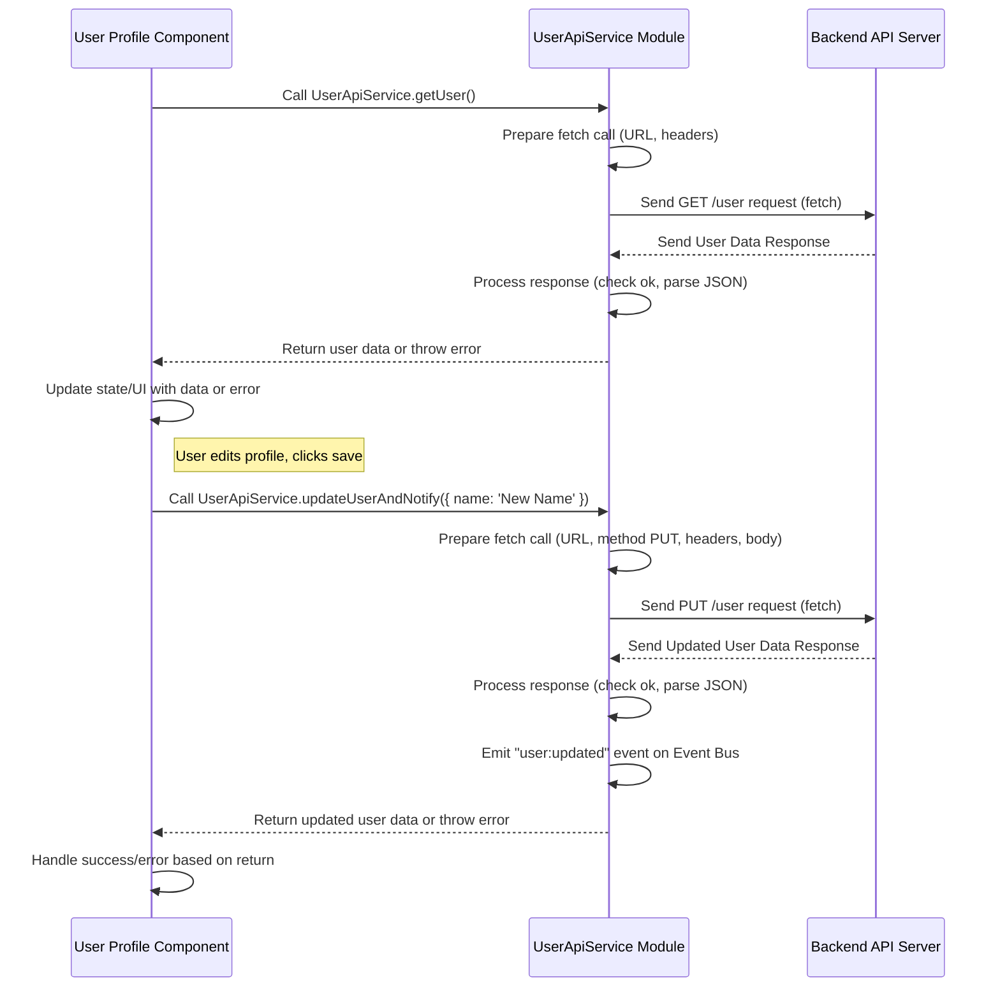

# Chapter 9: API Service Pattern

Welcome back to the **mfe-project** tutorial! In our last chapter, [Global Context (window.mfeGlobalContext)](08_global_context__window_mfeglobalcontext__.md), we saw how the Shell provides a shared place for MFEs to easily access common data like the logged-in user's details. This is great for _reading_ data that's already available.

But what about getting brand new data from a backend server, or sending data to the server to save changes (like updating a user's profile)? This involves making API calls.

## The Problem: API Calls Can Get Messy

Imagine your website needs to show a list of products, display user orders, and let users update their profile. All this data usually comes from a backend API server (in this project, we have a simple `json-server` running on `http://localhost:3005`).

If every single MFE or every component within an MFE makes direct `fetch` or `axios` calls scattered throughout the code, it can quickly become hard to manage:

- **Repetition:** You might write the same basic logic for fetching data or handling errors in multiple places.
- **Inconsistency:** Different parts of the application might handle API responses or errors differently.
- **Hard to Update:** If the API endpoint changes, or you need to add authentication headers to _all_ requests, you have to find and change code in many different files across potentially different MFEs.
- **Poor Readability:** Mixing data fetching logic directly within components makes the components harder to understand and test.

We need a more organized and consistent way to handle all the interactions with the backend API.

## The Solution: The API Service Pattern

The **API Service Pattern** is a common way to solve this. The idea is simple: group all API calls related to a specific _domain_ or type of data into a single, dedicated module or class.

Think of it like having dedicated couriers for different types of packages:

- A "User Data Courier" service handles everything related to fetching and sending user information.
- A "Products Courier" service handles getting the list of products and details.
- An "Orders Courier" service handles fetching and submitting order information.

In code, this means creating files like `userApiService.js`, `productsApiService.js`, `ordersApiService.js`, etc. Each of these files exports a class (often with static methods, meaning you call them directly on the class without creating an instance) or an object containing functions that perform specific API operations.

For example, a `UserApiService` might have methods like:

- `UserApiService.getUser()`: Fetches the current user's data.
- `UserApiService.updateUser(userData)`: Sends updated user data to the server.

While _in this specific project's code_, you might see copies of a `UserApiService.js` file in different MFE directories (`shell`, `user-profile-mfe`, `orders-mfe`, `products-mfe`), the _pattern_ is the key. The pattern is about **encapsulating** the API call logic away from the components that need the data. Each MFE manages its own internal API interactions using this pattern.

## Key Ideas of the API Service Pattern

1.  **Encapsulation:** Hide the details of _how_ the API call is made (the `fetch` syntax, headers, base URL) inside the service module.
2.  **Domain Grouping:** Keep all related API calls together (e.g., all user-related calls in `UserApiService`).
3.  **Abstraction:** Provide simple methods (like `getUser()`) that describe _what_ the service does, not _how_.
4.  **Consistency:** Implement consistent error handling, logging, or request modification within the service methods.

## Use Case: Fetching and Updating User Data

Let's walk through a common scenario: a component in the User Profile MFE needs to:

1.  Fetch the initial user data when it loads.
2.  Allow the user to change their name and save it, which requires sending updated data to the API.

Without the API Service Pattern, the component might contain messy `fetch` calls. With the pattern, it calls methods on a dedicated service.

## How to Use an API Service

First, you need to have an API service module defined. In the `mfe-project`, the `user-profile-mfe` has its own `userApiService.js` file.

Let's look at a simplified example of a component using this service:

```javascript
// Inside user-profile-mfe/src/UserProfile.js (simplified)
import React, { useState, useEffect } from "react";
// Import the dedicated API Service module
import UserApiService from "./userApiService";
// We'll also use the Event Bus from Chapter 7
import { window } from "window-or-global"; // Access global window

const UserProfile = ({ user: initialUser }) => {
  // Component state for the form fields
  const [name, setName] = useState(initialUser?.name || "");
  const [email, setEmail] = useState(initialUser?.email || "");
  const [isLoading, setIsLoading] = useState(false);
  const [error, setError] = useState(null);

  // Effect to potentially fetch data on mount if not provided via props
  useEffect(() => {
    // In this project, shell provides initialUser via global context & props
    // But if this component fetched its own data, it might do it here:
    // const fetchData = async () => { ... await UserApiService.getUser() ... }
  }, []);

  // Function to handle saving changes
  const handleSave = async (event) => {
    event.preventDefault(); // Prevent page reload
    setIsLoading(true);
    setError(null);

    const updates = { name, email }; // Data to send

    try {
      console.log("📝 User Profile MFE: Calling API Service to update user...");
      // Use the API Service to make the API call
      // Calling a method on the imported service class
      const updatedUser = await UserApiService.updateUserAndNotify(updates);

      console.log("💾 User Profile MFE: Save successful:", updatedUser);

      // State might be updated locally or rely on the Event Bus update
      // setUser(updatedUser); // Could update local state
    } catch (err) {
      console.error("❌ User Profile MFE: Error saving user:", err);
      setError("Failed to save profile.");
    } finally {
      setIsLoading(false);
    }
  };

  return (
    <form onSubmit={handleSave}>
      {/* ... Input fields for name and email, bound to state ... */}
      <div>
        <label>Name:</label>
        <input
          type="text"
          value={name}
          onChange={(e) => setName(e.target.value)}
          disabled={isLoading}
        />
      </div>
      <div>
        <label>Email:</label>
        <input
          type="email"
          value={email}
          onChange={(e) => setEmail(e.target.value)}
          disabled={isLoading}
        />
      </div>
      {error && <p style={{ color: "red" }}>{error}</p>}
      <button type="submit" disabled={isLoading}>
        {isLoading ? "Saving..." : "Save Profile"}
      </button>
    </form>
  );
};

export default UserProfile;
```

Explanation:

1.  `import UserApiService from './userApiService';`: We import the module that contains our API service class.
2.  `await UserApiService.updateUserAndNotify(updates);`: Instead of writing `fetch(...)` directly here, we call a method (`updateUserAndNotify`) on the `UserApiService` class. The component doesn't need to know the API endpoint URL, the HTTP method (PUT), or how to stringify the body. It just knows it needs to ask the service to update the user.
3.  The component handles the UI state (`isLoading`, `error`) and reacts to the _result_ of the service call (success or failure).

This makes the `UserProfile` component cleaner, focusing on _what_ data to get/send and _how_ to display/handle the process, rather than the low-level details of the API request itself.

## Under the Hood: What's Inside the API Service?

The API Service module itself is where the `fetch` (or other HTTP library) calls actually happen. It's a simple JavaScript file that defines the methods you call from your components.

Let's look at a simplified version of the `UserApiService` found in multiple MFEs in the project (e.g., `user-profile-mfe/src/userApiService.js`):

```javascript
// File: user-profile-mfe/src/userApiService.js (simplified)
// We know the API is running here (from package.json scripts)
const API_BASE_URL = "http://localhost:3005";

// Access global event bus (from Chapter 7)
const eventBus = window.mfeEventBus;

/**
 * Dedicated service for User API interactions.
 * Encapsulates fetch calls related to users.
 */
class UserApiService {
  /**
   * Fetches user data from the /user endpoint.
   * @returns {Promise<Object>} The user data.
   * @throws {Error} If the network request fails or response is not ok.
   */
  static async getUser() {
    try {
      console.log("📞 User API Service: Fetching user data...");
      const response = await fetch(`${API_BASE_URL}/user`); // The actual fetch call!

      // Basic error handling for non-2xx responses
      if (!response.ok) {
        throw new Error(`HTTP error! status: ${response.status}`);
      }

      const userData = await response.json(); // Parse the JSON response
      console.log("✅ User API Service: User data fetched.");
      return userData; // Return the data to the caller (the component)
    } catch (error) {
      console.error("❌ User API Service: Error fetching user data:", error);
      // Re-throw the error so the calling component can catch it
      throw error;
    }
  }

  /**
   * Sends updated user data to the /user endpoint using PUT.
   * @param {Object} userData - The data to send.
   * @returns {Promise<Object>} The updated user data from the server response.
   * @throws {Error} If the network request fails or response is not ok.
   */
  static async updateUser(userData) {
    try {
      console.log("📞 User API Service: Updating user data...");
      const response = await fetch(`${API_BASE_URL}/user`, {
        method: "PUT", // Specify HTTP method
        headers: {
          // Add necessary headers
          "Content-Type": "application/json",
          // ... other headers like Authorization if needed ...
        },
        body: JSON.stringify(userData), // Send data as JSON string
      });

      if (!response.ok) {
        throw new Error(`HTTP error! status: ${response.status}`);
      }

      const updatedUserData = await response.json();
      console.log("✅ User API Service: User data updated.");
      return updatedUserData; // Return the updated data
    } catch (error) {
      console.error("❌ User API Service: Error updating user data:", error);
      throw error;
    }
  }

  /**
   * Helper method: Updates user and notifies other MFEs via Event Bus.
   * This combines an API call and an event emission, standardizing the pattern.
   * @param {Object} updates - Partial user data to update.
   * @returns {Promise<Object>} The updated user data from the API.
   */
  static async updateUserAndNotify(updates) {
    try {
      // Optional: Get current data from global context to merge updates
      const currentUser = window.mfeGlobalContext?.user || {};
      const dataToSend = { ...currentUser, ...updates };

      // Call the internal API update method
      const apiResponse = await this.updateUser(dataToSend);

      // After successful API update, emit event (using Event Bus from Chapter 7)
      if (eventBus) {
        eventBus.emit("user:updated", apiResponse);
        console.log("📢 User API Service: Emitted 'user:updated' event.");
      }

      return apiResponse; // Return the result to the caller
    } catch (error) {
      console.error("❌ User API Service: updateUserAndNotify failed:", error);
      // Optional: Emit error event
      if (eventBus) {
        eventBus.emit("user:api-error", {
          message: error.message,
          source: "UserApiService",
        });
      }
      throw error; // Re-throw to signal failure to the caller
    }
  }
}

export default UserApiService; // Export the class
```

This code shows:

1.  The `API_BASE_URL` is defined once.
2.  `getUser` contains the `fetch` logic for getting user data, including checking `response.ok` and parsing JSON.
3.  `updateUser` contains the `fetch` logic for sending data using `PUT`, setting headers, and stringifying the body.
4.  The `updateUserAndNotify` method is a helpful pattern combining the API call with an [Event Bus](07_event_bus__window_mfeeventbus__.md) emission. This is a common flow: user action -> call API Service -> API Service makes fetch call -> API Service receives successful response -> API Service emits event on the Event Bus -> MFEs listening for the event update their UI or state. This is used by the `user-profile-mfe` and `products-mfe` when they handle user updates.
5.  Errors are caught and logged within the service, but also _re-thrown_ (`throw error;`) so the component calling the service can also catch them and update its UI (e.g., show an error message).

**Why do multiple MFEs have a `userApiService.js`?**

In this specific project, for simplicity, some MFEs that need to interact with user data (like the Shell, User Profile, Products) have their _own copy_ of a `userApiService.js` file. They are slightly different in their details (e.g., what console logs they print, the `updateUserAndNotify` helper might vary or only exist in some), but they follow the same _pattern_. This avoids the complexity of trying to expose and consume an API service _itself_ as a [Remote Module](03_remote_module__exposed_module__.md) via Module Federation, or passing it down through [Global Context](08_global_context__window_mfeglobalcontext__.md). The focus is on the _pattern_ of encapsulation _within_ each unit (MFE or Shell), even if the implementation is duplicated. In a larger, more complex MFE system, you might explore ways to share core services or libraries containing services using [Shared Dependencies](05_shared_dependencies__.md) or by exposing the service itself as a Remote Module, but that adds complexity not needed for this introductory project.

Here's a simplified view of the interaction flow:



This diagram illustrates how the component delegates the API interaction to the dedicated service. The service handles the low-level communication and then returns the result (data or error) to the component. The `updateUserAndNotify` variant adds the step of emitting an event _after_ a successful write operation, notifying other parts of the application.

## Benefits of the API Service Pattern

- **Modularity:** Keeps API logic separate from UI components. Components are easier to read, understand, and test.
- **Maintainability:** Changes to API endpoints, request formats, or error handling can often be made in just one place (the service file for that domain).
- **Testability:** It's easier to write unit tests for standalone service methods than for API calls mixed into components. You can also easily "mock" (fake) the service in component tests to test UI behavior without actually hitting the network.
- **Consistency:** Promotes consistent API interaction patterns and error handling across the application or within an MFE.

## Conclusion

The API Service Pattern is a fundamental concept for managing backend communication in applications, including Micro Frontends. In the `mfe-project`, this pattern is applied by creating dedicated modules or classes (like `UserApiService`) responsible for specific API interactions. This encapsulates the low-level `fetch` logic, making components cleaner and promoting better organization, even if the service implementation is duplicated across different MFEs for simplicity in this learning project. Combining API service calls with [Event Bus](07_event_bus__window_mfeeventbus__.md) emissions (as seen in `updateUserAndNotify`) is a powerful way to standardize workflows that involve updating data and notifying the rest of the application about the change.

Now that we understand how MFEs handle API calls and communicate via events, let's look at how the Shell often orchestrates actions triggered by these events – the concept of Semantic Actions.

Let's move on to the next chapter!

[Semantic Actions](10_semantic_actions_.md)
