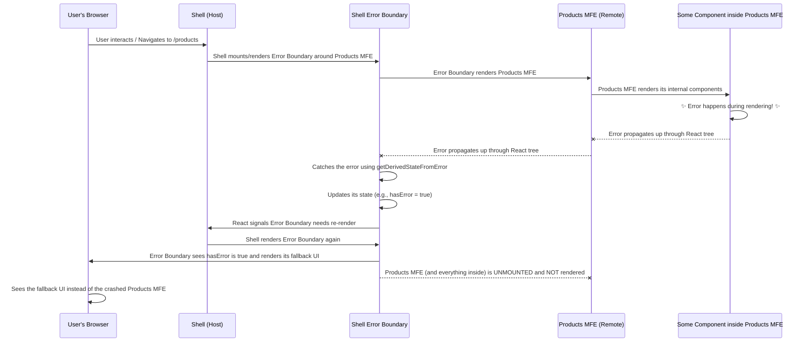

# Chapter 9: Error Boundary

Welcome back to the `mfe-project` tutorial! We've come a long way. We've learned about **[Micro Frontends (MFEs)](01_micro_frontend__mfe__.md)** (independent shops), the **[Shell (Host Application)](02_shell__host_application__.md)** that hosts them (the mall), **[Webpack Module Federation](03_webpack_module_federation_.md)** (the infrastructure), the **[Remote Entry File](04_remote_entry_file_.md)** (the shop directory), **[Remote Modules](05_remote_module__exposed_component_app__.md)** (the items in the shop), **[Shared Modules](06_shared_modules_.md)** (the shared facilities), **[Inter-MFE Communication](07_inter_mfe_communication__event_bus___context__.md)** (the mall's communication systems), and **[Routing](08_routing_.md)** (navigating the mall and its shops).

Now, let's tackle a critical aspect of building robust applications: **Error Handling**.

## The Problem: When a Shop Has a Meltdown

Imagine you're walking through our mall (the Shell application). You enter the "Products Shop" (the Products MFE). Suddenly, something unexpected happens inside the Products MFE – perhaps it tries to process some data incorrectly, or a network request fails in a way it didn't expect, causing a programming error (an uncaught JavaScript exception).

In a traditional, single-application setup, an uncaught error often crashes the _entire_ application, showing a blank screen or an ugly error message, and the user loses their progress.

In a Micro Frontend architecture, we have multiple independent applications running together. If one MFE crashes, should it take down the _entire_ Shell application and all other running MFEs (Header, Orders, etc.) with it? Ideally not! Just like a problem in one shop shouldn't require shutting down the entire mall.

We need a way to contain errors within the specific MFE where they occur, preventing them from "bubbling up" and affecting the rest of the application.

## The Solution: Error Boundaries (The Safety Net)

This is where **Error Boundaries** come in.

**Think of an Error Boundary as a safety net you place around a component or a group of components, like placing a safety net around the entrance of each shop in the mall.**

- It's a special type of React component.
- If a JavaScript error happens _inside_ the components it wraps (in its "children"), the Error Boundary catches that error.
- Instead of letting the error crash the whole application, the Error Boundary stops the error propagation and renders a **fallback UI** instead of the crashed children. This fallback could be a simple "Something went wrong" message, a retry button, or a generic error screen.
- Error Boundaries only catch errors that happen during rendering, in lifecycle methods, or inside hooks. They _don't_ catch errors in event handlers (like a button's `onClick`) or asynchronous code (like `setTimeout` or `fetch` inside a `useEffect`) – you still need `try/catch` blocks for those inside the handler/async function itself. However, uncaught rendering errors are common and can easily break an MFE.

By placing Error Boundaries around each MFE loaded by the Shell, we create isolated error zones. If the Products MFE crashes, its Error Boundary catches the error, shows a friendly message _only in the area where the Products MFE was supposed to be_, and the Header MFE, Orders MFE, and the rest of the Shell continue to function normally.

## Using Error Boundaries in the Shell

The most critical place to use Error Boundaries is in the **Shell application**, around where you load and render your remote MFEs. This provides the primary defense against one MFE crashing the host.

Look at the Shell's `shell/src/App.js`. It wraps each lazy-loaded MFE component with an `<ErrorBoundary>`:

```jsx
// shell/src/App.js (Simplified)
import React, { Suspense } from "react";
import { BrowserRouter as Router, Routes, Route, Navigate } from "react-router-dom";
import ErrorBoundary from "./components/ErrorBoundary"; // <-- Import the Error Boundary component

// Lazy load MFE components
const ProductsMfe = React.lazy(() => import("productsMfe/App"));
const OrdersMfe = React.lazy(() => import("ordersMfe/App"));
const HeaderMfe = React.lazy(() => import("headerMfe/Header")); // Header also wrapped

const Loading = ({ message = "Loading..." }) => (/* ... loading UI ... */);

const AppContent = () => {
  return (
    <div className="app">
      <Router>
        {/* Header MFE - Wrapped with Error Boundary */}
        <ErrorBoundary fallback={<div>Header failed to load 😢</div>}> {/* <-- Wrap here! */}
          <Suspense fallback={<Loading message="Loading Header..." />}>
            <HeaderMfe /> {/* The MFE component */}
          </Suspense>
        </ErrorBoundary>

        <main>
          <Routes>
            {/* Products MFE Route - Wrapped with Error Boundary */}
            <Route
              path="/products/*"
              element={
                <ErrorBoundary fallback={<div>Products MFE failed to load 🙁</div>}> {/* <-- Wrap here! */}
                  <Suspense fallback={<Loading message="Loading Products..." />}>
                    <ProductsMfe /> {/* The MFE component */}
                  </Suspense>
                </ErrorBoundary>
              }
            />

            {/* Orders MFE Route - Wrapped with Error Boundary */}
             <Route
              path="/orders/*"
              element={
                <ErrorBoundary fallback={<div>Orders MFE failed to load 😟</div>}> {/* <-- Wrap here! */}
                  <Suspense fallback={<Loading message="Loading Orders..." />}>
                    <OrdersMfe /> {/* The MFE component */}
                  </Suspense>
                </ErrorBoundary>
              }
            />
          </Routes>
        </main>
        {/* ... Learning Info ... */}
      </Router>
    </div>
  );
};
// ... App wrapper ...
```

**Explanation:**

- We import a custom `ErrorBoundary` component (`./components/ErrorBoundary`).
- Around each `<Suspense>` block that loads a remote MFE (like `<ProductsMfe />`), we add `<ErrorBoundary>`.
- The `fallback` prop on `<ErrorBoundary>` specifies what React should render if an error occurs anywhere within the children of this specific Error Boundary (i.e., inside the `ProductsMfe` component or anything it renders during the initial render or updates).
- Now, if something goes wrong deep inside the Products MFE component during rendering, the Error Boundary wrapping it catches the error. The area on the page where the Products MFE was supposed to be will show the fallback message ("Products MFE failed to load 🙁") instead of crashing the whole page.

## Error Boundaries Within MFEs

While the Shell's Error Boundaries protect the host application, an MFE might also want to use Error Boundaries _internally_.

For example, in the `products-mfe`, we embed the `userProfileMfe`. If the `userProfileMfe` component has a rendering error, we don't necessarily want the _entire_ Products MFE area to show an error message. We might just want that specific embedded section to show an error.

Look at the Products MFE's `products-mfe/src/App.js`:

```jsx
// products-mfe/src/App.js (Simplified with internal Error Boundary)
import React, { Suspense, useState } from "react";
import { Routes, Route, useNavigate, useLocation } from "react-router-dom";
import ErrorBoundary from "./components/ErrorBoundary"; // <-- Products MFE has its OWN Error Boundary component!

// Import User Profile MFE (Remote Module)
const UserProfileMfe = React.lazy(() => import("userProfileMfe/UserProfile"));

const App = () => {
  // ... state, hooks, etc. ...
  const [showProfile, setShowProfile] = useState(false);

  return (
    <div className="products-mfe">
       {/* ... Products MFE Header, User Editor ... */}

       {/* Embedded User Profile MFE - Wrapped with Products MFE's OWN Error Boundary */}
       {showProfile && (
         <div style={/* ... styles ... */}>
           <h3>👤 User Profile (Embedded MFE)</h3>
           <ErrorBoundary
             fallback={<div>❌ User Profile MFE failed to load</div>} {/* <-- Fallback specifically for this section */}
           >
             <Suspense fallback={<div>Loading User Profile MFE...</div>}>
               {/* The embedded MFE component */}
               <UserProfileMfe user={/* ... */} />
             </Suspense>
           </ErrorBoundary>
         </div>
       )}

       {/* ... Products MFE Navigation and main content Routes ... */}
       {/* The main content area routes might also be wrapped if desired */}
       {/* <main className="products-content"> */}
       {/*    <ErrorBoundary fallback={<div>Error in Products Content!</div>}> */}
       {/*      <Routes> ... </Routes> */}
       {/*    </ErrorBoundary> */}
       {/* </main> */}

       {/* ... Learning Info ... */}
    </div>
  );
};

export default App;
```

**Explanation:**

- The `products-mfe` project also has its _own_ `ErrorBoundary.js` component (`products-mfe/src/components/ErrorBoundary.js`).
- When rendering the `UserProfileMfe`, which is a remote module loaded _by the Products MFE_, it's wrapped in _this_ internal `<ErrorBoundary>`.
- If an error occurs inside the `UserProfileMfe`, the Error Boundary in the Products MFE catches it. The user will only see the "❌ User Profile MFE failed to load" message within that specific box on the page. The rest of the Products MFE (like the product list or add form) would remain functional, and the Shell and other MFEs are completely unaffected.

This demonstrates how Error Boundaries provide layers of protection. The Shell's Error Boundaries are the first line of defense for protecting the host application from remote MFE crashes. Internal Error Boundaries within an MFE protect different sections of that MFE from each other.

## How Error Boundaries Work (Under the Hood)

Error Boundaries are standard React class components that implement specific lifecycle methods:

- `static getDerivedStateFromError(error)`: This static method is called after an error is thrown in a child component. It receives the error and should return an object to update the component's state (e.g., setting `hasError: true`).
- `componentDidCatch(error, errorInfo)`: This method is called after the error is caught. It's used for side effects, like logging the error information to a reporting service (e.g., Sentry, LogRocket) or the console.

When an error occurs during rendering within a component tree:



The crucial point is that the Error Boundary's `render` method checks its state (`hasError`). If `hasError` is `true` (because `getDerivedStateFromError` was called), it renders the `fallback` prop instead of trying to render `this.props.children` (which would likely crash again).

Here's a simplified look at the `ErrorBoundary.js` component used in our project:

```javascript
// shell/src/components/ErrorBoundary.js (Simplified)
import React from "react";

class ErrorBoundary extends React.Component {
  constructor(props) {
    super(props);
    // State to track if an error occurred within children
    this.state = { hasError: false, error: null, errorInfo: null };
  }

  // Called after an error is thrown by a descendant component
  static getDerivedStateFromError(error) {
    // Update state so the next render shows the fallback UI
    return { hasError: true, error: error };
  }

  // Called after an error is caught; useful for logging
  componentDidCatch(error, errorInfo) {
    // Log error details (e.g., to console or an external service)
    console.error("MFE Error Boundary caught:", error, errorInfo);
    this.setState({ errorInfo }); // Store info for potential display
  }

  render() {
    if (this.state.hasError) {
      // If an error occurred, render the fallback UI provided by the parent
      if (this.props.fallback) {
        return this.props.fallback;
      }

      // Or render a default error message
      return (
        <div style={{ padding: "20px", border: "1px solid red", color: "red" }}>
          <h2>🚨 An error occurred.</h2>
          <p>Details: {this.state.error?.message}</p>
          {/* Optionally display errorInfo for debugging */}
          {/* <pre>{this.state.errorInfo?.componentStack}</pre> */}
        </div>
      );
    }

    // No error, render children components normally
    return this.props.children;
  }
}

export default ErrorBoundary;
```

The `ErrorBoundary` component provided in the project includes a more detailed fallback with the error stack trace (helpful for debugging) and retry buttons.

The Products MFE's `ErrorBoundary.js` is similar but might have a simpler fallback or logging strategy specific to that MFE.

## Benefits of Error Boundaries in MFEs

- **Resilience:** A critical MFE crashing doesn't bring down the entire application.
- **Isolation:** Errors are visually and functionally contained within the failing MFE's area.
- **Improved User Experience:** Users see a controlled error message in a specific section rather than a full-page crash.
- **Easier Debugging:** `componentDidCatch` provides details about _where_ the error occurred in the component tree.

## Conclusion

Error Boundaries are a vital tool in any React application, and they are particularly important in Micro Frontend architectures. By strategically placing `<ErrorBoundary>` components around your remote MFEs in the Shell, and potentially around key sections _within_ your MFEs, you create safety nets that catch rendering errors. This prevents a single failing MFE from crashing the entire host application, leading to a more resilient, stable, and user-friendly experience, much like individual shop problems in a mall are contained without disrupting the entire shopping experience.

This concludes our core chapters on the concepts behind the `mfe-project`. We've covered how to build, deploy, combine, communicate with, route to, and gracefully handle errors within independent Micro Frontends using Webpack Module Federation and React.
