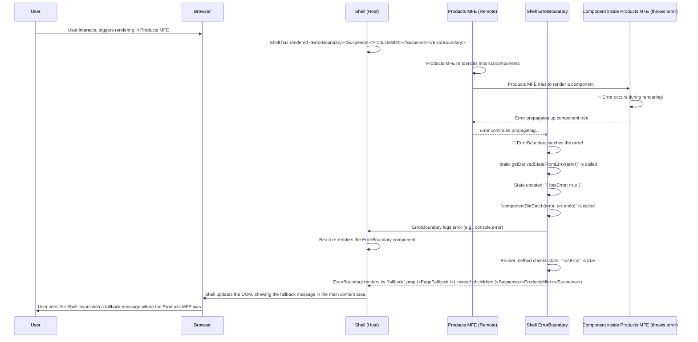

# Chapter 9: Error Boundary

Welcome back to the `mfe-project` tutorial! We've built independent **Micro Frontends (MFEs)** ([Chapter 2](02_micro_frontend__mfe__.md)), learned how the **Shell** ([Chapter 3](03_shell__host__application_.md)) orchestrates them using [Webpack Module Federation](01_webpack_module_federation_.md), and explored how to manage their connections with [Remotes](04_remotes_configuration_.md), [Exposed Modules](05_exposed_modules_.md), and [Shared Dependencies](06_shared_dependencies_.md). We've even seen how to structure them as [Component MFEs](07_component_mfe_.md) or [Page MFEs](08_page_mfe_.md).

Our architecture is becoming quite powerful, allowing different parts of the application to be developed and deployed by separate teams. But what happens if one of these independent parts runs into trouble?

## The Problem: A Single MFE Crash

Imagine you have your Shell application running perfectly. It loads the Header MFE at the top and the Products Page MFE in the main content area. Suddenly, a bug occurs _inside_ the Products MFE – perhaps it tries to access data that doesn't exist, or a piece of its logic throws an uncaught error.

In a traditional single-application frontend, an uncaught JavaScript error often leads to the entire application "crashing" – the page might become blank, unresponsive, or display a disruptive error message that takes over the screen.

In a Micro Frontend architecture, this is even more critical. If the Products MFE is developed and deployed by a different team, you _absolutely do not_ want a bug in their code to take down the _entire_ Shell application, including the Header, the navigation, and potentially other MFEs that were working fine. The user experience would be terrible; it would be like a small issue in one store causing the entire shopping mall to shut down!

We need a safety net. We need a way for one part of the application to fail _gracefully_ without affecting the rest.

## The Solution: Error Boundaries

This is where **Error Boundaries** come in.

An **Error Boundary** is a special type of React component that you wrap around other components (or in our case, other MFEs). It acts like a protective shield. If any component _inside_ the Error Boundary throws a JavaScript error during rendering, in a lifecycle method, or in its constructor, the Error Boundary catches that error instead of letting it propagate up and crash the entire application.

Once an Error Boundary catches an error:

1.  **It prevents the crash:** The rest of the application outside the Error Boundary continues to function normally.
2.  **It logs the error:** You can include logic to log the error details (e.g., to the console, or to an error monitoring service like Sentry or Datadog).
3.  **It displays fallback UI:** Instead of the crashing component, the Error Boundary can render a friendly fallback message or component (like "Sorry, something went wrong in this section").

Think of it as a fire containment system in our shopping mall analogy. If a small fire (an error) breaks out in one store (an MFE), the fire containment system (the Error Boundary) isolates the issue to that store, preventing it from spreading and allowing the rest of the mall to operate, perhaps showing a sign on the affected store's gate saying "Temporarily Closed".

Error Boundaries are a standard feature in React (specifically for class components with certain lifecycle methods). In Micro Frontend architectures, they are _essential_ because they provide failure isolation between independent application parts.

## Using Error Boundaries in the Shell

The most crucial place to use Error Boundaries in our `mfe-project` is in the **Shell application**, specifically around the points where you dynamically load and render other **Micro Frontends (MFEs)**. This includes both [Component MFEs](07_component_mfe_.md) (like the Header) and [Page MFEs](08_page_mfe_.md) (like Products or Orders).

Let's look at the `shell/src/App.js` file again, focusing on how we wrap the lazy-loaded MFEs.

```javascript
// --- File: shell/src/App.js (Snippet) ---
import React, { Suspense } from "react";
import {
  BrowserRouter as Router,
  Routes,
  Route,
  Navigate,
} from "react-router-dom";
// 🔑 Import the ErrorBoundary component
import ErrorBoundary from "./components/ErrorBoundary";

// Lazy load MFE components/apps
const HeaderMfe = React.lazy(() => import("headerMfe/Header"));
const ProductsMfe = React.lazy(() => import("productsMfe/App"));
const OrdersMfe = React.lazy(() => import("ordersMfe/App"));

// 🔑 Fallback components to show when an MFE fails
const HeaderFallback = () => (
  <div
    className="header-fallback"
    style={
      {
        /* ... styles ... */
      }
    }
  >
    <h1>MFE Learning Project</h1>
    <p>Header MFE failed to load - using fallback</p>
  </div>
);

const PageFallback = ({ pageName }) => (
  <div
    className="page-fallback"
    style={
      {
        /* ... styles ... */
      }
    }
  >
    <h2>{pageName} MFE Unavailable</h2>
    <p>This MFE failed to load. Check console.</p>
  </div>
);

// ... Loading component ...

function App() {
  console.log("🚀 Shell App rendering...");

  return (
    <div
      className="app"
      style={
        {
          /* ... styles ... */
        }
      }
    >
      <Router>
        <div
          className="layout"
          style={
            {
              /* ... styles ... */
            }
          }
        >
          {/* 🔑 Wrap Header MFE with Error Boundary */}
          <ErrorBoundary fallback={<HeaderFallback />}>
            <Suspense fallback={<Loading message="Loading Header..." />}>
              <HeaderMfe /> {/* This is the MFE that could potentially fail */}
            </Suspense>
          </ErrorBoundary>

          <main
            className="main-content"
            style={
              {
                /* ... styles ... */
              }
            }
          >
            <Routes>
              <Route path="/" element={<Navigate to="/products" replace />} />

              {/* 🔑 Wrap Products MFE route element with Error Boundary */}
              <Route
                path="/products/*"
                element={
                  <ErrorBoundary
                    fallback={<PageFallback pageName="Products" />}
                  >
                    <Suspense
                      fallback={<Loading message="Loading Products MFE..." />}
                    >
                      <ProductsMfe />{" "}
                      {/* This is the MFE that could potentially fail */}
                    </Suspense>
                  </ErrorBoundary>
                }
              />

              {/* 🔑 Wrap Orders MFE route element with Error Boundary */}
              <Route
                path="/orders/*"
                element={
                  <ErrorBoundary fallback={<PageFallback pageName="Orders" />}>
                    <Suspense
                      fallback={<Loading message="Loading Orders MFE..." />}
                    >
                      <OrdersMfe />{" "}
                      {/* This is the MFE that could potentially fail */}
                    </Suspense>
                  </ErrorBoundary>
                }
              />

              {/* ... other Shell routes ... */}
            </Routes>
          </main>
          {/* ... Footer ... */}
        </div>
      </Router>
    </div>
  );
}

export default App;
```

Here's what we're doing:

1.  We import our custom `ErrorBoundary` component (`./components/ErrorBoundary`).
2.  We define simple React components (`HeaderFallback`, `PageFallback`) to serve as the visual fallback when an error occurs within the wrapped MFE.
3.  Crucially, we wrap the `<Suspense>` component (which itself wraps the lazy-loaded MFE component like `<HeaderMfe />` or `<ProductsMfe />`) with `<ErrorBoundary>`.
4.  We pass the desired fallback component to the `fallback` prop of the `ErrorBoundary`.

Now, if an error happens while the `HeaderMfe` is loading or rendering, the `ErrorBoundary` wrapped around it will catch it. It will prevent that error from affecting the rest of the `App` component (the Shell's main layout). Instead of the whole page breaking, the `ErrorBoundary` will render the `HeaderFallback` component in place of the Header, while the rest of the Shell (including the main content area and footer) remains functional.

Similarly, if an error occurs within the `ProductsMfe` (which is the entire application loaded for the `/products` route), the `ErrorBoundary` around the `<ProductsMfe />` element in the `/products/*` route will catch it. The Shell's main content area will then display the `PageFallback` for Products, while the Shell's header and footer are unaffected.

## Using Error Boundaries _Within_ an MFE

It's also a good practice to use Error Boundaries _inside_ your individual MFEs, especially if they are consuming other MFEs (like our Products MFE consuming the User Profile MFE) or rendering complex, independent sections.

Look at the `products-mfe/src/App.js` file:

```javascript
// --- File: products-mfe/src/App.js (Snippet) ---
import React, { Suspense, useState } from "react";
import { Routes, Route, useNavigate, useLocation } from "react-router-dom";
import "./styles.css";
// 🔑 Import ErrorBoundary within the MFE itself
import ErrorBoundary from "./components/ErrorBoundary";
// ... other imports ...

// Import User Profile MFE - MFE within MFE!
const UserProfileMfe = React.lazy(() => import("userProfileMfe/UserProfile"));

const App = () => {
  // ... state and logic ...
  const [showProfile, setShowProfile] = useState(false);
  const currentUser = {
    /* ... mock user data ... */
  };

  // ... isActive helper ...

  return (
    <div className="products-mfe">
      {/* ... Products MFE's own layout ... */}

      {/* ... User Profile Toggle ... */}

      {/* 🔑 Wrap the embedded Component MFE with Error Boundary */}
      {showProfile && (
        <div className="embedded-profile">
          <div className="profile-header">
            <h3>👤 User Profile (Embedded MFE)</h3>
            <span className="learning-note">
              💡 This profile component is loaded from User Profile MFE (port
              3004)
            </span>
          </div>
          {/* Use ErrorBoundary for graceful failure of the embedded MFE */}
          <ErrorBoundary
            fallback={
              <div className="profile-error">
                <p>❌ User Profile MFE failed to load</p>
                <p>
                  This demonstrates graceful degradation when embedded MFEs fail
                </p>
              </div>
            }
          >
            {/* Use Suspense for loading state of the embedded MFE */}
            <Suspense
              fallback={
                <div className="loading">Loading User Profile MFE...</div>
              }
            >
              {/* The embedded MFE component */}
              <UserProfileMfe user={currentUser} />
            </Suspense>
          </ErrorBoundary>
        </div>
      )}

      {/* ... Navigation ... */}
      {/* ... Main Content (internal routes) ... */}

      {/* ... Learning Info ... */}
    </div>
  );
};

export default App;
```

Here, the `ProductsMfe` itself is acting as a _host_ for the `UserProfileMfe` ([Chapter 7](07_component_mfe_.md)). If the `UserProfileMfe` fails, we don't want it to crash the _entire_ `ProductsMfe` (even though the `ProductsMfe` is already isolated by an Error Boundary in the Shell).

By wrapping the `<UserProfileMfe />` component with another `ErrorBoundary` _inside_ the `ProductsMfe`, we ensure that if the User Profile component fails, only _that specific section_ within the Products page displays a fallback, and the rest of the Products MFE (like the product list or add form) remains usable.

This layered approach to Error Boundaries provides robust failure isolation at multiple levels: between the Shell and Page MFEs, and between Page MFEs and any embedded Component MFEs.

## Implementing the Error Boundary Component

An Error Boundary is typically a React class component that implements at least one of two specific lifecycle methods:

1.  `static getDerivedStateFromError(error)`: Used to update state when an error is thrown, which triggers a re-render with the fallback UI.
2.  `componentDidCatch(error, errorInfo)`: Used for side effects like logging the error details.

Let's look at the simple `shell/src/components/ErrorBoundary.js` file:

```javascript
// --- File: shell/src/components/ErrorBoundary.js ---
import React from "react";

class ErrorBoundary extends React.Component {
  constructor(props) {
    super(props);
    // Initialize state to track if an error has occurred
    this.state = { hasError: false, error: null, errorInfo: null };
  }

  // This static method is called after an error is thrown by a descendant component.
  // It receives the error and should return a value to update state.
  static getDerivedStateFromError(error) {
    // Update state so the next render will show the fallback UI
    return { hasError: true };
  }

  // This method is called after an error has been caught.
  // It receives the error and information about the component stack.
  componentDidCatch(error, errorInfo) {
    // 🔑 Log error details for debugging
    console.error("MFE Error Boundary caught an error:", error, errorInfo);

    // Store error details in state (optional, but helpful for displaying details)
    this.setState({
      error: error,
      errorInfo: errorInfo,
    });

    // In a real application, you would send this error to an error tracking service
    // Example: MyErrorLoggingService.logError(error, errorInfo);
  }

  render() {
    // If state indicates an error occurred...
    if (this.state.hasError) {
      // ...render the fallback UI provided via props...
      if (this.props.fallback) {
        return this.props.fallback;
      }

      // ...or render a default error message if no fallback prop was provided.
      return (
        <div
          className="error-boundary"
          style={
            {
              /* ... styles ... */
            }
          }
        >
          <h2>🚨 Something went wrong with this micro frontend</h2>
          <details
            style={
              {
                /* ... styles ... */
              }
            }
          >
            <summary>Error Details (for debugging)</summary>
            <p>
              <strong>Error:</strong>{" "}
              {this.state.error && this.state.error.toString()}
            </p>
            <p>
              <strong>Stack Trace:</strong>
            </p>
            <pre>{this.state.errorInfo.componentStack}</pre>
          </details>
          {/* ... optional retry buttons ... */}
        </div>
      );
    }

    // If no error, render the children wrapped by this Error Boundary
    return this.props.children;
  }
}

export default ErrorBoundary;
```

This component is a standard React Error Boundary. When `getDerivedStateFromError` is called because a child component threw an error, it sets `hasError` to `true`. This triggers the `render` method to execute again. In the `render` method, if `hasError` is true, it renders the content passed to the `fallback` prop (or a default message) instead of rendering `this.props.children` (which would be the failing MFE). The `componentDidCatch` is where you'd implement your error logging logic.

The `products-mfe` also includes a similar, simplified `ErrorBoundary.js` component specifically for use within that MFE, demonstrating that each MFE can have its own error handling strategy and components.

## How Error Boundaries Work Under the Hood (Simplified)

When a React component renders or updates, React performs a process called reconciliation. If, during this process, a component throws an uncaught JavaScript error, React stops rendering that component tree and attempts to find the nearest ancestor Error Boundary.

Here's a simplified flow when an error occurs _within_ a lazy-loaded MFE component wrapped by an `ErrorBoundary` in the Shell:



This diagram illustrates the isolation. The error originating deep within the Products MFE's component tree is contained by the `ErrorBoundary` wrapping the Products MFE _within the Shell_. The error doesn't escape the Error Boundary to affect the Shell's Header, Footer, or overall structure.

## Benefits of Using Error Boundaries

- **Failure Isolation:** This is the primary benefit in MFEs. A bug in one isolated MFE doesn't take down the entire application.
- **Improved User Experience:** Instead of a blank or completely broken page, the user sees a clear message indicating that a specific section is unavailable, potentially with options to retry or navigate elsewhere.
- **Easier Debugging:** Errors are caught and logged, often with component stack traces, making it easier to pinpoint where the issue originated, even across MFE boundaries.
- **Graceful Degradation:** Critical features failing don't necessarily make the _entire_ application unusable.

It's important to note that Error Boundaries only catch errors in the React render lifecycle, constructors, and certain lifecycle methods (`componentDidMount`, `componentDidUpdate`, `componentWillUnmount`). They _don't_ catch errors from:

- Event handlers (you need standard `try...catch` blocks here)
- Asynchronous code (`setTimeout`, `requestAnimationFrame`, promises/`async` functions)
- Server-side rendering
- Errors thrown in the Error Boundary itself

For errors in event handlers or async code within an MFE, you would still use standard JavaScript error handling (`try...catch`). However, errors related to rendering or mounting the MFE component itself, or errors within its core logic executed during rendering, are precisely what Error Boundaries are designed to catch, making them invaluable for runtime loading of independent MFEs.

## Conclusion

In a Micro Frontend architecture using Webpack Module Federation, **Error Boundaries** are not just a good practice, they are a fundamental requirement for building resilient applications. They provide crucial failure isolation, ensuring that a runtime error in one independent Micro Frontend does not cascade and break the entire Shell application. By wrapping dynamically loaded MFEs with Error Boundaries (both in the Shell and potentially within MFEs that host other MFEs), we create a safety net that catches errors, logs them, and displays a user-friendly fallback UI, leading to a much more stable and robust application experience.

This chapter concludes our deep dive into the core concepts of the `mfe-project`. You now have a solid understanding of the technologies and patterns used to build Micro Frontends with Webpack Module Federation, from the basic concepts to handling potential failures.

Thank you for following this tutorial! Feel free to explore the project code further, experiment with breaking an MFE to see the Error Boundaries in action, and apply these concepts to your own Micro Frontend projects.
