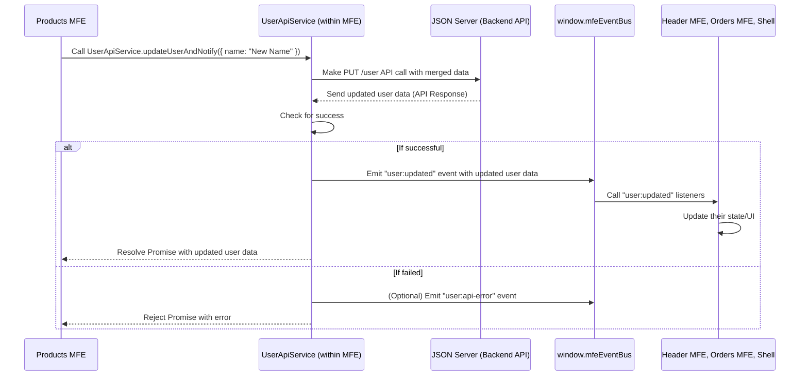

# Chapter 9: User API Service (`UserApiService`)

Welcome back! In the last couple of chapters, we learned how our independent Micro Frontends (MFEs) and the Shell can communicate using the [Event Bus (`window.mfeEventBus`)](07_event_bus___window_mfeeventbus___.md) for real-time updates and share common data using the [Shared Context (`window.mfeGlobalContext`)](08_shared_context___window_mfeglobalcontext__.md) for initial access.

These are great tools for _sharing_ and _reacting_ to data, but they don't actually _get_ or _update_ the data from the place it's stored – usually a backend server with a database.

Imagine the shopping mall again. The shared bulletin board ([Shared Context](08_shared_context___window_mfeglobalcontext__.md)) has today's special offers, and the public announcement system ([Event Bus](07_event_bus___window_mfeeventbus__.md)) announces when new stock arrives. But how does the information _get_ onto the bulletin board or _who_ makes the announcement after checking the stock? This is where a dedicated service comes in.

### What Problem Does the User API Service Solve?

In our application, different parts need to interact with user information:

- The Header MFE displays the user's name and avatar.
- The Products MFE might need the user's ID to show personalized content.
- The Orders MFE allows updating the user's email.
- The Shell needs initial user data to set up the [Shared Context](08_shared_context___window_mfeglobalcontext__.md).

All these actions involve talking to a backend API to fetch or save user data.

If every MFE wrote its own code to `fetch` user data from `/api/users/:id` and another piece of code to `fetch` (with a `PUT` method) to update user data, we'd have:

1.  **Duplicated Code:** The same logic for fetching and updating user data would be scattered across multiple MFEs.
2.  **Inconsistency:** Different MFEs might handle API errors differently or use slightly different API endpoints or request formats.
3.  **Maintenance Headaches:** If the API endpoint changes, you'd have to update code in _every_ MFE that talks to the user API.

We need a single, standardized way for _any_ part of the application (Shell or any MFE) to interact with user data in the backend.

This is the role of the **User API Service (`UserApiService`)**.

### What is the User API Service (`UserApiService`)?

The `UserApiService` is a **dedicated module** (a simple JavaScript class with static methods in our project) that acts as the **single point of contact** for all operations related to user data with the backend API.

- It knows the **API endpoints** for user data (e.g., `/user` in our project, which talks to a mock backend called [JSON Server](10_json_server_.md)).
- It contains the logic to make API calls (using `fetch`).
- It provides **simple methods** for other parts of the application to use, like `UserApiService.getUser()` to fetch data or `UserApiService.updateUser({...})` to send updates.
- In this project, it also includes a helper method (`updateUserAndNotify`) that combines updating user data with the crucial step of notifying other MFEs about the change via the [Event Bus (`window.mfeEventBus`)](07_event_bus___window_mfeeventbus__.md).

Think of it as a dedicated "Delivery Service" or a "Middleman" just for user information. If any part of the application needs user data or wants to update it, they don't go to the backend directly; they call the `UserApiService` and say, "Hey, Delivery Service, can you get me the user data?" or "Hey, Delivery Service, can you take this updated user data to the backend for me?".

### How MFEs Use the User API Service

Any part of the application that needs user data interaction uses the `UserApiService`.

For example, in the `Products MFE`, when you edit the user's name and click "Save", the application needs to update that name in the backend. Instead of the button component or the `Products MFE`'s main `App.js` writing `fetch` code directly, it calls the `UserApiService`.

Look at the simplified `updateUser` function within `products-mfe/src/App.js` (this function is called when the user saves changes):

```javascript
// products-mfe/src/App.js (Simplified updateUser function)
import UserApiService from "./userApiService"; // Import the service

const App = () => {
  // ... state and effects ...

  const updateUser = async (updates) => {
    try {
      // Call the service method to update user data in the backend
      // and also notify other MFEs
      await UserApiService.updateUserAndNotify(updates);
      console.log("🔄 Products MFE: User update flow completed");
      // The UserApiService internally emits the event,
      // which the useEffect listener in THIS App.js also catches
      // to update the local 'user' state.
    } catch (error) {
      console.error("❌ Products MFE: Failed to update user:", error.message);
      // Handle the error, maybe show a message
    }
  };

  // ... rest of component logic ...
  // The save button's onClick calls this updateUser function
};
```

**Explanation:**

- `import UserApiService from "./userApiService";`: First, the `UserApiService` module is imported into the file that needs to use it.
- `await UserApiService.updateUserAndNotify(updates);`: This is the key line. Instead of writing `await fetch(...)` here, we simply call the `updateUserAndNotify` method provided by the `UserApiService`. We pass it an object containing the `updates` (e.g., `{ name: "New Name" }`).
- The `await` keyword means we wait for the service to finish its job (which includes the API call) before continuing.
- The `try...catch` block handles potential errors if the API call fails.

Similarly, in `orders-mfe/src/App.js`, when you update the user's email, a similar `updateUser` function calls `UserApiService.updateUserAndNotify(updates)`.

The Shell application also uses `UserApiService` to fetch the _initial_ user data when the application starts:

```javascript
// shell/src/AppContext.js (Simplified useEffect for initial fetch)
import UserApiService from "./userApiService"; // Import the service

export const AppContextProvider = ({ children }) => {
  // ... state (user, loading, error) ...

  useEffect(() => {
    const fetchInitialUserData = async () => {
      try {
        // Call the service method to fetch initial user data
        const userData = await UserApiService.getUser();
        setUser(userData); // Update Shell's state
      } catch (err) {
        // ... handle error ...
      } finally {
        // ... update loading state ...
      }
    };
    fetchInitialUserData();
  }, []); // Runs once on mount

  // ... other effects and rendering ...
};
```

**Explanation:**

- `import UserApiService from "./userApiService";`: The service is imported.
- `const userData = await UserApiService.getUser();`: The Shell calls the `getUser` method to fetch the data.

This shows that both the Shell and the MFEs interact with user data by going through the `UserApiService`.

### How the User API Service Works (Internal Details)

Let's look inside the `UserApiService` itself. In this project, each MFE that needs the service has its _own copy_ of a `userApiService.js` file. This is a design choice to keep each MFE's codebase independent. The Shell also has its own copy. While the _code_ is duplicated, they all talk to the _same_ backend API endpoint.

Look at the simplified code for `user-profile-mfe/src/userApiService.js`:

```javascript
// user-profile-mfe/src/userApiService.js (Simplified)
const API_BASE_URL = "http://localhost:3005"; // Where the backend is

class UserApiService {
  /**
   * Fetch user data from the API
   * @returns {Promise<Object>} User data object
   */
  static async getUser() {
    try {
      // Uses standard fetch to get data
      const response = await fetch(`${API_BASE_URL}/user`);
      // Checks if the API call was successful (status 2xx)
      if (!response.ok) {
        throw new Error(`HTTP error! status: ${response.status}`);
      }
      // Parses the JSON response
      const userData = await response.json();
      console.log("✅ Service: Data fetched:", userData); // Simplified log
      return userData; // Returns the user data
    } catch (error) {
      console.error("❌ Service: Fetch error:", error); // Simplified log
      throw error; // Re-throw the error for the caller to handle
    }
  }

  /**
   * Update user data via API
   * @param {Object} userData - Updated user data
   * @returns {Promise<Object>} Updated user data object
   */
  static async updateUser(userData) {
    try {
      // Uses standard fetch with PUT method to send data
      const response = await fetch(`${API_BASE_URL}/user`, {
        method: "PUT",
        headers: { "Content-Type": "application/json" },
        body: JSON.stringify(userData), // Sends data as JSON string
      });
      if (!response.ok) {
        throw new Error(`HTTP error! status: ${response.status}`);
      }
      const updatedUserData = await response.json();
      console.log("✅ Service: Data updated:", updatedUserData); // Simplified log
      return updatedUserData; // Returns the updated user data from API
    } catch (error) {
      console.error("❌ Service: Update error:", error); // Simplified log
      throw error;
    }
  }

  /**
   * Helper method: Update user via API AND notify via Event Bus
   * This is used by MFEs that want to save changes and alert others.
   * @param {Object} updates - User data updates (e.g., { name: "..." })
   */
  static async updateUserAndNotify(updates) {
    try {
      // Get current user data (often from shared context for a base)
      const currentUser = window.mfeGlobalContext?.user || {};
      // Merge updates into the current data structure
      const updatedUserData = { ...currentUser, ...updates };

      // 1. Call the core updateUser method (talks to backend)
      const apiResponse = await this.updateUser(updatedUserData);

      // 2. If API call was successful, notify others via Event Bus
      if (window.mfeEventBus) {
        window.mfeEventBus.emit("user:updated", apiResponse); // Emit the event!
        console.log("📡 Service: Notified about user update"); // Simplified log
      }

      return apiResponse; // Return the final data
    } catch (error) {
      // 3. If API call fails, potentially notify about the error
      if (window.mfeEventBus) {
        // Optionally emit an error event
        window.mfeEventBus.emit("user:api-error", { message: error.message });
        console.error("📡 Service: Notified about API error"); // Simplified log
      }
      throw error; // Re-throw the error
    }
  }
}

export default UserApiService;
```

**Explanation:**

- `API_BASE_URL`: A constant defining the base address of the backend API.
- `getUser()`: A static asynchronous method that uses `fetch` to make a `GET` request to the `/user` endpoint and returns the parsed JSON response. Includes basic error handling.
- `updateUser(userData)`: A static asynchronous method that uses `fetch` to make a `PUT` request to the `/user` endpoint, sending the provided `userData` as a JSON string in the body. It also returns the updated user data received from the backend. Includes error handling.
- `updateUserAndNotify(updates)`: A helper static asynchronous method.
  - It first gets the currently known user data (often from `window.mfeGlobalContext`) and merges the `updates` into it to create the full `updatedUserData` object to send.
  - It calls the core `this.updateUser()` method to perform the actual API call.
  - _Crucially_, if the `updateUser` call is successful, it then uses `window.mfeEventBus.emit("user:updated", apiResponse)` to broadcast the new user data via the Event Bus. This is the notification step!
  - It also includes basic error emission via Event Bus if the API call fails.

This structure means any MFE or the Shell can call `UserApiService.updateUserAndNotify()` to update user data, and they know that if it succeeds, the `UserApiService` will automatically take care of letting everyone else know by emitting the `user:updated` event.

### How it Works: API Service + Event Bus Flow

Let's trace the flow when an MFE updates user data using `updateUserAndNotify`:



This diagram shows how the `UserApiService` acts as the central orchestrator for user data updates: it handles the interaction with the backend and then integrates with the Event Bus to notify the rest of the system.

### Why is the User API Service Important?

- **Centralized Logic:** All API interaction for user data is in one place.
- **Consistency:** Ensures all parts of the app use the same approach for user data API calls and error handling (within the service itself).
- **Maintainability:** If the user API changes, you only need to update the `UserApiService` file(s), not every single component that touches user data.
- **Integration Point:** It's a natural place to integrate the "notify other MFEs" step after a successful data change, using the Event Bus.

While having a _copy_ of the service code in each MFE adds some duplication, it keeps the MFEs truly independent in their build and deployment. An alternative in larger projects could be to make the `UserApiService` a [Shared Module](06_shared_modules_libraries_.md) itself, but that adds coupling – updating the service would potentially require rebuilding/redeploying consumers that import it as a shared module. The current approach prioritizes MFE independence at the cost of code duplication.

### Conclusion

The `User API Service` (`UserApiService`) is a critical abstraction in our micro frontend project. It serves as the dedicated gateway for all user data interactions with the backend API. By encapsulating the API call logic, it provides a consistent and maintainable way for the Shell and various MFEs to fetch or update user information. Furthermore, in this project's design, the `updateUserAndNotify` method integrates seamlessly with the [Event Bus (`window.mfeEventBus`)](07_event_bus___window_mfeeventbus__.md) pattern, ensuring that successful user data updates are automatically broadcast throughout the application, keeping all relevant parts of the UI synchronized.

Now that we know how our application talks to the backend for user data, let's briefly look at what that backend actually is in this project: [JSON Server](10_json_server_.md).

[JSON Server](10_json_server_.md)
