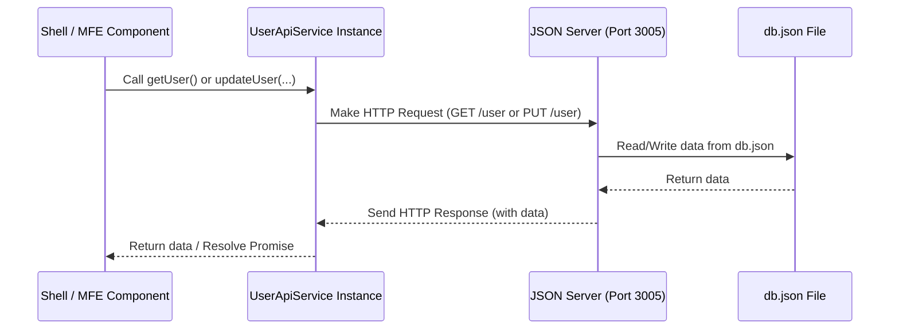

# Chapter 10: JSON Server

Welcome back for the final concept chapter in our `mfe-project` tutorial!

In the previous chapter, [Chapter 9: User API Service (`UserApiService`)](09_user_api_service___userapiservice__.md), we saw how the `UserApiService` acts as a dedicated middleman, centralizing the logic for fetching and updating user data. This service talks to a "backend API" to do its job.

But in a learning project like this, we often don't have a _real_, complex backend server with a full database already set up. Building one would be a whole other project! How can our frontend Micro Frontends (MFEs) and the Shell still practice making API calls and seeing real data flow?

### What Problem Does JSON Server Solve?

Imagine our shopping mall again. The stores (MFEs) and mall management (Shell) sometimes need to interact with information that's stored centrally, like customer loyalty details (user data) or product catalogs. This information lives somewhere outside the mall itself, let's say in a central company warehouse system (the backend).

For development and testing purposes, maybe the "warehouse system" isn't fully built yet, or it's complicated to connect to. We need a simple, temporary stand-in for the warehouse that can store a little bit of data and respond to requests, so the stores can practice their "ordering" and "updating" procedures.

This is exactly what **JSON Server** does for our frontend applications.

### What is JSON Server?

**JSON Server** is a simple, lightweight tool that lets you quickly set up a fake REST API based on a single JSON file.

- It's not a real, production-ready database or backend framework.
- It's perfect for **mocking a backend API** during development.
- You give it a JSON file containing some data, and it automatically creates API endpoints (URLs) that you can access using standard web requests (like GET, POST, PUT, DELETE) from your frontend code.
- The JSON file acts like a tiny, simple database.

Think of it as setting up a little stand-in "mini-warehouse" locally on your computer. It has a simple ledger book (`db.json`) where you write down the data. JSON Server reads this book and acts as a simple clerk who can look up information (GET requests) or write down updates (PUT/POST requests) based on what your frontend asks for.

### How JSON Server is Used in Our `mfe-project`

In our `mfe-project`, JSON Server serves as the mock backend for our `UserApiService`.

1.  **Data Storage:** The user data that the `UserApiService` interacts with is stored in a file called `db.json` at the root of the project.
2.  **Mock API:** JSON Server runs locally and reads `db.json`. It automatically creates API endpoints based on the structure of the JSON data. Since our `db.json` has a `"user"` object, JSON Server creates a `/user` endpoint.
3.  **Frontend Interaction:** The `UserApiService` classes within the Shell and MFEs are configured to make `fetch` calls to `http://localhost:3005`, which is where we run JSON Server.

This setup allows the `UserApiService.getUser()` method to make a `GET` request to `http://localhost:3005/user` and get the user data from `db.json`. Similarly, `UserApiService.updateUser()` makes a `PUT` request to the same endpoint, and JSON Server updates the `db.json` file with the new data.

### The Data File: `db.json`

Look at the `db.json` file at the root of your project:

```json
{
  "user": {
    "id": "yogendr_123",
    "name": "yogendra",
    "email": "yogendrasaxena56@gmail.com",
    "role": "Software Engineer",
    "avatar": "👨"
  }
}
```

**Explanation:**

- This file contains a single key: `"user"`.
- The value associated with `"user"` is an object containing the user's details.
- JSON Server reads this file. Because there's a top-level key named `"user"`, JSON Server automatically creates a RESTful endpoint at `/user`.
- If you had another key, say `"products": [...]`, it would create a `/products` endpoint, and it would handle arrays of objects by allowing requests like `/products/1` (GET a single product), POST (add a product), DELETE (remove a product), etc. For a single object like `"user"`, it primarily supports GET (get the object) and PUT (replace/update the object).

This `db.json` file is our simple "database" for the user data in this project.

### Running JSON Server

To make the mock API available, you need to start the JSON Server. This is done using a script defined in the project's main `package.json` file.

Look at the `scripts` section in `package.json`:

```json
{
  "name": "mfe-learning-project",
  // ... other details ...
  "scripts": {
    // ... other scripts ...
    "api": "json-server --watch db.json --port 3005",
    "dev": "concurrently \"npm run api\" \"npm run dev:header\" \"npm run dev:products\" \"npm run dev:orders\" \"npm run dev:profile\" \"npm run dev:shell\""
    // ... other dev/build scripts ...
  },
  "devDependencies": {
    "concurrently": "^7.6.0",
    "dotenv": "^16.5.0",
    "json-server": "^0.17.4" // JSON Server is a dev dependency
  }
  // ... other details ...
}
```

**Explanation:**

- `"api": "json-server --watch db.json --port 3005"`: This script defines how to start JSON Server.
  - `json-server`: The command to run the installed `json-server` package.
  - `--watch db.json`: Tells JSON Server to use `db.json` as the data file and to restart or reload if the file changes.
  - `--port 3005`: Tells JSON Server to run on port 3005. This is why the `UserApiService` is configured with `API_BASE_URL = "http://localhost:3005"`.
- `"dev": "concurrently ... \"npm run api\" ..."`: The main `npm run dev` command uses `concurrently` to start multiple processes at once, including `npm run api`. This means when you run `npm run dev` to start all your MFEs and the Shell, the JSON Server mock backend is also started automatically in the background.

So, to start the mock backend, you just need to ensure the `dev` script is running (or you could run `npm run api` separately if needed).

### JSON Server and the User API Service Flow

Let's revisit how the `UserApiService` uses JSON Server.

When the Shell needs the initial user data:

```javascript
// shell/src/AppContext.js (Conceptual simplified call)
useEffect(() => {
  const fetchInitialUserData = async () => {
    // UserApiService uses http://localhost:3005/user internally
    const userData = await UserApiService.getUser();
    // ... use userData ...
  };
  fetchInitialUserData();
}, []);
```

The `UserApiService.getUser()` method internally makes a GET request to `http://localhost:3005/user`. JSON Server receives this request, reads the data under the `"user"` key in `db.json`, and sends that data back in the response.

When an MFE updates user data:

```javascript
// products-mfe/src/App.js (Conceptual simplified call)
const updateUser = async (updates) => {
  // UserApiService uses http://localhost:3005/user internally
  // and sends { ...current, ...updates } as body
  await UserApiService.updateUserAndNotify(updates);
  // ... handle success/error ...
};
```

The `UserApiService.updateUser()` method (which is called by `updateUserAndNotify`) internally makes a PUT request to `http://localhost:3005/user`, sending the updated user object in the request body. JSON Server receives this request, updates the `"user"` object in its memory (and optionally in the `db.json` file itself because of `--watch`), and sends back the updated user data in the response.

Here's a simplified flow showing the frontend talking to JSON Server via the API Service:



This shows how JSON Server provides the necessary API endpoints for our `UserApiService` to interact with data during development, acting as a crucial piece of the local development environment.

### Why is JSON Server Important for This Project?

- **Enables Frontend Development:** It allows the Shell and MFEs to be developed and tested against a realistic API interaction pattern _without_ needing a real backend team or complex setup.
- **Simulates API Calls:** It provides actual HTTP endpoints (`http://localhost:3005/user`) that the `fetch` API in `UserApiService` can call, simulating real network requests.
- **Simple Data Storage:** `db.json` provides a very easy way to define and modify the mock data used by the application.
- **Facilitates Independent Development:** Each MFE can be developed and tested locally against the same simple mock API provided by JSON Server, reinforcing their independence.

JSON Server is not a core _concept_ of Micro Frontends or Module Federation itself, but it's an indispensable **tool** in the _practice_ of building and running a project like this locally. It bridges the gap between the frontend code and the backend data it expects to interact with.

### Conclusion

In this chapter, we introduced **JSON Server** as the simple, lightweight mock backend API used in our `mfe-project`. We learned that it reads data from `db.json` and automatically creates REST API endpoints (like `/user` at `http://localhost:3005`). This allows our `UserApiService` instances within the Shell and MFEs to practice fetching and updating data via standard HTTP requests during local development, simulating interaction with a real backend without requiring one to be built. JSON Server is launched automatically as part of the `npm run dev` script, providing the essential data layer for our frontend architecture to function locally.

This concludes our exploration of the core concepts and key pieces that make up the `mfe-project`. You now have a foundational understanding of the Shell, MFEs, Module Federation, how they load code, share libraries, communicate via events and context, interact with data through a service, and use a mock backend for development.

We hope this tutorial has been helpful in understanding Micro Frontends with Webpack Module Federation!
