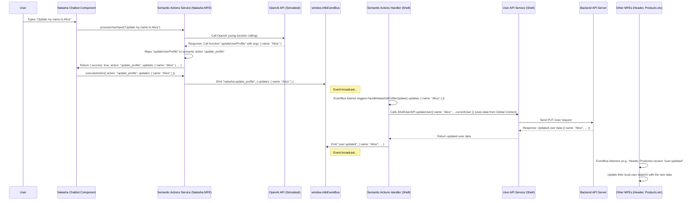

# Chapter 10: Semantic Actions

Welcome back to the **mfe-project** tutorial! In our last chapter, [API Service Pattern](09_api_service_pattern__.md), we learned how to organize the code that talks to backend servers, ensuring consistency and maintainability for data fetching and updates.

So far, we've focused on user interfaces driven by clicks, forms, and navigation links. But what if users could just _tell_ the application what they want to do, using natural language?

## The Problem: Interacting with the App Using Language

Imagine you're on the website, and you want to see your past orders. The standard way is to find an "Orders" link in the header and click it. Or maybe you want to update your name in your profile – you navigate to the profile page, find the name field, type the new name, and click "Save".

This is how most websites work, and it's fine. But what if you could just type or say:

- "Show me my orders"
- "Navigate to the products page"
- "Update my name to Alice Smith"
- "I want to change my email address"

How could the application understand these natural language requests and translate them into actions like changing the page or sending data to an API? Clicking buttons is predictable, but human language is not!

## The Solution: Semantic Actions

This is where **Semantic Actions** come in. The core idea is to use intelligent processing, often powered by AI, to understand the _meaning_ (the "semantics") of a user's request and map it to specific, predefined _actions_ within your application.

Think of it like a smart home assistant:

- You say: "Turn on the living room lights."
- The assistant understands: Your _intent_ is "turn on", the _target_ is "lights", and the _location_ is "living room".
- It maps this to a predefined _action_: Call the command `smartHome.turnOnLight({ location: 'living room' })`.

In our `mfe-project`, the **Natasha Chatbot MFE** is designed to act as this smart assistant. It takes natural language input from the user and, using AI (specifically, the function calling feature of models like OpenAI's GPT), tries to understand the user's intent and extract any necessary information (like a destination page or a new name).

Once Natasha understands the _semantic intent_, it translates this into a request for a specific **Semantic Action** to be performed by the main application (the Shell) or other MFEs.

## Semantic Actions Flow in mfe-project

Here's how the concept works in our application, leveraging tools we've already discussed:

1.  **User Input:** The user types a request into the Natasha Chatbot (e.g., "Show my orders").
2.  **Intent Processing:** The **Natasha Chatbot MFE** uses its internal logic and an AI model to analyze the text. It determines the user wants to perform an action ("navigate") and the target is the "orders" section.
3.  **Action Request (Event Bus):** Natasha doesn't _directly_ perform the navigation. Instead, it emits a specific event on the global [Event Bus (window.mfeEventBus)](07_event_bus__window_mfeeventbus__.md). For navigation, it might emit `natasha:navigate` with a payload `{ path: '/orders' }`. For a profile update, it might emit `natasha:update_profile` with `{ updates: { name: 'Alice' } }`.
4.  **Action Handling (Shell):** The **Shell application** is listening for these specific events from Natasha. When it receives a `natasha:navigate` event, it uses its internal router to change the page. When it receives a `natasha:update_profile` event, it calls its [API Service](09_api_service_pattern__.md) (`UserApiService`) to update the user data on the backend, and then uses the [Event Bus](07_event_bus__window_mfeeventbus__.md) or [Global Context](08_global_context__window_mfeglobalcontext__.md) mechanism to inform other MFEs of the change (often by re-emitting `user:updated` as seen in [Chapter 8](08_global_context__window_mfeglobalcontext__.md)).

This separation is key: Natasha's job is to _understand_ and _request_ the action; the Shell's job is to _perform_ the action, as it's the Shell that controls navigation, core API interactions, and global state. This keeps the chatbot MFE focused on AI/language processing and the Shell focused on orchestrating the overall application.

## How It Works: Code Examples

Let's look at simplified code snippets showing this interaction.

### 1. Natasha MFE: Understanding and Requesting the Action

The Natasha Chatbot MFE contains a `SemanticActionsService` (see `natasha-chatbot-mfe/src/semanticActionsService.js` and `natasha-chatbot-mfe/src/openai.json`). This service encapsulates the logic for talking to the AI and deciding what semantic action is requested.

When the user sends a message in the chat, the `NatashaChatbot` component calls this service:

```javascript
// Inside natasha-chatbot-mfe/src/NatashaChatbot.js (simplified send message logic)
import React, { useState } from "react";
import SemanticActionsService from "./semanticActionsService"; // Import the service

const NatashaChatbot = () => {
  // ... state and other logic ...
  const semanticService = new SemanticActionsService(); // Create service instance

  const handleSendMessage = async () => {
    // ... get user input ...
    setIsProcessing(true);

    try {
      console.log("🤖 Natasha: Processing user input...");
      // Ask the service to process the input using AI
      const actionResult = await semanticService.processUserInput(
        userMessage.text
      );
      console.log("✅ Natasha: Action result:", actionResult);

      // If the AI suggested a valid action, execute it via the service
      if (actionResult.success) {
        console.log(
          "🤖 Natasha: Executing semantic action:",
          actionResult.action
        );
        semanticService.executeAction(actionResult); // This method emits events
      }

      // ... add bot response to messages ...
    } catch (error) {
      console.error("❌ Natasha: Error processing message:", error);
      // ... show error message in chat ...
    } finally {
      setIsProcessing(false);
    }
  };

  // ... render logic ...
};
```

The `SemanticActionsService` does the heavy lifting of communicating with the AI (which is simulated in the frontend in this project for demonstration but would typically be a backend call to avoid exposing API keys). Based on the AI's response (specifically, if it suggests calling a "function"), the service determines which _semantic action_ is intended using a mapping defined in `openai.json`.

Then, the `executeAction` method within `SemanticActionsService` emits the appropriate event on the [Event Bus](07_event_bus__window_mfeeventbus__.md):

```javascript
// Inside natasha-chatbot-mfe/src/semanticActionsService.js (simplified executeAction method)
// Assume eventBus = window.mfeEventBus is already available

executeAction(actionResult) {
  if (!actionResult.success) {
    return; // Don't execute if AI didn't find a valid action
  }

  const { action, target, updates } = actionResult; // Extract action type and data

  // Dispatch action via the MFE event bus (Chapter 7)
  switch (action) {
    case "navigation":
      console.log("📢 Natasha: Emitting 'natasha:navigate' event:", { path: target });
      window.mfeEventBus.emit("natasha:navigate", { path: target }); // Emitting the event!
      break;
    case "update_profile":
      console.log("📢 Natasha: Emitting 'natasha:update_profile' event:", { updates });
      window.mfeEventBus.emit("natasha:update_profile", { updates }); // Emitting the event!
      break;
    // ... other semantic actions ...
  }
}
```

This is the crucial step from Natasha's side: translating the AI's technical "function call" suggestion into a business-level "semantic action" and broadcasting it via the Event Bus for the Shell to pick up.

### 2. Shell Application: Handling the Semantic Action

The Shell application includes a component, `SemanticActionsHandler`, specifically designed to listen for these semantic action events emitted by the chatbot and perform the corresponding application logic. This component is rendered inside the Shell's router, as it needs access to the `useNavigate` hook.

```javascript
// Inside shell/src/App.js (simplified SemanticActionsHandler component)
import { useEffect } from "react";
import { useNavigate } from "react-router-dom"; // Needed for navigation
import UserApiService from "./userApiService"; // Needed for profile updates (Chapter 9)

const SemanticActionsHandler = () => {
  const navigate = useNavigate(); // Get Shell's navigation function

  useEffect(() => {
    if (window.mfeEventBus) {
      console.log("👂 Shell: Subscribing to Natasha's semantic action events");

      // Listener for navigation requests from Natasha
      const handleNatashaNavigation = (data) => {
        if (data.path) {
          console.log(
            "🎉 Shell: Received 'natasha:navigate', navigating to:",
            data.path
          );
          navigate(data.path); // Shell performs the navigation!
        }
      };

      // Listener for profile update requests from Natasha
      const handleNatashaProfileUpdate = async (data) => {
        if (data.updates && Object.keys(data.updates).length > 0) {
          console.log(
            "🎉 Shell: Received 'natasha:update_profile' with updates:",
            data.updates
          );
          try {
            // Get current user data from global context (Chapter 8)
            const currentUser = window.mfeGlobalContext?.user || {};
            const updatedUserData = { ...currentUser, ...data.updates };

            // Shell uses its *own* API Service to make the update (Chapter 9)
            const apiResponse = await UserApiService.updateUser(
              updatedUserData
            );
            console.log(
              "💾 Shell: API Update successful. Broadcasting user:updated."
            );

            // Shell emits user updated event to refresh all MFEs (Chapter 7/8)
            window.mfeEventBus.emit("user:updated", apiResponse);
          } catch (error) {
            console.error(
              "❌ Shell: Error handling profile update from Natasha:",
              error
            );
            // Optionally emit a global error event or show notification
          }
        }
      };

      // Subscribe to the events on the Event Bus (Chapter 7)
      window.mfeEventBus.on("natasha:navigate", handleNatashaNavigation);
      window.mfeEventBus.on(
        "natasha:update_profile",
        handleNatashaProfileUpdate
      );

      // Cleanup subscriptions when the component unmounts (important!)
      return () => {
        console.log(
          "🧹 Shell: Unsubscribing from Natasha's semantic action events"
        );
        window.mfeEventBus.off("natasha:navigate", handleNatashaNavigation);
        window.mfeEventBus.off(
          "natasha:update_profile",
          handleNatashaProfileUpdate
        );
      };
    }
  }, [navigate]); // Effect depends on navigate function

  return null; // This component doesn't render anything visible
};
```

This snippet shows how the Shell's `SemanticActionsHandler`:

- Uses a `useEffect` hook to subscribe to specific events (`natasha:navigate`, `natasha:update_profile`) when it mounts.
- Defines callback functions (`handleNatashaNavigation`, `handleNatashaProfileUpdate`) that execute when those events are received.
- Inside the callbacks, it performs the actual application action:
  - `handleNatashaNavigation` uses the Shell's `navigate` function (from `react-router-dom`) to change the URL.
  - `handleNatashaProfileUpdate` uses the Shell's `UserApiService` ([Chapter 9](09_api_service_pattern__.md)) to make the API call and then emits `user:updated` on the [Event Bus](07_event_bus__window_mfeeventbus__.md) ([Chapter 7](07_event_bus__window_mfeeventbus__.md)) to notify all listening MFEs (like the Header and the User Profile MFE) that the user data has changed.
- Crucially, it cleans up the subscriptions when the component unmounts.

## Under the Hood: The Semantic Action Flow

Let's trace the "Update my name to Alice" request with a simplified sequence diagram:



This diagram clearly shows how Natasha initiates the _request_ via the Event Bus, and the Shell (specifically the `SemanticActionsHandler`) intercepts it and performs the necessary _application-level actions_ (API call, re-broadcasting the user update).

## Benefits of Semantic Actions

- **Natural Interaction:** Provides an intuitive way for users to interact with the application using language.
- **Decoupling:** The chatbot MFE is decoupled from the specific implementation details of actions (like how navigation works or which API endpoint is used). It just requests a _semantic action_ type.
- **Centralized Action Handling:** The Shell is the logical place to handle application-wide actions like navigation or core data updates, keeping this logic consolidated.
- **Extensibility:** New semantic actions can be added by updating Natasha's AI configuration (the "functions" it understands) and adding corresponding listeners in the Shell's `SemanticActionsHandler`.

## Conclusion

Semantic Actions in the `mfe-project`, demonstrated by the Natasha Chatbot MFE, provide a powerful way to translate natural language user requests into concrete application behaviors. This is achieved by having the chatbot understand the user's intent (often using AI function calling), map it to a semantic action type (like `navigation` or `update_profile`), and then communicate this request via the [Event Bus (window.mfeEventBus)](07_event_bus__window_mfeeventbus__.md). The Shell application, acting as the orchestrator, listens for these requests and performs the necessary steps, such as changing the route using its own router or calling its [API Service](09_api_service_pattern__.md) to modify data. This pattern leverages the [Global Context (window.mfeGlobalContext)](08_global_context__window_mfeglobalcontext__.md) for accessing shared data and the Event Bus for loose coupling, creating a flexible and intelligent interaction layer.

This marks the end of our core tutorial chapters exploring the fundamental concepts behind the `mfe-project`. You now have a solid understanding of how Micro Frontends are structured, communicate, and collaborate to form a unified application. Congratulations!
