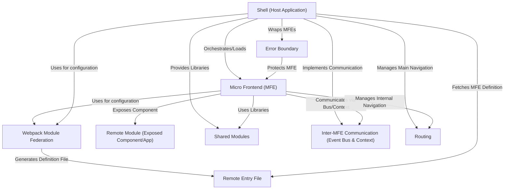

# Tutorial: mfe-project

This project is a **learning demo** showcasing a Micro Frontend (MFE) architecture.
It works like a **Shell** (the main application) that loads and displays different,
independently built and deployed parts called **Micro Frontends** (like Products, Orders, or Header).
It uses **Webpack Module Federation** to share common code like React and enable MFEs
to communicate and load each other dynamically, providing a **flexible and resilient** application structure.

**Source Repository:** [None](None)

## Chapters

1. [Micro Frontend (MFE)
   ](01_micro_frontend__mfe__.md)
2. [Shell (Host Application)
   ](02_shell__host_application__.md)
3. [Webpack Module Federation
   ](03_webpack_module_federation_.md)
4. [Remote Entry File
   ](04_remote_entry_file_.md)
5. [Remote Module (Exposed Component/App)
   ](05_remote_module__exposed_component_app__.md)
6. [Shared Modules
   ](06_shared_modules_.md)
7. [Inter-MFE Communication (Event Bus & Context)
   ](07_inter_mfe_communication__event_bus___context__.md)
8. [Routing
   ](08_routing_.md)
9. [Error Boundary
   ](09_error_boundary_.md)
