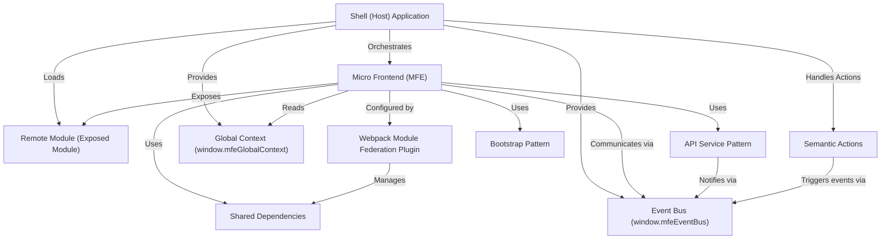

# Tutorial: mfe-project

This project is a learning demo showcasing **Micro Frontend (MFE)** architecture
using **Webpack Module Federation**. A main **Shell** application loads and
orchestrates several independent MFEs (like Products, Orders, Header).
They communicate using a shared **Event Bus** and access common data via a
**Global Context**, while sharing libraries through **Shared Dependencies**.
An AI **Chatbot** demonstrates **Semantic Actions** by interpreting requests
and triggering application behaviors via the Event Bus.

**Source Repository:** [None](None)

## Chapters

1. [Micro Frontend (MFE)
   ](01_micro_frontend__mfe__.md)
2. [Shell (Host) Application
   ](02_shell__host__application_.md)
3. [Remote Module (Exposed Module)
   ](03_remote_module__exposed_module__.md)
4. [Webpack Module Federation Plugin
   ](04_webpack_module_federation_plugin_.md)
5. [Shared Dependencies
   ](05_shared_dependencies_.md)
6. [Bootstrap Pattern
   ](06_bootstrap_pattern_.md)
7. [Event Bus (window.mfeEventBus)
   ](07_event_bus__window_mfeeventbus__.md)
8. [Global Context (window.mfeGlobalContext)
   ](08_global_context__window_mfeglobalcontext__.md)
9. [API Service Pattern
   ](09_api_service_pattern_.md)
10. [Semantic Actions
    ](10_semantic_actions_.md)
