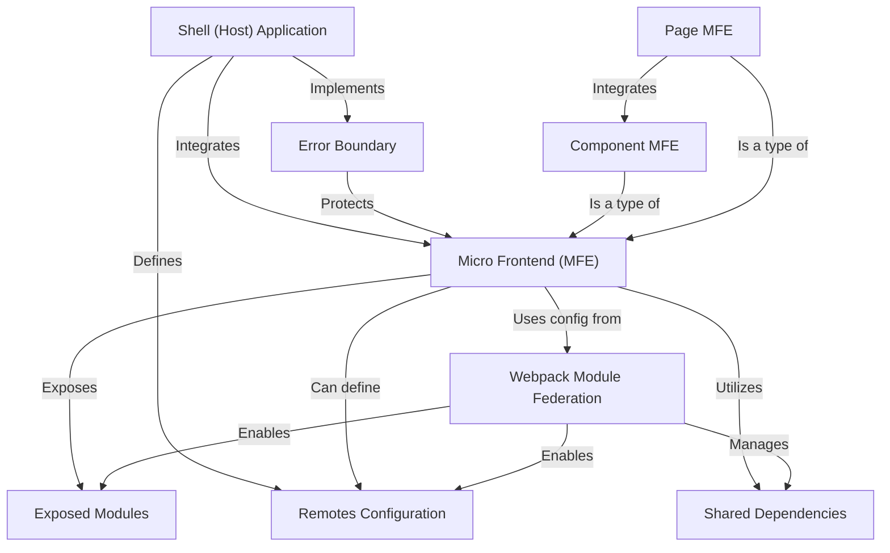

# Tutorial: mfe-project

This project demonstrates a Micro Frontend (MFE) architecture using Webpack Module Federation.
The **Shell** application acts as the _host_, loading and integrating different **MFEs**
(Micro Frontends) that represent independent parts of the application, like products or orders pages
(**Page MFEs**) or reusable components like a header or user profile (**Component MFEs**).
**Webpack Module Federation** is the technology that enables these independent parts to share code and dependencies,
loading each other at _runtime_ instead of build time.

**Source Repository:** [None](None)

## Chapters

1. [Webpack Module Federation
   ](01_webpack_module_federation_.md)
2. [Micro Frontend (MFE)
   ](02_micro_frontend__mfe__.md)
3. [Shell (Host) Application
   ](03_shell__host__application_.md)
4. [Remotes Configuration
   ](04_remotes_configuration_.md)
5. [Exposed Modules
   ](05_exposed_modules_.md)
6. [Shared Dependencies
   ](06_shared_dependencies_.md)
7. [Component MFE
   ](07_component_mfe_.md)
8. [Page MFE
   ](08_page_mfe_.md)
9. [Error Boundary
   ](09_error_boundary_.md)
