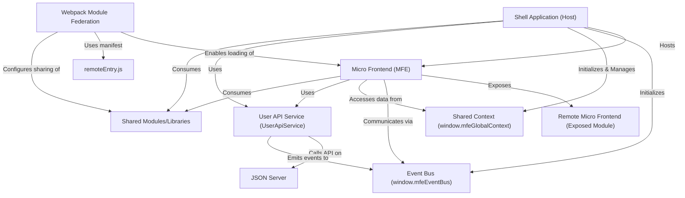

# Tutorial: mfe-project

This project demonstrates a **Micro Frontend (MFE)** architecture where a main **Shell Application** _hosts_ multiple independent mini-applications (the MFEs). It uses **Webpack Module Federation** to dynamically load these MFEs at runtime. Communication and shared data between the Shell and MFEs are handled via a global **Event Bus** and **Shared Context**. A mock **JSON Server** acts as the backend for user data, accessed by **User API Services** within both the Shell and MFEs, with updates being broadcast via the Event Bus.

## Chapters

1. [Shell Application (Host)
   ](01_shell_application__host__.md)
2. [Micro Frontend (MFE)
   ](02_micro_frontend__mfe__.md)
3. [Webpack Module Federation
   ](03_webpack_module_federation_.md)
4. [Remote Micro Frontend (Exposed Module)
   ](04_remote_micro_frontend__exposed_module__.md)
5. [`remoteEntry.js`
   ](05__remoteentry_js__.md)
6. [Shared Modules/Libraries
   ](06_shared_modules_libraries_.md)
7. [Event Bus (`window.mfeEventBus`)
   ](07_event_bus___window_mfeeventbus___.md)
8. [Shared Context (`window.mfeGlobalContext`)
   ](08_shared_context___window_mfeglobalcontext___.md)
9. [User API Service (`UserApiService`)
   ](09_user_api_service___userapiservice___.md)
10. [JSON Server
    ](10_json_server_.md)
